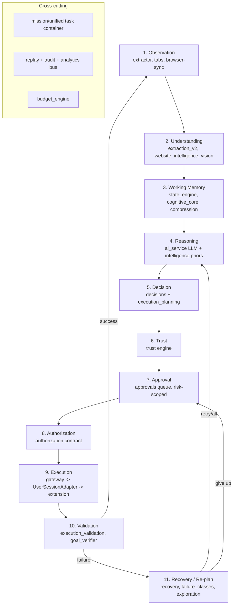

# Architecture Reconciliation Document (ARP)

**Date:** 2026-06-29
**Author role:** Chief Systems Architect
**Constraint:** No implementation code. No new architectural layers. Maximize reuse of existing work; eliminate fragmentation by unifying the two halves that already exist.
**Companion:** `docs/architecture-review.md` (the prior audit this document validates and revises).

---

## 1. Executive Summary

The project did not build "two unrelated systems." It built **the two halves of one cognitive loop and never connected them**:

- **Front half (live, real AI):** Observation → Understanding → Working Memory → Reasoning. Implemented by the extension extractor, `extraction_v2`, `context_compression`, `state_engine`, `cognitive_core`, `intent`, and the single Gemini/OpenRouter call in `ai_service`. Exposed via `POST /assist` (ambient) and `POST /analyze` (workflow), joined by the `cognitive_core.workflow_bridge` handoff.
- **Back half (built, orphaned, AI-free):** Decision → Trust → Approval → Authorization → Execution → Validation → Recovery. Implemented by `decisions`, `trust`, `approvals`, `authorization`, `execution_planning`, `execution_gateway` (+ Playwright adapter, adaptive recovery), `mission`, `runtime`, `browser`-sync, `tabs`. This cluster is **internally well-connected** (e.g., the gateway preflight chains plan→auth→mission→governance→approval→runtime→browser; the decision aggregator pulls trust+mission-intel+browser+research) but is **not reachable from either live endpoint**.

Today the live loop *fakes* the back half: it does trust as a keyword `danger/caution` classifier inside `ai_service.parse_response`, approval as an inline side-panel button, and execution as a synthetic-event content-script `.click()` — while a fully-built trust engine, approval queue, authorization gate, planner, gateway, retry/rollback, and recovery engine sit unused.

**The reconciliation is therefore not a rewrite — it is a wiring job plus a deletion job.** Route the Gemini reasoning output through the existing back-half pipeline; make the production executor a **user-session driver behind the gateway's existing 9-method `ExecutionAdapter` contract**; retire the duplicate server-side Playwright *browser* (not the adapter pattern) because it can never be logged into the user's sites; collapse ~77 boilerplate scaffold files into shared infrastructure; and demote the per-site hardcoded adapters/task-graphs that cause the "new website → new failure" cycle. This preserves the overwhelming majority of engineering work while producing **one** loop.

The single highest-leverage fact in the whole codebase: **the gateway already abstracts the browser driver behind a 9-method adapter interface** (`navigate/click/type/wait/extract/validate/upload/download/execute_custom`). A new `UserSessionAdapter` that forwards those nine calls to the extension is the seam that fuses the two halves with almost no new architecture.

---

## 2. Validation of the Previous Audit

I re-verified the prior audit against the code rather than assuming it. Results:

### 2.1 Confirmed (I agree)

| Prior claim | Verdict | Evidence |
|---|---|---|
| Only real AI is the Gemini/OpenRouter call | **Confirmed** | `ai_service` is the sole LLM client; all "intelligence"/trust/decision/planning modules are deterministic (keyword tables, scoring formulas, boolean rules). |
| The execution-governance cluster is disconnected from the live product | **Confirmed** | `orchestrator/` imports **none** of `mission/trust/governance/authorization/execution_gateway/execution_planning/decisions/approvals/runtime/browser/tabs` (grep: no matches). |
| Server-side Playwright is a separate browser, not the user's session | **Confirmed** | `playwright_adapter` asks `BrowserSessionManager` for a backend-spawned page; no cookie/session bridge. Cannot complete authenticated workflows. |
| State is volatile in-memory; persistence is stubbed | **Confirmed** | Registries are module-level TTL dicts under `RLock`; `execution_planning/registry.py` documents "in-memory only; persistence flag is a stub." |
| Milestone process adds breadth not depth | **Confirmed** | ~11 subsystems replicate the same 6–7 file scaffold (~77 files). |
| Execution fidelity (synthetic events, brittle selectors, no shadow/iframe, no in-loop vision) is the real gap vs SOTA | **Confirmed** | `executor_v2.ts` uses `el.click()`/value-set + dispatched events; `extractor_v2.ts` does not pierce shadow DOM or iframes. |

### 2.2 Revised / where I disagree with the prior audit

The prior audit over-simplified to "two systems" and listed `intelligence` and `research` among the orphaned set. Closer reading corrects three things:

1. **`intelligence` and `research` are NOT orphaned.** On the `/assist` *research* route, `research.engine.run_research()` and `intelligence.engine.run_intelligence()` execute live and their output (`research_report`, `intelligence` schema with goal tree, readiness, recommendations) is returned to the user. What is orphaned is their *dedicated inspection routes*, not their engines.
2. **The live product is itself two coordinated loops, not one.** The ambient-assist loop (`/assist`) and the workflow loop (`/analyze`) are bridged by `cognitive_core.workflow_bridge.build_handoff_payload` → `orchestrate_analysis(handoff_payload)`, which cold-starts workflow state facts from the assist conversation. Reconciliation must unify *three* things, not two: assist-loop, workflow-loop, and the orphaned back-half cluster.
3. **The orphaned cluster is a coherent, internally-wired system, not 30 islands.** This is good news: it can be adopted as a unit behind the reasoning output, which is why salvage value is high.

One more nuance the prior audit missed: there are **two different "ExecutionPlan" concepts** — `intelligence.models.ExecutionPlan` (a lightweight advisory schema surfaced in the assist UI) and `execution_planning.models.ExecutionPlan` (the gateway's executable plan). They are unrelated types with the same name — a fragmentation hazard that must be merged.

**Conclusion:** the audit's core thesis (fragmentation, AI-free back half, brittle execution) is correct and the reconciliation it implies is sound; its taxonomy needed the corrections above. Those corrections *increase* the amount of reusable work.

---

## 3. Classification of Every Major Subsystem

Categories: **Core Browser Intelligence (CBI)** · **Supporting Platform Infrastructure (SPI)** · **Shared Infrastructure (SI)** · **Redundant (R)** · **Premature (P)** · **Merge (M)** · **Retire (X)**. (A subsystem may carry a primary class plus an action.)

| Subsystem | Class | Rationale |
|---|---|---|
| `extension/content/extractor_v2` | **CBI** | The observation/perception entrypoint. Must gain shadow/iframe + vision. |
| `extension/content/executor_v2` | **CBI** | The only driver touching the user's real session. Must gain trusted (CDP) input. |
| `extraction_v2` (grounded_registry, semantic_models) | **CBI** | Page understanding + element grounding. Keep, deepen. |
| `vision` (vision_service, vision_policy) | **CBI / P** | Visual perception capability; currently only multimodal-extraction adjacent. Promote into the in-loop perception stage. |
| `website_intelligence` (Phase E semantic) | **CBI / Rewire** | Semantic UI understanding; built, unwired. Belongs in the Understanding stage. |
| `locator_engine` (ranker, registry, score) + `execution_gateway/browser/{resolver,adaptive_resolver}` | **CBI / Merge** | Two grounding/locator strategies. Merge into one locator service. |
| `context_compression` | **CBI** | Relevance ranking + state summarization feeding the reasoner. Keep. |
| `state_engine` | **SI/CBI** | Verified-facts working memory. Keep; back with DB. |
| `cognitive_core` | **CBI** | Entities, goals, references, conversation; the working-memory + continuity layer. Keep — it is the assist↔workflow bridge. |
| `intent` (router) | **CBI** | Routes user message to summarize/ask/research/workflow. Keep. |
| `ai_service` | **CBI** | The sole reasoner. Keep; abstract behind a model-agnostic interface. |
| `intelligence` (goal_decomposer, plan_builder, opportunity_detector, readiness, advisors) | **CBI / Merge** | Live but heuristic. Reposition as *priors/guardrails feeding the LLM reasoner*, and merge its advisory `ExecutionPlan` into the executable plan. |
| `mission/intelligence` (next_action_planner, blocker, readiness_scorer) | **SPI / Merge** | Heuristic advisors for long-running tasks. Fold into the reasoning/decision stages of the mission spine. |
| `research` (engine, providers, synthesizer) | **CBI** | Live sub-capability on `/assist`. Keep. |
| `decisions` (priority, aggregator, feed) | **SPI** | Decision-making/prioritization stage. Rewire to consume live candidate actions, not just mission registries. |
| `trust` (risk_classifier, policy_engine, action_analyzer) | **SPI** | The Trust stage. Replace the keyword classifier in `ai_service` with this. Rewire. |
| `approvals` + `unified.approval_center` | **SPI / Merge** | The Approval stage. Multiple approval notions must merge into one. |
| `authorization` (engine, readiness) | **SPI** | The Authorization gate (executable contract). Keep as gateway preflight. |
| `execution_planning` (planner, validator, rollback) | **SPI** | Compiles reasoning into an executable plan. Keep; feed it from the reasoner. |
| `execution_gateway` (engine, dispatcher, runner, retry, rollback, audit, adapter) | **SPI** | The execution orchestrator. **Keep — this is the back-half spine.** |
| `execution_gateway/browser/playwright_adapter` + `session` | **R / Retire-from-prod** | Server-side browser cannot use the user's session. Demote to a headless **test** driver; production uses the user-session adapter behind the same contract. |
| `execution_gateway/browser/{recovery, failure_classes, execution_validation, monitor, metrics}` | **SPI / Merge** | Real recovery/validation logic. Merge with the other recovery managers; wire into the live loop. |
| `recovery/recovery_orchestrator` + `orchestrator/recovery_manager` + `failure_engine` + `retry_engine` + `rollback_engine` | **R / Merge** | Four+ overlapping recovery/retry constructs. Merge into one Recovery service. |
| `exploration` (candidate_generator/evaluator) | **SPI** | Failure-time alternative generation. Wire into Recovery/Re-planning. |
| `mission` (lifecycle, store, affinity, memory, context_registry) | **SPI** | The long-running task container (multi-step, multi-tab). Keep as orchestration spine; back with DB. |
| `unified` (task_lifecycle, timeline, continuity, task graph) | **SPI / Merge** | Live task tracking on `/assist`. Overlaps `mission`. Merge "unified task" and "mission" into one task model. |
| `tabs` (registry, mission_tab_map, snapshot, restoration) | **SPI** | Multi-tab reasoning/coordination. Keep; wire to observation. |
| `browser` (sync_service, recommendation, refresh) | **SPI / Merge** | Browser-event sync. Merge with `runtime` and `tabs` into one live browser-state service. |
| `runtime` (context, cache, prefetch, diff, detector) | **SPI / Merge** | Runtime browser context. Overlaps `browser`/`tabs`. Merge. |
| `governance` (contracts, eligibility) | **P** | Premature for single-user localhost. Keep minimal; defer full governance until multi-user. |
| `budget_engine` | **SI** | Live, useful cost guard. Keep. |
| `replay` (timeline_service, screenshot_store) | **SI** | Observability/audit. Keep; unify with the per-subsystem timelines. |
| Per-subsystem `registry.py / persistence.py / analytics.py / timeline.py / inspector.py` (~77 files) | **SI / Merge** | Collapse into one generic registry base + one event/timeline/analytics bus + one persistence layer. |
| `task_graph` (static JSON) + `adapters/{amazon,gmail,mmt,whatsapp}` + `site_knowledge/*` + `validators/{site}` | **X / Demote** | Hardcoded per-site scripts = the root cause of "new website → new failure." Demote to optional *site hints* (priors), not execution paths. |
| `file_engine` (file_workflow) | **SPI** | Upload/download task support. Keep; wire to gateway upload/download. |
| `certification` (Phase F) | **P / Repurpose** | Premature as a "feature," but its scenario/reliability harness should **become the task-success eval harness** (Section 8/Principle 3). |
| `services/{summarization,qa,followup,context,workflow,analytics}` | **SI/CBI** | Live assist services. Keep. |
| `conversation` | **CBI / Merge** | Overlaps `cognitive_core.conversation_manager`. Merge into one conversation store. |
| `memory/learning_layer` | **CBI / P** | Cross-site failure learning — high future value, currently thin. Keep as the learning hook. |

---

## 4. The Unified Architecture

One loop. The front half exists in the live product; the back half exists in the orphaned cluster; reconciliation connects them and swaps the executor.

```
                    ┌───────────────────────── USER (Chrome side panel) ─────────────────────────┐
                    │                                                                             │
                    ▼                                                                             │
        ┌───────────────────────┐                                                                │
        │ 1. OBSERVATION        │  extension/extractor_v2 (a11y+DOM+bbox+vision),                 │
        │                       │  tabs + browser-sync + runtime (live browser state)            │
        └───────────┬───────────┘                                                                │
                    ▼                                                                             │
        ┌───────────────────────┐                                                                │
        │ 2. PAGE UNDERSTANDING │  extraction_v2 (grounded registry, semantics),                 │
        │                       │  website_intelligence (semantic UI), vision, locator_engine    │
        └───────────┬───────────┘                                                                │
                    ▼                                                                             │
        ┌───────────────────────┐                                                                │
        │ 3. WORKING MEMORY     │  state_engine (verified facts), cognitive_core (entities/      │
        │                       │  goals/refs), context_compression, mission.memory, learning    │
        └───────────┬───────────┘                                                                │
                    ▼                                                                             │
        ┌───────────────────────┐                                                                │
        │ 4. REASONING          │  ai_service (LLM — the ONLY reasoner) + intent.router;         │
        │  (goal + next action) │  intelligence/mission-intelligence as deterministic PRIORS     │
        └───────────┬───────────┘   and guardrails feeding the prompt, not parallel planners     │
                    ▼                                                                             │
        ┌───────────────────────┐                                                                │
        │ 5. DECISION MAKING    │  decisions (priority/aggregator) ranks candidate action(s),    │
        │                       │  execution_planning compiles the chosen action into a step     │
        └───────────┬───────────┘                                                                │
                    ▼                                                                             │
        ┌───────────────────────┐                                                                │
        │ 6. TRUST              │  trust (risk_classifier/policy_engine) — replaces the          │
        │                       │  keyword danger/caution hack in ai_service                     │
        └───────────┬───────────┘                                                                │
                    ▼                                                                             │
        ┌───────────────────────┐                                                                │
        │ 7. APPROVAL           │  approvals queue (only for caution/danger) — surfaced to the   │──┘
        │   (human, risk-scoped)│  side panel; safe actions auto-proceed
        └───────────┬───────────┘
                    ▼
        ┌───────────────────────┐
        │ 8. AUTHORIZATION      │  authorization (executable contract) = gateway HARD preflight
        └───────────┬───────────┘
                    ▼
        ┌───────────────────────┐
        │ 9. EXECUTION          │  execution_gateway (dispatcher/runner/retry/rollback)
        │                       │  → ExecutionAdapter contract → **UserSessionAdapter**
        │                       │     (forwards 9 methods to extension content-script/CDP)
        └───────────┬───────────┘     [PlaywrightAdapter demoted to headless test driver]
                    ▼
        ┌───────────────────────┐
        │ 10. VALIDATION        │  execution_validation, validators/goal_verifier
        └───────────┬───────────┘
                    ▼
        ┌───────────────────────┐      success → advance goal
        │ 11. RECOVERY /        │  recovery + failure_classes + exploration + retry/rollback
        │     RE-PLANNING       │      failure → re-plan (back to Reasoning) or escalate to human
        └───────────┬───────────┘
                    │
                    └──────────────►  back to 1. OBSERVATION (re-observe after every act)

   Cross-cutting spine (NOT a stage): mission/unified = long-running task container;
   replay + audit + one shared analytics/timeline bus = observability; budget_engine = cost guard;
   governance = deferred multi-user policy.
```

Mermaid form (for rendering):



**Why this is "one architecture, not two":** every stage is owned by exactly one existing subsystem (or one merged group). There is a single executor contract, a single plan type, a single approval notion, a single recovery service, a single task container, and a single observability bus. Nothing runs in parallel to the loop.

---

## 5. The Unified Cognitive Execution Loop (stage detail)

| # | Stage | Inputs | Process | Outputs | Existing owner(s) |
|---|---|---|---|---|---|
| 1 | **Observation** | user action / prior step result | snapshot DOM (a11y+bbox), optional screenshot, tab/browser state | `PageContext` | extractor_v2, tabs, browser-sync, runtime |
| 2 | **Understanding** | `PageContext` | ground elements, classify semantic regions/UI, rank locators | grounded elements + semantic map | extraction_v2, website_intelligence, vision, locator_engine |
| 3 | **Working Memory** | understanding + history + handoff | merge verified facts, entities, goals; compress to budget | compressed context | state_engine, cognitive_core, context_compression, mission.memory, learning_layer |
| 4 | **Reasoning** | compressed context + goal | LLM proposes next action(s) + analysis; heuristics supply priors/guardrails | candidate action(s) + confidence | ai_service (LLM), intent, intelligence/mission-intelligence (priors), research |
| 5 | **Decision** | candidate action(s) | prioritize/aggregate; compile chosen action into an executable step | one `ExecutionStep` | decisions, execution_planning |
| 6 | **Trust** | `ExecutionStep` + context | classify risk (safe/caution/danger), elevate per policy | risk verdict | trust |
| 7 | **Approval** | risk verdict | safe → auto; caution/danger → human gate in side panel | approved/rejected | approvals (+ unified.approval_center merged) |
| 8 | **Authorization** | approved step | verify executable contract (plan READY, auth executable, mission active) | go/no-go | authorization, gateway preflight |
| 9 | **Execution** | authorized step | dispatch through gateway to the **user-session driver** | `AdapterResult` | execution_gateway + UserSessionAdapter (new wiring of existing contract) |
| 10 | **Validation** | `AdapterResult` + expected | post-action checks (URL/text/DOM/goal) | pass/fail | execution_validation, validators/goal_verifier |
| 11 | **Recovery / Re-plan** | validation/failure | classify failure, attempt bounded recovery / generate alternatives / re-plan / escalate | next directive | recovery + failure_classes + exploration + retry/rollback |

Loop control lives in `execution_gateway` (already runs a step loop with retry/rollback). The mission/unified container holds the *sequence* of loops that make up a long-running task.

---

## 6. Producer–Consumer Matrix

(Who feeds it · who consumes it · why it exists · user-visible capability it improves · verdict)

| Subsystem | Producer (inputs from) | Consumer (outputs to) | Why | User-visible capability | Verdict |
|---|---|---|---|---|---|
| extractor_v2 | user/page | Understanding | perceive the page | "it sees the page I'm on" | KEEP+deepen |
| extraction_v2 | Observation | Working Memory, Reasoning | ground & label elements | reliable element targeting | KEEP |
| website_intelligence | Observation | Understanding/Reasoning | semantic UI regions | works on unseen sites | REWIRE |
| vision | Observation | Understanding/Reasoning | visual controls | handles visual/canvas UI | REFINE/promote |
| locator_engine + resolvers | Understanding | Execution | choose robust locator | fewer "element not found" | MERGE |
| context_compression | Working Memory | Reasoning | fit budget, focus | faster/cheaper steps | KEEP |
| state_engine | execution results, handoff | Working Memory, Reasoning | verified facts | continuity across steps | KEEP+persist |
| cognitive_core | assist turns | Working Memory, workflow handoff | entities/goals/refs | "remembers what we discussed" | KEEP (bridge) |
| intent.router | user message | Reasoning routing | route summarize/ask/research/workflow | right mode per request | KEEP |
| ai_service (LLM) | compressed context | Decision | the actual reasoning | every intelligent behavior | KEEP+abstract |
| intelligence (heuristics) | research/cognitive | Reasoning priors, Decision | cheap structure & guardrails | readiness/recommendations | MERGE as priors |
| mission/intelligence | mission state | Reasoning/Decision priors | next-action/blocker hints | long-task guidance | MERGE |
| research engine | user query | Reasoning, assist UI | gather facts | "research this for me" | KEEP |
| decisions | candidate actions, mission sources | Trust/Approval | prioritize | clear, ranked choices | REWIRE to live candidates |
| trust | ExecutionStep | Approval | risk gating | safety | REWIRE (replace keyword hack) |
| approvals (+unified center) | risk verdict | Authorization | human gate | "I stay in control" | MERGE |
| authorization | approved step | Execution | executable contract | safe execution | KEEP |
| execution_planning | reasoning output | Execution | compile to steps | multi-step tasks | KEEP; **merge plan types** |
| execution_gateway | authorized plan | UserSessionAdapter | orchestrate execution + retry/rollback | reliable multi-step runs | KEEP (spine) |
| PlaywrightAdapter | gateway | backend browser | drive a browser | *(none for real users)* | RETIRE from prod / test-only |
| UserSessionAdapter *(wiring)* | gateway | extension content-script/CDP | drive the user's real browser | tasks actually run logged-in | NEW WIRING of existing contract |
| recovery/failure/retry/rollback/exploration | validation failures | Re-planning, Reasoning | self-heal | "recovers instead of giving up" | MERGE into one Recovery svc |
| mission/unified | tasks | whole loop | long-running task container | "track my whole task" | MERGE the two task models |
| tabs/browser/runtime | browser events | Observation, mission | multi-tab/live state | cross-tab workflows | MERGE into one browser-state svc |
| governance | approvals | audit | multi-user policy | *(none yet, single-user)* | DEFER (premature) |
| budget_engine | step/token usage | gating | cost guard | predictable cost | KEEP |
| replay + audit + per-subsystem timelines/analytics | every stage | user/devtools | observability | history/replay/trust | MERGE into one bus |
| task_graph/site-adapters/site_knowledge/site-validators | hardcoded | (was Execution) | per-site scripts | brittle, breaks on change | DEMOTE to hints / RETIRE |
| learning_layer | failures/successes | Working Memory/Understanding | cross-site learning | "gets better over time" | KEEP as learning hook |

**Subsystems with no meaningful consumer today (must be rewired or removed):** `governance` (no multi-user), `PlaywrightAdapter` as a *production* path (no user session), `certification` as a *feature* (no consumer — repurpose to eval), the dedicated inspection routes for mission/trust/decisions/etc. (debug-only), and the static `task_graph` JSON definitions (superseded by LLM reasoning).

---

## 7. Keep / Refine / Merge / Rewire / Remove

| Action | Subsystems | Net effect |
|---|---|---|
| **KEEP** | ai_service, intent, cognitive_core, extraction_v2, context_compression, state_engine, budget_engine, research, execution_gateway (engine/dispatcher/runner/retry/rollback/audit/adapter contract), authorization, execution_planning, mission (as task container), replay | The loop's backbone — unchanged. |
| **REFINE** | extractor_v2 (shadow/iframe + screenshot), executor_v2 (CDP trusted input), vision (into the loop), website_intelligence (wire to Understanding), learning_layer | Closes the execution-fidelity & perception gaps. |
| **MERGE** | locator_engine + resolvers → one Locator service; recovery_orchestrator + recovery_manager + failure_engine + retry + rollback + browser/recovery → one Recovery service; approvals + unified.approval_center + the two approval_advisors → one Approval stage; intelligence.ExecutionPlan + execution_planning.ExecutionPlan → one plan type; mission + unified task model → one task container; tabs + browser + runtime → one Browser-State service; conversation + cognitive_core.conversation_manager → one conversation store; the ~77 registry/persistence/analytics/timeline/inspector files → shared infrastructure base | Eliminates duplication & fragmentation; large file-count reduction. |
| **REWIRE** | trust (replace ai_service keyword classifier), decisions (consume live candidate actions), the whole back-half cluster (hang it off the reasoning output via the gateway), cognitive handoff (already the bridge — formalize it) | Connects front half to back half. |
| **REMOVE / DEMOTE** | PlaywrightAdapter as production driver (→ test-only); static task_graph JSON + per-site adapters + site_knowledge + per-site validators (→ optional priors/hints); governance (→ deferred); dedicated inspection routes (→ dev-only flag); root-level `scratch/`, `benchmark_v*`, `validate_v*`, `debug_*.json` (→ out of tracked root) | Removes the brittleness source and dead weight. |

**Reuse rate:** of ~30 subsystems, roughly **22 are kept or refined in place, 8 groups are merged, ~3 are removed/demoted.** Almost no logic is discarded; the deletions are duplicates (one of two execution drivers, one of several recovery managers) and the per-site hardcoding that actively harms reliability.

---

## 8. Browser Intelligence Roadmap (gap analysis, ranked by impact)

Target = Comet-class behavior: autonomously complete arbitrary browser tasks on unseen sites, in the user's session, with minimal hand-holding. Ranked by impact on real task-completion:

1. **Robust grounding & trusted execution (highest impact).** Replace synthetic `el.click()`/value-set with CDP-level trusted input (`chrome.debugger` Input domain, or Playwright-over-CDP attached to the user's Chrome). Add shadow-DOM piercing and iframe traversal in both extractor and executor. *This is the difference between "works on a demo page" and "works on Flipkart/MMT."*
2. **Visual perception in the loop.** Screenshot + set-of-marks alongside the a11y tree on every step (not just the keyword-gated extraction branch). Unblocks canvas, maps, date pickers, visually-styled controls. (`vision` exists — promote it.)
3. **Adaptive planning + reflection.** Make the loop close: on validation failure, reflect and re-plan rather than asking the human every step. The recovery/exploration/failure-class machinery already exists — wire it into the live loop and let the LLM consume failure analysis.
4. **Semantic page understanding.** Wire `website_intelligence` into Understanding so the reasoner gets region/role semantics, reducing reliance on brittle selectors and per-site scripts. This is the structural cure for "new website → new failure."
5. **Driver abstraction (enabler/prerequisite).** The `UserSessionAdapter` behind the existing 9-method contract — small effort, unlocks #1 and unifies the two halves.
6. **Long-running task & multi-tab reasoning.** Wire `mission`+`tabs` into the loop so a task can span pages/tabs with preserved goals and context (YouTube→Gmail→Docs class flows).
7. **Cross-site learning memory.** `learning_layer` records failure→fix patterns and successful locators per domain, feeding Understanding/Reasoning so the system improves instead of re-failing.
8. **Cost/latency: streaming + prompt caching + multi-action plans** to make long flows affordable and responsive.

---

## 9. Platform Infrastructure Roadmap

Sequenced so infrastructure follows, never leads, capability:

1. **Shared infrastructure base (now).** One generic `Registry[T]` (TTL/lock/index), one event/timeline/analytics bus, one persistence interface. Migrate the ~77 scaffold files onto it. Pure debt reduction, no behavior change.
2. **Persistence (when state must survive restart).** Implement the stubbed `persistence.py` against the existing DB for the subsystems that are actually wired (mission/task, state, approvals, audit). Delete persistence stubs for anything not yet wired.
3. **Observability spine.** Consolidate `replay` + all per-subsystem timelines into one trace per task, surfaced in the side panel (history/replay) — turns the scattered analytics into a real product feature.
4. **Eval harness (repurpose `certification`).** Convert Phase F certification into a task-success harness over the 10 target workflows (deterministic mirrors where possible), reporting per-step and end-to-end completion. This becomes the milestone gate.
5. **Authorization/Governance (defer to multi-user).** Keep authorization as the lightweight execution-contract gate; defer full governance until there is a multi-user deployment to govern.
6. **Horizontal scale (last).** Only once single-user is excellent: externalize state (DB/Redis) and remove the in-process singleton assumption. Not before.

---

## 10. Migration Plan (practical, staged, low-risk)

Each milestone must leave the product **shippable** and must move the eval-harness number. No big-bang rewrite.

- **M0 — Truth & guardrails (days).** Build the eval harness from `certification` over the 10 workflows; record today's baseline completion rate. Rewrite the stale docs (`architecture.md`, `roadmap.md`, ADR for the execution-model decision). Move `scratch/`/`benchmark_*`/`validate_*` out of the tracked root. *No behavior change; establishes the metric.*
- **M1 — Fuse the halves via the adapter seam (1–2 wk).** Implement the `UserSessionAdapter` behind the existing `ExecutionAdapter` contract: gateway dispatch → service worker → content-script executor. Route `/analyze`'s chosen action through gateway→trust→approval→authorization→execution instead of returning it raw. Keep the human approval gate. *Now one loop runs end-to-end on the user's session, reusing the entire back half.*
- **M2 — Replace the fakes with the real stages (1–2 wk).** Swap the `ai_service` keyword danger/caution classifier for the `trust` engine; swap inline approval for the `approvals` queue (risk-scoped: safe auto-proceeds); merge the two `ExecutionPlan` types. *Deletes fragmentation; no new layers.*
- **M3 — Execution fidelity (2–4 wk).** CDP trusted input + shadow/iframe in extractor/executor; merge resolvers+locator_engine into one locator service with a fallback ladder. *Biggest jump in the eval number.*
- **M4 — Close the loop (2–4 wk).** Wire recovery/failure-classes/exploration into the live loop for automatic re-planning; reduce human approvals to risky actions only. Merge the recovery managers into one service. *Autonomy.*
- **M5 — Perception & understanding (2–4 wk).** Screenshot+SoM vision in-loop; wire `website_intelligence` into Understanding; demote per-site `task_graph`/adapters to optional hints. *Cures "new website → new failure."*
- **M6 — Long-running tasks (2–3 wk).** Merge `mission`+`unified` task models; wire `mission`+`tabs` for multi-tab flows; persist task/mission state. *Cross-page workflows.*
- **M7 — Debt & scale (ongoing).** Collapse the ~77 scaffold files onto shared infra; persist remaining wired state; defer governance; only then consider horizontal scale.

Rollback safety: M1–M2 sit behind a feature flag (raw-action path vs gateway path), so the current product remains the fallback until the gateway path beats it on the eval harness.

---

## 11. Engineering Principles for Future Development

Adopting the user's four, plus additions:

1. **No subsystem may exist unless it directly improves browser task completion** — measured on the eval harness.
2. **Every module declares its producer and consumer.** A module with no live consumer is not merged to main.
3. **Every milestone must raise measurable task-success on real websites.** "Built and tested in isolation" is not progress.
4. **Architecture evolves around the one cognitive loop — never as a parallel framework.** New capability attaches to a loop stage or it doesn't ship.
5. **One concept, one implementation.** One plan type, one approval notion, one recovery service, one task container, one registry base, one observability bus. Duplicate concepts are a bug.
6. **Prefer wiring over building.** Before writing a module, check whether an existing subsystem already does it and is merely unwired. (This entire document is an instance of that principle.)
7. **Generalize, don't patch per site.** Site-specific behavior may exist only as *optional priors/hints* consumed by the general loop — never as a hardcoded execution path. Fixing one site by adding a script is forbidden; fix the general capability or add a hint the reasoner may ignore.
8. **The LLM reasons; deterministic code guards.** Heuristics are guardrails, priors, and safety rails around the reasoner — not parallel "intelligence."
9. **Real-session first.** Production execution happens in the user's authenticated browser; server-side browsers are for tests only.
10. **Vertical before horizontal.** Make single-user excellent before investing in persistence/scale/governance.
11. **Docs and ADRs track reality.** A merged change that contradicts an ADR updates that ADR in the same change.

---

## 12. Final Recommendation

Do **not** rebuild and do **not** keep extending the milestone factory. **Connect the two halves you already built into one loop, swap the executor to the user's real session, and delete the duplicates.** Concretely: ship the eval harness (M0), fuse the loop through the gateway via a `UserSessionAdapter` (M1), replace the trust/approval/plan fakes with the real built stages (M2), then spend the bulk of effort on execution fidelity, closed-loop recovery, and in-loop vision (M3–M5) — the only things standing between this and Comet-class behavior. Preserve the safety posture and real-session advantage as the product's moat. Defer governance and horizontal scale until single-user is excellent.

---

## Final Question — *If you were Chief Architect today, how would you transform this into a production-grade browser assistant while preserving the maximum existing work?*

I would treat the codebase as **a loop that was built in two disconnected halves**, and spend my effort connecting rather than creating.

**First, I'd make truth measurable.** Within days I'd repurpose the Phase-F certification code into a task-success harness over the 10 target workflows and publish today's baseline completion rate. Every decision after that is judged against that number, not against "subsystems shipped."

**Second, I'd exploit the one seam that makes this cheap.** The execution gateway already abstracts the browser behind a 9-method `ExecutionAdapter` contract, with a `MockBrowserAdapter` and a `PlaywrightAdapter` already implementing it. I would add a third implementation — a `UserSessionAdapter` that forwards those nine calls to the existing extension content-script (later CDP) — and route the live `/analyze` action through the gateway instead of returning it raw. In one focused change, the entire orphaned back half (planning, authorization, trust, approval, retry, rollback, recovery, audit) comes online, executing in the user's real logged-in browser. That is the whole reconciliation: **wiring, not rewriting.**

**Third, I'd delete the fakes and the duplicates, not the work.** The keyword `danger/caution` classifier in `ai_service` is replaced by the real `trust` engine; the inline approval button by the real `approvals` queue (risk-scoped, so safe actions stop interrupting the user); the two clashing `ExecutionPlan` types and the four overlapping recovery managers are merged into one each. The server-side Playwright *browser* is demoted to a test driver because it can never be logged into the user's sites — but the adapter pattern that wrapped it is exactly what I reuse. The per-site `task_graph`/adapter/`site_knowledge` scripts — the literal source of the "new website → new failure" cycle — are demoted from execution paths to optional hints the general loop may ignore.

**Fourth, only then would I build — and only where the eval number demands it.** The real gaps are not missing subsystems; they are execution fidelity (CDP trusted input, shadow-DOM/iframe), in-loop visual perception (promote the existing `vision`), and closed-loop reflection/re-planning (wire the existing recovery/exploration into the live loop). These three, in that order, are what move this from "works on a demo page" to Comet-class behavior on real sites.

The result preserves ~22 of ~30 subsystems in place, merges 8 groups, removes ~3, adds essentially no new architecture, and ends with a single continuous loop — observation → understanding → memory → reasoning → decision → trust → approval → authorization → execution → validation → recovery → observation — running in the user's own browser, measured on real tasks, and evolving by deepening that loop instead of widening the scaffolding. The fastest path to production here is mostly a wiring diagram and a delete list, which is precisely why it also saves the most future development time.
