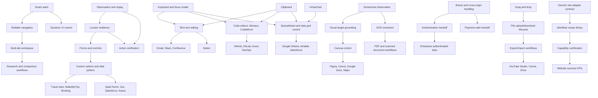
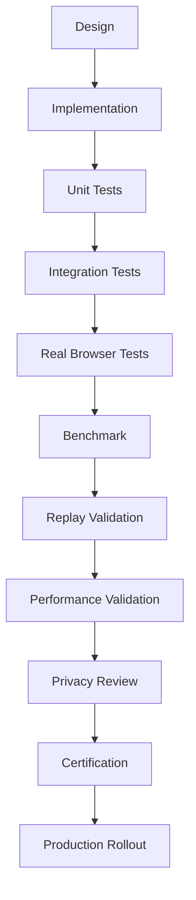

# Browser Control Master Specification V4

Date: 2026-07-23

Status: final planning specification for V4 Browser Control. Design only; no implementation code.

## 1. Executive Summary

V3 completes the AI Browser runtime: Mission Intelligence, Semantic Page Graph, Context Packet, Intent Grounding, Validation, Governance, Learning, and Evaluation are treated as frozen runtime foundations. V4 should not redesign those systems. V4 should make the browser itself capable enough for real-world, multi-step web work on modern applications.

The current browser surface is strongest in basic deterministic automation:

- extension-side capabilities: click, fill, select option, choose date, scroll, navigate, wait, open/switch/focus/close tab, upload, download, observe, extract visible fact, user ask, user handoff;
- Playwright adapter support: navigate, click, type, wait, text/html extraction, upload, download, URL/text/existence validation;
- contextual support: multiple tabs, new windows, refresh, popup handling, basic iframe support;
- known gaps: cross-browser, mobile, persistent profile, drag and drop, cloud browser, upload by drag and drop, deep rich-editor handling, complex web components, visual/canvas control, enterprise SaaS adapters, and hardened recovery.

The V4 thesis is simple: competing with Operator, Comet, Computer Use, and Mariner-class systems requires browser capabilities that are **semantic, modality-aware, stateful, recoverable, and benchmarked against real websites**. V4 should evolve from "can click and type" to "can operate hostile, dynamic, authenticated, collaborative web apps with evidence-backed completion."

Recommended sequence:

- **Wave 1: Control Bedrock.** Harden navigation, interaction, forms, state, waiting, locators, tabs, downloads/uploads, and recovery.
- **Wave 2: Modern Web Apps.** Add rich editors, shadow DOM, iframes, virtual lists, dynamic UI, tables, calendars, keyboard shortcuts, clipboard, and authentication handoff.
- **Wave 3: Visual And Specialized Surfaces.** Add canvas/SVG/chart/map/media/PDF capabilities, visual targeting, drag and drop, and file workflows.
- **Wave 4: Enterprise And Site Adapters.** Add adapters for Gmail, GitHub, Google Docs/Sheets, Jira, Confluence, Slack, Notion, Salesforce, Stripe, Figma, Canva, travel, commerce, and messaging.

North-star V4 outcome: by the end of V4, the browser should complete representative workflows across the target website and user-task matrices with high reliability, bounded latency, clear recovery behavior, certified capability maturity, and measurable coverage.

## 2. Capability Taxonomy

| Domain | Capability Families | Primary Outcome |
|---|---|---|
| Core control | navigation, click/type, scroll, hover, keyboard, clipboard, focus | Reliable page operation |
| Form operation | inputs, validation, masks, autocomplete, date/time, address/payment-safe fields | End-to-end task submission after approval |
| Application surfaces | rich editors, spreadsheets, code editors, boards, calendars, tables, charts | SaaS productivity workflows |
| Dynamic structure | SPAs, popovers, modals, infinite scroll, virtual lists, shadow DOM, iframes | Robust operation on modern UI frameworks |
| Browser workspace | tabs, windows, history, profiles, auth, permissions, notifications | Multi-site continuity |
| File and media | uploads, downloads, drag files, PDFs, images, audio/video, print/export | Document-heavy workflows |
| Visual control | OCR, screenshot targeting, canvas, SVG, maps, visual diffing | Non-DOM and graphical UI operation |
| Reliability | waits, retries, recovery, rollback, validation, idempotency, observability | Production-grade completion |
| Site intelligence | generic adapters, site-specific adapters, workflow libraries | Faster, safer operation on high-value sites |
| Security and governance interface | cross-origin boundaries, permissions, secrets, destructive-action gates | User trust and policy compliance |

## 3. Capability Catalog

Legend for current support:

- **Supported:** declared and substantially available today.
- **Partial:** some primitives exist, but not enough for robust real-world use.
- **Missing:** no reliable capability surface is visible in the current system.

### 3.1 Core Navigation And Page Control

| Capability | Purpose | Why It Matters | Current Support | Missing Functionality | Priority | Dependencies | Typical Websites | Example Workflows | Suggested Test Scenarios | Success Criteria |
|---|---|---|---|---|---|---|---|---|---|---|
| URL navigation | Load target URLs and route within same tab. | Every web task starts with reaching the right page. | Supported | URL normalization, blocked-navigation diagnosis, SPA route stabilization, redirect classification. | Critical | tab state, waits, validation | all sites | Open GitHub repo, open Stripe customer page. | HTTP redirect page, SPA route, blocked mixed-content route. | Correct final URL and page identity detected within budget. |
| Link and button activation | Activate visible controls. | Base primitive for web operation. | Supported | Pointer fidelity, disabled-state detection, overlay avoidance, duplicate label disambiguation. | Critical | grounding, visibility, recovery | all sites | Click compose, save, filter, checkout step. | Hidden duplicate buttons, sticky headers, disabled submit. | Correct control activates and unintended controls are not clicked. |
| Text entry | Type or set text into editable targets. | Required for search, forms, messages, comments. | Supported | Keystroke vs direct set policy, IME handling, masks, debounced validation, contenteditable. | Critical | forms, rich editors | Gmail, Amazon, LinkedIn, Jira | Search products, draft message, enter issue title. | React controlled input, masked phone field, autosuggest. | Field retains intended value and page receives input/change events. |
| Scrolling | Move viewport or scroll containers. | Needed for long pages and hidden content. | Supported | Scroll-container discovery, scroll-to-target, sticky obstruction handling, smooth-scroll completion. | Critical | dynamic UI, virtual lists | LinkedIn, Amazon, YouTube Studio | Review product results, reach save button. | Window scroll, nested panel scroll, sticky footer. | Target becomes visible without layout drift or overscroll loops. |
| Hover and pointer movement | Reveal hover menus and operate hover-only UI. | Many nav menus and toolbars are hidden until hover. | Partial | True pointer events, hover intent timing, menu persistence, coordinate fallback. | High | visual geometry, waits | GitHub, Figma, Canva, Salesforce | Open account menu, reveal toolbar action. | CSS hover menu, nested hover flyout, tooltip interference. | Intended menu remains actionable long enough to select item. |
| Keyboard input and shortcuts | Send keys, chords, and navigation keys. | Power-user apps depend on keyboard flows. | Partial | Modifier chords, platform mapping, focus repair, shortcut conflict detection. | High | focus model, clipboard, rich editors | Gmail, Docs, Sheets, Figma, Slack | Send Ctrl/Cmd+K, Escape modal, save draft. | Ctrl+K command palette, Tab traversal, Escape close. | Shortcut performs intended action and focus is known afterward. |
| Focus management | Know and control active element/window. | Prevents typing into wrong element. | Partial | Active-element tracking across frames, focus traps, blur validation. | Critical | keyboard, forms, rich editors | all SPAs | Fill modal field after opening dialog. | Focus trap modal, iframe focus, auto-focus stealing. | Active target matches grounded target before input. |
| Clipboard operations | Copy, paste, read allowed clipboard content. | Needed for editors, spreadsheets, bulk entry, transfer. | Missing | Permission-aware clipboard read/write, paste verification, rich MIME formats. | High | browser permissions, keyboard, policy | Docs, Sheets, Slack, Notion | Paste table, copy report excerpt. | Plain text paste, HTML paste, clipboard denied. | Clipboard action succeeds or cleanly requests user handoff. |
| Browser history control | Back, forward, reload, stop navigation. | Recovery and comparison workflows need route control. | Partial | History stack awareness, reload-safe resumption, beforeunload handling. | High | navigation, state, recovery | all sites | Back from detail page to results. | SPA back, native back, unsaved-form warning. | Returns to expected prior page without losing mission state. |

### 3.2 Forms, Inputs, And Submission

| Capability | Purpose | Why It Matters | Current Support | Missing Functionality | Priority | Dependencies | Typical Websites | Example Workflows | Suggested Test Scenarios | Success Criteria |
|---|---|---|---|---|---|---|---|---|---|---|
| Native form fields | Fill input, textarea, select, checkbox, radio. | Most transactional tasks use forms. | Partial | Checkbox/radio semantics, file/date/color inputs, validation messages. | Critical | grounding, validation | Amazon, Stripe, Salesforce | Update address, filter records. | Required fields, checkbox group, select with disabled options. | Submitted form contains intended values. |
| Custom selects and comboboxes | Operate ARIA/listbox/autocomplete controls. | Modern frameworks rarely use native selects. | Partial | Option ranking, async search options, multi-select chips. | Critical | dynamic UI, keyboard | Jira, Booking, MakeMyTrip, Salesforce | Choose assignee, flight city, CRM status. | Typeahead select, virtualized options, duplicate option labels. | Correct option selected and visible selected state verified. |
| Date and time pickers | Choose dates/times in calendars and travel widgets. | Travel, scheduling, finance, and SaaS tasks need this. | Partial | Month navigation, ranges, disabled dates, locale formats, timezone. | Critical | calendars, custom selects | MakeMyTrip, Booking, Calendar, Stripe | Book flight dates, set due date. | Date range picker, min/max date, timezone offset. | Correct ISO date/time represented in UI and submitted data. |
| Autocomplete and suggestions | Select suggestions from search/address fields. | Search and data entry often require suggestion pick. | Partial | Debounce waits, result disambiguation, keyboard selection. | High | waits, dynamic UI | Google, Amazon, LinkedIn, Maps | Pick city, product, person, company. | Slow suggestions, same-name suggestions, no-results. | Desired suggestion selected with stable resulting value. |
| Form validation handling | Detect and fix validation errors. | Prevents silent failure after submit. | Partial | Validation-message extraction, field-to-error mapping, retry strategy. | Critical | semantic graph, validation | all transactional sites | Submit signup or ticket form. | Required error, invalid email, server-side error. | Errors are surfaced, mapped, and resolved or escalated. |
| Safe submission | Submit forms with risk-aware confirmation. | Avoids destructive or financial mistakes. | Partial via governance | Browser-side pre-submit intent/evidence checks, double-submit prevention. | Critical | policy, validation, idempotency | Amazon, Stripe, Salesforce | Save settings, send email, place order handoff. | Save vs delete, payment submit, duplicate submit button. | Safe submits proceed; risky submits require confirmation/handoff. |
| Multi-step wizards | Complete forms across several pages. | Checkout, onboarding, bookings, and admin flows use wizards. | Partial | Step state model, progress detection, recover/back behavior. | High | navigation, forms, validation | Amazon, Booking, MakeMyTrip, Salesforce | Checkout until final confirmation, create CRM record. | 3-step wizard, optional step, validation blocking step. | All required steps completed with step evidence captured. |
| Sensitive fields | Handle passwords, OTPs, cards, secrets. | Authentication and payments are unavoidable but risky. | Partial via policy/handoff | Field classification, no-secret logging, handoff/resume checkpoints. | Critical | policy, auth, privacy | Gmail, Amazon, Stripe, banks | Login handoff, card entry handoff. | Password field, OTP prompt, saved card CVV. | Secrets are never captured; workflow resumes after user action. |

### 3.3 Rich Application Surfaces

| Capability | Purpose | Why It Matters | Current Support | Missing Functionality | Priority | Dependencies | Typical Websites | Example Workflows | Suggested Test Scenarios | Success Criteria |
|---|---|---|---|---|---|---|---|---|---|---|
| Contenteditable rich text | Edit rich text blocks and comments. | Core for email, docs, comments, knowledge bases. | Partial | Selection ranges, formatting, paste modes, mention widgets, undo safety. | Critical | keyboard, clipboard, validation | Gmail, Notion, Confluence, Slack | Draft email, update Notion page, comment on PR. | Nested contenteditable, empty editor placeholder, mention autocomplete. | Text appears in correct document region with formatting preserved as requested. |
| ProseMirror/TipTap/Slate editors | Control structured block editors. | Many modern apps use editor frameworks with custom state. | Missing | Framework detection, block insertion, slash commands, document model validation. | High | rich text, keyboard, clipboard | Notion, Linear, Confluence | Create page with headings/tasks/table. | Slash command menu, block drag handle, nested list. | Editor internal state and rendered DOM match requested content. |
| Google Docs editor | Operate Docs canvas-like editor. | High-value productivity target; DOM is not straightforward. | Missing | Visual text targeting, keyboard/paste strategy, document outline verification. | High | visual control, clipboard, auth | Google Docs | Write, format, share a document. | Insert paragraph, bold heading, comment, share dialog. | Document text and formatting verified through accessible/DOM/export signal. |
| Spreadsheet grids | Edit cells, ranges, formulas, sheets. | Critical for Google Sheets, Airtable-like apps, admin tables. | Missing | Cell addressing, formula entry, selection, copy/paste tables, sheet tabs. | High | keyboard, clipboard, virtual grids | Google Sheets, Airtable, Salesforce | Update forecast cells, create formula. | Paste CSV, fill formula, sort/filter grid. | Intended cells contain exact values/formulas after recalculation. |
| Code editors | Operate Monaco/CodeMirror/Ace. | Developer workflows need code and config edits. | Missing | Text model detection, cursor positioning, bulk replace, diff validation. | High | keyboard, clipboard, rich editors | GitHub, GitLab, Azure DevOps, Replit | Edit workflow YAML, comment on code. | Monaco editor, CodeMirror editor, conflict banner. | File content diff matches requested change before commit/save. |
| Kanban boards | Move cards and update status. | Project management apps rely on board interactions. | Missing | Card identity, lane detection, drag/drop or menu fallback. | Medium | drag/drop, dynamic UI | Trello, Jira, Asana, Linear | Move issue to Done, assign card. | Board with hidden columns, collapsed swimlane, WIP limit. | Card appears in intended lane and backend/UI status changes. |
| Command palettes | Use app-global search/action palettes. | Fast path in complex SaaS apps. | Missing | Shortcut opening, result ranking, command confirmation. | Medium | keyboard, dynamic UI | Slack, Notion, Figma, GitHub | Jump to issue, open settings. | Ctrl/Cmd+K palette, delayed results, ambiguous command. | Correct destination/action selected without accidental destructive command. |

### 3.4 Dynamic UI And DOM Complexity

| Capability | Purpose | Why It Matters | Current Support | Missing Functionality | Priority | Dependencies | Typical Websites | Example Workflows | Suggested Test Scenarios | Success Criteria |
|---|---|---|---|---|---|---|---|---|---|---|
| SPA route stabilization | Detect when JS navigation is truly ready. | SPAs update without full page loads. | Partial | Network-idle plus DOM-stability plus app-state signals. | Critical | waits, navigation | Gmail, LinkedIn, Salesforce | Navigate from list to detail. | React route, loading skeleton, stale content. | Actions begin only after page identity and target readiness are stable. |
| Modals, drawers, popovers | Detect and operate overlays. | Most workflows use layered UI. | Partial | Overlay stack, escape/close strategy, backdrop blocking, focus traps. | Critical | focus, keyboard, validation | all SaaS | Open create dialog, save, dismiss toast. | Nested modal, side drawer, blocking cookie banner. | Correct topmost overlay is operated and closed when needed. |
| Toasts and transient feedback | Capture short-lived success/error states. | Completion evidence often appears briefly. | Missing | Toast observer, screenshot/event capture, semantic classification. | High | observation, validation | Gmail, Slack, Stripe, GitHub | Verify "Saved" or "Message sent". | 2-second toast, error toast, undo snackbar. | Transient evidence captured before it disappears. |
| Infinite scroll | Load more content until goal reached. | Search, feeds, travel, ecommerce use endless lists. | Partial | Progress tracking, termination criteria, duplicate avoidance. | High | scroll, extraction, performance | LinkedIn, Amazon, Booking | Find target product/person/listing. | Lazy loaded results, end-of-list, repeated sponsored items. | Target found or end condition proven without runaway scrolling. |
| Virtual lists/grids | Interact with recycled DOM rows/cells. | Enterprise data grids render only visible rows. | Missing | Logical row identity, viewport paging, scroll anchoring. | High | scroll, tables, extraction | Salesforce, Sheets, Jira, Stripe | Update row 500, scan records. | React Window list, ag-grid, sticky headers. | Correct logical item acted on despite DOM recycling. |
| Shadow DOM | Pierce open shadow roots and handle web components. | Many design systems hide internals. | Partial in Playwright context likely; extension unclear | Recursive shadow query, closed-shadow fallback, event retargeting. | High | locators, visual fallback | Salesforce, Chrome UI-like widgets, modern SaaS | Click custom dropdown. | Open shadow root, nested shadow, closed shadow. | Grounding resolves open-shadow elements; closed roots handled via visual/handoff. |
| Iframes | Operate embedded contexts. | Payments, docs, ads, editors, auth use frames. | Partial basic iframe | Frame tree model, cross-origin boundaries, nested frames, focus transfer. | Critical | cross-origin, permissions, auth | Stripe, Docs, Figma, Confluence | Fill embedded payment-safe handoff, edit embedded doc. | Same-origin frame, cross-origin frame, nested frame. | Correct frame selected and policy enforced for restricted frames. |
| Cross-origin boundaries | Respect browser security while coordinating frames/windows. | Required for OAuth, payments, embedded apps. | Partial | Capability availability per origin, handoff contracts, post-action validation. | Critical | iframes, auth, policy | OAuth, Stripe, Google, Microsoft | Login, payment, embedded picker. | OAuth popup, card iframe, file picker iframe. | Secure boundaries are not bypassed; resumable state captured. |
| Responsive and mobile layouts | Operate sites across viewport classes. | Mobile layouts differ dramatically. | Missing | Mobile viewport profiles, touch events, responsive locator variants. | Medium | visual geometry, locators | travel, ecommerce, social | Complete flow in mobile viewport. | Hamburger nav, bottom sheet, mobile date picker. | Same workflow passes desktop and mobile benchmark variants. |

### 3.5 Browser Workspace, Auth, Permissions, And State

| Capability | Purpose | Why It Matters | Current Support | Missing Functionality | Priority | Dependencies | Typical Websites | Example Workflows | Suggested Test Scenarios | Success Criteria |
|---|---|---|---|---|---|---|---|---|---|---|
| Multi-tab workspace | Open, switch, focus, close, and label tabs. | Research and comparison need parallel pages. | Supported/Partial | Tab purpose persistence, opener relationships, stale tab recovery. | Critical | state, validation | GitHub, Amazon, research flows | Compare products across tabs. | New tab, popup tab, closed tab restoration. | Planner-visible tab map remains accurate after tab events. |
| Multi-window and popups | Handle auth/payment/export popups. | Real sites use secondary windows. | Partial | Window lifecycle, popup classification, return-to-origin. | High | tabs, auth, cross-origin | OAuth, Stripe, Google, Slack | OAuth login, payment confirmation. | Popup blocked, popup closes itself, multiple windows. | Workflow resumes in correct originating tab after popup completes. |
| Persistent browser profile | Maintain cookies, local storage, sessions. | Authenticated sites need continuity. | Missing in Playwright capability baseline | Profile lifecycle, isolation, encryption, reset/export policy. | Critical | auth, privacy, state | all authenticated sites | Stay logged into Gmail/Jira. | Fresh profile, expired session, profile corruption. | Auth state persists across runs without leaking between users/tasks. |
| Authentication handoff | Let user safely complete login/MFA then resume. | Agent should not handle secrets directly. | Partial via user handoff | Login-state detection, MFA wait, account mismatch detection. | Critical | policy, sensitive fields, state | Gmail, Slack, Salesforce | User logs in, agent resumes task. | Password page, OTP, SSO account chooser. | Agent resumes only after intended account/session is verified. |
| Browser permissions | Request/handle geolocation, camera, clipboard, notifications. | Apps block workflows behind permission prompts. | Missing | Prompt detection, user approval path, permission state tracking. | High | policy, notifications, media | Maps, Canva, Slack, Figma | Allow clipboard, deny camera, share screen handoff. | Permission prompt allow/deny/dismiss. | Prompt outcome is known and workflow adapts safely. |
| Notifications | Observe or control browser/site notifications. | Messaging and collaboration workflows depend on them. | Missing | Notification permission, event capture, notification-driven resume. | Medium | permissions, scheduler | Slack, Gmail, WhatsApp Web | Wait for incoming message or export done. | Browser notification, in-page notification, denied permission. | Relevant notification is captured or alternative polling is used. |
| Session storage and local state | Inspect high-level app readiness without leaking secrets. | SPA state can prove login/page readiness. | Missing | Safe storage classification, app-state hints, no-secret logging. | Medium | privacy, auth | all SPAs | Detect selected workspace/org. | localStorage workspace id, token redaction. | Useful non-secret state extracted; secrets excluded. |
| Cookie/banner handling | Handle consent, cookie, and regional banners. | Banners obstruct first-run workflows. | Partial via click | Banner classification, accept/reject policy, regional variants. | High | modals, policy | news, travel, ecommerce | Dismiss cookie banner before search. | Accept all, reject all, necessary-only, obstructing banner. | Banner resolved according to configured privacy preference. |

### 3.6 Files, Downloads, Uploads, PDF, And Export

| Capability | Purpose | Why It Matters | Current Support | Missing Functionality | Priority | Dependencies | Typical Websites | Example Workflows | Suggested Test Scenarios | Success Criteria |
|---|---|---|---|---|---|---|---|---|---|---|
| Input-based upload | Attach local files through file inputs. | Resumes, invoices, images, decks. | Supported/Partial | Backend-selected file paths, multiple file verification, cloud file pickers. | High | policy, file metadata | Gmail, Slack, Canva, job sites | Attach invoice to email. | Hidden file input, multiple files, rejected file type. | Correct files attached and visible in UI with metadata. |
| Drag-and-drop upload | Upload through drop zones. | Many modern apps hide file inputs. | Missing | DataTransfer synthesis, drop-zone targeting, progress tracking. | High | drag/drop, visual geometry | Canva, Figma, Drive, Slack | Drop image into design. | Dropzone, nested dropzone, upload progress. | File appears in target area and upload completes. |
| Download lifecycle | Detect, wait for, and catalog downloads. | Export workflows need file evidence. | Supported/Partial | File integrity checks, duplicate naming, download prompt handling. | High | filesystem, validation | Stripe, Docs, Sheets, Canva | Export CSV/PDF. | Direct download, generated export, blocked download. | Expected file exists, type/size/content checks pass. |
| Cloud file pickers | Operate Google Drive/OneDrive/Canva pickers. | Enterprise files often live in cloud pickers. | Missing | Cross-origin picker flow, search/select, permission handoff. | Medium | iframes, auth, cross-origin | Drive, Gmail, Canva, Figma | Attach Drive file to email. | Google picker iframe, permission prompt, folder search. | Intended cloud file is selected or handoff requested. |
| PDF viewing and extraction | Read and navigate browser PDFs. | Invoices, reports, policies, confirmations. | Missing in browser control | PDF viewer controls, text extraction, page navigation, download. | High | visual/PDF, downloads | Stripe, Booking, bank portals | Verify invoice amount in PDF. | Native Chrome PDF viewer, embedded PDF.js, scanned PDF. | Text/visual evidence extracted with page reference. |
| Print/export flows | Generate PDFs/CSVs/images from web apps. | Many apps produce artifacts asynchronously. | Missing | Print dialog handoff, export menus, async job polling. | Medium | downloads, notifications, popups | Docs, Sheets, Canva, Stripe | Export report CSV, print booking PDF. | Browser print dialog, export progress modal. | Artifact produced and validated against requested format. |
| Upload/download governance | Prevent accidental exfiltration or unsafe file actions. | File operations are high-trust actions. | Partial | File classification, destination verification, size/type policy. | Critical | policy, file handling | all file sites | Upload resume only to intended job form. | Wrong tab upload, unknown destination, large file. | Risky transfers require confirmation; safe transfers are auditable. |

### 3.7 Visual, Canvas, SVG, Charts, Maps, And Media

| Capability | Purpose | Why It Matters | Current Support | Missing Functionality | Priority | Dependencies | Typical Websites | Example Workflows | Suggested Test Scenarios | Success Criteria |
|---|---|---|---|---|---|---|---|---|---|---|
| Screenshot observation | Capture visual page state. | DOM misses canvas, visual errors, and layout. | Partial via V3 visual policy concept; not browser-control mature | Viewport/full-page screenshots, redaction, visual evidence refs. | High | policy, validation | all sites | Verify chart, locate non-DOM button. | Full page, clipped viewport, sensitive fields. | Screenshot evidence is captured safely and tied to step. |
| Visual target grounding | Click/drag by screen coordinates from visual evidence. | Needed when DOM locators fail. | Missing | Element box detection, coordinate confidence, obstruction checks. | High | screenshots, recovery | Maps, Figma, Canva, Docs | Click canvas toolbar icon. | Canvas button, icon-only control, overlapping overlay. | Coordinate action hits intended target with post-action verification. |
| Canvas control | Operate canvas-rendered apps. | Figma, Docs, games, maps, design tools. | Missing | Canvas region model, coordinate transforms, text proxy extraction. | Medium/High | visual grounding, keyboard | Figma, Canva, Google Docs, Maps | Select design object, edit doc region. | Scaled canvas, pan/zoom canvas, retina coordinates. | Canvas interaction changes intended state with visual/DOM evidence. |
| SVG interaction | Inspect and operate SVG charts/diagrams. | Charts and diagrams are common in dashboards. | Missing | SVG semantic extraction, path labels, tooltip activation. | Medium | visual, hover | Stripe, analytics dashboards, GitHub graphs | Read revenue chart, click graph node. | SVG bar chart, tooltip on hover, hidden labels. | Correct data point/shape identified and interacted with. |
| Chart understanding | Extract values and trends from charts. | Business tasks need dashboard interpretation. | Missing | Axis detection, legend mapping, tooltip probing, data-table fallback. | Medium | SVG/canvas, visual OCR | Stripe, YouTube Studio, Salesforce | Report revenue trend. | Line chart, stacked bars, canvas chart. | Extracted chart claim matches source data within tolerance. |
| Map interaction | Search, pan, zoom, select pins/routes. | Travel/local workflows depend on maps. | Missing | Coordinate search, pin identification, route panel extraction. | Medium | canvas, visual, forms | Google Maps, Booking, MakeMyTrip | Find hotel near landmark. | Clustered pins, map popup, route overlay. | Correct place/route selected and textual evidence captured. |
| Media controls | Play/pause/seek/read captions/upload media. | YouTube Studio, training, reviews. | Missing | Player control, transcript extraction, upload progress. | Low/Medium | visual, file handling | YouTube Studio, Loom, Canva | Upload video, verify title/caption. | HTML5 video, custom player, upload processing. | Media state and metadata verified without runaway waits. |
| OCR text extraction | Read text unavailable in DOM. | Images, PDFs, canvases, screenshots. | Missing | OCR pipeline, language detection, confidence, redaction. | Medium | screenshots, policy | PDFs, images, charts | Read scanned invoice. | Low contrast, multi-column, rotated text. | OCR text passes confidence threshold or escalates uncertainty. |

### 3.8 Tables, Data Grids, Calendars, And Structured Data

| Capability | Purpose | Why It Matters | Current Support | Missing Functionality | Priority | Dependencies | Typical Websites | Example Workflows | Suggested Test Scenarios | Success Criteria |
|---|---|---|---|---|---|---|---|---|---|---|
| HTML table extraction | Read tables into structured rows/columns. | Reports, admin screens, comparison pages. | Partial via website intelligence | Header association, pagination, sorting, row actions. | High | semantic graph, extraction | Stripe, GitHub, admin dashboards | Extract invoice rows. | Rowspan/colspan, sortable headers, action column. | Extracted table matches DOM-visible data with row ids. |
| Data grid operation | Sort/filter/select/edit rows in grid widgets. | Enterprise apps use ag-grid-like controls. | Missing | Grid role model, row virtualization, inline editing. | High | virtual lists, forms | Salesforce, Jira, Stripe | Update customer status. | ag-grid, MUI DataGrid, infinite rows. | Correct logical row changed and persisted. |
| Pagination | Move across paged result sets. | Needed for exhaustive search. | Partial | Result counting, termination, page-size controls. | High | navigation, extraction | Amazon, GitHub, Stripe | Find record across pages. | Next disabled, numbered pages, cursor pagination. | Stops after finding target or proving absence within scope. |
| Calendar views | Navigate day/week/month and create events/tasks. | Scheduling and project work rely on calendars. | Missing/Partial date picker only | Calendar grid model, event blocks, drag/reschedule. | Medium | drag/drop, date/time | Google Calendar, Outlook, Asana | Schedule meeting, update due date. | Month view, timezone, recurring event. | Event appears at intended time/date with title/attendees. |
| Filters and facets | Apply filters across result lists. | Search and dashboards depend on faceted UI. | Partial | Filter state extraction, chip removal, multi-facet validation. | High | forms, dynamic UI | Amazon, LinkedIn, Booking, Stripe | Filter orders by status/date. | Sidebar facets, removable chips, hidden filters. | Filter state and result set reflect requested constraints. |
| Sorting and column controls | Sort data and show/hide columns. | Common in dashboards and reports. | Medium | Column menu support, stable sort verification. | Medium | tables, dynamic UI | Stripe, Salesforce, Sheets | Sort transactions by date. | Sort toggles, hidden columns, sticky headers. | Order and visible columns match requested configuration. |

### 3.9 Reliability, Recovery, Performance, And Observability

| Capability | Purpose | Why It Matters | Current Support | Missing Functionality | Priority | Dependencies | Typical Websites | Example Workflows | Suggested Test Scenarios | Success Criteria |
|---|---|---|---|---|---|---|---|---|---|---|
| Smart waits | Wait on semantic readiness, not arbitrary time. | Reduces flakiness and latency. | Partial | Network/app/DOM/visual combined readiness, timeout classification. | Critical | observation, performance | all SPAs | Wait for results before extraction. | Skeleton loader, long polling, delayed modal. | Wait exits as soon as target ready or with classified timeout. |
| Locator resilience | Survive DOM changes and ambiguous targets. | Modern pages shift selectors constantly. | Partial | Locator scoring, self-healing, visual fallback, adapter hints. | Critical | semantic graph, visual | all sites | Click "Save" after redesign. | A/B DOM, duplicate labels, moved control. | Correct target selected across fixture variants. |
| Action verification | Prove action effect after each step. | Prevents compounding errors. | Partial | Capability-specific validators, transient evidence capture. | Critical | validation, observation | all sites | Verify filter applied after click. | No-op click, delayed save, optimistic UI rollback. | Each action emits verified, uncertain, or failed status with evidence. |
| Recovery planning hooks | Recover from failed action without runtime redesign. | Browser failures are normal. | Partial | Browser-specific remedies: close overlay, retry locator, reload, backtrack. | Critical | V3 recovery, history, state | all sites | Retry after stale element. | Detached element, intercepted click, lost tab. | Recovery improves success rate without unsafe repeated actions. |
| Idempotency and duplicate prevention | Avoid repeated submits/sends/deletes. | Critical for emails, purchases, records. | Partial | Browser-side submit tokens, sent-state detection, cooldowns. | Critical | policy, validation | Gmail, Amazon, Salesforce | Send email once. | Double click, retry after timeout, network error after submit. | Repeated attempts do not create duplicates. |
| Performance budgets | Keep browser control fast and bounded. | Slow agents lose usability. | Partial via V3 budgets | Capability-level latency budgets, per-site SLOs. | High | metrics, benchmark | all sites | Complete search task under target time. | Slow page, heavy DOM, huge virtual list. | P95 action latency and mission duration meet budgets. |
| Browser crash/session recovery | Resume after tab/browser/extension failure. | Long missions need durability. | Partial via persistence concepts | Driver heartbeat, crash classification, restoration checkpoints. | High | persistent profile, ledger | all sites | Resume research after crash. | Tab crash, extension reload, backend restart. | Mission resumes with correct tab/page state or clean handoff. |
| Observability and replay | Make failures diagnosable and reproducible. | Required for production development. | Supported/Partial | Capability trace schema, screenshots on failure, privacy redaction. | Critical | run ledger, screenshots | all benchmark sites | Replay failed GitHub task. | Failed click, wrong row, auth block. | Trace identifies failing capability, target, evidence, and recovery outcome. |
| Accessibility channel | Use ARIA tree as first-class observation/control source. | Improves semantic grounding and accessibility. | Partial | A11y tree snapshots, role/name/state diffs, keyboard pathing. | High | semantic graph, locators | all accessible sites | Select button by role/name. | ARIA menu, treegrid, live region. | A11y signal improves grounding without harming DOM path. |

### 3.10 Site Adapters And Workflow Libraries

| Capability | Purpose | Why It Matters | Current Support | Missing Functionality | Priority | Dependencies | Typical Websites | Example Workflows | Suggested Test Scenarios | Success Criteria |
|---|---|---|---|---|---|---|---|---|---|---|
| Generic site adapter contract | Declare site-specific affordances safely. | High-value sites need reusable knowledge. | Partial for Amazon/Gmail/MakeMyTrip/WhatsApp | Versioned adapter capabilities, health, fallback, eval ownership. | Critical | capability platform, metrics | all matrix sites | Use Gmail compose adapter. | Adapter enabled/disabled, stale adapter, fallback route. | Adapter improves success and fails open to generic capability safely. |
| Workflow recipe library | Reusable task graphs for common workflows. | Speeds planning and validation. | Partial task graph definitions | More sites, versioning, preconditions, evidence criteria. | High | adapters, validation | Gmail, GitHub, travel, commerce | Draft email, search product, book flight. | Recipe mismatch, missing precondition, alternate layout. | Recipe completes or falls back with clear reason. |
| Site memory | Remember stable site behaviors and recent failures. | Helps avoid repeated exploration. | Partial V3 learning/evaluation foundation | Browser-control-specific memory: selectors, modals, auth patterns. | Medium | evaluation, adapters | all recurring sites | Avoid wrong "Save" button on Jira. | Layout changed, memory stale. | Memory improves success without locking onto stale locators. |
| Capability certification | Certify capabilities per site/workflow. | Roadmap needs measurable readiness. | Partial certification framework | Per-capability certification gates and scorecards. | Critical | benchmarks, metrics | matrix sites | Certify Gmail compose. | Release suite, nightly suite, regression suite. | Capability/site status visible as certified/degraded/blocked. |

## 4. Capability Maturity Model

Every Browser Control capability must carry a maturity level. Maturity is not a subjective status label; it is an implementation, evidence, benchmark, and rollout state.

| Level | Name | Meaning | Minimum Evidence |
|---|---|---|---|
| 0 | Not Started | Capability is planned but not implemented. | Catalog entry, dependencies, and intended benchmark defined. |
| 1 | Prototype | Capability works in a narrow local or developer-controlled path. | Local fixture proof, known limitations recorded, not planner-visible by default. |
| 2 | Shadow Tested | Capability runs in observation or non-routing mode against real pages. | Shadow telemetry, failure classes, replay artifacts, no user-impacting active routing. |
| 3 | Beta | Capability can be used in controlled real workflows behind a feature flag. | Unit, integration, browser, and benchmark tests pass for scoped websites. |
| 4 | Certified | Capability is planner-visible for approved workflows and sites. | Certification pipeline passed, privacy review complete, rollback path tested. |
| 5 | Production Ready | Capability is broadly reliable across supported sites and maintained by regression gates. | Sustained benchmark pass rate, production telemetry, adapter health, and release gates. |

Default target maturity:

- Critical capabilities target **Level 5** before V4 is considered complete.
- High capabilities target **Level 4** or **Level 5** depending on website dependency.
- Medium capabilities target **Level 3** or **Level 4**.
- Low capabilities target **Level 2** or **Level 3** unless a certified website requires them.

Capability maturity overlay:

| Capability Area | Representative Capabilities | Current Maturity | Target Maturity | Certification Requirements |
|---|---|---:|---:|---|
| Core navigation | URL navigation, history, refresh, SPA route readiness | 3 | 5 | URL/page identity validation, redirect tests, route-stability benchmarks, replay on timeout. |
| Core interaction | click, hover, pointer movement, focus | 2-3 | 5 | Hidden/disabled/duplicate target fixtures, overlay interception tests, action verification. |
| Text input | text entry, controlled inputs, keyboard events | 3 | 5 | React/Vue/native input fixtures, value-retention proof, masked-input tests. |
| Keyboard shortcuts | shortcuts, command palettes, focus repair | 1-2 | 4 | Modifier mapping tests, focus-state assertions, Gmail/Slack/GitHub palette benchmarks. |
| Clipboard | copy, paste, rich MIME paste | 0 | 4 | Permission-state tests, privacy review, editor/spreadsheet paste benchmarks. |
| Native forms | inputs, checkbox/radio/select, submission | 2-3 | 5 | Form-state extraction, validation mapping, safe-submit idempotency tests. |
| Custom forms | comboboxes, autocomplete, multi-select | 1-2 | 5 | Async option tests, duplicate label disambiguation, Jira/MakeMyTrip benchmarks. |
| Date/time | date pickers, ranges, timezones | 2 | 5 | Locale/date-range fixtures, disabled date handling, travel/calendar benchmarks. |
| Rich editors | contenteditable, ProseMirror, comments | 1 | 4 | Editor detection, paste/type/format tests, Gmail/Notion/Confluence benchmarks. |
| Document editors | Google Docs-like canvas editors | 0 | 4 | Visual+clipboard strategy, export/evidence validation, auth-safe test workspace. |
| Spreadsheet grids | cells, ranges, formulas, sheet tabs | 0 | 4 | Cell-addressing tests, paste-table tests, Sheets/Airtable benchmark. |
| Code editors | Monaco, CodeMirror, Ace | 0 | 4 | Text model verification, diff validation, GitHub edit benchmark. |
| Dynamic overlays | modals, drawers, popovers, toasts | 2 | 5 | Overlay stack tests, transient feedback capture, recovery from blocked clicks. |
| Infinite/virtual lists | endless feeds, virtual rows/grids | 1 | 4 | Bounded termination, duplicate detection, virtual-row identity benchmarks. |
| Shadow DOM | open shadow traversal, closed-shadow fallback | 1 | 4 | Nested open-shadow fixtures, event retargeting tests, Salesforce-style web component benchmark. |
| Iframes/cross-origin | frame tree, nested frames, OAuth/payment boundaries | 2 | 5 | Frame targeting, policy enforcement, auth/payment handoff resume tests. |
| Multi-tab/window | tab map, popups, opener relations | 3 | 5 | Tab lifecycle tests, popup return tests, stale-tab recovery. |
| Profile/auth state | persistent profile, login handoff, MFA resume | 1 | 5 | No-secret logging proof, account verification, expired-session recovery. |
| Permissions/notifications | browser permission prompts, site notifications | 0 | 4 | Prompt detection, user decision path, denied/allowed/dismissed scenarios. |
| Uploads/downloads | input upload, drag upload, download/export lifecycle | 2 | 5 | File metadata validation, transfer governance, export artifact checks. |
| PDF | browser PDF, PDF.js, scanned PDFs | 0 | 4 | Page navigation, text/OCR extraction, evidence references. |
| Visual control | screenshots, OCR, coordinate grounding | 0-1 | 4 | Redaction, visual target confidence, post-action visual/DOM verification. |
| Canvas/SVG/maps/charts | graphical app surfaces and dashboards | 0 | 3-4 | Coordinate transforms, tooltip probing, chart/map value benchmarks. |
| Tables/data grids | table extraction, sorting, filters, row actions | 1-2 | 5 | Header mapping, pagination, virtual grid benchmarks, row-action verification. |
| Recovery/reliability | smart waits, locator resilience, idempotency | 2 | 5 | Failure taxonomy, remedy tests, duplicate prevention, sustained benchmark pass rate. |
| Site adapters | generic contract, website adapters, workflow recipes | 1-2 | 5 | Adapter lift proof, stale-adapter fallback, per-site certification scorecards. |

## 5. Capability Registry Specification

The Browser Capability Registry is the canonical metadata model for every V4 browser-control capability. It extends the V3 Capability Platform without changing the V3 runtime contract. The registry is authoritative for planner visibility, rollout status, certification, benchmark ownership, and long-term maintenance.

Canonical capability metadata:

| Field | Required | Description |
|---|---|---|
| `capability_id` | yes | Stable identifier, such as `browser.forms.custom_select` or `browser.visual.ocr`. |
| `version` | yes | Semantic version for the capability contract. Breaking behavior requires a major version. |
| `category` | yes | One taxonomy category from this specification. |
| `description` | yes | Human-readable purpose and supported behavior. |
| `dependencies` | yes | Other capability IDs required for safe use. |
| `feature_flag` | yes | Flag controlling availability and rollout state. |
| `maturity_level` | yes | Level 0-5 from the maturity model. |
| `target_maturity_level` | yes | Required level for V4 completion. |
| `supported_browsers` | yes | Browser/runtime support, initially Chromium extension and Playwright Chromium. |
| `supported_websites` | yes | Websites where the capability is certified or beta. |
| `site_adapters` | no | Adapter IDs that consume or specialize the capability. |
| `benchmarks` | yes | Local, integration, browser, and website benchmarks that certify the capability. |
| `metrics` | yes | Capability-specific KPIs and SLOs. |
| `known_limitations` | yes | Explicit unsupported cases and degradation modes. |
| `rollout_status` | yes | Experimental, Internal, Shadow, Beta, Production, or GA. |
| `safety_constraints` | yes | Policy constraints, confirmation requirements, privacy requirements. |
| `failure_classes` | yes | Expected failure taxonomy and recovery hooks. |
| `owner` | yes | Engineering owner or module owner for maintenance. |
| `last_certified_at` | no | Timestamp of most recent successful certification. |

Registry invariants:

- Planner-visible capabilities must be at least Beta and must expose constraints.
- Certified capabilities must have replayable benchmark evidence.
- Production Ready capabilities must be protected by regression gates.
- Unavailable, degraded, unauthorized, or below-threshold capabilities must not be advertised as generally usable.
- Site adapters may specialize capabilities but cannot bypass registry safety constraints.
- Registry entries must be additive within a major version; semantic behavior changes require a version bump.
- Every capability must declare future compatibility boundaries for vision, OCR, MCP, external tools, native desktop automation, and mobile automation when relevant.

Example registry families, without implementation code:

| Capability ID Family | Category | Feature Flag Pattern | Initial Browser Support | Rollout Rule |
|---|---|---|---|---|
| `browser.navigation.*` | Core control | `V4_BROWSER_NAVIGATION_*` | Chromium extension, Playwright Chromium | Production only after route-stability benchmarks pass. |
| `browser.forms.*` | Form operation | `V4_BROWSER_FORMS_*` | Chromium extension, Playwright Chromium | Certified per widget class and website workflow. |
| `browser.editors.*` | Application surfaces | `V4_BROWSER_EDITORS_*` | Chromium extension first | Beta until editor state validation is reliable. |
| `browser.dynamic_ui.*` | Dynamic structure | `V4_BROWSER_DYNAMIC_UI_*` | Chromium extension, Playwright Chromium | Production after overlay/list/shadow/iframe regression suite. |
| `browser.files.*` | File and media | `V4_BROWSER_FILES_*` | Extension plus browser downloads API | Requires privacy and file-transfer governance review. |
| `browser.visual.*` | Visual control | `V4_BROWSER_VISUAL_*` | Screenshot-capable runtimes | Shadow first; production only with redaction and confidence thresholds. |
| `browser.tables.*` | Structured data | `V4_BROWSER_TABLES_*` | Chromium extension, Playwright Chromium | Certified by extraction accuracy and row-action benchmarks. |
| `browser.adapters.*` | Site intelligence | `V4_SITE_ADAPTER_*` | Site-specific | Requires adapter lift, fallback, and site certification. |
| `browser.recovery.*` | Reliability | `V4_BROWSER_RECOVERY_*` | Runtime-wide | Production only after duplicate-prevention and policy gates. |

## 6. User Task Matrix

Implementation should be driven by real user workflows. This matrix maps user tasks to required browser capabilities and defines what "supported" means for each major website.

| Website | User Task | Required Capabilities | Certification Focus |
|---|---|---|---|
| GitHub | Review pull request | navigation, tabs, rich comments, code diff extraction, keyboard, toasts | Correct PR state, comment draft, no accidental submit without approval. |
| GitHub | Edit workflow/file | code editor, file tree, forms, validation, commit dialog | Diff exactly matches requested edit before commit. |
| GitHub | Merge PR | policy confirmation, button disambiguation, status checks, idempotency | Merge only after checks and explicit confirmation. |
| GitHub | Resolve conflict | code editor, diff validation, multi-step wizard | Conflict markers removed and diff validated. |
| Gmail | Draft email | auth handoff, rich editor, recipient autocomplete, safe send | Draft body/recipients/subject verified before send. |
| Gmail | Reply/search mail | search, thread extraction, rich editor, keyboard | Correct thread selected; reply attached to intended conversation. |
| Gmail | Attach file | upload, file metadata, progress, idempotency | Correct file attached once and visible. |
| Google Docs | Create document | auth, document editor, clipboard, visual validation | Content appears in test document. |
| Google Docs | Format text/comment/export PDF | rich formatting, comments, sharing/export, download/PDF | Exported PDF or document evidence matches request. |
| Google Sheets | Update cells/formulas | spreadsheet grid, keyboard, clipboard, formula validation | Intended cells contain exact values/formulas. |
| Google Sheets | Sort/filter/export | grid filters, table extraction, download | Exported data matches filtered state. |
| Slack | Send message | auth, channel search, rich editor, idempotent send | Message sent to intended channel/DM only. |
| Slack | Upload file/search channel | upload, progress, search, result extraction | File visible in intended channel; search result evidence captured. |
| Jira | Create issue | custom forms, rich editor, project/issue type selects, validation | Issue created in intended project with fields correct. |
| Jira | Update status/assign ticket | custom select, board/list navigation, policy for transitions | Status/assignee verified after update. |
| Confluence | Create/update page | rich editor, page tree, publish flow, comments | Page draft/publish state and content verified. |
| Notion | Create page/database entry | block editor, slash commands, database grid | Blocks/database values match requested structure. |
| LinkedIn | Search people/companies | search, filters, infinite scroll, extraction | Target entities found or absence proven within scope. |
| LinkedIn | Draft message/connect | auth, overlays, rich editor, policy confirmation | Message/connect action gated and verified. |
| Amazon | Search product | search, filters/facets, pagination, extraction | Product set matches constraints. |
| Amazon | Compare products | tabs, extraction, table/fact comparison | Comparison uses evidence from product pages. |
| Amazon | Checkout confirmation only | cart, policy, auth/payment handoff, idempotency | Stops before purchase unless explicitly confirmed. |
| WhatsApp Web | Send message | auth QR/session, contact search, rich editor, idempotency | Message delivered to intended contact/chat. |
| WhatsApp Web | Attach media/file | upload, preview, confirmation, progress | Attachment appears and send is gated. |
| Trello | Move card/update task | board model, drag/drop or menu fallback, forms | Card appears in intended lane with expected metadata. |
| Asana | Create/update task | forms, custom selects, date picker, board/list/calendar views | Task fields and status verified. |
| MakeMyTrip | Search flights/hotels | autocomplete, date ranges, filters, popups | Search results reflect route/date/passenger constraints. |
| Booking | Compare lodging | search, filters, maps, infinite scroll, extraction | Lodging comparison evidence is complete. |
| YouTube Studio | Upload video | file upload, media progress, metadata forms, notifications | Upload metadata saved; processing state tracked. |
| YouTube Studio | Read analytics | charts, tables, date filters, extraction | Reported metrics match dashboard evidence. |
| Stripe Dashboard | Export report | auth, tables, filters, download, CSV validation | Exported artifact matches selected filters. |
| Stripe Dashboard | Inspect customer/payment | search, table/detail extraction, policy | Intended record opened; sensitive actions gated. |
| Salesforce | Create/update record | auth, shadow DOM, custom forms, data grids | Record field changes persisted and verified. |
| Salesforce | Manage pipeline | boards/grids, filters, custom selects, recovery | Correct opportunity/stage updated. |
| Figma | Inspect/edit design | canvas, visual grounding, keyboard, export | Target object/file modified or evidence captured. |
| Canva | Create/export design | canvas, uploads, drag/drop, visual verification, downloads | Design state/export artifact verified. |

## 7. Website Capability Matrix

| Website | Supported Workflows With Current Baseline | Missing Capabilities | Difficulty | Estimated Completion Impact |
|---|---|---|---|---|
| GitHub | Navigate repos, click links/buttons, extract visible text, basic search, open tabs. | Monaco/CodeMirror editing, PR review comments, file tree virtualized navigation, auth handoff, toasts, command palette. | Medium | High: unlocks developer workflows, repo research, issue/PR automation. |
| Gmail | Basic navigation, compose button, fill simple fields if locators work, send with approval. | Rich compose editor, attachments, autocomplete recipients, sent-state/idempotency, auth/MFA handoff, keyboard shortcuts. | High | Very high: email workflows are central and broadly benchmarkable. |
| Google Docs | Basic navigation only. | Canvas-like editor, clipboard paste, visual targeting, sharing dialogs, comments, export/download. | Very High | Very high: unlocks document creation/editing, but requires visual/editor investment. |
| Google Sheets | Basic navigation only. | Spreadsheet grid, formulas, ranges, sheet tabs, clipboard table paste, export. | Very High | Very high for business tasks; depends on grid/editor capabilities. |
| LinkedIn | Navigate/search/extract profile or feed text with basic clicks. | Infinite scroll, overlays, messaging rich editor, filters, anti-bot sensitivity, auth/session resilience. | High | High: recruiting and research workflows. |
| Amazon | Search, navigate, filter/click, extract visible facts; adapter exists. | Robust facets, pagination, cart idempotency, checkout policy handoff, dynamic price validation. | Medium | High: ecommerce benchmark coverage and safe transaction flows. |
| WhatsApp Web | Adapter/site knowledge exists; basic clicks/text possible. | Auth QR/session state, message rich editor, attachment upload, notifications, idempotent send. | High | High: messaging workflows after auth/session hardening. |
| Notion | Basic navigation/clicks. | Block editor, slash commands, drag blocks, database grids, command palette. | Very High | High: knowledge work and project docs. |
| Jira | Basic navigation/clicks/forms. | Custom selects, issue editor, boards, virtual lists, modals, command palette, workflow transitions. | High | Very high for enterprise automation. |
| Confluence | Basic navigation/forms. | Rich editor, mentions, page tree, comments, publish validation. | High | High: enterprise documentation workflows. |
| Slack | Basic navigation/clicks. | Auth/session, message editor, channel switcher, notifications, file upload, keyboard shortcuts. | High | Very high: collaboration workflows. |
| Figma | Basic navigation only. | Canvas control, visual targeting, drag/drop, keyboard shortcuts, file picker/export. | Very High | Medium/High: design workflows, but advanced visual surface required. |
| Canva | Basic navigation only. | Canvas/design editor, upload/drag assets, export/download, visual verification. | Very High | Medium/High: content creation workflows after visual/file waves. |
| Trello | Basic navigation/clicks. | Drag cards, board model, inline editing, labels/members/date widgets. | Medium | Medium: good proving ground for drag/drop and boards. |
| Asana | Basic navigation/clicks/forms. | Task editor, custom selects, calendar/board views, multi-pane state. | High | High: project management workflows. |
| MakeMyTrip | Basic navigation/forms/date picker; adapter/site knowledge exists. | Robust date ranges, autocomplete cities, filters, fare calendar, popups, payment handoff. | High | High in India/travel benchmark relevance. |
| Booking | Basic navigation/search/forms. | Date ranges, maps, filters/facets, infinite results, auth/payment handoff. | High | High: travel shopping and comparison workflows. |
| YouTube Studio | Basic navigation/clicks. | File/video upload progress, rich metadata forms, analytics charts, monetization policy gates. | High | Medium/High: creator workflows and media handling. |
| Stripe Dashboard | Basic navigation/clicks/extraction. | Tables, filters, downloads/exports, charts, permission/auth, destructive action governance. | Medium/High | Very high for business admin/reporting workflows. |
| Salesforce | Basic navigation/clicks/forms. | Shadow DOM/web components, data grids, record pages, custom selects, auth/session, iframes. | Very High | Very high: enterprise SaaS benchmark, but hardest DOM complexity. |
| Google Calendar | Basic navigation only. | Calendar grid, event modal, date/time, attendees autocomplete, recurring events. | High | High: scheduling workflows. |
| Microsoft 365/Outlook Web | Basic navigation/clicks. | Auth handoff, rich editor, calendar, attachments, popups, iframes. | High | High: enterprise productivity coverage. |
| Airtable | Basic navigation only. | Virtual grid, formula/cell editing, views, filters, record modals. | High | Medium/High: structured data workflows. |
| Shopify Admin | Basic navigation/forms. | Auth, product forms, rich descriptions, media upload, tables, destructive gates. | High | High: commerce/admin automation. |

## 8. Capability Dependency Graph

## 9. Implementation Waves

### Wave 1: Control Bedrock

Goal: make existing primitive actions production-grade.

Capabilities:

- smart waits;
- locator resilience;
- action verification;
- form field completeness;
- custom selects;
- date/time pickers;
- modal/drawer/popover handling;
- transient toast capture;
- multi-tab workspace hardening;
- browser history/reload;
- download lifecycle;
- input-based upload verification;
- authentication handoff checkpoints;
- persistent browser profile;
- observability and replay;
- capability certification harness.

Reasoning: these are prerequisites for almost every target website. Without them, advanced adapters will only encode fragility.

Exit criteria:

- 90%+ success on generic navigation/click/type/form benchmark tasks;
- no known duplicate-submit failure in benchmark suite;
- replay artifact exists for every failed browser action;
- Gmail basic compose, Amazon search/filter, GitHub repo navigation, MakeMyTrip search, and Stripe table extraction have repeatable smoke flows.

### Wave 2: Modern Web Apps

Goal: operate complex SaaS UIs that still expose useful DOM/accessibility structure.

Capabilities:

- contenteditable rich text;
- ProseMirror/TipTap/Slate control;
- keyboard shortcuts and command palettes;
- clipboard;
- infinite scroll;
- virtual lists;
- data grids and tables;
- pagination;
- filters/facets;
- shadow DOM;
- iframe frame-tree model;
- cookie/banner handling;
- calendar view operation;
- generic site adapter contract;
- workflow recipe library.

Reasoning: this wave unlocks Gmail, Slack, Notion, Jira, Confluence, Trello, Asana, Salesforce partial, Stripe, LinkedIn, and Booking-class workflows.

Exit criteria:

- Gmail compose/send-with-confirmation benchmark passes;
- Jira issue create/update benchmark passes;
- Notion page creation benchmark passes through either editor API strategy or keyboard/clipboard strategy;
- Stripe export/report benchmark passes;
- infinite/virtual list tests have bounded termination behavior.

### Wave 3: Visual And Specialized Surfaces

Goal: handle pages where DOM and accessibility are insufficient.

Capabilities:

- screenshot observation;
- visual target grounding;
- OCR;
- PDF viewing/extraction;
- SVG interaction;
- chart understanding;
- map interaction;
- canvas control;
- drag-and-drop upload and board interactions;
- print/export flows;
- media controls and upload progress.

Reasoning: design tools, documents, maps, dashboards, and PDFs need perception. This wave makes the browser multimodal without changing V3 runtime semantics.

Exit criteria:

- PDF invoice extraction benchmark passes;
- chart value extraction benchmark passes within defined tolerance;
- Trello drag/drop or reliable menu-fallback card move passes;
- Canva/Figma minimal visual workflow reaches selected-object/edit/export evidence;
- Google Docs minimal text insertion/edit benchmark passes with evidence.

### Wave 4: Enterprise And Site Adapters

Goal: convert generic capability into high completion rates on named websites.

Capabilities:

- Gmail adapter;
- GitHub adapter;
- Google Docs/Sheets adapters;
- Jira/Confluence adapters;
- Slack adapter;
- Notion adapter;
- Salesforce adapter;
- Stripe adapter;
- Figma/Canva adapters;
- travel adapters for MakeMyTrip and Booking;
- ecommerce adapter for Amazon;
- messaging adapter for WhatsApp Web;
- per-site certification and release gates.

Reasoning: generic automation gets broad reach; adapters produce competitive reliability on valuable workflows. Site adapters should be built only after underlying generic capabilities exist, and each adapter must have a benchmark suite and fallback path.

Exit criteria:

- top 10 target websites each have at least 3 certified workflows;
- top 20 target websites each have at least 1 certified workflow or a documented blocker;
- site adapter stale-rate and fallback-rate are tracked;
- adapter changes cannot ship without passing generic capability regressions.

## 10. Engineering Complexity Matrix

Complexity is relative engineering effort, not schedule. It accounts for DOM complexity, visual complexity, browser APIs, cross-browser implications, recovery difficulty, and certification burden.

| Capability Area | Complexity | Primary Drivers |
|---|---|---|
| URL navigation and route stabilization | Medium | SPA readiness, redirects, blocked navigation, validation evidence. |
| Click/type/scroll/focus | Medium | Pointer fidelity, overlays, duplicate labels, controlled inputs. |
| Native forms and safe submission | Medium | Field semantics, validation, idempotency, policy gates. |
| Custom selects/autocomplete/date pickers | Large | Async UI, virtualized options, localization, duplicate choices. |
| Keyboard shortcuts and clipboard | Medium | Browser permissions, platform differences, editor focus states. |
| Rich text editors | Large | Contenteditable state, paste/selection behavior, framework differences. |
| Google Docs-style document editors | Very Large | Canvas-like surface, visual validation, auth, export evidence. |
| Spreadsheet grids | Very Large | Virtual grids, keyboard model, formulas, ranges, recalculation. |
| Code editors | Large | Monaco/CodeMirror models, cursor/selection, diff verification. |
| Dynamic overlays and toasts | Medium | Overlay stack, transient evidence, focus traps. |
| Infinite scroll and virtual lists | Large | DOM recycling, termination, duplicate detection, performance. |
| Shadow DOM and iframes | Large | Frame/shadow traversal, cross-origin boundaries, focus transfer. |
| Persistent profile and auth handoff | Large | Privacy, account verification, session expiry, MFA resume. |
| Browser permissions and notifications | Medium | Prompt state, user choice, workflow continuation. |
| Upload/download/export | Large | File governance, progress detection, artifact validation. |
| PDF browser workflows | Large | Viewer variants, extraction quality, scanned/OCR fallback. |
| Visual target grounding and OCR | Very Large | Redaction, confidence thresholds, coordinate transforms, validation. |
| Canvas/SVG/maps/charts | Very Large | Non-DOM semantics, visual state, tooltip probing, panning/zooming. |
| Tables/data grids | Large | Header mapping, sorting/filtering, virtual rows, row actions. |
| Recovery/idempotency/observability | Large | Failure taxonomy, remedy safety, replay, no-duplicate guarantees. |
| Generic site adapter contract | Medium | Metadata model, fallback behavior, health metrics. |
| Major site adapters | Large to Very Large | Website-specific complexity, auth, maintenance, benchmark ownership. |

Complexity guidance:

- **Small:** bounded wrapper around existing capability, low recovery risk.
- **Medium:** requires new state model or browser API behavior but mostly DOM-accessible.
- **Large:** requires cross-surface coordination, significant recovery logic, or site-specific certification.
- **Very Large:** requires visual/non-DOM operation, complex editor/grid models, or high-maintenance enterprise surfaces.

## 11. Testing Strategy

Every capability should ship with the same test ladder:

| Test Layer | Required Coverage |
|---|---|
| Unit testing | Capability input contract, target resolver, state classifier, safety classifier, timeout classification, success/failure result shape. |
| Integration testing | Backend capability registry to planner packet, grounding to execution request, execution to validation object, run ledger/replay artifact creation. |
| Real browser testing | Playwright/extension run against local fixtures and live-safe public pages; authenticated tests use recorded or manually prepared profiles. |
| Regression testing | Golden fixtures for DOM variants, accessibility variants, visual variants, and known historical failures. |
| Benchmark tasks | One generic benchmark per capability, plus at least one mapped website workflow before certification. |

Capability-specific benchmark examples:

| Capability Group | Unit Tests | Integration Tests | Real Browser Tests | Regression Tests | Benchmark Tasks |
|---|---|---|---|---|---|
| Navigation/tabs | URL normalization, tab refs | open/switch/close events | GitHub multi-tab compare | popup lost, closed tab | Compare two repo pages and report stars/license. |
| Forms | field type classifiers | fill-submit-validate loop | Amazon filter, Stripe form | masked input, validation error | Fill a profile form with required fields. |
| Custom widgets | combobox/date models | select/date action lifecycle | MakeMyTrip date/city search | duplicate options, disabled dates | Search flights for a specified route/date. |
| Rich editors | editor detection | paste/type/verify | Gmail, Notion, Confluence | empty editor, mention popup | Draft formatted email/page. |
| Tables/grids | header mapping | table extraction to validation | Stripe table, Salesforce grid | pagination, virtual rows | Export/filter transactions. |
| Dynamic UI | overlay stack | click blocked by modal recovery | cookie banner, drawer | nested modal, stale overlay | Create item from modal and verify toast. |
| Visual/canvas | image capture/redaction | visual target to action | Figma/Canva/Maps | scaled canvas, hidden toolbar | Select visual object and change property. |
| Files/PDF | file metadata policy | download/upload ledger | Gmail attachment, PDF invoice | duplicate filename, blocked download | Attach file; export and validate PDF/CSV. |
| Auth/permissions | sensitive field classifier | handoff/resume | Gmail/Slack login profile | MFA, account chooser | Resume after user login and complete task. |
| Recovery | failure class mapping | remedy execution | stale element live fixture | detached node, no-op click | Recover from overlay/intercepted click. |

Minimum release gates:

- unit coverage for new capability contracts;
- deterministic local fixture integration;
- real-browser smoke test;
- failure replay artifact;
- performance budget measurement;
- privacy review for capabilities touching files, screenshots, clipboard, auth, or storage.

## 12. Benchmark Strategy

V4 benchmarks should combine capability micro-benchmarks with website mission benchmarks.

### 8.1 Capability Micro-Benchmarks

Create fixture pages for each browser behavior:

- forms: native, React controlled, masked, validation errors;
- widgets: combobox, date range, autocomplete, multi-select;
- overlays: modal, drawer, tooltip, cookie banner, nested popover;
- lists: infinite scroll, virtual list, paginated results;
- editors: contenteditable, ProseMirror-like, CodeMirror-like, Monaco-like;
- tables: HTML table, ARIA grid, ag-grid-like virtual grid;
- frames: same-origin iframe, cross-origin placeholder, nested iframe;
- files: input upload, drag/drop zone, generated download;
- visual: canvas buttons, SVG chart, image-only text, map-like viewport.

### 8.2 Website Mission Benchmarks

Use live-safe, non-destructive tasks:

- GitHub: find repo facts, compare issues, draft PR comment without submitting unless confirmed;
- Gmail: compose draft, attach file, verify draft/sent state with confirmation;
- Amazon: search/filter/compare products, add-to-cart only under explicit confirmation tests;
- MakeMyTrip/Booking: search travel options, filter, compare, stop before payment;
- Stripe: filter transactions, export CSV, verify totals;
- Jira/Confluence: create draft issue/page in test workspace;
- Slack/WhatsApp Web: draft/send test message only in controlled channel/contact;
- Notion: create/update page in test workspace;
- Google Docs/Sheets: create/edit test file, export/download;
- Canva/Figma: modify test design/file and export or verify visual state.

### 8.3 Benchmark Scoring

Each benchmark should report:

- mission success;
- capability path used;
- action count;
- retries and recovery count;
- user handoff count;
- policy confirmations;
- validation evidence quality;
- elapsed time;
- per-action latency;
- final artifact/evidence links;
- failure class if unsuccessful.

### 8.4 Certification Levels

| Level | Meaning | Requirement |
|---|---|---|
| Experimental | Capability exists behind flag. | Unit tests and local fixture pass. |
| Beta | Usable in controlled flows. | Integration plus real-browser smoke pass. |
| Certified | Planner-visible for general use. | Benchmark pass rate meets threshold for two consecutive runs. |
| Degraded | Temporarily allowed with caution. | Known issue tracked; fallback exists. |
| Blocked | Not advertised to planner. | Unsafe, unreliable, or unsupported. |

## 13. Certification Lifecycle

Every capability must pass the same lifecycle before it is considered Certified or Production Ready.

Certification gates:

| Stage | Required Evidence | Exit Rule |
|---|---|---|
| Design | Catalog entry, registry metadata, dependencies, failure classes, tests planned. | Architecture owner accepts scope and non-goals. |
| Implementation | Capability exists behind flag and emits structured results. | Not planner-visible outside experimental/internal scopes. |
| Unit tests | Contract, classification, target resolution, safety constraints. | Required tests pass deterministically. |
| Integration tests | Registry to context packet, grounding to execution, execution to validation, ledger/replay events. | End-to-end event chain complete. |
| Real browser tests | Local fixtures and at least one safe real-browser workflow. | Browser state and validation evidence match expected outcome. |
| Benchmark | Capability micro-benchmark and website task benchmark. | Pass rate meets maturity-specific threshold. |
| Replay validation | Failure and success traces replay and diagnose correctly. | Replay produces actionable failure classification. |
| Performance validation | Latency, memory, trace size, and retry counts measured. | SLOs met or documented as Beta limitation. |
| Privacy review | Secrets, screenshots, clipboard, auth, files, storage handling reviewed. | No disallowed sensitive data captured. |
| Certification | Capability owner signs off on maturity, rollout, and known limitations. | Registry moves to Certified. |
| Production rollout | Flag staged to production cohorts with monitoring. | Regression gates and rollback path active. |

Certification thresholds:

- Level 3 Beta: 80%+ pass on scoped benchmark tasks, no critical safety failures.
- Level 4 Certified: 90%+ pass on certified workflows for two consecutive benchmark runs.
- Level 5 Production Ready: 95%+ pass on critical workflows, stable production telemetry, and no unresolved high-severity duplicate/destructive-action failures.

## 14. Rollout Strategy

Rollout stages:

| Rollout Stage | Meaning | Feature Flag Behavior | Planner Visibility |
|---|---|---|---|
| Experimental | Developer-only implementation or fixture trial. | Flag off by default; manually enabled. | Not planner-visible. |
| Internal | Used by internal test runs and controlled dogfood. | Flag enabled for internal users/tasks. | Planner-visible only in internal packets. |
| Shadow | Runs observation, scoring, or alternate resolution without changing behavior. | Flag in shadow mode. | Not advertised as active; telemetry collected. |
| Beta | Used for selected workflows/sites with explicit constraints. | Flag active for allowlisted cohorts/sites. | Planner-visible with constraints. |
| Production | Default for supported workflows/sites. | Flag active by default with kill switch. | Planner-visible for certified scopes. |
| General Availability | Broadly available, maintained as core Browser Control. | Flag may remain as rollback control but is no longer experimental. | Planner-visible by default when healthy. |

Feature flag rules:

- A feature flag must exist before any implementation becomes active.
- Shadow mode may collect telemetry and replay evidence but must not change user-visible behavior.
- Beta flags must declare supported websites, task types, and disallowed actions.
- Production flags must have rollback procedures and alert thresholds.
- Degraded health must remove or constrain planner visibility automatically.
- Site adapters must have independent flags from the generic capability they consume.

Rollout decision inputs:

- capability maturity;
- benchmark pass rate;
- production failure rate;
- policy/handoff rate;
- latency and memory budget;
- privacy review status;
- adapter lift over generic baseline;
- user-impact severity of known limitations.

## 15. Progress Dashboard

This dashboard is the executive view of V4 progress. Values below are initial baseline targets and should be maintained as live status once implementation begins.

| Dashboard Item | Baseline At Spec Freeze | V4 Target | Owner Signal |
|---|---:|---:|---|
| Overall Browser Capability Coverage | Basic primitives only | 80% of planned Critical+High capabilities Certified or better | Capability registry maturity distribution. |
| Critical Capability Coverage | Partial | 100% Critical capabilities Level 4+, 80% Level 5 | Release scorecard. |
| Website Certification Progress | Amazon/Gmail/MakeMyTrip/WhatsApp knowledge partial; broad matrix uncertified | Top 10 sites with 3 certified workflows each | Website benchmark matrix. |
| Wave 1 Progress | Existing primitives implemented, hardening incomplete | Complete before Wave 2 production rollout | Wave milestone checklist. |
| Wave 2 Progress | Mostly not started | Modern SaaS workflows Beta/Certified | SaaS benchmark suite. |
| Wave 3 Progress | Mostly not started | Visual/file/PDF beta with selected certifications | Visual benchmark suite. |
| Wave 4 Progress | Partial adapter foundation | Top site adapters with measured lift | Adapter scorecards. |
| Capability Maturity Distribution | Mostly Level 0-3 | Majority Critical+High at Level 4-5 | Registry snapshot. |
| Feature Flag Rollout Status | V3 flags exist; V4 flags to be added | Every capability has rollout stage and kill switch | Runtime flag audit. |
| Recovery Effectiveness | Partial | 50%+ recoverable browser failures auto-resolved | Failure taxonomy dashboard. |
| Validation Evidence Quality | Partial | 90%+ benchmark validation accuracy | Evaluation scorecards. |

Recommended dashboard rollups:

- count by maturity level;
- count by rollout stage;
- certification status by website;
- certification status by wave;
- failed benchmark tasks by capability;
- top recovery classes and success rates;
- capabilities blocked by privacy, auth, visual, or adapter dependencies.

## 16. Success Metrics

| KPI | Definition | V4 Target |
|---|---|---|
| Capability coverage | Certified capabilities / planned critical+high capabilities. | 80% of Critical+High by V4 end. |
| Website success rate | Successful benchmark missions per website. | Top 10 sites: 75%+ mission pass rate. |
| Mission success rate | End-to-end user goal completed with validation evidence. | 70%+ live-safe benchmark pass rate initially; 85% stretch. |
| Interaction latency | Time from action dispatch to verified action result. | P50 < 1s, P95 < 5s for non-navigation actions. |
| Recovery success rate | Failed actions recovered without user intervention. | 50%+ recoverable browser failures. |
| Validation accuracy | Correct satisfied/not-satisfied classification. | 90%+ on benchmark evidence labels. |
| Browser reliability | Runs without browser/extension/session failure. | 99% run stability on smoke suite. |
| Locator accuracy | Grounded target is the intended element. | 95% on local fixtures; 90% on live smoke. |
| Duplicate action rate | Duplicate sends/submits/downloads caused by retry. | 0 known critical duplicates. |
| Handoff quality | User handoff resolves blocker and resumes correctly. | 90% successful resume after auth/permission handoff. |
| File workflow success | Upload/download/export tasks complete and validate. | 85% pass on certified file workflows. |
| Visual fallback success | Visual action resolves DOM-inaccessible target. | 60% initial, 80% stretch on visual fixtures. |
| Adapter lift | Site adapter success over generic baseline. | 20%+ absolute lift or adapter is not retained. |
| Regression escape rate | Certified workflow regression found after release. | < 2 high-severity escapes per month. |

## 17. Long-Term Extensibility

The Browser Capability Registry must be future-compatible without designing future systems inside V4. The metadata model should support additional providers and execution environments as extensions of capability descriptors.

Future integration compatibility:

| Future Integration | Required Registry Compatibility | V4 Boundary |
|---|---|---|
| Vision | Capabilities can declare screenshot, visual target, visual evidence, and redaction requirements. | V4 may use visual observation/grounding, but does not redesign the vision subsystem. |
| OCR | Capabilities can declare OCR provider, languages, confidence, and privacy constraints. | V4 defines OCR as browser evidence support, not a general document AI platform. |
| MCP | Capabilities can declare external tool dependencies and handoff boundaries. | V4 browser actions remain browser-control capabilities; MCP tools are future adjuncts. |
| External tools | Capabilities can link to non-browser actions, artifacts, or APIs. | V4 does not replace browser workflows with APIs unless a future adapter explicitly owns that path. |
| Native desktop automation | Capabilities can list non-browser execution environments. | V4 remains browser-first and does not certify OS-level UI automation. |
| Mobile automation | Capabilities can declare viewport/device/browser support separately. | V4 may prepare metadata but does not require mobile implementation. |
| Cross-browser automation | Capabilities can declare browser compatibility and gaps. | V4 starts with Chromium and can add Firefox/Edge certification later. |
| Cloud browsers | Capabilities can declare local vs remote runtime constraints. | V4 does not require cloud execution, but registry fields must not assume local-only state. |

Extensibility rules:

- Capability IDs should be stable across execution environments.
- Environment-specific behavior belongs in support metadata, not in planner prose.
- New providers must pass the same certification lifecycle.
- Future integrations inherit V4 safety constraints for files, auth, clipboard, screenshots, and destructive actions.
- Site adapters must remain optional specializations over generic capability contracts.
- Benchmark evidence, replay traces, and maturity levels must remain comparable across providers.

## 18. Final Recommendations

### Month 1: Stabilize The Existing Browser Surface

- Freeze current capability manifest as V4 baseline.
- Add capability certification statuses.
- Harden waits, locators, action verification, transient feedback, and form controls.
- Add persistent profile and auth handoff checkpoints.
- Create the first V4 benchmark pack: navigation, forms, tabs, modals, upload/download.

Primary deliverable: Control Bedrock beta.

### Month 2: Make SaaS Workflows Practical

- Add robust custom selects, date ranges, filters/facets, pagination, infinite scroll.
- Add rich text editor baseline for Gmail/Slack/Confluence-like editors.
- Add clipboard and keyboard shortcut handling.
- Implement generic adapter contract and migrate existing Amazon/Gmail/MakeMyTrip/WhatsApp knowledge into it.

Primary deliverable: Gmail/Amazon/MakeMyTrip/GitHub/Stripe smoke workflows.

### Month 3: Data Grids, Enterprise UI, And Recovery

- Add table extraction and data grid operation.
- Add virtual list/grid handling.
- Add shadow DOM and deeper iframe support.
- Expand browser-specific recovery remedies.
- Certify Jira, Stripe, Salesforce partial, LinkedIn, Booking, and Asana workflows.

Primary deliverable: Modern Web Apps certified core.

### Month 4: Visual And File-Heavy Workflows

- Add screenshot observation with privacy redaction.
- Add visual target grounding and OCR.
- Add PDF viewer/extraction workflows.
- Add drag-and-drop upload.
- Add SVG/chart/map benchmark capabilities.

Primary deliverable: Visual Control beta and file/export certification.

### Month 5: High-Value Site Adapters

- Build adapters only where generic capability is already stable.
- Priority adapters: Gmail, GitHub, Jira, Confluence, Slack, Notion, Stripe, Amazon, MakeMyTrip, Booking.
- Start advanced adapters: Google Docs, Google Sheets, Salesforce, Canva, Figma.
- Require adapter lift and benchmark proof for each adapter.

Primary deliverable: Top 10 website workflow matrix with certified tasks.

### Month 6: Competitive Hardening

- Improve visual/canvas workflows for Docs, Sheets, Figma, Canva, Maps.
- Expand enterprise auth/session handling.
- Add mobile/responsive benchmark variants if product direction requires it.
- Tune performance and recovery KPIs.
- Publish V4 capability scorecard and V5 candidate gaps.

Primary deliverable: Operator/Comet-class browser capability scorecard for the selected target websites.

### Non-Goals And Guardrails

- Do not redesign V3 runtime, planner contract, governance, mission intelligence, validation, or learning foundations.
- Do not make site adapters bypass policy or validation.
- Do not capture passwords, OTPs, card data, tokens, or private clipboard contents into logs.
- Do not certify a capability without a replayable failure artifact path.
- Do not make visual control the first fallback for normal DOM-accessible UI; use it when DOM/accessibility confidence is insufficient.
- Do not let retries repeat destructive, financial, messaging, or submission actions without idempotency evidence or confirmation.

### Final Recommendation

V4 should be managed as a capability certification program rather than a loose feature backlog. Every browser-control improvement should declare:

- capability id and version;
- planner-visible status;
- supported websites/workflows;
- safety constraints;
- benchmark coverage;
- success threshold;
- failure taxonomy;
- recovery behavior;
- rollout flag.

This keeps V3 intact while giving Browser Control a disciplined path from basic automation to competitive, real-world web operation.
