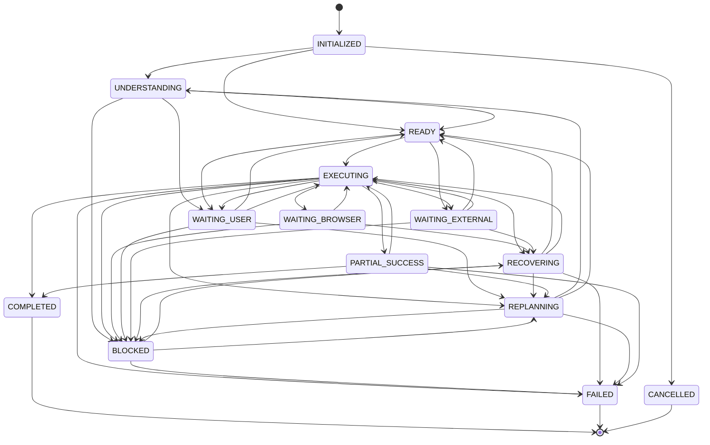

# Cognitive Runtime V2 Wave 3: Cognitive Flow & State Management

## Purpose

Wave 3 adds passive cognitive flow and state management.

It answers:

- what reasoning state a mission appears to be in
- why that state was selected
- which transitions are legal
- whether clarification, waiting, recovery, or replanning is likely
- what the complete diagnostic snapshot looks like

It remains shadow-only and does not modify Runtime V1 behavior.

## Cognitive State Machine

`backend/app/cognitive_runtime/state_machine.py`

The `CognitiveStateMachine` determines a diagnostic reasoning state from:

- evidence count
- readiness summary
- blocked nodes
- waiting nodes
- clarification diagnostics
- wait diagnostics
- recovery diagnostics
- replanning diagnostics

It does not update Mission Ledger, execute providers, trigger recovery, or invoke replanning.

## Supported States



These are reasoning states, not Mission Ledger execution states.

## Transition Engine

`backend/app/cognitive_runtime/transitions.py`

`TransitionEngine` provides:

- legal transition validation
- illegal transition rejection
- transition diagnostics
- transition history
- transition timestamps
- allowed next states

It is in-memory and diagnostic in Wave 3.

## Clarification Engine

`backend/app/cognitive_runtime/clarification.py`

`ClarificationEngine` detects unanswered Blueprint clarification requirements.

It reports:

- required count
- optional count
- unanswered count
- urgency
- grouped clarification diagnostics

It must not ask the user or generate prompts.

## Wait State Engine

`backend/app/cognitive_runtime/waits.py`

`WaitStateEvaluator` classifies:

- browser waits
- user waits
- external waits
- authentication waits
- file waits
- network waits
- approval waits
- time waits

It performs no polling and starts no timers.

## Recovery Evaluation

`backend/app/cognitive_runtime/recovery.py`

`RecoveryStateEvaluator` classifies passive recovery likelihood:

- recoverable
- partially recoverable
- non-recoverable
- blocked
- unknown

It does not execute recovery.

## Replanning Evaluation

`backend/app/cognitive_runtime/replanning.py`

`ReplanningEvaluator` reports:

- replanning unnecessary
- replanning recommended
- replanning required

It does not invoke the planner.

## Lifecycle Analysis

`backend/app/cognitive_runtime/lifecycle.py`

`MissionLifecycleAnalyzer` reports:

- mission age
- transition count
- active duration
- wait duration
- execution duration
- recovery duration
- replanning count

## Snapshot Model

`backend/app/cognitive_runtime/snapshots.py`

`CognitiveSnapshotBuilder` produces a complete read-only reasoning snapshot:

- cognitive state
- evidence summary
- readiness summary
- wait state
- clarification summary
- recovery summary
- replanning summary
- progress summary
- lifecycle summary

## APIs

Read-only endpoints:

```text
GET /mission/{mission_id}/cognitive/state
GET /mission/{mission_id}/cognitive/transitions
GET /mission/{mission_id}/cognitive/waits
GET /mission/{mission_id}/cognitive/clarifications
GET /mission/{mission_id}/cognitive/recovery
GET /mission/{mission_id}/cognitive/replanning
GET /mission/{mission_id}/cognitive/lifecycle
GET /mission/{mission_id}/cognitive/snapshot
```

All endpoints are gated by `COGNITIVE_RUNTIME_V2`.

## Runtime Boundaries

Wave 3 must not:

- execute providers
- create ledger intents
- modify Blueprint
- modify Mission Ledger
- call the planner
- modify Browser Runtime
- modify Workflow Orchestrator
- modify Mission Completion
- modify the extension
- trigger recovery
- trigger replanning
- request clarification

Everything is diagnostic only.

## Future Wave 4 Integration

Future waves may use these diagnostics to drive active cognitive feedback loops.

Wave 3 intentionally stops at passive reasoning.

