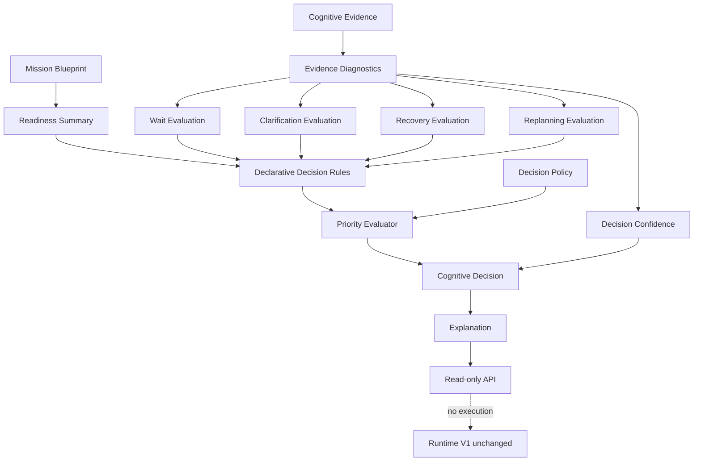

# Cognitive Runtime V2 Wave 4: Cognitive Decision Engine

## Purpose

Wave 4 adds passive cognitive recommendations.

It answers:

- what the runtime appears able to do next
- whether deterministic work appears possible
- whether waiting, recovery, replanning, or clarification is advisable
- how confident the recommendation is
- which alternatives were considered

All decisions are advisory. Wave 4 never executes recommendations.

## Decision Flow



## Components

### CognitiveDecisionEngine

`backend/app/cognitive_runtime/decision_engine.py`

Coordinates diagnostics, rules, confidence, policy, and recommendation output.

### Decision Models

`backend/app/cognitive_runtime/decision_models.py`

Supported advisory decision types:

- `continue`
- `wait`
- `request_user`
- `recover`
- `replan`
- `complete_ready`
- `blocked`
- `fail`
- `cancel`
- `unknown`

These are reasoning outcomes, not execution commands.

### RecommendationEngine

`backend/app/cognitive_runtime/recommendations.py`

Produces:

- recommended decision
- alternatives
- rejected decisions
- confidence
- rationale
- ranked signals

### DecisionConfidenceEngine

`backend/app/cognitive_runtime/confidence_engine.py`

Scores confidence using:

- evidence confidence
- freshness
- contradiction level
- readiness quality
- clarification completeness
- provider agreement
- mission progress

### PriorityEvaluator

`backend/app/cognitive_runtime/priority.py`

Ranks competing recommendations using signal strength, base priority, and policy bias.

### DecisionPolicy

`backend/app/cognitive_runtime/policy.py`

Supported policies:

- conservative
- balanced
- aggressive

Policies affect advisory ranking only.

### DecisionExplanationBuilder

`backend/app/cognitive_runtime/explanations.py`

Explains:

- why the recommendation was selected
- supporting evidence
- conflicting evidence
- assumptions
- confidence factors
- alternatives considered

### DeclarativeDecisionRuleSet

`backend/app/cognitive_runtime/decision_rules.py`

Evaluates generic mission signals:

- readiness
- evidence coverage
- confidence
- contradictions
- lifecycle
- recovery state
- wait state
- clarification state

No workflow-specific logic is introduced.

## APIs

Read-only endpoints:

```text
GET /mission/{mission_id}/cognitive/decision
GET /mission/{mission_id}/cognitive/recommendations
GET /mission/{mission_id}/cognitive/decision/confidence
GET /mission/{mission_id}/cognitive/decision/explanation
GET /mission/{mission_id}/cognitive/decision/policy
GET /mission/{mission_id}/cognitive/decision/alternatives
```

All endpoints are gated by `COGNITIVE_RUNTIME_V2`.

## Database

Wave 4 adds no tables.

## Runtime Boundaries

Wave 4 must not:

- execute providers
- create ledger intents
- dispatch browser actions
- invoke planner
- invoke Mission Completion
- invoke Workflow Orchestrator
- invoke Browser Runtime
- invoke Extension
- modify Blueprint
- modify Mission Ledger

## Future Wave 5 Integration

Future waves may decide how advisory recommendations become controlled runtime inputs.

Wave 4 intentionally stops at passive recommendations.

