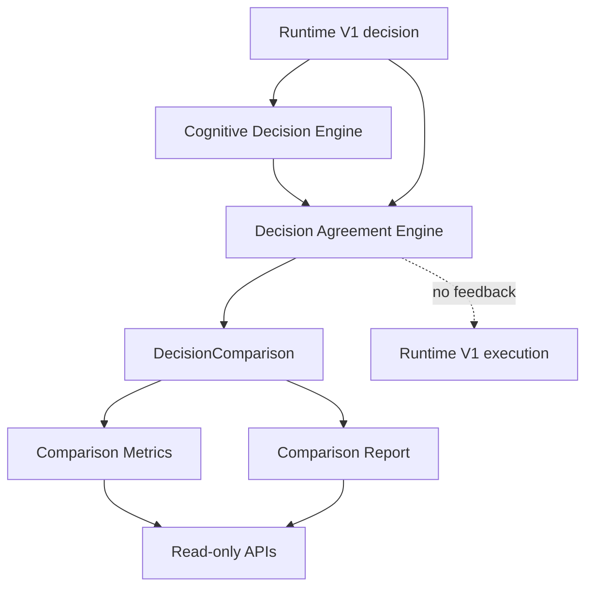

# Cognitive Runtime V2 Wave 5A: Shadow Decision Comparison

Wave 5A is the first integration wave between Runtime V1 and Cognitive Runtime V2.
It is intentionally passive.

Runtime V1 remains the only execution authority. Cognitive Runtime observes the
Runtime V1 decision, produces an advisory recommendation, compares the two, and
stores diagnostics for migration analysis.

## Architecture

## Comparison Flow

1. Runtime V1 produces an `AnalyzeResponse`.
2. The orchestrator maps the response into one Runtime V1 decision:
   `CONTINUE`, `WAIT`, `REQUEST_USER`, `RECOVER`, `REPLAN`,
   `COMPLETE`, `BLOCKED`, or `FAILED`.
3. Cognitive Runtime V2 reads existing passive evidence, Blueprint readiness,
   and diagnostics.
4. Cognitive Runtime produces a shadow recommendation.
5. `DecisionAgreementEngine` computes exact, semantic, partial, or disagreement.
6. `DecisionComparisonService` persists the comparison.
7. Read-only APIs expose history, metrics, reports, and disagreements.

No comparison result is fed back into Runtime V1.

## Agreement Engine

`DecisionAgreementEngine` normalizes Cognitive decisions into Runtime V1 labels:

- `continue` -> `CONTINUE`
- `wait` -> `WAIT`
- `request_user` -> `REQUEST_USER`
- `recover` -> `RECOVER`
- `replan` -> `REPLAN`
- `complete_ready` -> `COMPLETE`
- `blocked` -> `BLOCKED`
- `fail` / `cancel` -> `FAILED`

Agreement levels:

- `exact`: same normalized decision
- `semantic`: different labels with compatible execution meaning
- `partial`: adjacent handling paths requiring migration review
- `disagreement`: incompatible recommendations

Examples:

- `WAIT` vs `WAIT`: exact
- `WAIT` vs `REQUEST_USER`: partial
- `WAIT` vs `REPLAN`: disagreement

## Metrics

Wave 5A reports:

- overall agreement
- exact agreement
- semantic agreement
- partial agreement
- disagreement rate
- agreement by Runtime V1 decision type
- high-confidence disagreement count
- confidence distribution
- recommendation frequency
- false-positive candidates
- false-negative candidates
- average confidence
- recommendation latency

## APIs

All APIs are read-only and feature-flagged by `COGNITIVE_RUNTIME_V2`.

- `GET /mission/{id}/cognitive/comparison`
- `GET /mission/{id}/cognitive/comparison/history`
- `GET /mission/{id}/cognitive/comparison/metrics`
- `GET /mission/{id}/cognitive/comparison/report`
- `GET /mission/{id}/cognitive/comparison/disagreements`

When the feature flag is `off`, endpoints return disabled responses.

## Feature Flag

`COGNITIVE_RUNTIME_V2`

- `off`: comparison disabled
- `shadow`: comparisons are recorded and exposed
- `active`: same behavior as shadow for Wave 5A

Wave 5A active mode does not alter execution.

## Runtime Boundaries

Wave 5A must never:

- mutate `AnalyzeResponse`
- create Mission Ledger intents
- dispatch Intent Runtime providers
- call Browser Control
- replan
- recover
- mark mission completion
- modify Extension behavior

Runtime V1 always wins.

## Future Wave 5B

Wave 5B may add advisory override logging: when Runtime V1 and Cognitive Runtime
disagree, the system can record what would have changed under a future migration.
That future work should still avoid execution changes until a separate
feature-flagged adoption wave.
