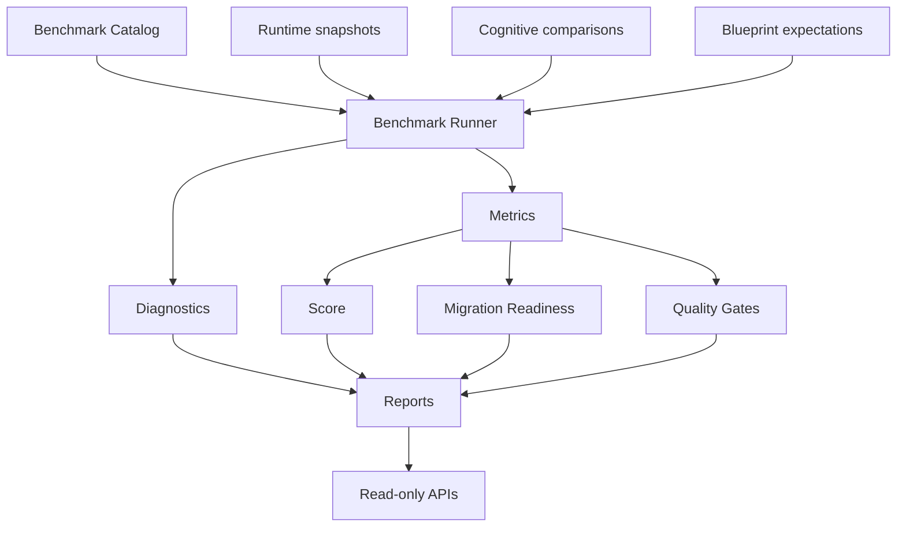

# Cognitive Runtime Validation & Benchmark Framework V1

This framework measures Runtime V1, Mission Blueprint V1, and Cognitive Runtime
V2 behavior without influencing execution.

Runtime V1 remains frozen. Validation is passive.

## Architecture

## Benchmark Pipeline

Each benchmark defines:

- mission
- expected outcome
- expected success criteria
- expected providers
- expected Blueprint structure
- expected Ledger progression

`BenchmarkRunner` evaluates supplied snapshots and comparison records. It does
not call the planner, create intents, dispatch providers, operate the browser,
or change Mission Completion.

## Benchmark Categories

- Research
- Shopping
- Booking
- Authentication
- Navigation
- Forms
- Job Applications
- Dashboard Workflows
- Multi-tab Research
- Extraction
- Upload
- Download
- Email
- Calendar
- Cross-System Workflow
- Custom Mission

## Metrics

The framework computes:

- Mission Success Rate
- Completion Accuracy
- Decision Agreement
- High Confidence Disagreement
- Planner Calls
- Ledger Intents
- Browser Intents
- Provider Calls
- Recovery Count
- Replan Count
- Wait Count
- Clarification Count
- Mission Duration
- Provider Latency
- Evidence Coverage
- Evidence Confidence
- Blueprint Readiness
- Expansion Efficiency
- Validation Accuracy
- Comparison Agreement
- Decision Confidence
- Runtime Stability
- Failure Recovery Rate

## Diagnostics

Diagnostics cover:

- planner
- browser
- ledger
- providers
- knowledge extraction
- validation
- completion
- blueprint
- cognitive runtime
- overall mission

Diagnostics identify root cause, weak subsystem, failure category, and
confidence.

## Quality Gates

Default gates:

- 95% agreement
- less than 2% false positives
- less than 2% false negatives
- 99% ledger consistency
- 100% mission integrity
- Blueprint integrity
- Provider integrity
- Runtime determinism

## Migration Readiness

`MigrationReadinessEvaluator` computes readiness for:

- WAIT
- CONTINUE
- REQUEST_USER
- RECOVER
- REPLAN
- COMPLETE
- BLOCKED
- FAIL

Each decision receives readiness percentage, risk, recommended wave, required
evidence, and confidence.

## Reports

Structured reports include:

- Mission Report
- Subsystem Report
- Decision Report
- Migration Report
- Benchmark Summary
- Regression Summary
- Trend Report
- Readiness Report

No charts are generated.

## APIs

Feature-flagged by `COGNITIVE_RUNTIME_V2`.

- `GET /validation/benchmarks`
- `GET /validation/benchmark/{id}`
- `GET /validation/report`
- `GET /validation/metrics`
- `GET /validation/diagnostics`
- `GET /validation/migration`
- `GET /validation/readiness`
- `GET /validation/quality`

`off` disables APIs. `shadow` enables validation. `active` is identical to
shadow for this framework.

## Runtime Boundaries

Validation must never:

- modify Planner Contract V2
- change Workflow Orchestrator behavior
- create Mission Ledger intents
- dispatch Intent Runtime providers
- control Browser Runtime
- call Browser Control
- affect Extension behavior
- alter Mission Completion
- expand Blueprint nodes
- execute providers

## Adding Benchmarks

Add a `BenchmarkDefinition` to `benchmark_catalog.py` with:

- stable `benchmark_id`
- category
- mission
- expected outcome
- expected success criteria
- expected providers
- expected Blueprint structure
- expected Ledger progression

New benchmarks should be provider-neutral and declarative. They should describe
expected runtime behavior, not website-specific selectors or parser details.
