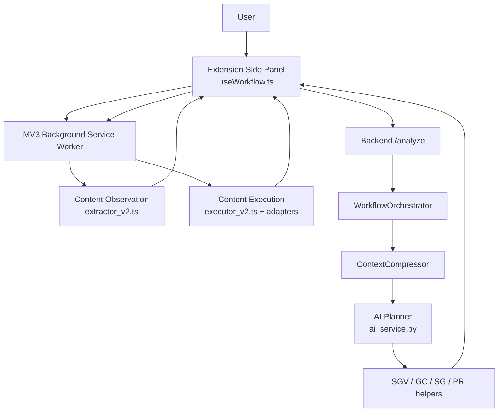
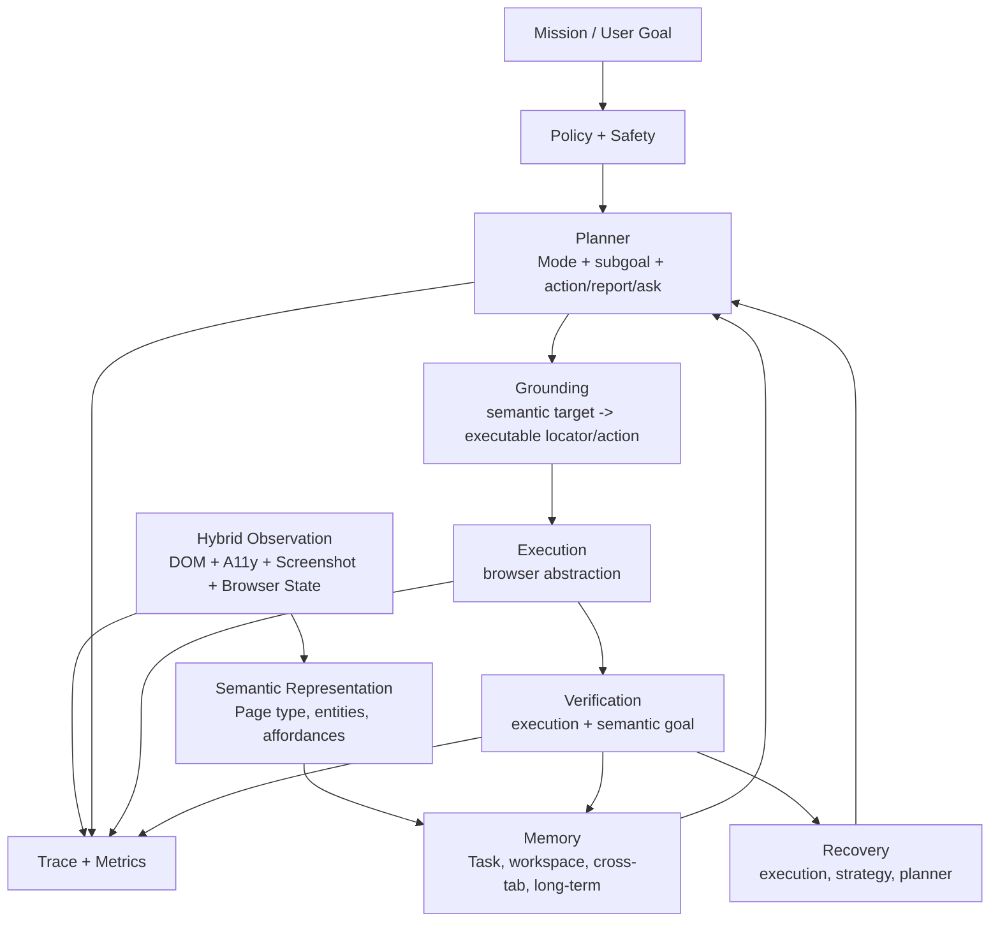
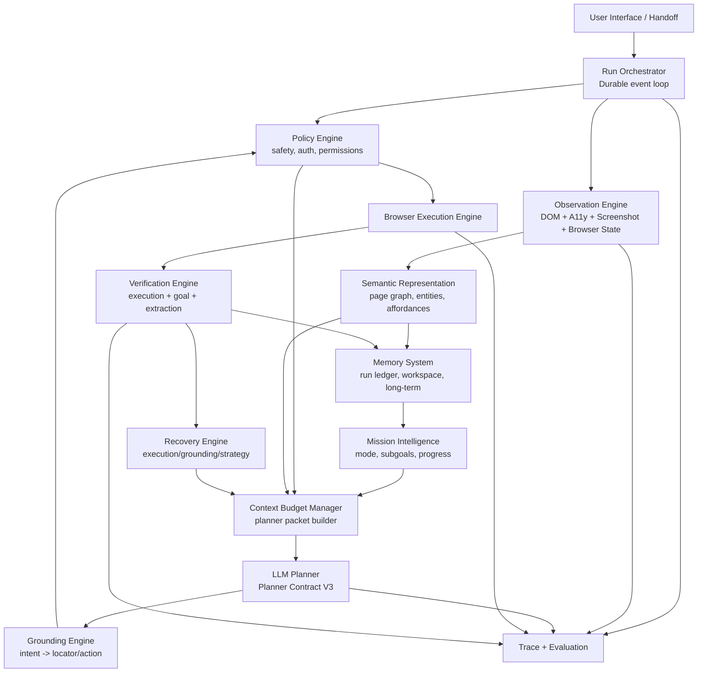

# Comet-Class Browser Agent Architecture Blueprint

Date: 2026-07-19

Status: architecture blueprint. This document does not implement code and does not define a rewrite mandate. It is the reference architecture for evolving this project into a production-grade autonomous browser agent comparable in capability class to Comet, OpenAI Operator, Claude Computer Use, Browser Use, Project Mariner, Skyvern, Stagehand, and BrowserMCP.

## 1. Current Architecture Overview

### 1.1 Runtime Shape

The project is a Chrome Extension plus FastAPI backend browser assistant.



Repository evidence:

- `extension/src/sidepanel/hooks/useWorkflow.ts` owns production workflow state, action approval, auto mode, prior steps, task workspace, tab workspace, mission snapshot, report continuation, execution feedback continuation, and re-analysis.
- `extension/src/background/service-worker.ts` brokers extraction, execution, tab lifecycle, tab control, downloads, DOM settle, and active-tab access.
- `extension/src/content/extractor_v2.ts` captures visible text, headings, content blocks, interactive elements, accessibility metadata, selected values, checkbox/radio state, and password filled/empty state without raw password values.
- `extension/src/content/executor_v2.ts` handles core browser actions. Adjacent production modules add action verification, selector recovery, widget adapters, file transfer, and tab control.
- `backend/app/orchestrator/workflow_orchestrator.py` persists workflow session state, registers grounded elements, compresses context, calls the planner, verifies reports, assesses goal convergence, prepares strategy context, and prepares one-turn planner recovery context.
- `backend/app/services/ai_service.py` is the provider-facing planner, prompt renderer, parser, Planner Contract V2 normalizer, and provider trace integration point.
- `backend/app/context_compression/compressor.py` and `state_summarizer.py` compress verified facts, relevant elements, recent actions, failures, task constraints, and optional cognitive context.
- `backend/app/schemas/response.py` and `extension/src/types/index.ts` expose Planner Contract V2 outcomes: `act`, `wait`, `ask`, `report`, and `replan`.

### 1.2 Existing Intelligence Layers

The system already has meaningful pieces of a modern browser agent:

- Planner Contract V2: typed planner outcomes instead of action-only planning.
- Semantic Goal Validation: report verification and goal evidence separation from action success.
- Goal Convergence: semantic stagnation detection using signatures.
- Strategy Generation: structured context after non-progress.
- Planner Recovery: one-turn recovery planning context.
- Context Compression: relevance-ranked page and history projection.
- Mission Snapshot: compact user-goal progress state.
- Task Workspace: durable task facts/objectives/visited URLs.
- Multi-Tab Workspace: structured tab metadata and tab lifecycle tracking.
- Action Verification: deterministic post-execution effect checking.
- Selector Recovery: one alternate deterministic selector attempt.
- Widget Adapters: deterministic handling for modern controls.
- File Transfer and Tab Control: deterministic execution extensions.
- Planner Traceability: provider/request trace hooks.
- Production Validation Framework: 100-task validation plan, metrics, taxonomy, and failure template.

### 1.3 Current End-To-End Loop

```text
Observe
-> Compress
-> Plan one Planner Contract V2 outcome
-> Route outcome
-> Execute if action
-> Verify execution
-> Update workspace / mission / prior steps
-> Refresh observation
-> Re-analyze until completed, reported, awaiting user, cancelled, or failed
```

This is the correct skeleton. The remaining gap is not "make it click buttons"; it is making the system reason, remember, validate, recover, and choose sources like an autonomous assistant rather than a reactive action loop.

## 2. State-Of-The-Art Architecture Overview

Public systems differ in product surface, but they converge on recurring architectural patterns.

### 2.1 OpenAI Operator

OpenAI describes Operator as a Computer-Using Agent that can use its own browser, look at pages through screenshots, interact through mouse and keyboard, and ask the user to take over for sensitive information such as login or payment details. It is built to combine reasoning with browser control rather than only DOM automation. Public source: [OpenAI Operator announcement](https://openai.com/index/introducing-operator/).

Architectural inference:

- A multimodal observation loop is central.
- Browser execution is mediated by safety boundaries and user takeover.
- Tasks are long-running and stateful.
- Completion is goal-based, not action-based.
- The action space is computer/browser actions, not only page DOM selectors.

### 2.2 Claude Computer Use

Anthropic's Computer Use API exposes a virtual computer tool where Claude receives screenshots and can issue mouse and keyboard actions. Anthropic documents a loop where the developer sends task/tool definitions, Claude requests tool use, the app executes it, sends results back, and the model continues. Public source: [Anthropic Computer Use docs](https://docs.anthropic.com/en/docs/agents-and-tools/tool-use/computer-use-tool).

Architectural inference:

- The model sees a screenshot-centric state representation.
- Tool results form an explicit feedback loop.
- Safety and tool-use mediation are outside model weights.
- Low-level UI control is available when semantic DOM is inadequate.

### 2.3 Google Project Mariner

Google describes Project Mariner as an early research prototype for exploring and acting across websites, with Gemini reasoning over browser state and assisting with tasks across the web. Public source: [Google DeepMind Project Mariner](https://deepmind.google/technologies/project-mariner/).

Architectural inference:

- The product direction is general web task completion, not fixed-site automation.
- Browser state understanding, task context, and action execution are integrated.
- Source/site choice and task decomposition matter for broad web workflows.

### 2.4 Perplexity Comet

Perplexity describes Comet as an AI browser with an assistant that can answer questions, summarize pages, manage tabs, and perform web tasks in the browsing context. Public source: [Perplexity Comet](https://www.perplexity.ai/comet).

Architectural inference:

- The browser itself is the agent workspace.
- Cross-tab context is first-class.
- The assistant is expected to answer and act, not just navigate.
- Search, browsing, extraction, comparison, and summarization are unified.

### 2.5 Browser Use

Browser Use is an open-source browser agent framework that exposes browser automation to LLMs and emphasizes making websites accessible for AI agents. Public source: [Browser Use GitHub](https://github.com/browser-use/browser-use).

Architectural inference:

- The browser is abstracted behind an agent-friendly action API.
- Page state must be converted into compact, useful model context.
- Reusable browser sessions and multi-action workflows are normal.

### 2.6 Skyvern

Skyvern positions itself as an AI browser automation platform using LLMs and computer vision to automate browser workflows, especially complex web tasks where brittle scripts fail. Public source: [Skyvern GitHub](https://github.com/Skyvern-AI/skyvern).

Architectural inference:

- Visual reasoning and DOM reasoning are complementary.
- Workflow durability, observability, and repeatability matter for production.
- The executor must handle dynamic sites without per-site brittle scripts.

### 2.7 Stagehand / Browserbase

Stagehand provides AI-assisted browser automation with Playwright-like primitives and `act`, `extract`, and `observe` style abstractions. Public source: [Stagehand docs](https://docs.stagehand.dev/).

Architectural inference:

- Separating observe, act, and extract is a useful boundary.
- Deterministic browser automation should remain available under AI guidance.
- Extraction is a first-class operation, not merely a side effect of browsing.

### 2.8 BrowserMCP / WebMCP

BrowserMCP connects AI apps to a browser through the Model Context Protocol. Public source: [BrowserMCP GitHub](https://github.com/browsermcp/mcp) and [MCP documentation](https://modelcontextprotocol.io/).

Architectural inference:

- Browser capabilities should be toolized behind stable protocol boundaries.
- Tool calls, observations, and browser state should be inspectable and replayable.
- Separating agent intelligence from browser capability providers is a durable architecture.

### 2.9 Shared SOTA Pattern

Across these systems, the state-of-the-art pattern is:



## 3. Capability Comparison Matrix

| Capability | State-of-the-Art Pattern | Current Project | Gap | Priority |
|---|---|---|---|---|
| Observation | Hybrid DOM + accessibility + screenshot + browser metadata | Strong DOM/a11y extraction; no production screenshot/vision loop | Missing visual perception for canvas, visually hidden structure, spatial layouts | P0 |
| Page Representation | Page type, entities, affordances, form semantics, source quality | Extracted elements/content and compression; limited page-type/entity model | Representation is mostly prompt/context, not a stable semantic graph | P0 |
| Grounding | Semantic target -> robust locator/action, with confidence and fallbacks | Unique selector extraction, ranking, selector recovery | No explicit target-object model; grounding still selector-centric | P0 |
| Context Compression | Budget-aware mission, page, memory, and evidence packing | Existing compressor and context budget manager | Lacks policy-driven hierarchy across page, workspace, screenshots, traces | P1 |
| Planner | Mode-aware mission planner with tool/action/report/ask decisions | Prompted Planner Contract V2, MSM, DCR | Too much deterministic reasoning lives as prompt text | P0 |
| Workflow Loop | Durable event loop with explicit lifecycle and resumption | Production workflow loop in extension/backend | State split across extension memory, backend DB, module globals | P0 |
| Browser Execution | Robust browser abstraction, adapters, verification, recovery | Strong extension execution layer with adapters, verification, selector recovery, tab/file support | Needs unified execution result and replayable action ledger across backend/extension | P1 |
| Element Selection | Multi-signal locators: role, text, aria, spatial, visual, DOM similarity | Unique CSS selectors and alternate recovery | Lacks semantic locator object and confidence model | P0 |
| Recovery | Multi-level: execution, grounding, strategy, planner, user handoff | Action verification, selector recovery, GC/SG/PR | Recovery modes are additive but not unified by a recovery policy engine | P1 |
| Validation | Goal semantics, report verification, task criteria, uncertainty | SGV report verification and goal evidence work | Production validation is still lightweight and lacks explicit uncertainty object | P0 |
| Multi-step Planning | Subgoal graph, dependencies, progress estimate | Mission Snapshot and prompt reasoning | No deterministic subgoal manager or planner-visible task graph in production | P0 |
| Multi-tab Support | Browser workspace with tab purpose, source, facts, switching | MultiTabWorkspace and tab control | No source-citation graph or cross-tab synthesis policy | P1 |
| File Upload/Download | Deterministic transfer with permissions and metadata | File transfer support | Needs user file broker, permission policy, download artifact lifecycle | P2 |
| Authentication | Session reuse, human handoff, credential boundaries | Basic reuse through browser session, ask outcomes | No explicit auth state manager or secure handoff flow | P1 |
| Cookie/Popup/Dynamic UI | Common deterministic adapters plus visual fallback | Widget adapters and cookie/modal handling | Needs adapter registry scoring and visual fallback | P1 |
| Infinite Scroll/Pagination | Scroll/search/result navigation policies | Basic scroll and validation examples | No generalized collection policy for result sets | P0 |
| Long Context Memory | Episodic ledger + working memory + long-term site memory | Workspace, mission snapshot, DB state, memory modules | Memory hierarchy exists but is fragmented and partly prompt-only | P0 |
| Cross-site Reasoning | Source selection, authority ranking, comparison synthesis | DCR prompt guidance and tab workspace | No deterministic source-selection/domain policy | P0 |
| Structured Extraction | Schema-aware extraction and source attribution | Content blocks, SGV, report answers | No first-class `extract` outcome/tool or extraction schema compiler | P0 |
| Retry Policy | Bounded retries by failure taxonomy and safety | Selector recovery once; analyze retry | No central retry/recovery policy across layers | P1 |
| Timeout Recovery | Detect stalled pages, alternate strategy, user handoff | Wait, GC, PR context | Timeout handling remains split between fetch timeout, DOM settle, workflow stop | P1 |
| Session Persistence | Durable tasks, resumability, traceability | Backend sessions, workflow events, extension session state | Not yet a single durable run log reconstructing full state | P0 |
| Execution Monitoring | Action traces, screenshots, before/after, metrics | Verification metadata and benchmark traces | Production trace propagation is incomplete | P1 |
| Safety Policy | Risk classification, approval, restricted actions, human takeover | Safety level, approval/auto mode, restricted close/tab logic | Needs unified policy engine independent of prompt | P0 |

## 4. Architectural Gap Analysis

### 4.1 Largest Gaps

1. Semantic representation is not strong enough.
   The system captures useful page data, but it does not maintain a typed semantic page model: page type, entities, result sets, source authority, forms, affordances, task-relevant facts, and targetable semantic objects. Compression currently ships relevant elements and content blocks to the planner. A Comet-class agent needs a stable representation that every layer can query.

2. Mission state is still more summary than controller.
   Mission Snapshot is helpful, but production still relies on prompt instructions for mode transitions, evidence sufficiency, and subgoal progression. A state-of-the-art agent needs deterministic mission decomposition, current subgoal, collected evidence, missing evidence, source coverage, and completion readiness.

3. Grounding remains selector-centric.
   The project has improved selectors and recovery, but the planner still directly chooses selectors from context. Modern agents increasingly separate "semantic target" from "executable locator" so the planner says "open the repository home result" and grounding resolves the exact element.

4. No hybrid visual layer.
   SOTA systems like Operator and Claude Computer Use demonstrate that screenshots/computer control are essential for pages where DOM/a11y is incomplete, misleading, canvas-based, or visually structured. This project currently depends primarily on DOM/a11y extraction.

5. Prompt carries too much policy.
   MSM-2/MSM-3/DCR-1 rightly improve behavior fast, but many rules should graduate from prompt prose into deterministic structures: mission modes, source choice, evidence sufficiency, policy gates, and recovery thresholds.

6. Memory hierarchy is fragmented.
   The repo contains many memory/state modules, plus extension workspace, mission snapshot, tab workspace, backend verified facts, prior steps, benchmark traces, and compression summaries. The architecture needs a single canonical Run Ledger and Memory Hierarchy.

7. Validation lacks explicit uncertainty and criteria objects in production.
   SGV currently verifies reports against live page evidence, but production does not yet expose a rich `satisfied/not_satisfied/contradicted/uncertain` object with required evidence, observed evidence, confidence, and missing criteria.

### 4.2 Where The Current Project Is Strong

- It has the correct observe-plan-execute-refresh loop.
- Planner Contract V2 is a major architectural upgrade over action-only planning.
- Execution verification and selector recovery are production-grade foundations.
- Context compression and traceability are better than many toy agents.
- Workspaces, mission snapshots, and tab metadata are the right direction.
- The validation framework is unusually mature for an early browser agent.

### 4.3 Where It Is Fundamentally Weaker Than SOTA

- It lacks a visual perception fallback.
- It asks the LLM to do target selection at the CSS selector level.
- It lacks an explicit semantic object graph.
- It lacks a single event-sourced run model.
- It lacks deterministic source/domain/capability policy.
- It lacks a first-class extraction engine.
- It lacks a unified safety and human-handoff policy engine.

## 5. Identified Design Weaknesses

### 5.1 Wrong Responsibility Boundaries

The planner is still asked to choose both the next semantic move and the exact executable selector. This overloads the LLM. The planner should choose intent; grounding should resolve target; execution should actuate.

### 5.2 Prompt-Dependent Deterministic Policy

Mission mode, source suitability, evidence sufficiency, and loop prevention are currently expressed as prompt rules. They should eventually become planner-visible structured state computed before the model call.

### 5.3 Parallel Memory Shapes

There are multiple memories:

- extension completed actions,
- validation prior steps,
- task workspace,
- mission snapshot,
- tab workspace,
- backend verified facts,
- state persistence,
- compressed `recent_actions` and `important_failures`,
- benchmark trace records.

The project needs a canonical Run Ledger with projections, not many peer memories.

### 5.4 Selector-Centric Planning

Letting the planner emit CSS selectors makes grounding brittle and hides ambiguity. The system already felt this in repository/stargazers errors. A target should be semantic first and selector-bound second.

### 5.5 Validation Too Narrow For Real-World Goals

Verified report completion is useful, but real goals require goal criteria: "top two results", "compare price and last updated", "download the file", "submit application", "confirm success page". These need typed evidence requirements, not only report claim matching.

### 5.6 Browser Abstraction Split

The backend planner understands actions, but the extension owns browser execution capabilities. Capability availability should be discoverable as a versioned browser tool manifest, not only embedded in prompt prose and TypeScript action types.

### 5.7 Missing Safety Policy Engine

Approval mode, safety level, destructive tab rules, upload safety, and auth handoff are scattered. A production agent needs one policy engine for risk, confirmation, auth, payment, irreversible actions, and data exfiltration.

### 5.8 Insufficient Production Trace

Benchmark traces are strong; production trace is partial. A production-grade assistant needs every run reconstructable: observation hash, compressed context, planner prompt, provider response, parsed response, grounding decision, execution result, validation state, and user intervention.

## 6. Proposed Comet-Class Architecture

### 6.1 High-Level Component Hierarchy



### 6.2 Component Responsibilities

#### Run Orchestrator

Owns the durable workflow lifecycle:

- run creation, pause, resume, cancel, complete;
- step budgets, time budgets, token budgets;
- event ordering;
- phase transitions;
- user handoff;
- persistence.

It should not reason semantically. It routes deterministic components and persists their outputs.

#### Observation Engine

Collects:

- DOM and accessibility tree;
- visible text and content blocks;
- form state with password redaction;
- browser metadata: URL, title, tab, window, load state;
- screenshot and visual layout when enabled;
- console/network signals when useful.

It should produce raw observations and stable hashes, not planner-ready prose.

#### Semantic Representation Engine

Transforms observation into a typed page graph:

- page type: search results, product page, repository page, docs page, form, checkout, login, error, dashboard;
- entities: product, repository, job, hotel, document, invoice, message, video;
- affordances: search box, submit button, filter, pagination, date picker, upload control;
- result sets and item cards;
- facts and source attribution;
- semantic targets for grounding.

This is the most important missing layer.

#### Mission Intelligence

Owns:

- mission decomposition;
- current subgoal;
- mission operating mode: search, collect, extract, verify, compare, report;
- progress estimate;
- evidence sufficiency;
- remaining evidence;
- source coverage;
- completion readiness;
- confidence.

The planner should receive this as structured state, not infer it only from prose.

#### Policy Engine

Owns:

- sensitive action classification;
- irreversible action rules;
- auth and credential handoff;
- upload/download permission;
- payment and purchase confirmation;
- data privacy and exfiltration constraints;
- site capability restrictions;
- user approval requirements.

The planner proposes; policy permits, blocks, asks, or requires takeover.

#### Context Budget Manager

Builds the planner packet:

1. mission state,
2. current subgoal,
3. policy constraints,
4. semantic page summary,
5. relevant targets,
6. workspace facts,
7. recent attempt ledger,
8. execution/validation feedback,
9. browser capability manifest.

It should be deterministic, testable, and budget-aware.

#### Planner

The LLM planner should choose high-level next intent:

- act,
- extract,
- report,
- ask,
- wait,
- replan,
- handoff.

It should not directly own low-level selector recovery, visual fallback, retry policy, or final validation.

#### Grounding Engine

Resolves planner intent into executable browser action:

```text
Planner: "Open the first repository result, not the stargazers link."
Grounding: semantic target = search_result.repository_home[rank=1]
Locator candidates = role/link text/href/card context/visual bbox
Decision = click locator X with confidence 0.91
```

Grounding owns ambiguity detection. If multiple targets match, it should ask the planner or user rather than guess.

#### Execution Engine

Executes through browser tools:

- click, fill, select, navigate, wait, scroll;
- tabs;
- uploads/downloads;
- widgets;
- keyboard/mouse when necessary;
- screenshot fallback.

It returns structured execution telemetry, not semantic conclusions.

#### Verification Engine

Owns:

- action effect verification;
- extraction correctness;
- report verification;
- goal criteria satisfaction;
- uncertainty;
- contradiction detection.

It should output:

```text
status: satisfied | not_satisfied | contradicted | uncertain
required_evidence
observed_evidence
missing_evidence
confidence
source_refs
```

#### Recovery Engine

Owns layered recovery:

1. execution recovery: same intent, alternate locator/action mechanics;
2. grounding recovery: same semantic target, new locator strategy;
3. strategy recovery: different route/source;
4. planner recovery: one recovery planning turn;
5. human handoff: user-needed state.

Recovery should be policy-governed and bounded.

#### Memory System

Memory hierarchy:

| Layer | Lifetime | Contents |
|---|---|---|
| Observation cache | one step | raw page state, screenshot, hashes |
| Attempt ledger | one run | every planner intent, grounding decision, execution result, validation result |
| Task workspace | one run | goals, subgoals, facts, sources, current target |
| Tab workspace | one run/browser session | tab purpose, source, status, facts |
| Source graph | one run | which facts came from which pages/tabs |
| User/session memory | user-approved | preferences, auth state labels, safe defaults |
| Site memory | cross-run | successful selectors, site patterns, known failure patterns |

The Attempt Ledger is the canonical event stream. Everything else is a projection.

### 6.3 Proposed Data Flow

```text
User Goal
-> Mission decomposition
-> Observe browser
-> Build semantic page graph
-> Update run ledger and workspace
-> Compute mission mode and evidence gaps
-> Build planner packet
-> Planner returns intent
-> Policy checks intent
-> Ground intent to executable action
-> Policy checks concrete action
-> Execute
-> Verify action and goal
-> Update ledger/workspace/source graph
-> Continue, ask, recover, or complete
```

### 6.4 Planner Contract Evolution

Planner Contract V2 is a strong base. A future Planner Contract V3 should move away from raw selector ownership:

```text
outcome_kind: act | extract | report | wait | ask | replan | handoff
intent:
  semantic_target
  operation
  constraints
  expected_evidence
```

Selectors remain an internal grounding artifact. Backward compatibility can preserve V2 actions during migration.

### 6.5 Browser Flow

```text
Intent
-> Grounding target candidates
-> Policy gate
-> Execute
-> Verify effect
-> If no effect:
     execution recovery
-> If wrong target:
     grounding recovery
-> If repeated semantic non-progress:
     strategy/planner recovery
-> If sensitive:
     user handoff
```

### 6.6 Validation Flow

```text
Goal Criteria
Current Semantic Page Graph
Workspace Facts
Planner Report / Extracted Fact
Source Graph
-> Validation state
-> Completion / Continue / Contradiction / Uncertainty
```

### 6.7 Context Flow

The planner should not receive "whatever fits." It should receive a stable packet:

```text
Mission:
  goal, mode, current subgoal, remaining evidence
Policy:
  allowed capabilities, sensitive constraints
Browser:
  active tab, relevant tabs, current site capability
Page:
  page type, entities, affordances, relevant targets
Memory:
  completed objectives, collected facts, sources
Feedback:
  last execution, last validation, known blockers
Instruction:
  output contract and allowed intent vocabulary
```

## 7. Incremental Migration Roadmap

### M1: Canonical Run Ledger

Purpose: unify attempts, actions, reports, validations, recovery, mission updates, and traces into one event stream.

Architecture impact: replaces parallel histories with event-sourced state projections.

Dependencies: existing workflow events, prior steps, trace sink.

Complexity: medium.

Expected improvement: high for debugging, memory consistency, and recovery.

Validation strategy: every production workflow can be replayed from the ledger; no missing planner/execution/validation links.

Risk: migration must preserve extension state behavior.

### M2: Semantic Page Graph

Purpose: create typed page representation: page type, entities, result sets, forms, facts, affordances, targets.

Architecture impact: creates the semantic layer between observation and planner.

Dependencies: extractor_v2, context compression, task workspace.

Complexity: high.

Expected improvement: very high for GitHub, shopping, search, docs, SaaS, and forms.

Validation strategy: page graph snapshot tests for common page types and real-world task traces.

Risk: poor extraction rules could overfit; keep schema generic.

### M3: Intent-Based Grounding

Purpose: separate planner semantic intent from executable selectors.

Architecture impact: planner stops owning CSS selectors for supported action classes.

Dependencies: Semantic Page Graph, existing selector recovery, action verification.

Complexity: high.

Expected improvement: very high for wrong-link and repeated wrong-selector failures.

Validation strategy: tests where repository home, stars, forks, issues, and result-card links are distinguishable.

Risk: requires careful backward compatibility with Planner Contract V2.

### M4: Deterministic Mission Controller

Purpose: move mission modes, subgoal progression, evidence sufficiency, and completion readiness out of prompt-only guidance.

Architecture impact: Mission Intelligence becomes a deterministic pre-planner state generator.

Dependencies: Run Ledger, Semantic Page Graph, Validation Engine.

Complexity: medium-high.

Expected improvement: very high for multi-entity research/comparison and stopping behavior.

Validation strategy: production tasks requiring search -> collect -> extract -> compare -> report.

Risk: over-constraining planner if mission state is wrong.

### M5: Goal Criteria and Validation Object

Purpose: represent goals as typed criteria with uncertainty and evidence provenance.

Architecture impact: SGV becomes a general validation engine, not only report verification.

Dependencies: Semantic Page Graph, Source Graph, Mission Controller.

Complexity: high.

Expected improvement: high for extraction, comparison, form completion, downloads, and report correctness.

Validation strategy: positive/negative SGV paths, contradicted reports, incomplete multi-entity goals.

Risk: false positives if criteria are too loose; false negatives if too strict.

### M6: Hybrid Visual Observation

Purpose: add screenshot/spatial reasoning fallback for pages where DOM/a11y is insufficient.

Architecture impact: observation becomes hybrid; grounding can use bounding boxes.

Dependencies: Run Ledger, Policy Engine, visual trace storage.

Complexity: high.

Expected improvement: high for modern apps, canvas, custom widgets, visual-only layouts.

Validation strategy: pages with misleading DOM, canvas controls, custom menus, visual cards.

Risk: cost, latency, privacy, screenshot retention policy.

### M7: Unified Policy Engine

Purpose: centralize safety, approvals, auth, payments, upload/download, destructive actions, and site restrictions.

Architecture impact: policy becomes an explicit layer before planner context and before execution.

Dependencies: Run Ledger, browser capability manifest.

Complexity: medium.

Expected improvement: high for production safety and user trust.

Validation strategy: auth, payment, delete, upload, private data, and permission scenarios.

Risk: excessive blocking if policy lacks nuance.

### M8: Source Graph and Research Memory

Purpose: track facts by source, tab, URL, confidence, and extraction time.

Architecture impact: workspace gains provenance and cross-site synthesis.

Dependencies: Semantic Page Graph, Extraction Engine.

Complexity: medium.

Expected improvement: high for research, comparison, and citation-heavy tasks.

Validation strategy: multi-tab research tasks with source coverage metrics.

Risk: context bloat if summarization is weak.

### M9: First-Class Extraction Engine

Purpose: make extraction an explicit operation with schemas and source attribution.

Architecture impact: adds `extract` as an internal operation and eventually planner outcome.

Dependencies: Semantic Page Graph, Validation Object, Source Graph.

Complexity: medium-high.

Expected improvement: high for "read", "compare", "summarize", "find value" workflows.

Validation strategy: deterministic invoice, pricing, repo metadata, comments, docs, tables.

Risk: extraction confidence must be calibrated.

### M10: Production Trace and Evaluation Parity

Purpose: make production runs as inspectable as benchmark runs.

Architecture impact: trace becomes first-class production artifact.

Dependencies: Run Ledger.

Complexity: medium.

Expected improvement: high for engineering velocity and regression control.

Validation strategy: every failed production validation task has a reconstructable trace.

Risk: privacy and storage controls must be clear.

### M11: Site Memory and Learning From Runs

Purpose: aggregate successful/failed strategies by domain without hardcoding workflows.

Architecture impact: cross-run memory informs source choice, grounding, and recovery.

Dependencies: Run Ledger, Source Graph, Policy Engine.

Complexity: high.

Expected improvement: medium-high over time.

Validation strategy: repeated tasks on same domains improve without prompt changes.

Risk: stale site memory and privacy concerns.

## 8. Validation Strategy

### 8.1 Critique Of Existing Validation

The 100-task production validation plan is a strong start. It covers real websites, failure taxonomy, KPIs, and evidence capture. It is necessary but not sufficient for Comet-class readiness because completion rate alone can hide architectural weakness.

Current strengths:

- broad task catalog;
- explicit failure taxonomy;
- earliest-failure analysis;
- production metrics;
- procedure that forbids fixing during validation.

Current gaps:

- insufficient multimodal/visual-only tasks;
- insufficient source-provenance scoring;
- insufficient long-running resumability tests;
- insufficient safety/handoff scenarios;
- insufficient adversarial/misleading UI tests;
- insufficient multi-tab synthesis metrics;
- insufficient criteria for evidence sufficiency and uncertainty.

### 8.2 Additional Benchmark Categories

Add categories:

1. Visual grounding: canvas, cards, image-only controls, visually grouped results.
2. Source provenance: answer must cite which tab/source supplied each fact.
3. Multi-entity extraction: top N products/repos/jobs with multiple fields.
4. Long-running resume: pause/reload/resume after 20+ steps.
5. Auth handoff: user logs in, agent resumes without seeing credentials.
6. Safety gates: delete/payment/purchase/upload confirmations.
7. Site unsuitability: agent must leave unsuitable app/source.
8. Contradiction handling: page says no result/404/out of stock; planner must adapt.
9. Dynamic result collection: infinite scroll, pagination, filters, facets.
10. Workspace drift: ensure collected entity A/B facts do not mix.

### 8.3 Production Intelligence Metrics

Beyond task success rate:

- Mission mode accuracy.
- Subgoal progression accuracy.
- Evidence sufficiency accuracy.
- Report precision and recall.
- Source suitability accuracy.
- Grounding target accuracy.
- Selector execution success.
- Execution verification accuracy.
- Recovery usefulness rate.
- Repeated-action avoidance rate.
- Workspace fact retention.
- Cross-tab source attribution accuracy.
- Human handoff appropriateness.
- Safety false positive/false negative rate.
- Trace completeness.
- Cost and latency per successful task.

### 8.4 Validation Standard

A production run is valid only if it records:

- task and initial page;
- every observation hash;
- semantic page graph;
- mission state;
- planner packet;
- raw and parsed planner response;
- grounding decision;
- execution result;
- verification result;
- workspace/source updates;
- final validation outcome.

## 9. Final Recommendations

### 9.1 Strategic Direction

Do not keep adding isolated prompt rules or one-off execution features. The project has reached the point where the next large gains require consolidating intelligence layers:

1. Canonical Run Ledger.
2. Semantic Page Graph.
3. Intent-Based Grounding.
4. Deterministic Mission Controller.
5. General Validation Object.

These should become the foundation for future milestones.

### 9.2 Most Important Architectural Pivot

Move from:

```text
Planner reads compressed DOM and chooses selector/action
```

to:

```text
Representation builds semantic targets
Mission chooses current subgoal/evidence gap
Planner chooses semantic intent
Grounding resolves executable action
Validation verifies goal evidence
```

This is the difference between an action-bot and a browser agent.

### 9.3 What To Preserve

Preserve:

- Planner Contract V2 outcome discipline;
- production workflow loop;
- extension execution capabilities;
- context compression;
- workspaces and mission snapshots;
- SGV/GC/SG/PR concepts;
- validation framework;
- provider trace hooks.

These are useful assets. The issue is not that they exist; the issue is that they need a stronger semantic and event-sourced spine.

### 9.4 What To Stop Doing

Stop treating prompt additions as the primary architecture mechanism. Prompt guidance is useful for fast steering, but durable autonomy requires deterministic state, explicit semantic objects, validation criteria, grounding ownership, and policy gates.

### 9.5 North Star

A Comet-class browser assistant should be able to say:

```text
I know the user's mission.
I know the current mode.
I know which sources are appropriate.
I know what evidence has been collected and where it came from.
I know what remains missing.
I choose a semantic next intent.
I ground that intent safely into browser action.
I verify whether it worked.
I recover or ask for help when evidence says I should.
I stop when the user's goal is satisfied.
```

The current project has many of these sentences partially true. The next architecture phase should make them structurally true.

