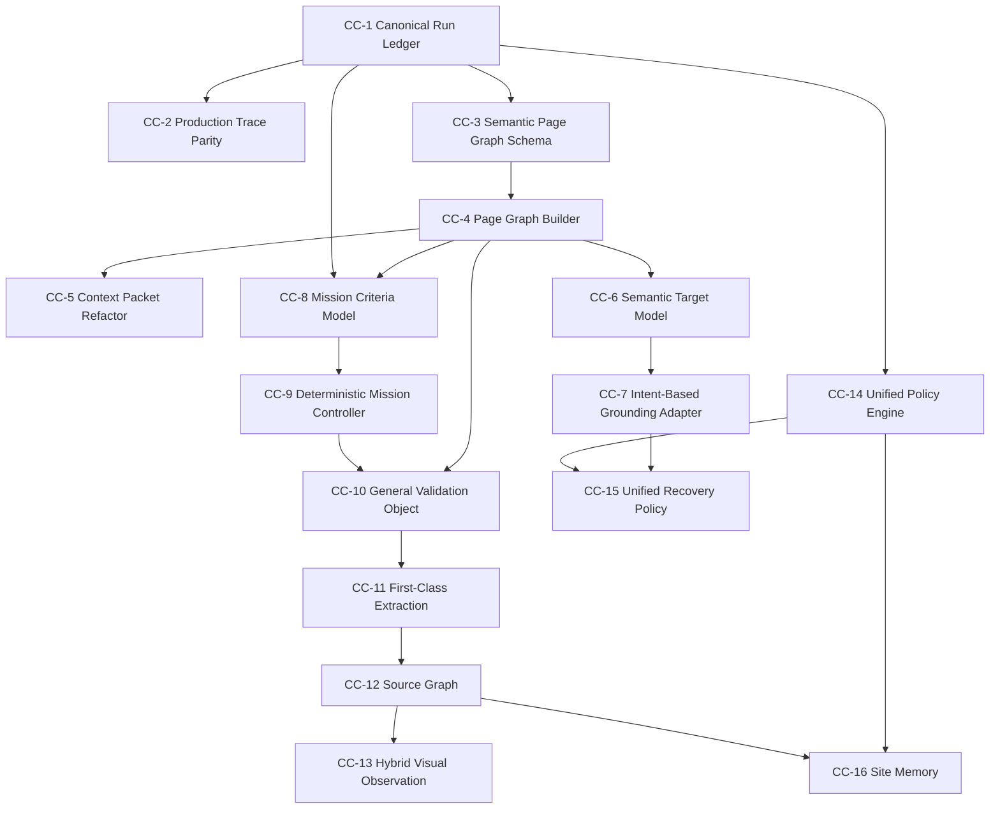

# Comet-Class Implementation Plan

Date: 2026-07-21

Source blueprint: `docs/comet_class_architecture_blueprint.md`

Status: implementation planning document. This does not implement code. It converts the Comet-class architecture blueprint into a sequenced engineering plan.

## 1. Planning Principles

1. Build the semantic spine before adding more surface features.

   The blueprint identifies the largest structural gap as the absence of a canonical run ledger, typed semantic page graph, intent-based grounding, deterministic mission control, and general validation object. These come before more widgets, more prompt rules, or more site-specific patches.

2. Preserve the existing production loop.

   The current extension/backend flow already observes, analyzes, executes, verifies, refreshes, and re-analyzes. Milestones should integrate into this loop rather than replacing it.

3. Make every milestone independently mergeable.

   Each milestone must compile independently, pass focused tests, and be revertable without invalidating later unrelated work.

4. Keep planner autonomy but reduce planner burden.

   The LLM remains the planner, but deterministic components should own state, representation, grounding, validation, safety policy, and memory projection.

5. Prefer additive contracts first.

   When existing Planner Contract V2 or extension APIs need to evolve, introduce optional/additive fields and compatibility adapters before replacing old paths.

6. Benchmark and production validation both matter.

   Backend benchmark runs catch regression in controlled workflows; production validation catches real-world failures. A milestone is not complete until both surfaces have a clear validation story.

## 2. Implementation Sequence

## 3. Milestones

### CC-1: Canonical Run Ledger

Objective:

- Introduce one canonical event stream for production workflow runs.
- Capture planner outcomes, prior steps, execution results, verification results, SGV results, GC/SG/PR signals, mission updates, workspace updates, and tab updates as typed ledger entries.

Expected files:

- `backend/app/models/db.py`
- `backend/app/orchestrator/workflow_orchestrator.py`
- `backend/app/replay/*`
- `backend/app/schemas/*`
- `extension/src/sidepanel/hooks/useWorkflow.ts`
- `extension/src/types/index.ts`
- focused backend and extension tests

Dependencies:

- Existing `WorkflowEvent`, `TimelineService`, prior steps, and extension workflow state.

Unit tests:

- ledger entry creation for planner, execution, validation, mission, workspace, tab, and report events;
- projection from ledger to existing prior steps;
- backward compatibility with existing workflow event rows;
- no duplicate event writes on refresh/retry.

Production validation:

- Run one simple search workflow and prove it can be reconstructed from ledger entries.

Benchmark validation:

- Existing backend benchmark suite unchanged.
- Add a no-op compatibility test proving benchmark reports are not required to use the production ledger.

Rollback:

- Disable ledger writing behind a single feature flag or adapter.
- Existing prior-step state remains authoritative.

Acceptance criteria:

- Existing workflows behave unchanged.
- Every production step has one ledger entry with type, timestamp, session id, and payload.
- Existing `prior_steps` can be rebuilt from the ledger.

### CC-2: Production Trace Parity

Objective:

- Make production runs as inspectable as benchmark runs by connecting trace ids to the run ledger.

Expected files:

- `backend/app/api/routes/analyze.py`
- `backend/app/services/ai_service.py`
- `backend/app/diagnostics/*`
- `extension/src/sidepanel/hooks/useWorkflow.ts`
- `extension/src/types/index.ts`

Dependencies:

- CC-1.
- Existing backend trace sink and `X-Trace-Id` support.

Unit tests:

- trace id generated per workflow run;
- analyze requests include trace id;
- planner request, rendered prompt, raw provider response, parsed response, and outcome are linked to ledger event ids;
- tracing disabled preserves behavior.

Production validation:

- One failed production validation run can be reconstructed without benchmark artifacts.

Benchmark validation:

- Trace fixture tests continue to pass.

Rollback:

- Turn off production trace emission; ledger remains.

Acceptance criteria:

- Trace completeness can answer: what did the planner receive, what did provider return, what was parsed, what happened next?

### CC-3: Semantic Page Graph Schema

Objective:

- Define a typed, versioned semantic representation schema without changing planner behavior.

Expected files:

- `backend/app/representation/*` or `backend/app/semantic_page/*`
- `backend/app/schemas/*`
- `extension/src/types/index.ts`
- documentation update in `docs/`

Dependencies:

- CC-1 preferred, but schema can be developed independently.

Unit tests:

- schema validates page type, entities, affordances, facts, result sets, forms, source metadata, and target references;
- schema serializes deterministically;
- unknown fields fail or are quarantined according to versioning policy.

Production validation:

- None required beyond compilation; no behavior change.

Benchmark validation:

- Snapshot tests using fixture pages.

Rollback:

- Remove unused schema module.

Acceptance criteria:

- Schema exists, is typed, versioned, tested, and unused by production planner until CC-4.

### CC-4: Page Graph Builder

Objective:

- Build a Semantic Page Graph from existing `PageContext` without screenshots or LLM calls.

Expected files:

- `backend/app/semantic_page/*`
- `backend/app/context_compression/*`
- `backend/tests/unit/*`
- fixture snapshots

Dependencies:

- CC-3.

Unit tests:

- detects page types: search results, repository page, product page, docs page, form, login, error page, table/list page;
- extracts entities and facts from content blocks;
- detects affordances from interactive elements;
- builds result-set items with child links/actions;
- preserves redaction and password safety.

Production validation:

- GitHub search results and invoice fixture produce expected page graphs.

Benchmark validation:

- Run relevant fixture/search/extraction tasks and verify no planner behavior regression.

Rollback:

- Stop passing page graph to downstream components; raw `PageContext` remains.

Acceptance criteria:

- Page graph is generated and logged/traceable, but planner output remains unchanged unless explicitly enabled in CC-5.

### CC-5: Context Packet Refactor

Objective:

- Refactor planner context into a stable packet: mission, policy, browser capability, semantic page graph summary, workspace, recent ledger, feedback.

Expected files:

- `backend/app/context_compression/compressor.py`
- `backend/app/context_compression/state_summarizer.py`
- `backend/app/services/ai_service.py`
- `backend/app/orchestrator/workflow_orchestrator.py`
- tests for prompt/context construction

Dependencies:

- CC-1 and CC-4.

Unit tests:

- packet includes page graph summary;
- packet preserves mission/workspace/execution feedback;
- packet respects token budget;
- no raw DOM, passwords, screenshots, or oversized history leak;
- Planner Contract V2 parser unchanged.

Production validation:

- Run one search, one form, one extraction, and one compare workflow; confirm planner request contains structured packet.

Benchmark validation:

- Full backend suite and one nightly benchmark if provider is healthy.

Rollback:

- Use old compressed context builder.

Acceptance criteria:

- Planner receives the same behavior contract with better structured context.
- No public API schema change required.

### CC-6: Semantic Target Model

Objective:

- Introduce planner-visible semantic target references separate from CSS selectors.

Expected files:

- `backend/app/semantic_page/*`
- `backend/app/grounding/*`
- `backend/app/schemas/*`
- `extension/src/types/index.ts`

Dependencies:

- CC-4.

Unit tests:

- semantic targets are stable across page graph builds;
- repository home, stars, forks, issues, search-result card, filter, and pagination controls are distinguishable;
- target ids map to locator candidates;
- old selector-based actions still work.

Production validation:

- GitHub repository search target inspection.

Benchmark validation:

- Grounding fixture tasks.

Rollback:

- Keep target model unused; planner continues selector-based actions.

Acceptance criteria:

- Semantic targets exist as context objects but do not yet change execution.

### CC-7: Intent-Based Grounding Adapter

Objective:

- Allow the planner to choose a semantic intent/target for selected action types, while preserving Planner Contract V2 selector actions as fallback.

Expected files:

- `backend/app/schemas/response.py`
- `backend/app/services/ai_service.py`
- `backend/app/grounding/*`
- `backend/app/orchestrator/workflow_orchestrator.py`
- `extension/src/types/index.ts`
- `extension/src/sidepanel/hooks/useWorkflow.ts`

Dependencies:

- CC-6.

Unit tests:

- planner can return legacy selector action unchanged;
- planner can return target-referenced action through additive fields;
- grounding resolves target to executable selector;
- ambiguity returns ask/replan context, not random selector;
- wrong-link cases are prevented when semantic target exists.

Production validation:

- GitHub search result comparison workflow: repository home link is selected instead of stargazers/forks/issues metadata links.

Benchmark validation:

- Nightly benchmark plus targeted grounding scenarios.

Rollback:

- Ignore target fields and execute legacy selectors only.

Acceptance criteria:

- Supported actions can be grounded from semantic target references.
- Existing selector path remains compatible.

### CC-8: Mission Criteria Model

Objective:

- Represent user goals as typed criteria and evidence requirements.

Expected files:

- `backend/app/mission/*`
- `backend/app/schemas/*`
- `extension/src/sidepanel/missionState.ts`
- tests

Dependencies:

- CC-1 and CC-4.

Unit tests:

- criteria for information extraction, comparison, form completion, navigation, download, upload, and auth handoff;
- criteria remain stable across steps;
- criteria can list required evidence and missing evidence;
- criteria serialize into compact planner context.

Production validation:

- Invoice total, GitHub compare, product compare, and form-fill tasks produce expected criteria.

Benchmark validation:

- Positive/negative report fixture remains valid.

Rollback:

- Mission snapshot remains summary-only.

Acceptance criteria:

- Criteria are generated and visible to planner/validation but do not yet control completion.

### CC-9: Deterministic Mission Controller

Objective:

- Move mission mode, subgoal progression, evidence sufficiency, and completion readiness out of prompt-only reasoning into deterministic mission state.

Expected files:

- `backend/app/mission/*`
- `backend/app/orchestrator/workflow_orchestrator.py`
- `backend/app/context_compression/*`
- `extension/src/sidepanel/missionState.ts`
- tests

Dependencies:

- CC-8.

Unit tests:

- mode transitions: search -> collect -> extract -> verify -> compare -> report;
- enough evidence triggers report-readiness;
- missing entity evidence advances to next entity;
- completed objectives do not repeat;
- poor source suitability is surfaced as a mission blocker.

Production validation:

- Multi-entity GitHub comparison and product comparison workflows.

Benchmark validation:

- Compare against previous production validation traces, not only benchmark score.

Rollback:

- Keep mission controller passive; planner prompt guidance remains.

Acceptance criteria:

- Mission controller outputs structured mode/current subgoal/evidence state.
- It does not create actions or override planner outcomes.

### CC-10: General Validation Object

Objective:

- Replace boolean-only report validation with an explicit validation result: `satisfied`, `not_satisfied`, `contradicted`, `uncertain`.

Expected files:

- `backend/app/orchestrator/report_verifier.py`
- `backend/app/validators/*`
- `backend/app/schemas/response.py`
- `backend/app/orchestrator/workflow_orchestrator.py`
- extension type/UI state tests

Dependencies:

- CC-8 and CC-9.

Unit tests:

- verified report;
- rejected report with missing evidence;
- contradicted report;
- uncertain report;
- action success but goal not satisfied;
- goal satisfied without further action.

Production validation:

- Invoice, pagination, GitHub compare, docs extraction.

Benchmark validation:

- Full backend suite and one nightly benchmark.

Rollback:

- Continue using `sgv_verified` boolean derived from new object.

Acceptance criteria:

- `sgv_verified` compatibility remains.
- New validation object is traceable and planner-context-ready.

### CC-11: First-Class Extraction

Objective:

- Introduce explicit extraction as an internal operation and later planner outcome, with schema and source attribution.

Expected files:

- `backend/app/extraction_v2/*`
- `backend/app/semantic_page/*`
- `backend/app/schemas/*`
- `backend/app/services/ai_service.py`
- `extension/src/types/index.ts`

Dependencies:

- CC-4, CC-10.

Unit tests:

- extract invoice total;
- extract repository stars/updated date;
- extract table rows;
- extract selected search results;
- source references attached;
- extraction does not browse unnecessarily.

Production validation:

- Information extraction and comparison workflows.

Benchmark validation:

- Report-centric fixtures and extraction tasks.

Rollback:

- Treat extraction as report/context only; do not expose as planner outcome.

Acceptance criteria:

- The system can produce structured facts with provenance before reporting.

### CC-12: Source Graph

Objective:

- Track facts by source URL, tab, title, timestamp, confidence, and extraction method.

Expected files:

- `backend/app/memory/*`
- `backend/app/research/*`
- `backend/app/mission/*`
- `extension/src/sidepanel/taskWorkspace.ts`
- `extension/src/workspace/multiTabWorkspace.ts`

Dependencies:

- CC-1 and CC-11.

Unit tests:

- facts attach to source refs;
- duplicate facts merge;
- contradictory facts are retained as conflicts;
- tab/source summaries stay bounded;
- comparison reports cite sources.

Production validation:

- Multi-tab research and product comparison tasks.

Benchmark validation:

- Add source-provenance scoring to production validation, not necessarily nightly benchmark.

Rollback:

- Keep task workspace facts without provenance.

Acceptance criteria:

- Planner context can say which facts came from which sources/tabs.

### CC-13: Hybrid Visual Observation

Objective:

- Add screenshot/spatial observation as a fallback when DOM/a11y/semantic graph is insufficient.

Expected files:

- `extension/src/content/*`
- `extension/src/background/service-worker.ts`
- `backend/app/vision/*`
- `backend/app/schemas/*`
- trace storage/privacy docs

Dependencies:

- CC-1 and CC-14 preferred.

Unit tests:

- screenshot capture gated by policy;
- screenshot metadata stored without raw image in planner context unless enabled;
- bounding boxes align with extracted elements;
- visual fallback activates only when needed.

Production validation:

- Custom card layouts, canvas-like controls, visually grouped search results.

Benchmark validation:

- Visual-only fixture category.

Rollback:

- Disable visual capture flag; DOM/a11y path remains.

Acceptance criteria:

- Visual observation can be captured, traced, and used in representation without leaking sensitive data.

### CC-14: Unified Policy Engine

Objective:

- Centralize safety, approvals, auth, uploads/downloads, destructive actions, site restrictions, and human handoff.

Expected files:

- `backend/app/policy/*`
- `backend/app/orchestrator/workflow_orchestrator.py`
- `extension/src/sidepanel/hooks/useWorkflow.ts`
- `extension/src/types/index.ts`
- execution modules for policy metadata only

Dependencies:

- CC-1.

Unit tests:

- purchase/payment requires handoff;
- destructive actions require confirmation;
- upload requires explicit user request;
- credential entry is user-only;
- safe read/extract/report is allowed;
- policy decision is included in planner context.

Production validation:

- Auth, payment, upload, delete, and private-data tasks.

Benchmark validation:

- Policy fixture suite.

Rollback:

- Fall back to current safety level and approval flow.

Acceptance criteria:

- There is one policy decision object for planner and execution gates.

### CC-15: Unified Recovery Policy

Objective:

- Coordinate execution recovery, grounding recovery, strategy recovery, planner recovery, and human handoff through one bounded policy.

Expected files:

- `backend/app/recovery/*`
- `backend/app/orchestrator/*`
- `extension/src/content/selector_recovery.ts`
- `extension/src/sidepanel/hooks/useWorkflow.ts`

Dependencies:

- CC-7 and CC-14.

Unit tests:

- execution no-effect -> selector recovery;
- wrong semantic target -> grounding recovery;
- repeated semantic stagnation -> planner recovery;
- unsafe recovery -> handoff/ask;
- recovery attempts are bounded and ledgered.

Production validation:

- GitHub wrong-link recovery, dynamic UI no-effect, repeated report rejection.

Benchmark validation:

- Existing recovery tests plus production validation traces.

Rollback:

- Keep existing selector recovery and planner recovery independent.

Acceptance criteria:

- Recovery decisions are visible, bounded, and non-duplicative.

### CC-16: Site Memory and Learning From Runs

Objective:

- Aggregate successful and failed strategies by domain without hardcoding workflows.

Expected files:

- `backend/app/site_knowledge/*`
- `backend/app/memory/*`
- `backend/app/context_compression/*`
- admin/debug docs

Dependencies:

- CC-1, CC-12, CC-14.

Unit tests:

- successful domain patterns are stored;
- stale patterns expire;
- failures are stored with diagnosis;
- private/sensitive facts are never promoted;
- planner context receives compact site priors.

Production validation:

- Repeat tasks on GitHub, Google, Amazon, Booking, docs sites and measure improvement over repeated runs.

Benchmark validation:

- Cross-run validation set, not single-run nightly.

Rollback:

- Disable site memory lookup; current run memory remains.

Acceptance criteria:

- Site memory improves source/grounding/recovery choices without exposing private data or hardcoding site workflows.

## 4. Recommended First Release Slice

The first release slice should be:

1. CC-1 Canonical Run Ledger.
2. CC-2 Production Trace Parity.
3. CC-3 Semantic Page Graph Schema.
4. CC-4 Page Graph Builder for three page types: search results, detail/article page, form/login page.
5. CC-5 Context Packet Refactor in compatibility mode.

Why this slice:

- It creates the missing semantic and event-sourced spine.
- It does not require changing the planner output contract immediately.
- It gives future milestones reliable evidence and structured page meaning.
- It is the lowest-risk route toward intent-based grounding and deterministic mission control.

Do not start with visual observation, site memory, or another prompt-only reasoning phase. Those are valuable later, but they depend on the ledger and semantic graph to be more than isolated capability patches.

## 5. Validation Plan

For each milestone, run:

1. Focused unit tests for the new component.
2. Existing backend suite.
3. Existing extension workflow tests and build if extension files changed.
4. Scoped TypeScript validation if extension/shared types changed.
5. A small production validation smoke set:
   - Google search extraction.
   - GitHub repository comparison.
   - Deterministic invoice/report task.
   - Basic form fill.
   - One multi-tab research task.
6. Nightly benchmark only when behavior-affecting backend planner/context/routing changes land.

## 6. Risk Controls

| Risk | Control |
|---|---|
| Big-bang rewrite | Milestones are additive and compatibility-first |
| Planner behavior regression | Keep Planner Contract V2 unchanged until semantic target fields are proven |
| Context bloat | Context packet tests enforce budgets |
| Privacy leakage | Redaction and policy gates before ledger promotion and visual capture |
| False validation | Validation object carries uncertainty instead of boolean-only verdicts |
| Fragmented memory persists | CC-1 ledger becomes the source; other memories become projections |
| Overfitted page graph | Start with generic page types and fixture snapshots |
| User-facing instability | Rollbacks keep old prior-step/context/action paths available |

## 7. Definition Of Comet-Class MVP

The assistant reaches a practical Comet-class MVP when it can:

1. Maintain a durable run ledger.
2. Build a semantic page graph for common page types.
3. Choose semantic intents rather than raw selectors for common actions.
4. Track mission criteria, subgoals, and evidence gaps deterministically.
5. Validate reports and goal completion with uncertainty.
6. Extract structured facts with source provenance.
7. Recover across execution, grounding, and strategy failures without loops.
8. Produce complete production traces for failures.

This likely corresponds to completing CC-1 through CC-12, with CC-13 through CC-16 moving the system from strong MVP to SOTA-class robustness.

## 8. Immediate Next Milestone

Implement CC-1: Canonical Run Ledger.

Reason:

- The blueprint identifies memory fragmentation and weak traceability as root structural issues.
- Every later milestone needs a single source of truth for attempts, planner outcomes, execution, validation, recovery, mission updates, and workspace changes.
- CC-1 can be built without changing planner behavior, execution behavior, or user workflow semantics.
- It gives immediate debugging value and lowers risk for Semantic Page Graph, Mission Controller, Validation Object, Recovery Policy, and Site Memory.

Scope boundary for CC-1:

- Add ledger data structures and write/read adapters.
- Project existing prior steps from the ledger.
- Do not change planner prompts.
- Do not change Planner Contract V2.
- Do not change execution.
- Do not change validation rules.
- Do not add site memory.

