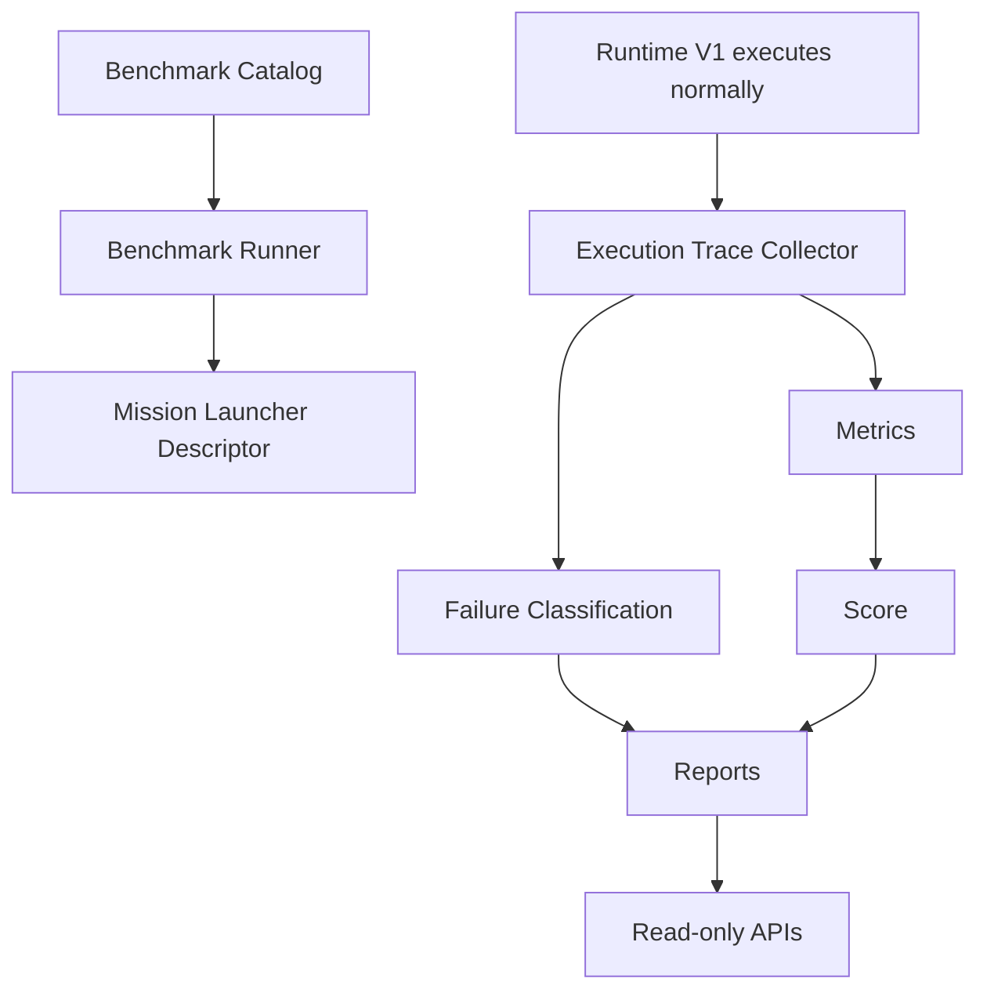

# Execution Benchmark Harness V1

The Execution Benchmark Harness is the primary regression measurement system for
Runtime V1. It is observational only.

## Architecture

The harness does not call Runtime V1, the planner, Mission Ledger, Intent
Runtime, Browser Control, providers, or the extension. It evaluates captured
snapshots from normal product execution.

## Benchmark Mission Definition

Each benchmark includes:

- id
- title
- description
- category
- difficulty
- user prompt
- expected deliverable
- expected Blueprint nodes
- expected success criteria
- expected providers
- timeout
- tags

## Categories

Research, Shopping, Navigation, Extraction, Forms, Authentication, Upload,
Download, Dashboard, Documentation, News, Job Application, Cross-System, Custom.

## Execution Capture

Trace stages include mission metadata, Blueprint, readiness, expanded nodes,
ledger intents, intent timeline, provider execution, browser actions, evidence,
validation, Mission Completion, Cognitive recommendations, decision comparison,
duration, planner calls, recovery, clarifications, and failures.

## Metrics

The harness computes mission success rate, Blueprint accuracy, intent expansion
accuracy, ledger consistency, execution time, planner calls, browser actions,
provider calls, evidence coverage/confidence, validation accuracy, Mission
Completion accuracy, recovery/replanning/clarification counts, agreement rate,
failure category, latency, reliability, and overall benchmark score.

## Failure Classification

Failures are classified into Planner, Blueprint, Expansion, Ledger, Intent
Runtime, Provider, Browser, Knowledge Extraction, Validation, Mission Completion,
Extension, or Unknown. Every failure includes root cause, affected subsystem,
timeline, recommended fix, and confidence.

## Reports

Reports include structured JSON and Markdown:

- Mission Report
- Benchmark Report
- Failure Report
- Metrics Report
- Comparison Report
- Regression Report
- Trend Report

## Storage

Additive tables:

- `benchmark_runs`
- `benchmark_execution_traces`
- `benchmark_reports`
- `benchmark_failures`
- `benchmark_metrics`

## APIs

Feature-flagged by `EXECUTION_BENCHMARK_V1`:

- `GET /benchmarks`
- `GET /benchmarks/catalog`
- `GET /benchmarks/run/{id}`
- `GET /benchmarks/report/{id}`
- `GET /benchmarks/failures/{id}`
- `GET /benchmarks/metrics`
- `GET /benchmarks/history`
- `GET /benchmarks/trends`
- `GET /benchmarks/export`

`off` disables APIs. `shadow` and `active` both observe only.

## Runtime Boundaries

The harness must never modify Runtime V1, Mission Ledger, Intent Runtime,
Browser Runtime, Browser Control, Mission Blueprint execution, Planner Contract
V2, provider execution, or extension execution.
