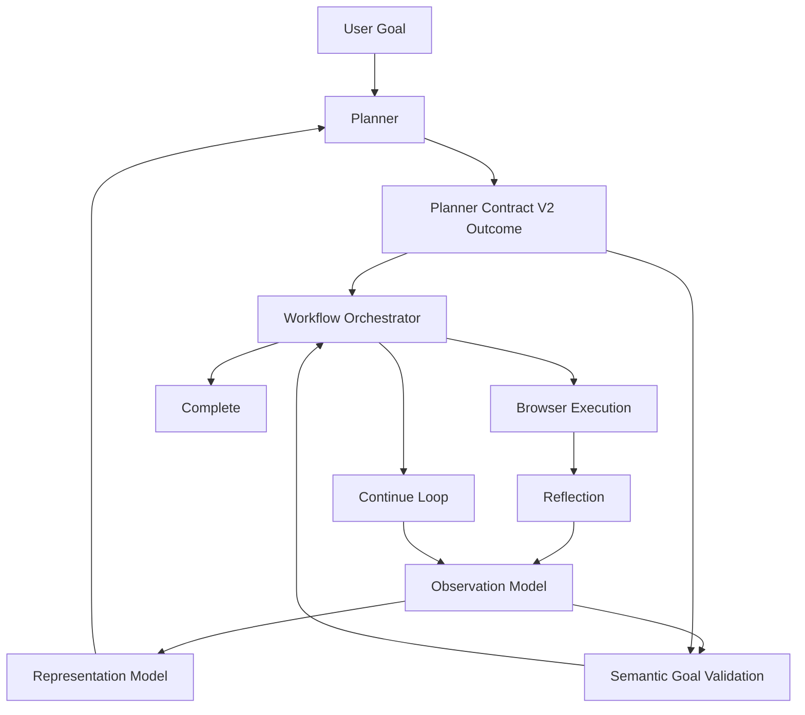
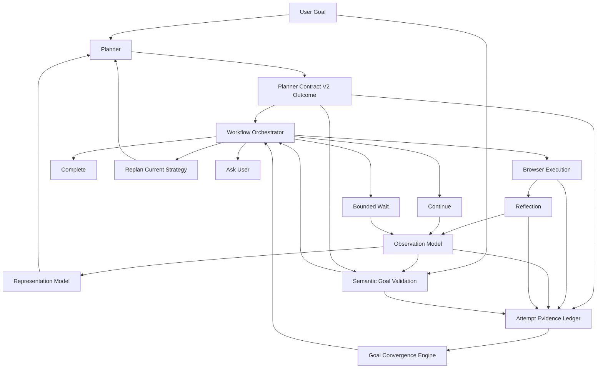

# Goal Convergence Engine Architecture

## Scope

The Goal Convergence Engine is a control-layer component for the autonomous browser assistant. It determines whether the current strategy is still moving toward the user's original goal, or whether the loop should stop relying on the same strategy and request a different one.

This document is architecture only. It does not define implementation milestones, file changes, effort estimates, or optimization work.

The design preserves the existing architecture:

- The Observation Model describes browser state.
- The Representation Model structures that state for planner and validation use.
- Planner Contract V2 defines typed planner outcomes: `Act`, `Report`, `Wait`, `Ask`, and `Replan`.
- Semantic Goal Validation determines whether the original user goal has been satisfied.
- Reflection handles local execution failures and repeated action-level mistakes.
- The Workflow Orchestrator owns the loop and final task termination.

The Goal Convergence Engine does not replace any of these components. It consumes their outputs and answers one narrower question:

> Is the current strategy converging on the original goal?

## Evidence Base

The latest benchmark report, `unicode-logging-fix-nightly.json`, shows that the dominant remaining non-infrastructure failures are not caused by invalid planner routing, Unicode runtime crashes, or missing basic validation. They are convergence failures.

The key evidence is:

- `amazon_in__product_search_price`: the planner reached repeated `Report` outcomes after reaching Amazon search results, but the goal required a product detail URL and a price containing `INR`/`Rs`-equivalent evidence. Validation did not verify completion. The strategy did not change before timeout.
- `fixture__pagination`: validation correctly rejected completion after the page failed to expose the required semantic evidence, but the planner emitted a terminal-style answer anyway. The loop timed out instead of treating the repeated unverified report as a failed strategy.
- `booking_com__hotel_search`: the browser performed repeated occupancy and date interactions, but the URL never reached the required semantic state, such as the expected city destination marker. The loop became stuck on a repeated interaction strategy.
- `amazon_in__add_to_cart`: the system produced repeated reports and waits while the success criterion, visible evidence of `Added to Cart`, remained absent. The task exhausted budget instead of abandoning the non-converging strategy.
- `cross_site__amazon_search_github_compare`: the browser performed many actions, including navigation and search attempts, but the combined semantic goal was not satisfied. This exposes a broader orchestration gap, but still shows the same local symptom: browser activity continued without enough semantic progress.

The architecture below is designed around that evidence: validation can correctly say "not complete", planner outputs can be contract-valid, and the orchestrator can route outcomes correctly, while the overall assistant still fails because it cannot tell that the strategy has stopped converging.

## What Is Goal Convergence?

Goal convergence is the deterministic assessment that a sequence of planner outcomes, browser observations, execution results, and validation results is moving toward the user's original goal.

It is not the same as execution success. A click, fill, navigation, or wait can succeed mechanically while the goal remains unsatisfied. In `booking_com__hotel_search`, repeated interactions succeeded or partially succeeded, but the required destination-search state was not reached.

It is not the same as validation. Validation answers whether the goal is satisfied by current evidence. Goal convergence answers whether repeated attempts are producing new, relevant evidence that makes future satisfaction plausible. In `fixture__pagination`, validation correctly rejected completion, but the loop still needed a convergence decision saying the current strategy was no longer productive.

It is not the same as planning. Planning chooses the next typed outcome under Planner Contract V2. Goal convergence does not invent browser actions, selectors, reports, or new outcome kinds. It decides whether the current trajectory should continue to be trusted.

It is not the same as reflection. Reflection handles local execution and action-selection problems, such as repeated failed clicks or bad selectors. Goal convergence handles strategy-level repetition across successful actions, reports, waits, observations, and validations. The Amazon price failure is the clearest evidence: the repeated `Report` outcomes were not a selector-level reflection problem, but a strategy-level convergence problem.

It is not the same as orchestration. The orchestrator owns routing, loop control, and task termination. The Goal Convergence Engine provides an input to that control decision; it does not become a second orchestrator.

## Ownership Boundaries

| Component | Owns | Does Not Own |
| --- | --- | --- |
| Planner | Producing one valid Planner Contract V2 outcome for the next step | Deciding final completion without validation |
| Execution | Applying browser actions and returning mechanical success or failure | Deciding whether the user goal is achieved |
| Observation | Capturing current browser state and structured page evidence | Interpreting long-term strategy convergence |
| Semantic Goal Validation | Determining whether the original goal is satisfied, refuted, or uncertain using current evidence | Choosing the next strategy |
| Reflection | Diagnosing local repeated action failures and execution-level dead ends | Tracking semantic progress across the whole task |
| Goal Convergence Engine | Determining whether the current strategy is making semantic progress toward the goal | Planning new actions, validating completion, or terminating the workflow directly |
| Workflow Orchestrator | Routing outcomes, applying validation and convergence decisions, ending or continuing the loop | Recomputing planner, validation, reflection, or convergence semantics inline |

The boundary is important because the latest benchmark evidence shows failures after Planner Contract V2 and Semantic Goal Validation are already functioning. Adding another planner, validator, or orchestrator would duplicate existing logic and risk reintroducing the contract mismatches that were already fixed.

## Evidence Accumulated By The Engine

The Goal Convergence Engine maintains a compact attempt ledger. The ledger is not a new source of truth. It is a chronological view over evidence already produced by existing components.

| Evidence Type | Producer | Examples | Consumed For | Why It Matters |
| --- | --- | --- | --- | --- |
| Action evidence | Planner, orchestrator, execution | Outcome kind, action type, selector, value, target URL, execution result, URL before and after | Detect repeated actions, successful mechanics without semantic progress, and failed execution loops | `booking_com__hotel_search` repeated similar interactions while the required URL state did not appear |
| Observation evidence | Observation Model, Representation Model | URL, title, visible text, accessible controls, content blocks, extracted page facts, page signature | Detect whether the browser state is changing in a goal-relevant way | `amazon_in__product_search_price` stayed on search results while the goal required a product detail page |
| Validation evidence | Semantic Goal Validation | Goal satisfied, not satisfied, uncertain, contradicted, report verified, report refuted | Determine whether completion is allowed and whether continued attempts are productive | `fixture__pagination` showed validation rejection but no strategy change |
| Planner evidence | Planner Contract V2 outcome | `Act`, `Report`, `Wait`, `Ask`, `Replan`, report claims, replan reasons | Detect repeated reports, repeated waits, or repeated strategy claims | Amazon price and add-to-cart both repeated reports without verified goal evidence |
| Semantic evidence | Semantic Goal Validation, Representation Model | Target entity, required state, extracted value, selected filters, product detail identity, cart confirmation | Measure progress against the user's original goal rather than against browser activity | Cross-site comparison performed actions but did not collect the required combined facts |

The engine consumes these evidence streams because each alone is insufficient:

- Action success cannot prove semantic progress.
- DOM change cannot prove goal progress.
- A planner report cannot prove completion.
- A validation failure cannot by itself identify whether the same strategy should continue.
- Reflection can identify repeated action problems, but not repeated semantic non-progress across reports, waits, and successful actions.

## Semantic Evidence Versus Action Success

Action success is evidence that the browser accepted an operation. Semantic evidence is evidence that the user's original goal is closer to being satisfied.

The benchmark failures show why this distinction must drive the design:

- In `booking_com__hotel_search`, opening or clicking occupancy controls was browser activity, but not semantic progress toward the required hotel search result URL.
- In `fixture__pagination`, clicking pagination controls and waiting were not enough; the required visible page content still had to appear.
- In `amazon_in__product_search_price`, reaching search results was progress toward the site, but not enough once the goal required a product detail page and price evidence.
- In `amazon_in__add_to_cart`, reports and waits did not matter without the semantic cart-confirmation evidence.

The Goal Convergence Engine therefore treats action success as a weak signal. It can support continuing only when paired with new semantic evidence or a plausible transitional state. It cannot justify indefinite continuation.

## Decision Model

The Goal Convergence Engine produces a control recommendation for the orchestrator. These recommendations intentionally resemble high-level workflow states, but they are not new Planner Contract V2 outcome kinds.

The planner still produces `Act`, `Report`, `Wait`, `Ask`, or `Replan`. The convergence decision tells the orchestrator whether the current strategy should be allowed to continue, whether completion is safe, or whether the next planner turn must be framed as a failed strategy that requires a different approach.

| Decision | Meaning | Required Evidence | Not Allowed When |
| --- | --- | --- | --- |
| `Complete` | The workflow may terminate successfully | Semantic Goal Validation has verified the original goal, or has verified a Planner Contract V2 `Report` against current evidence | Validation is uncertain, refuted, or not satisfied |
| `Continue` | The current strategy is still producing goal-relevant progress | New semantic evidence, a meaningful observation change, or a first attempt at a plausible next step | Same report, same observation, same validation failure, or same action pattern repeats without new evidence |
| `Replan` | The current strategy is not converging and the next planner turn should use that fact | Repeated unverified reports, repeated failed validation on stable evidence, repeated successful actions without semantic progress, or contradiction between planner claim and observed state | Validation has verified completion |
| `Wait` | The system should allow a bounded transitional observation interval | There is evidence of asynchronous loading, navigation in progress, or state transition that has not stabilized | Prior waits produced the same observation and same validation result |
| `Ask` | The system needs user-provided information that cannot be inferred from the page or goal | Validation or planner state identifies missing user-only information | The issue is merely that the current strategy failed; failed strategy should become `Replan`, not `Ask` |

This model is grounded in the latest benchmark evidence. The failures are not cases where the system needed more outcome kinds. They are cases where valid outcomes were allowed to repeat after they stopped producing semantic progress.

## How This Differs From Planner Decisions

Planner decisions are prospective: "What should I do next?"

Convergence decisions are retrospective and control-oriented: "Has this strategy produced enough goal-relevant evidence to keep trusting it?"

For example:

- A planner may validly produce a `Report` after observing a page.
- Semantic Goal Validation may reject that report because required evidence is missing.
- The Goal Convergence Engine may then determine that repeated rejected reports on the same observation mean the strategy is abandoned.
- The orchestrator may route the next turn as a required `Replan`.

The engine never writes the report, chooses the selector, or validates the answer. It only prevents the loop from treating repeated non-progress as useful work.

## Interpreting Repetition

Repetition is not automatically bad. Some workflows require repeated actions, scrolling, waiting, or multi-step refinement. The engine distinguishes productive repetition from non-progress and contradiction using semantic evidence.

### Repeated Action

A repeated action is productive when each attempt changes the semantic state in a way related to the goal. Examples include paging through result pages where new relevant results appear, or incrementing a form control until the requested value is visible.

A repeated action is non-progress when the same action leaves the same observation and same validation failure. `booking_com__hotel_search` exposed this pattern: repeated occupancy/date interactions did not produce the required destination-search URL state.

A repeated action is contradictory when the action appears to target a goal state but the observation shows the opposite. If the system believes it selected a destination city but the URL and validation evidence do not contain the city destination state, the action cannot be counted as convergence.

### Repeated Report

A repeated report is productive only when it is based on newly observed semantic evidence.

A repeated report is non-progress when the planner keeps reporting completion or an answer while validation remains uncertain or refuted on the same evidence. This was visible in `amazon_in__product_search_price`, where repeated reports occurred while the browser remained on search results rather than the required product detail state.

A repeated report is contradictory when it claims completion while validation has already identified missing or incompatible evidence. In `fixture__pagination`, the required page content was not verified, so a repeated terminal-style answer should not keep the same strategy alive.

### Repeated Observation

A repeated observation is productive only during a bounded transitional interval, such as waiting for a navigation or asynchronous load to settle.

A repeated observation is non-progress when the page signature, URL, goal-relevant text, and validation result remain stable. In that case, continuing with the same strategy consumes budget without increasing the chance of success.

A repeated observation is contradictory when the planner believes the browser moved to a new state, but the observation shows the same state. In Amazon price search, being on search results after repeated product-price reports contradicted the required product-detail trajectory.

### Repeated Validation

A repeated validation failure is productive only if the failure reason changes in a way that shows progress. For example, moving from "destination missing" to "date missing" can mean the task is advancing through form requirements.

A repeated validation failure is non-progress when the same criterion remains unsatisfied against the same semantic evidence.

A repeated validation contradiction must prevent continuation of the same strategy. The engine should not allow the planner to keep asserting a goal state that validation has already rejected.

## Browser Progress Versus Semantic Progress

The autonomous browser assistant must optimize for semantic progress, not browser movement.

Browser progress includes:

- URL changes.
- DOM changes.
- Successful clicks.
- Successful fills.
- Visible overlays opening.
- Waits completing.

Semantic progress includes:

- Required entities appearing.
- Required values being extracted.
- Required page state being reached.
- Required form state being represented in the URL or DOM.
- Required confirmation text appearing.
- A planner report being verified by validation.

The benchmark failures show browser progress without semantic progress:

- `booking_com__hotel_search`: UI interactions occurred, but the required search state was absent.
- `cross_site__amazon_search_github_compare`: many browser actions occurred, but the combined goal facts were not collected.
- `amazon_in__add_to_cart`: reports and waits occurred, but cart confirmation was absent.

The inverse is also important: DOM movement is not required when semantic evidence already proves the goal. If the current observation already contains the requested value or confirmation, Semantic Goal Validation can verify completion and the convergence engine should endorse `Complete` even if no further browser action occurs.

Therefore, semantic progress is the primary driver of autonomy. Browser progress is supporting evidence only.

## Uncertainty Lifecycle

The engine represents uncertainty deterministically. It does not use probabilities, confidence scores, learned classifiers, or an LLM judge.

The lifecycle is:

```text
Unknown -> Likely -> Verified
       \        \-> Contradicted -> Abandoned
        \-----------------------> Abandoned
```

### Unknown

The engine has no goal-relevant evidence yet.

Example: before the first useful observation on Amazon, the engine may know the user wants a product price but has no product, price, or detail-page evidence.

### Likely

Some evidence aligns with the goal, but validation has not verified completion.

Example: after an Amazon search query is submitted, the browser may be closer to the product-price goal, but search results alone do not satisfy a detail-page price criterion.

### Verified

Semantic Goal Validation has verified that the original goal is satisfied, or has verified a Planner Contract V2 `Report` against current evidence.

Only this state permits successful completion.

### Contradicted

Current evidence conflicts with the planner's claim, the expected goal state, or the assumed strategy.

Example: a report claims a price was found, but validation requires a product detail page and the observation remains on search results.

### Abandoned

The same strategy has produced repeated `Unknown`, `Likely`, or `Contradicted` states without new semantic evidence. This does not mean the task is impossible. It means the current strategy should no longer be continued.

This state is necessary because the latest benchmark shows timeout and budget exhaustion where the system should have abandoned the current strategy earlier:

- repeated unverified reports in Amazon price,
- repeated pagination non-completion,
- repeated Booking interactions,
- repeated add-to-cart reports and waits.

## Evidence Transitions

The engine transitions state by comparing the newest attempt against the attempt ledger.

| From | To | Transition Evidence |
| --- | --- | --- |
| `Unknown` | `Likely` | First goal-relevant observation, action result, or semantic fact appears |
| `Likely` | `Verified` | Semantic Goal Validation verifies the goal or verifies the report |
| `Unknown` or `Likely` | `Contradicted` | Planner claim or assumed state conflicts with validation or observation |
| `Contradicted` | `Likely` | A different strategy produces new evidence that removes the contradiction |
| `Unknown`, `Likely`, or `Contradicted` | `Abandoned` | Repeated attempts under the same strategy produce no new semantic evidence |
| Any non-verified state | `Verified` | Validation verifies the original goal |

The `Abandoned` state is strategy-scoped, not task-scoped. It tells the orchestrator that the next planner turn must not continue the same approach.

## Preventing False Completion

The engine prevents false completion by preserving the existing Semantic Goal Validation authority.

Completion is never allowed because:

- an action succeeded,
- the DOM changed,
- the planner emitted a report,
- the planner said the answer was found,
- the budget is nearly exhausted,
- the browser reached a plausible site,
- or the strategy appears likely.

Completion is allowed only when validation verifies the original goal or verifies a report outcome against current evidence.

This directly follows from the benchmark:

- `fixture__pagination` would be a false completion if the system accepted a report while required page text was absent.
- `amazon_in__product_search_price` would be a false completion if the system accepted a price report while still on search results without required detail-page evidence.
- `amazon_in__add_to_cart` would be a false completion if reports were accepted without visible cart confirmation.

The Goal Convergence Engine can recommend `Complete`, but only as an endorsement of validation's verified state. It cannot independently prove the goal.

## Preventing Infinite Loops

The engine prevents infinite loops by treating repeated non-progress as a strategy failure before timeout or budget exhaustion.

It specifically guards against:

- repeated unverified `Report` outcomes,
- repeated `Wait` outcomes with stable observations,
- repeated successful actions with unchanged semantic evidence,
- repeated validation failures for the same criterion,
- repeated planner claims contradicted by observation,
- and repeated browser movement unrelated to the goal.

This addresses the benchmark's observed failure mode: the system had enough evidence to know it was not complete, but lacked a control mechanism to stop continuing the same strategy.

For `amazon_in__product_search_price`, the engine would recognize repeated reports on the same non-detail-page evidence as abandoned strategy.

For `fixture__pagination`, it would recognize that validation rejection after stable page evidence should force a different plan instead of another terminal report.

For `booking_com__hotel_search`, it would recognize repeated interactions that do not produce the required URL/search-state evidence.

For `amazon_in__add_to_cart`, it would recognize repeated reports and waits without cart confirmation before token budget exhaustion.

## Integration With Planner Contract V2

Planner Contract V2 remains the only planner output contract.

The Goal Convergence Engine does not add outcome kinds and does not reinterpret invalid planner output. It consumes valid outcomes after they have been parsed and routed.

The integration sequence is:

1. Planner produces one Planner Contract V2 outcome.
2. Orchestrator routes the outcome by kind.
3. Execution, observation, report validation, wait handling, ask handling, or replan handling proceeds according to existing ownership.
4. Semantic Goal Validation evaluates the original goal where applicable.
5. Goal Convergence Engine compares the new evidence with prior attempts.
6. Orchestrator decides whether to complete, continue, request a replan, wait, or ask.

The engine uses Planner Contract V2 outcomes as evidence, not as authority for completion. This preserves the architectural rule that `Report` is a claim and validation is the verifier.

## Integration With Semantic Goal Validation

Semantic Goal Validation remains the only component that decides whether the original goal is satisfied by evidence.

The Goal Convergence Engine consumes validation outputs such as:

- verified goal,
- verified report,
- refuted report,
- uncertain report,
- unsatisfied criterion,
- contradicted criterion,
- and changed failure reason.

It does not re-evaluate selectors, parse the page independently, or decide whether a price, hotel result, cart state, or pagination state is semantically valid.

The distinction is:

- Semantic Goal Validation says: "The goal is satisfied", "The goal is not satisfied", or "The evidence is uncertain."
- Goal Convergence says: "Given that result and the prior attempts, this strategy is still productive" or "this strategy should be abandoned."

This avoids parallel validation logic.

## Integration With Reflection

Reflection remains responsible for action-level diagnosis.

Reflection is appropriate when:

- a selector is invalid,
- a click is intercepted,
- a fill targets the wrong element,
- the same action fails mechanically,
- or execution feedback indicates a local browser interaction problem.

Goal Convergence is appropriate when:

- actions succeed but validation stays failed,
- reports repeat without verification,
- waits repeat without observation change,
- browser state changes but goal state does not,
- or planner claims conflict with semantic evidence.

The two components can consume each other's outputs as evidence, but neither duplicates the other.

For example, in `booking_com__hotel_search`, Reflection may identify an intercepted click or repeated control interaction. The Goal Convergence Engine identifies the broader fact that these interactions are not producing the required search-state evidence.

## Integration With The Workflow Orchestrator

The Workflow Orchestrator remains the only component that controls task termination and loop routing.

The orchestrator consumes convergence recommendations as one input alongside:

- planner outcome kind,
- execution result,
- observation state,
- reflection result,
- validation result,
- task budget,
- and user-interaction requirements.

The orchestrator applies the following control principles:

- If validation is verified, complete.
- If convergence says the current strategy is productive, continue within existing budgets.
- If convergence says the strategy is abandoned, route the next planner turn as a replan condition.
- If convergence says a wait is still transitional, allow a bounded wait.
- If convergence says user-only information is missing, route through the existing ask path.

The orchestrator does not inline convergence rules. It asks the engine for a strategy-level assessment, then performs the existing routing.

## Current Architecture



In the current architecture, validation can correctly reject completion, but the loop lacks a dedicated strategy-convergence assessment. The benchmark failures show that this permits repeated reports, waits, and actions until timeout, stuck detection, or budget exhaustion.

## Proposed Architecture



The proposed architecture adds one strategy-level interpretation point between evidence production and orchestrator routing. It does not introduce a second planner, validator, reflection system, or orchestrator.

## Design Decisions Grounded In Benchmark Evidence

### Completion Must Remain Validation-Gated

The Pagination, Amazon price, and add-to-cart failures all show that planner reports can be premature. Therefore, the convergence engine cannot complete a task unless Semantic Goal Validation has verified it.

### Repeated Reports Must Become Strategy Evidence

Amazon price and add-to-cart both exposed repeated reports without verified goal evidence. Under Planner Contract V2, reports are valid claims, but repeated unverified claims are evidence that the current strategy is not converging.

### Repeated Browser Activity Must Be Judged Semantically

Booking and cross-site comparison show browser activity without goal completion. Therefore, the engine must compare browser progress against semantic progress, not simply against action success or DOM movement.

### Stable Failed Validation Must Affect Control Flow

Pagination shows that validation can be correct while the control loop remains ineffective. Repeated failed validation for the same semantic requirement must feed into a convergence decision, not merely be logged.

### Budget Exhaustion Is Too Late

Add-to-cart exhausted planner budget after repeated non-progress. The architecture must identify abandoned strategy before budget exhaustion. Budget remains an orchestrator constraint, but it should not be the primary loop-breaking mechanism for semantic non-convergence.

### No Website-Specific Heuristics

The evidence spans Amazon, Booking, a local pagination fixture, and a cross-site task. The common defect is not site-specific. It is repeated strategy without semantic convergence. Therefore, the engine must operate on generic evidence: outcomes, observations, validation states, semantic facts, and repetition patterns.

## Common Convergence Defect

The common defect revealed by the benchmark is:

> The system can know that the goal is not complete, but it does not consistently convert repeated non-completion under the same strategy into a required change of strategy.

This explains multiple remaining failures:

- Amazon price: repeated reports despite missing detail-page price evidence.
- Pagination: repeated terminal behavior despite failed semantic criteria.
- Booking: repeated interactions despite missing search-state evidence.
- Add-to-cart: repeated reports and waits despite missing cart confirmation.

The Goal Convergence Engine exists to close exactly this gap.

# Architectural Principles

- The user's original goal is the stable reference point for convergence.
- Semantic progress is stronger than browser progress.
- Action success is not goal success.
- A planner report is a claim, not proof.
- Validation remains the only authority for successful completion.
- Repetition is allowed only while it produces new goal-relevant evidence.
- Repeated non-progress is a strategy failure, not a reason to wait indefinitely.
- Uncertainty is deterministic and evidence-driven.
- Strategy abandonment is not task failure; it is a request for a different plan.
- The engine consumes existing architecture outputs and must not duplicate planner, validation, reflection, or orchestration logic.
- The design must remain site-independent and benchmark-evidence grounded.
