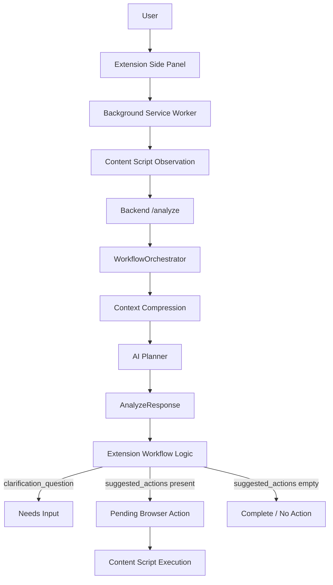
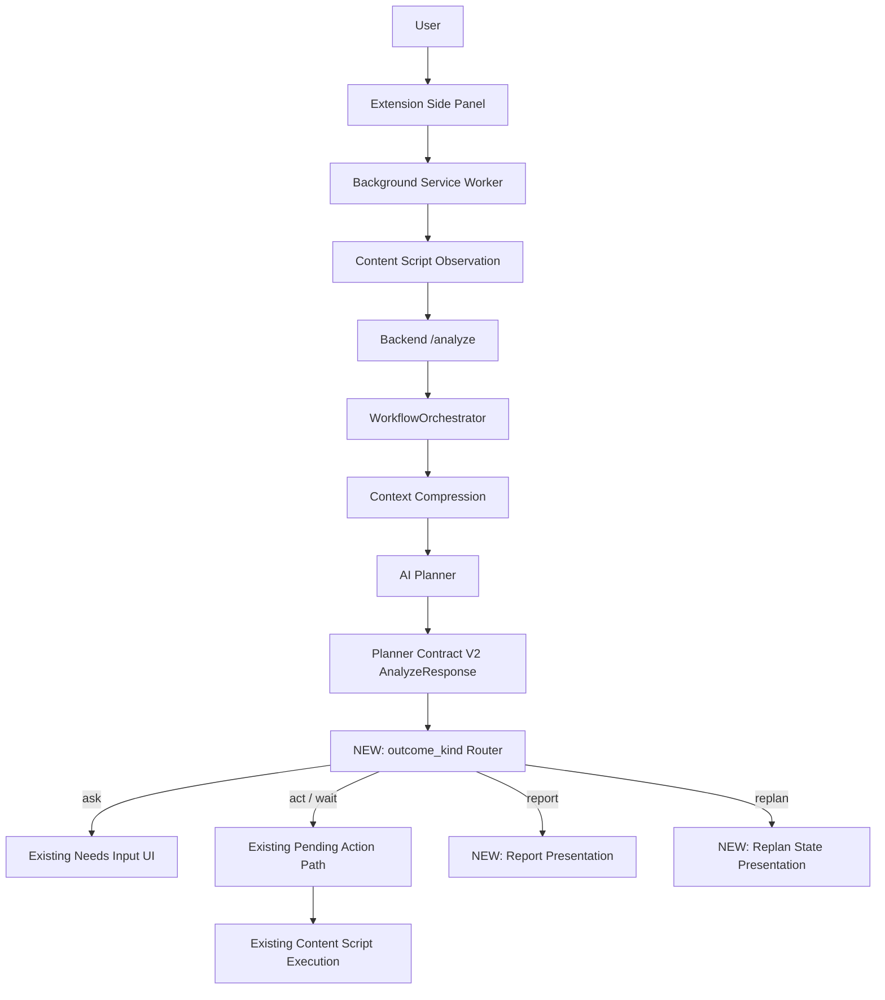
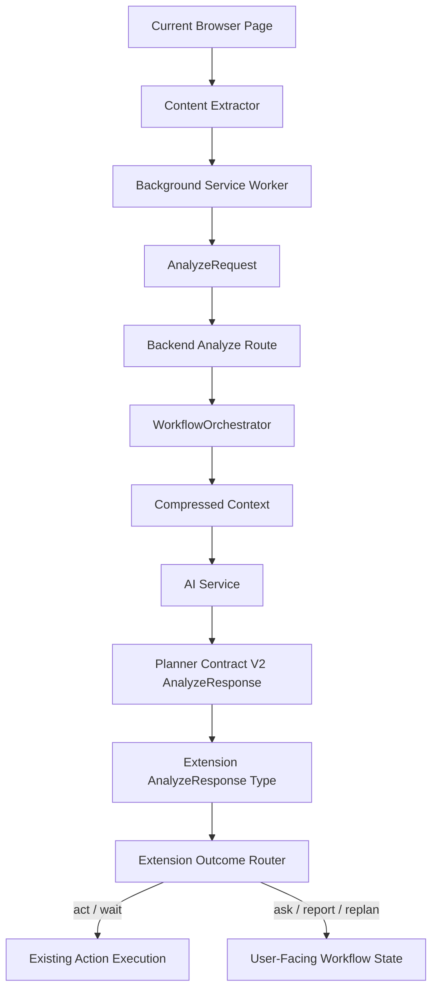

# Production Integration Phase 1

## Phase Name

PI-1: Planner Contract V2 Consumption in the Production Workflow

This milestone integrates the first proven benchmark capability into the real browser assistant: production-side consumption of Planner Contract V2 outcomes.

It does not add new reasoning, validation, recovery, convergence, or benchmark behavior. The backend already emits Planner Contract V2-shaped responses. Phase 1 makes the production extension understand and route those outcomes explicitly instead of treating every response as either a clarification, a browser action list, or an empty-action completion.

## 1. Scope

Phase 1 integrates exactly one benchmark capability:

| Capability | Phase 1 Decision | Reason |
|---|---|---|
| Planner Contract V2 | Integrate now | Backend already emits `outcome_kind`, `report`, and `replan`; production extension does not currently consume them. |
| Semantic Goal Validation | Not included | Requires production validation authority and semantic evidence lifecycle. |
| Goal Convergence | Not included | Depends on production semantic progress tracking. |
| Strategy Generation | Not included | Depends on Goal Convergence. |
| Planner Recovery | Not included | Depends on Goal Convergence and Strategy Generation. |
| Semantic Signatures | Not included | Needed later for convergence and validation, not required to consume Planner Contract V2. |
| Context Compression | Already integrated | Production backend already uses context compression before planner calls. |
| Planner Traceability | Not included | Useful for diagnostics, but not required for first user-facing integration. |

Phase 1 outcome handling:

| Outcome | Production Phase 1 Behavior |
|---|---|
| `act` | Continue through the existing approval, auto-execution, and content-script execution path. |
| `wait` | Continue through the existing executable action path when represented by an existing wait action. |
| `ask` | Route to the existing clarification UI using `clarification_question`. |
| `report` | Present the planner report to the user and do not execute a browser action. The report is not treated as semantically verified completion until SGV is integrated later. |
| `replan` | Surface the replan reason/context as a planner state instead of treating it as generic empty-action completion. No recovery loop is introduced in Phase 1. |

## 2. Production Runtime Flow

### Current Flow

Current production routing ignores Planner Contract V2 semantics. The extension primarily branches on `clarification_question` and `suggested_actions`.

### Phase 1 Flow

New integration points only:

- The extension type model understands Planner Contract V2 fields.
- The extension workflow routes by `outcome_kind`.
- `report` and `replan` stop being collapsed into generic empty-action completion.

## 3. Files Expected To Change

### Frontend

- `extension/src/sidepanel/hooks/useWorkflow.ts`

### Backend

- None expected.

### Shared Types

- `extension/src/types/index.ts`

## 4. Data Flow

Phase 1 uses the existing production data path and changes only response interpretation inside the extension.

Detailed Phase 1 routing:

1. The extension sends the existing page context and task to `/analyze`.
2. The backend returns the existing `AnalyzeResponse`, including Planner Contract V2 fields when present.
3. The extension reads `outcome_kind`.
4. If `outcome_kind` is `act` or `wait`, the existing action approval and execution flow continues unchanged.
5. If `outcome_kind` is `ask`, the existing clarification state is used.
6. If `outcome_kind` is `report`, the extension displays the report answer/claim and executes no browser action.
7. If `outcome_kind` is `replan`, the extension displays or preserves the replan reason/context and executes no browser action.

## 5. User Impact

After Phase 1, the production assistant becomes more faithful to planner intent.

Users gain:

- Clear answers when the planner intentionally reports information instead of clicking something.
- Fewer confusing “complete” states caused only by an empty action list.
- Cleaner clarification behavior because `ask` is treated as a contract outcome.
- Better visibility when the planner decides the current path needs replanning.
- No change to familiar action approval, auto mode, or browser execution behavior for normal actions.

This milestone does not make the assistant semantically verify answers. It only prevents production from losing the meaning of the planner response.

## 6. Success Criteria

Phase 1 is complete when the production workflow demonstrates these behaviors:

1. Extension-side `AnalyzeResponse` typing includes Planner Contract V2 fields:
   - `outcome_kind`
   - `report`
   - `replan`

2. `act` outcomes preserve existing behavior:
   - suggested actions become pending actions
   - manual approval still works
   - auto mode still executes eligible actions
   - content-script execution is unchanged

3. `wait` outcomes preserve existing behavior when expressed through the current wait action type.

4. `ask` outcomes route to the existing clarification state and display the clarification question.

5. `report` outcomes:
   - display the report answer/claim to the user
   - do not send an execute-action message
   - do not pretend the report has been semantically verified

6. `replan` outcomes:
   - are represented distinctly from generic completion
   - preserve the replan reason/context for the user-facing workflow state
   - do not introduce an automatic recovery loop
   - do not execute a browser action

7. Responses without `outcome_kind` remain backward compatible with the current extension behavior.

8. No backend planner, prompt, validation, benchmark, or execution behavior changes are required.

## 7. Boundaries

Phase 1 explicitly does not include:

- Semantic Goal Validation in production.
- Verified report completion.
- Goal Convergence.
- Strategy Generation.
- Planner Recovery.
- Semantic signature generation in production.
- Planner trace propagation.
- New browser automation behavior.
- New planner prompts.
- New planner outcome kinds.
- New backend orchestration logic.
- New benchmark scenarios.
- Benchmark scoring changes.
- Any second validator, second planner, or second recovery system.

The only purpose of Phase 1 is to make the real browser assistant consume the Planner Contract V2 response shape already produced by the backend.
