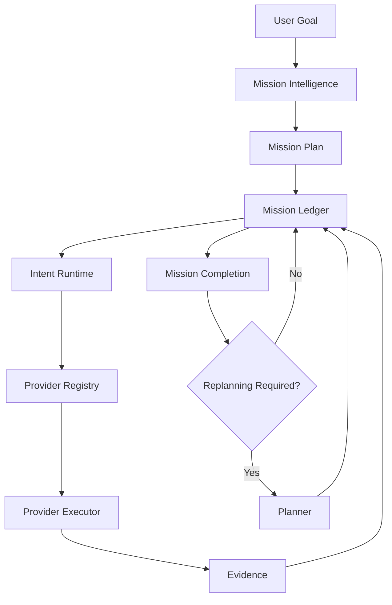

# Runtime V1 Freeze

Version: Runtime V1

Status: FROZEN

Date: 2026-07-29

## 1. Purpose

Runtime V1 is frozen because the browser assistant now has one authoritative execution model: mission-scoped intents recorded in the Mission Ledger, dispatched through the Intent Runtime, executed by registered providers, and evaluated by Mission Completion from evidence.

This document records the runtime architecture that now exists. It is not a proposal and it is not a roadmap for redesign. Future development must conform to this document unless an approved Architecture Decision Record explicitly supersedes the affected part of the runtime.

Future work should focus on reliability, providers, benchmarking, product capabilities, and performance. Future work should not redesign the execution model.

## 2. Runtime Philosophy

Runtime V1 is governed by these architectural principles:

- Intent-driven execution: executable work is represented as intents, not ad hoc actions.
- Evidence-driven completion: missions complete because evidence satisfies success criteria, not because a planner, browser, report, or provider claims completion.
- Ledger-owned state: execution state lives in the Mission Ledger.
- Provider independence: providers execute owned capabilities without owning mission sequencing.
- Planner as reasoning: the planner reasons and proposes intent; it does not execute or iterate deterministic work.
- Browser as executor: the browser and extension execute assigned browser intents only.
- Mission-first architecture: all runtime behavior is scoped to a mission objective and mission state.
- Deterministic execution where possible: deterministic work continues through the ledger and intent runtime without planner re-entry.
- Replanning only when necessary: the planner is recalled for ambiguity, blocked work, exhausted deterministic work, user-driven mission changes, or genuinely new reasoning requirements.

These principles are architectural laws for Runtime V1.

## 3. High-Level Architecture

The Mission Ledger is the execution authority. The Intent Runtime executes ledger intents through registered providers. Mission Completion evaluates evidence and determines whether the mission is complete, incomplete, blocked, failed, waiting, or in need of replanning.

## 4. Core Runtime Components

### Mission Intelligence

Purpose: Understand the user goal and produce mission-level context.

Inputs: user goal, mission state, available evidence, runtime context.

Outputs: mission plan context, objective classification, constraints, high-level reasoning inputs.

Responsibilities: interpret the mission objective, define the mission frame, provide planning context, identify broad constraints and risks.

Non-responsibilities: executing browser work, owning the queue, declaring completion, bypassing the ledger.

Dependencies: Mission Plan, Mission Ledger, Runtime State, Mission Completion.

### Mission Ledger

Purpose: Serve as the single authoritative execution ledger for a mission.

Inputs: intents, provider evidence, lifecycle updates, child intents, timestamps, ownership metadata.

Outputs: next executable intent, intent state, evidence history, durable resume state.

Responsibilities: store intent lifecycle, assign executable work, attach evidence, preserve parent-child intent relationships, support restart recovery, expose mission execution state.

Non-responsibilities: provider-specific execution, planner reasoning, browser automation, independent completion claims.

Dependencies: database persistence, Intent Runtime, Provider Registry, Mission Completion.

### Intent Runtime

Purpose: Dispatch executable intents to the provider that owns the capability.

Inputs: ledger intents, execution context, provider registrations.

Outputs: execution result, evidence, next intents, blocking state.

Responsibilities: resolve ownership, invoke providers, collect evidence, enqueue child intents, stop on browser/user/external waits or terminal states.

Non-responsibilities: mission sequencing outside the ledger, browser-specific parsing, planner invocation policy.

Dependencies: Mission Ledger, Provider Registry, Provider Executors, Execution Context.

### Execution Orchestrator

Purpose: Coordinate mission phases and planner constraints.

Inputs: mission plan, runtime state, mission progress, planner response, evidence summaries.

Outputs: phase context, constraints, phase coordination decisions, deterministic intent candidates.

Responsibilities: coordinate active phase, provide planner constraints, align work with mission phase, generate deterministic intent work for the ledger.

Non-responsibilities: owning execution state, resuming browser work, maintaining a queue outside the Mission Ledger, executing provider work.

Dependencies: Mission Plan, Mission Ledger, Runtime State, Intent Runtime, Mission Completion.

### Semantic Execution Kernel

Purpose: Validate and ground planner intent against semantic entities and runtime constraints.

Inputs: planner response, mission entity graph, runtime state, page context, semantic entities.

Outputs: grounded action or precise rejection, semantic diagnostics, validation evidence.

Responsibilities: preserve semantic validation, prevent unsupported or ungrounded execution, ensure planner output references observed entities.

Non-responsibilities: creating fallback entities, weakening semantic validation, executing browser work, owning the queue.

Dependencies: Mission Entity Graph, Runtime State, Planner Contract V2, Intent Runtime.

### Runtime State

Purpose: Represent current runtime resources and bindings.

Inputs: ledger evidence, runtime resources, browser state, artifacts, bindings.

Outputs: runtime snapshots, resource bindings, tab/window/artifact references.

Responsibilities: maintain resource identity, expose runtime bindings, provide current state to providers and completion evaluation.

Non-responsibilities: deriving execution authority from prior browser history, owning mission sequencing, declaring completion.

Dependencies: Mission Ledger, Evidence, Browser Control, Runtime Resource Registry.

### Mission Completion

Purpose: Evaluate mission status from evidence and success criteria.

Inputs: mission plan, success criteria, ledger evidence, runtime state, knowledge artifacts, validation evidence.

Outputs: COMPLETE, INCOMPLETE, BLOCKED, FAILED, WAITING_EXTERNAL, NEEDS_USER, PARTIAL_SUCCESS, or replanning requirement.

Responsibilities: decide mission completion state, explain missing or blocking evidence, determine when replanning is required.

Non-responsibilities: browser execution, provider sequencing, planner iteration, accepting report existence as completion.

Dependencies: Mission Plan, Success Criteria, Mission Ledger, Evidence, Runtime State, Knowledge Extraction, Validation.

### Knowledge Extraction

Purpose: Produce structured knowledge and artifacts from observed content.

Inputs: page context, mission objective, runtime context, prior evidence.

Outputs: read artifacts, extraction records, knowledge artifacts, report artifacts, extraction evidence.

Responsibilities: read page content, extract fields, synthesize knowledge, produce evidence.

Non-responsibilities: mission completion authority, browser navigation, mission sequencing.

Dependencies: Intent Runtime, Mission Ledger, Runtime State, Mission Completion.

### Validation

Purpose: Validate records, artifacts, claims, or runtime evidence.

Inputs: extracted records, artifacts, mission criteria, runtime context.

Outputs: validation evidence, confidence, invalid or missing evidence reasons.

Responsibilities: evaluate evidence quality and validity.

Non-responsibilities: provider sequencing, browser execution, planner decisions, mission completion declaration.

Dependencies: Knowledge Extraction, Mission Completion, Mission Ledger.

### Provider Registry

Purpose: Register ownership of capabilities.

Inputs: provider registrations, capability matchers, executor bindings.

Outputs: owner resolution, executor lookup.

Responsibilities: map intents to providers, support open provider identifiers, allow new capabilities without runtime redesign.

Non-responsibilities: executing intents, owning mission state, defining mission completion.

Dependencies: Intent Runtime, Provider Executors.

### Provider Executors

Purpose: Execute owned intents and return evidence.

Inputs: execution context, intent dispatch directive.

Outputs: execution status, evidence, optional child intents, blocking reason.

Responsibilities: perform provider-specific work, attach evidence, emit child intents when deterministic follow-up work exists.

Non-responsibilities: mission sequencing, planner invocation, completion authority.

Dependencies: Intent Runtime, Mission Ledger, provider-specific systems.

### Browser Executor

Purpose: Represent browser-control work as provider-owned intent execution.

Inputs: browser intent, browser-resolvable payload, execution context.

Outputs: WAITING_BROWSER handoff, browser payload, evidence after extension execution.

Responsibilities: prepare browser intent handoff, preserve intent identity, receive browser evidence through the ledger.

Non-responsibilities: owning mission flow, maintaining a browser queue, selecting next actions.

Dependencies: Mission Ledger, Intent Runtime, Extension, Browser Control.

### Extension

Purpose: Serve as the remote browser executor.

Inputs: assigned browser intent, browser page state, user approval where applicable.

Outputs: browser execution evidence attached to intent_id.

Responsibilities: request assigned browser intent, execute it, send evidence, await the next backend assignment.

Non-responsibilities: mission sequencing, retry policy, completion decisions, planner invocation, workflow reconstruction.

Dependencies: Browser Control, Mission Ledger intent APIs, page extraction.

## 5. Mission Ledger

The Mission Ledger is the single execution authority in Runtime V1.

Every executable step is represented by a durable intent. Each intent has an `intent_id`, `mission_id`, optional `parent_intent_id`, provider ownership, capability, dispatch target, lifecycle state, payload, evidence, provenance, resume metadata, and timestamps.

The ledger owns:

- intent lifecycle
- provider ownership
- execution assignment
- evidence attachment
- parent-child intent relationships
- retry and blocked state accounting
- restart recovery
- durable mission resume

No execution exists outside the Mission Ledger.

The ledger survives process restarts because executable work is persisted as mission intent records. Resume is performed by assigning resumable records from the ledger, not by replaying browser history, workflow logs, prior steps, or extension memory.

## 6. Intent Lifecycle

Runtime V1 supports these lifecycle states:

- QUEUED: intent exists and is waiting for dispatch.
- DISPATCHED: intent has been assigned or prepared for execution.
- EXECUTING: provider has accepted the intent and is currently executing it.
- WAITING_BROWSER: intent requires browser execution by the extension.
- WAITING_PROVIDER: intent is waiting for a non-browser provider.
- WAITING_USER: mission cannot continue until user input or approval is provided.
- WAITING_EXTERNAL: mission is waiting on an external system or asynchronous external state.
- COMPLETED: intent completed successfully and evidence is attached.
- FAILED: intent execution failed.
- BLOCKED: intent cannot proceed without recovery, user input, or changed external state.
- CANCELLED: intent was cancelled.
- SKIPPED: intent was intentionally skipped by a valid runtime decision.
- PARTIAL: intent produced partial evidence but did not fully satisfy its requested work.

Allowed transition patterns:

- QUEUED -> DISPATCHED -> EXECUTING -> COMPLETED
- QUEUED -> DISPATCHED -> WAITING_BROWSER -> EXECUTING -> COMPLETED
- QUEUED -> DISPATCHED -> WAITING_PROVIDER -> EXECUTING -> COMPLETED
- QUEUED -> DISPATCHED -> WAITING_USER
- QUEUED -> DISPATCHED -> WAITING_EXTERNAL
- EXECUTING -> FAILED
- EXECUTING -> BLOCKED
- EXECUTING -> PARTIAL
- Any non-terminal active state -> CANCELLED when cancellation is requested

Terminal or pause states are recorded in the ledger and must not be reconstructed elsewhere.

## 7. Provider Contract

Every provider must implement the Runtime V1 provider contract:

- accept an intent and execution context
- execute only the capability it owns
- produce structured evidence
- update the Mission Ledger through the runtime flow
- optionally create child intents
- return execution status and blocking reason when applicable

No provider may own mission sequencing.

No provider may directly declare mission completion.

No provider may create a hidden queue or hidden execution state outside the Mission Ledger.

## 8. Browser Contract

The browser is a remote executor.

The extension does not own mission state, retries, sequencing, completion, planner invocation, or workflow reconstruction.

The extension may:

- request the next assigned browser intent
- execute the assigned browser intent
- capture execution evidence
- submit evidence for the same `intent_id`
- wait for the next backend assignment

The extension must not:

- choose the next action
- maintain a mission queue
- retry mission work independently
- infer completion
- call the planner for deterministic continuation
- reconstruct runtime state from browser history

## 9. Planner Contract

The planner produces reasoning and proposed intent.

The planner does not execute. The planner does not own phase iteration. The planner does not continue deterministic work after each provider action.

The planner may be called only when:

- ambiguity exists
- deterministic work is exhausted
- mission is blocked
- user objective changes
- new reasoning is required
- Mission Completion or ledger state determines replanning is necessary

Planner output must enter the Intent Runtime. Planner output must not bypass the Mission Ledger.

## 10. Mission Completion

Mission Completion is evidence-driven.

Mission Completion is never planner-driven, browser-driven, provider-driven, or report-driven. A report artifact is evidence, not completion. Browser idle state is evidence, not completion. Planner silence is evidence, not completion.

Mission Completion evaluates the Mission Plan and success criteria against ledger evidence, runtime state, knowledge artifacts, validation results, user approval evidence, and external wait state evidence.

Only Mission Completion may declare mission completion state.

## 11. Runtime Invariants

These invariants are non-negotiable:

- Exactly one execution authority exists.
- Exactly one Mission Ledger exists per mission.
- Exactly one Intent Runtime executes ledger intents.
- No duplicate execution queues are allowed.
- No execution exists outside the Mission Ledger.
- Extension is executor only.
- WorkflowEvent is audit only.
- SuggestedAction is DTO only.
- Evidence belongs to intents.
- Planner never performs deterministic iteration.
- Mission Completion owns completion decisions.
- Runtime resume comes from ledger state.
- Provider executors do not own mission sequencing.
- Browser Control does not own workflow state.
- Runtime State does not reconstruct execution from browser history or prior steps.

## 12. Forbidden Architectural Patterns

The following patterns are forbidden in Runtime V1:

- Second execution queue: creates split authority and restart ambiguity.
- Provider-owned sequencing: prevents mission-wide coordination and evidence evaluation.
- Extension-owned workflow: turns the browser into a hidden runtime.
- Planner phase loops: waste reasoning budget and make deterministic work non-durable.
- Workflow reconstruction from browser history: loses intent identity and evidence provenance.
- Execution from prior_steps: recreates state from lossy summaries instead of durable intent records.
- Provider-specific orchestration: couples the runtime core to specific capability types.
- Hidden execution state: prevents replay, audit, resume, and correctness checks.
- Duplicate runtime state: creates divergent truth sources.
- Browser-specific execution logic in core orchestration: prevents provider generalization.
- Kernel-side fallback entity creation: hides integration contract violations.
- Silent recovery without ledger evidence: corrupts mission auditability.

## 13. Approved Extension Points

Future work is expected in these areas:

- Providers
- Capabilities
- Policies
- Mission types
- Evaluation metrics
- Memory
- Security
- Observability
- Scheduling
- Reliability
- Benchmarks
- Product features
- Performance

Runtime Core is not an ordinary extension point. Runtime Core includes Mission Ledger, Intent Runtime, execution lifecycle, provider lifecycle, Mission Completion authority, and ledger-owned resume.

## 14. Architecture Decision Rules

Any change to the following requires an approved ADR:

- Mission Ledger
- Intent Runtime
- execution model
- provider lifecycle
- intent lifecycle states
- Mission Completion authority
- browser handoff contract
- ledger-owned resume semantics
- planner invocation rules

Normal feature work does not require an ADR when it adds providers, capabilities, policies, metrics, product surfaces, or reliability improvements without changing Runtime Core.

## 15. Future Roadmap

Phase A: Reliability

Improve failure handling, durability, recovery policies, idempotency, and long-running mission stability without changing Runtime V1 architecture.

Phase B: Provider Platform

Add providers and capabilities such as OCR, Vision, Files, Downloads, Uploads, Email, Calendar, APIs, databases, RPA, native desktop, and mobile through the provider contract.

Phase C: Observability

Improve ledger inspection, evidence replay, metrics, traceability, debugging, and benchmark instrumentation without adding a second execution model.

Phase D: Product Layer

Build user-facing mission management, approvals, reporting, collaboration, workspace features, and product workflows on top of Runtime V1.

These phases must not redesign Runtime V1.

## 16. Freeze Declaration

Runtime V1 is hereby frozen.

Future development shall extend this architecture rather than redesign it.

Any modification to Runtime Core requires an approved Architecture Decision Record demonstrating that the current execution model cannot correctly represent the new requirement.
