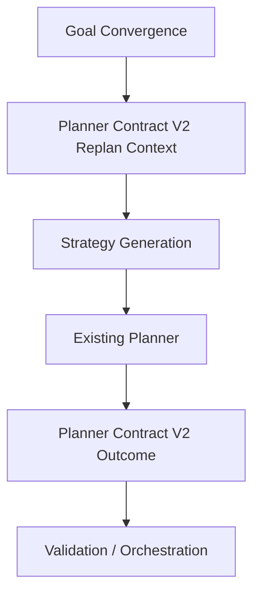
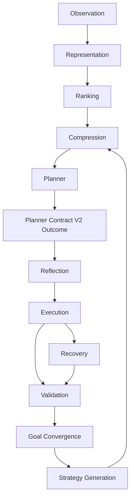

# Strategy Generation Architecture

**Status:** Architecture document. Design only. No code, no milestones, no effort estimate.

**Objective:** define how the system should cause the existing planner to generate a new strategy after Goal Convergence proves that the current strategy is no longer making semantic progress.

This is not a new planner, not a second reasoning engine, and not a second validation system. The LLM remains the only planner. Strategy Generation is the decision process that shapes the next planner invocation after a Planner Contract V2 `Replan` condition has been created by Goal Convergence.

The architectural position is:

```text
Goal Convergence detects non-progress
        |
        v
Planner Contract V2 Replan context is created
        |
        v
Strategy Generation frames what must change
        |
        v
Existing planner chooses the next Planner Contract V2 outcome
```

## Evidence Base

The design is grounded in the benchmark evidence accumulated so far:

- `amazon_in__product_search_price`: earlier runs showed repeated price-related clicks, accordions, reports, and scrolls while the semantic goal required a product detail page and extractable price evidence. Goal Convergence Phase 1 later shortened this from timeout to `STUCK PLANNING`, proving non-progress can be detected, but not yet transformed into a better strategy.
- `booking_com__hotel_search`: repeated date and occupancy-widget interactions did not produce the required search-result state. The problem was not merely one failed click; the strategy stayed around the same widget cluster while validation evidence did not advance.
- `fixture__pagination`: the system could click or wait, but repeatedly failed to produce the required Page 2 semantic evidence. Earlier behavior also included terminal-style reports despite validation not proving the goal.
- `github_com__pr_read_comments`: the planner repeatedly selected invalid navigation/search paths. Goal Convergence Phase 1 produced a convergence-stalled signal on repeated navigation, but the next planning behavior still lacked a principled alternate route.
- `cross_site__amazon_search_github_compare`: after Planner Contract V2 and later loop improvements, the workflow completed in the Goal Convergence Phase 1 benchmark, showing that better contract framing can unlock different behavior without adding a second planner.
- Goal Convergence Phase 1 benchmark: completion remained `14/22`, but failure modes shifted from long timeouts toward earlier `PLANNING` and `STUCK PLANNING` failures. This proves the system can now detect non-progress, but the largest remaining bottleneck is generating a materially different next strategy.

The common finding is:

> The loop can now know that the current strategy is not converging, but the next planner invocation does not yet receive a sufficiently explicit description of what kind of strategy must change.

## 1. What Is A Strategy?

A **strategy** is the planner's current approach for transforming the observed browser state into the user's goal state.

It is not one browser action. It is the organizing idea behind a sequence of possible actions, reports, waits, asks, or replans.

Examples:

- "Search Amazon, open a product result, read the price from the product detail page."
- "Use Booking's destination, date, and occupancy widgets until the result URL reflects the requested city."
- "Click the pagination control, then verify the expected Page 2 content."
- "Use GitHub's repository issue or pull-request route directly instead of global search."

### Strategy Versus Action

An **action** is one concrete browser operation or one Planner Contract V2 turn:

- click this selector,
- fill this input,
- navigate to this URL,
- wait,
- report,
- ask,
- replan.

A **strategy** is broader:

- which route through the site is being attempted,
- which page state is expected next,
- which evidence should prove progress,
- which prior assumptions are being relied on.

Benchmark grounding:

- In Amazon price, "scroll the product page" is an action. "Obtain price from the product detail page rather than from search results or accordions" is a strategy.
- In Booking, "click the occupancy widget" is an action. "Complete destination/date/occupancy constraints until the search-result URL reflects a city search" is a strategy.
- In GitHub, "navigate to `/issues/1`" is an action. "Find PR comments through the correct pull-request route rather than invalid search paths" is a strategy.

### Strategy Versus Plan

A **plan** is an ordered decomposition of steps. The current system does not require a separate durable multi-step plan to make the next turn better.

A **strategy** is lighter than a plan:

- it can be described in one short framing statement,
- it is task-local,
- it changes the next planner invocation,
- it does not prescribe every future action.

This matters because the benchmark evidence does not show a need for a second planning engine. It shows a need for the next planner call to understand that the previous approach must not be repeated.

## 2. What Goal Convergence Should Pass Forward

Strategy Generation uses only information that already exists today. It does not introduce new observations.

Goal Convergence should pass forward a compact **strategy failure summary** made from existing evidence:

| Evidence | Existing Source | Purpose In Strategy Generation |
| --- | --- | --- |
| Original user goal | Task definition / orchestrator context | Preserve the stable target; strategy changes must still serve this goal |
| Current observation signature | Observation / Representation | Identify whether the browser state actually changed |
| Current URL and title | Observation | Distinguish expected page state from observed page state |
| Goal-relevant visible and semantic text | Observation / Representation / Semantic Goal Validation | Show what evidence is present or absent |
| Last Planner Contract V2 outcome kind | Planner output | Distinguish repeated `Act`, `Report`, `Wait`, or `Replan` patterns |
| Last action type, selector, and value | Planner / execution record | Identify repeated concrete actions |
| Execution result | Execution / Recovery | Separate mechanical failure from semantic non-progress |
| Validation result | Semantic Goal Validation / benchmark criteria | Identify which goal evidence remains unsatisfied |
| Repeated failure type | Goal Convergence | Say whether the loop repeated the same action, same semantic failure, or same contradiction |
| Prior-step trail | Existing prior steps / attempt ledger | Give the planner enough task-local memory to avoid repeats |

The summary should answer four questions for the next planner invocation:

1. What was the current strategy trying to accomplish?
2. What evidence proves it did not make semantic progress?
3. What should not be repeated?
4. What kind of difference is required from the next strategy?

It should not contain:

- new page observations,
- guessed DOM facts,
- site-specific heuristics,
- model confidence scores,
- hidden validation logic,
- or a preselected next action.

## 3. How Contradictions Influence The Next Strategy

A contradiction is stronger than ordinary non-progress. It means the system expected one semantic state but observed another incompatible state.

Contradictions should change planner behavior by invalidating the assumption behind the current strategy.

| Expected | Observed | Strategy Meaning |
| --- | --- | --- |
| Page 2 | Page 1 | Do not report completion or wait on the same evidence; choose a route that changes or verifies pagination state |
| Product detail page | Search results page | Do not keep extracting/reporting price from the current context; first reach a product-detail state or use evidence already visible only if validation allows it |
| HP filter applied | No HP evidence | Do not assume the filter is active; use a control/state that can prove the filter was applied |
| PR comments page | Issue page or invalid search path | Do not repeat the same navigation route; choose a route consistent with PR-specific evidence |

Contradictions should be framed to the planner as **assumption failures**, not as generic failures.

For example:

```text
Previous strategy assumed the current page contained the target product price.
Validation still requires product detail URL / price evidence.
Observed state is search/product-navigation context, not verified price completion.
Next strategy must not report or keep interacting with price-adjacent controls unless it first obtains validating evidence.
```

This is grounded in the Amazon and Pagination failures: the problem was not merely "try a different selector"; it was "the browser state does not match the state your strategy assumes."

## 4. How Repeated Failures Change Strategy

Repeated failures are not all equivalent. Strategy Generation must preserve the difference because each kind demands a different change in planner context.

### Repeat Same Action

Definition:

- same outcome/action kind,
- same selector or target,
- same value where applicable,
- same or equivalent observation after the attempt.

Meaning:

- the concrete tactic is exhausted,
- the planner should avoid the same selector/operation unless the page state changed.

Benchmark grounding:

- Booking repeatedly clicking the same widget cluster should not merely produce "click again"; it should force the planner to select a different route through the form or search submission state.
- GitHub repeated navigation attempts should not keep choosing the same invalid URL route.

Planner-context effect:

```text
Do not repeat the same action/target. Choose a different target, route, or outcome kind.
```

### Repeat Same Semantic Failure

Definition:

- actions may differ,
- browser may change superficially,
- the same validation requirement remains unsatisfied.

Meaning:

- the current strategy is moving around the page but not toward the goal evidence,
- the planner must target the missing semantic evidence directly.

Benchmark grounding:

- Amazon add-to-cart performed search and page interactions, but `Added to Cart` never appeared.
- Booking interacted with widgets, but the required result/search URL state never appeared.
- Pagination clicked/waited/scrolled, but Page 2 evidence remained absent.

Planner-context effect:

```text
The next strategy must explicitly target the still-missing semantic criterion, not merely continue browser movement.
```

### Repeat Same Contradiction

Definition:

- planner or strategy assumes a state,
- validation/observation repeatedly shows an incompatible state.

Meaning:

- the core assumption of the strategy is wrong,
- the planner must abandon that assumption before choosing the next outcome.

Benchmark grounding:

- Expected product page but observed search-result/product-navigation context.
- Expected Page 2 but observed Page 1 or missing Page 2 text.
- Expected filtered state but observed no filter evidence.

Planner-context effect:

```text
The next strategy must explain how it will replace the contradicted assumption with a different route or evidence source.
```

## 5. Continue, Abandon, Or Try An Alternative

Strategy Generation does not decide task completion and does not choose the next action. It frames whether the current approach remains eligible for the planner to continue.

### Keep The Current Strategy When

- validation evidence is improving,
- the same semantic criterion is not failing in the same way,
- observation changes are goal-relevant,
- a wait corresponds to a real transition,
- a repeated action is expected and produces new evidence,
- or the planner can justify that the current strategy has not yet had a meaningful chance.

Example:

- A pagination strategy can continue if each click exposes new page content or a URL/page marker changes toward the target.

### Abandon The Current Strategy When

- the same action repeats without semantic progress,
- the same validation failure repeats under stable or irrelevant observations,
- the same contradiction repeats,
- reports remain unsupported by validation,
- waits do not change the observation,
- or browser movement is unrelated to the missing goal evidence.

Example:

- Amazon price should abandon "keep interacting with price-adjacent controls" once the goal still lacks verified price evidence.

### Try An Alternative When

- the goal remains reachable,
- the failure is strategy-scoped rather than task-scoped,
- current observation contains other affordances or routes,
- prior steps show a route that should be avoided,
- or validation identifies a missing criterion that can be targeted differently.

Example:

- GitHub should try a PR-specific route or page-local evidence path after invalid issue/search navigation repeats.

The principle is:

> Abandon the failed strategy, not the goal.

## 6. Integration With Planner Contract V2

Strategy Generation does not add Planner Contract V2 outcomes. It shapes the context that leads the existing planner to choose one of the existing outcomes.

| Outcome | Strategy Generation Participates? | Boundary |
| --- | --- | --- |
| `Act` | Yes, by telling the planner which prior action/route should not be repeated and what semantic evidence remains missing | It does not choose the action or selector |
| `Report` | Yes, by warning when reports were unsupported or contradicted | It does not validate the report |
| `Wait` | Yes, by marking repeated waits without observation change as non-strategic | It does not control timing or page settling |
| `Ask` | Rarely; only when the failed strategy reveals missing user-only information | It does not turn strategy uncertainty into a user question |
| `Replan` | Yes, this is the entry point: Goal Convergence creates the replan condition, Strategy Generation frames the next planner invocation | It does not create a new outcome kind |

The flow is:



Strategy Generation participates before the next planner invocation, not after the planner has selected an outcome. Reflection and Recovery still own their existing post-planner responsibilities.

## 7. Why This Is Not A Second Planner

The LLM remains the only component that chooses:

- the next outcome kind,
- the browser action,
- the selector,
- the report claim,
- the wait,
- the ask question,
- or the replan content.

Strategy Generation only changes planner context. It says:

- what strategy failed,
- why it failed,
- what evidence contradicted it,
- what must not be repeated,
- and what kind of semantic difference is required.

It does not say:

- "click this",
- "navigate there",
- "report this answer",
- "choose this selector",
- or "the goal is complete."

This is the same architectural pattern established by Planner Contract V2 and Goal Convergence:

- Planner Contract V2 widened what the planner may say.
- Goal Convergence decides when the current strategy is no longer productive.
- Strategy Generation frames the next planner call so the existing planner can say something different.

No component other than the planner performs planning.

## 8. Fit Inside The Existing Reasoning-Feedback Loop

Strategy Generation is a context-shaping layer between Goal Convergence and the next planner invocation. It uses the existing attempt ledger/prior steps, validation evidence, and observation evidence.

| Layer | Owns | Strategy Generation Relationship |
| --- | --- | --- |
| Observation | Current browser state: URL, title, text, elements, content blocks, state | Consumes only the already-produced observation summary; never observes directly |
| Representation | Structured page meaning and affordance representation | Uses represented facts only as evidence already available to planner/validation |
| Ranking | Which elements/facts are relevant enough for planner context | Does not rank elements or override ranking |
| Compression | Planner-sized projection of observation and history | Strategy failure summary becomes part of the next compressed planner context |
| Planner | Chooses the next Planner Contract V2 outcome | Remains the only planner |
| Validation | Determines whether goal/report/action evidence satisfies criteria | Strategy Generation consumes validation results; never validates independently |
| Goal Convergence | Determines that current strategy is not making semantic progress | Triggers Strategy Generation and supplies failure pattern evidence |
| Strategy Generation | Frames what must change in the next strategy | Does not choose the next outcome |
| Reflection | Detects action-level repetition or local failed-action reuse | Remains post-planner; Strategy Generation handles strategy-level context before the next planner call |
| Execution | Performs browser actions | Not involved unless planner later chooses `Act` |
| Recovery | Diagnoses and retries execution failures | Remains reactive to execution failure, not strategy failure |

The architecture therefore preserves the existing ownership model:



The loop back from Strategy Generation to Compression is conceptual: the next planner context includes the replan framing. It is not a new planner invocation mechanism.

## 9. End-To-End Example: Amazon Product Price

### Old Behavior

The user goal requires finding a product price on Amazon.

Observed sequence from benchmark evidence:

1. The planner searches Amazon.
2. The planner reaches search results or a product-like page.
3. The planner repeatedly clicks price-adjacent controls, scrolls, or reports.
4. Validation still lacks the required product-price evidence.
5. The loop times out or becomes stuck.

The core failure:

```text
Strategy assumed: current page/controls can yield the requested price.
Observed evidence: validation still lacks required price completion.
Behavior: continue nearby interactions or unsupported reports.
```

### Goal Convergence Detects Failure

Goal Convergence sees:

- repeated outcome patterns,
- unchanged or irrelevant semantic evidence,
- validation still failing the price criterion,
- browser progress not converting into goal progress.

It creates a Planner Contract V2 `Replan` condition:

```text
Current strategy is not making semantic progress.
Repeated interactions/reports did not satisfy product-price validation.
```

### Strategy Generation

Strategy Generation turns that into a strategy failure summary:

```text
Previous strategy:
Use current Amazon page interactions to expose or report the price.

Failure evidence:
Validation still requires verified price evidence.
Recent actions did not produce new semantic price evidence.
Current route must not repeat price-adjacent clicks or unsupported reports.

Contradiction:
The strategy behaved as if price evidence was available or revealable here,
but validation did not verify the price goal.

Required difference:
Choose a strategy that first establishes a valid product-detail/price evidence source,
or report only if current observation already contains evidence satisfying validation.
```

### Planner Receives Different Context

The existing planner receives the normal observation and prior steps, plus the replan framing:

```text
Do not continue the previous strategy.
Do not repeat the same price-control interaction or unsupported report.
Target the missing semantic evidence: verified product price.
If current page lacks that evidence, choose a route that obtains it.
```

This is not an instruction to click a specific selector. It is a constraint on strategy.

### Different Browser Behavior

The planner remains free to choose the next valid Planner Contract V2 outcome:

- `Act`: open a result that is more clearly a product detail page, use a different page route, or interact with a different relevant affordance.
- `Report`: only if the current observation already contains the verified price evidence.
- `Wait`: only if a real transition is underway.
- `Ask`: only if the task lacks user-only information.
- `Replan`: if another strategic shift is needed.

The expected architectural improvement is not "always click a particular Amazon selector." It is:

> the planner should no longer continue the same contradicted price-revealing/reporting strategy after convergence has proven that strategy non-productive.

## Final Architectural Principle

Strategy Generation is the missing bridge between knowing a strategy failed and giving the existing planner enough structured context to choose a meaningfully different one. It does not plan, validate, recover, execute, or complete. It preserves the LLM as the only planner while ensuring that `Replan` is not merely a loop marker, but a context transformation: the next planner invocation understands which strategy failed, why it failed, what evidence contradicted it, and what kind of semantic difference the next strategy must produce.
