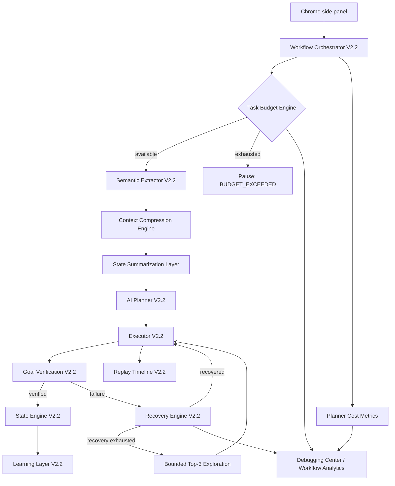
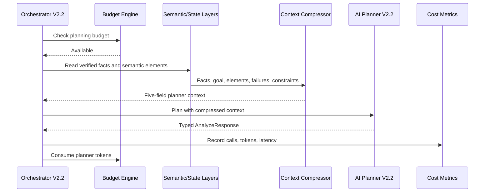
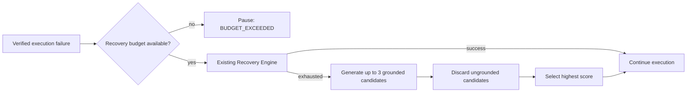

# V2.3 Incremental Enhancement Design

V2.3 extends the approved V2.2 architecture. It does not replace the workflow
orchestrator, state engine, task graph, recovery engine, learning layer, replay
timeline, or planner.

## 1. Updated architecture



The budget guard runs before planning, execution, and recovery. The existing
owners of the DOM, accessibility tree, and replay data keep those artifacts;
only compressed context crosses the planner boundary.

## 2. Updated folder structure

```text
backend/app/
|-- budget_engine/
|   |-- budget_models.py
|   |-- budget_manager.py
|   `-- budget_enforcer.py
|-- context_compression/
|   |-- compressor.py
|   |-- relevance_ranker.py
|   `-- state_summarizer.py
|-- exploration/
|   |-- exploration_planner.py
|   |-- candidate_generator.py
|   `-- candidate_evaluator.py
|-- domain_models.py
|-- schemas/analytics.py
`-- services/analytics_service.py
```

The existing orchestrator, AI service, recovery orchestrator, ORM models,
workflow routes, semantic extractor, and side-panel Debugging Center are
extended in place.

## 3. Database additions

```mermaid
erDiagram
  SESSIONS ||--o| WORKFLOW_BUDGETS : has
  SESSIONS ||--o| WORKFLOW_COST_METRICS : has
  SESSIONS ||--o{ WORKFLOW_EVENTS : records
  SESSIONS ||--o{ FAILURE_RECORDS : records

  WORKFLOW_BUDGETS {
    string session_id PK_FK
    int max_steps
    int max_tokens
    int max_retries
    int max_duration_seconds
    int steps_used
    int tokens_used
    int retries_used
    datetime started_at
    datetime updated_at
  }

  WORKFLOW_COST_METRICS {
    string session_id PK_FK
    int planner_calls
    int vision_calls
    int tokens_used
    int planning_latency_ms
    datetime updated_at
  }
```

Both additions are one-to-one, additive tables keyed by `sessions.id`. No V2.2
column is changed or removed. Counters use the defaults 50 steps, 5 retries,
50,000 tokens, and 300 seconds.

## 4. API additions

| Method | Path | Purpose |
|---|---|---|
| `GET` | `/workflow/{session_id}/analytics` | Return budget, cost, failure, success, and stability metrics. |
| `POST` | `/analyze` | Existing endpoint; now returns HTTP 409 when a budget is exhausted. |
| `POST` | `/workflow/log` | Existing endpoint; now enforces the execution budget and may return HTTP 409. |

Budget exhaustion uses this stable error contract:

```json
{
  "detail": {
    "status": "BUDGET_EXCEEDED",
    "reason": "maximum workflow steps reached"
  }
}
```

The workflow session is persisted as `BUDGET_EXCEEDED` before the response, so
the browser can stop safely without losing replay or state data.

## 5. New data models

`WorkflowBudget` validates positive limits and non-negative counters.
`FlightCard`, `ProductCard`, `GmailDraft`, and `WhatsAppMessage` are Pydantic
domain objects. The semantic extraction layer validates data into those models
before it can become a workflow fact. Invalid prices, ratings, URLs, or missing
required fields are rejected; raw LLM output is not written directly to state.

The analytics response is typed as `WorkflowAnalytics` with nested
`CostMetrics`, including planner calls, vision calls, token usage, average
tokens per step, and average planning latency.

## 6. Integration flows

### Planning cycle



The planner contract contains exactly `verified_facts`, `active_goal`,
`relevant_elements`, `important_failures`, and `task_constraints`. Full DOM,
full accessibility trees, visible page dumps, and full replay history are
excluded.

### Failure cycle



Exploration is deliberately bounded and only follows recovery exhaustion. It
does not perform MCTS, AgentQ, or recursive tree search.

## 7. Migration plan

1. Generate and review an additive migration for `workflow_budgets` and
   `workflow_cost_metrics`; apply it before application deployment.
2. Deploy analytics reads dark and backfill active sessions with default budget
   rows. Historical sessions may remain without rows because reads have safe
   defaults.
3. Enable context compression for a canary cohort and compare prompt tokens and
   latency with a V2.2 control cohort.
4. Enable budget checks with generous limits, then move to the specified
   defaults after observing real long-running workflows.
5. Enable bounded exploration only after recovery exhaustion.
6. Expose Workflow Analytics and alert when false-success rate exceeds 2%.
7. Roll back each capability with its feature flag if needed. Keep the additive
   tables for audit continuity; no destructive rollback is required.

For workflows intentionally longer than 50 steps, create an explicit larger
budget before starting. The engine remains bounded by tokens, retries, and
duration even when the step limit is raised.

## 8. Testing strategy

- Unit: every budget boundary, duration handling, compressed-context shape,
  relevance ordering, state-summary truncation, domain-model rejection, and
  top-three grounded exploration.
- Integration: checks at planning/execution/recovery boundaries, persistent
  `BUDGET_EXCEEDED`, cost aggregation, recovery-to-exploration handoff, and
  concurrent event accounting.
- Contract: assert that forbidden raw context never enters planner requests and
  that both 409-producing endpoints retain the documented payload.
- Browser: reproduce popup loops, stale selectors, React rerenders, duplicate
  controls, and repeated validation failures; verify the Analytics panel.
- Soak: run at least 60 minutes with an explicit budget above 50 steps and prove
  that every loop terminates at one of the remaining hard limits.

## 9. Performance benchmark plan

Replay at least 100 representative V2.2 workflows against control and V2.3,
including known sites, unseen sites, short workflows, and workflows above 50
steps. Hold the model, temperature, network region, page snapshots, and task
inputs constant.

Capture prompt and completion tokens, p50/p95 planner latency, planner and vision
calls, completion time, verified success, false success, recovery count, and
stability score. Report confidence intervals and results by workflow length and
site class.

Release gates are at least 50% fewer planner tokens, 30% lower average planning
latency, 15% higher stability, false success at or below 2%, successful bounded
execution above 50 configured steps, and zero unbounded recovery loops.

---

## V2.5 — Ambient Front Door (incremental build log)

V2.5 adds a lightweight cognition path (Intent Router → CTCE → AI service) that
runs independently of the V2.3 workflow engine. The engine, state machine, budget
enforcer, and recovery orchestrator are unchanged.

### Architecture

```
[Chrome sidepanel Assist tab]
     |  /assist  POST
     v
Intent Router (Tier-1 deterministic keyword classifier)
  summarize → light path → CTCE → summarization_service
  ask       → light path → CTCE → qa_service
  research / compare / unknown → fallback (not_implemented response)
     |
ConversationStore (in-memory ring buffer, max 100 conv × 20 turns)
```

### Slices implemented

| Slice | Title | Status |
|-------|-------|--------|
| 1 | Intent Router + CTCE + Summarize | Complete |
| 2 | Page Q&A (ask intent, multi-turn history) | Complete |
| BUG-05 | Suggested Follow-up Questions (summarize only, Option B) | Complete |
| 3 | Chat UI Shell — conversation thread in Assist panel | Complete |
| 4 | Handoff Protocol — escalate fallback intents to Workflow | Complete |

### Slice 3 details (Chat UI Shell)

**Frontend changes only — backend ConversationStore was already complete.**

Files changed:
- `extension/src/types/assist.ts` — Added `ChatMessageType`, `ChatMessage` interface;
  updated `AssistState` to use `messages: ChatMessage[]` (replaced `result` + `lastQuestion`).
- `extension/src/sidepanel/hooks/useAssist.ts` — Rewrote hook to accumulate messages
  into a thread. User messages appended optimistically before the fetch. Assistant
  responses or error messages appended on completion. `reset()` clears the thread and
  assigns a new conversationId.
- `extension/src/sidepanel/App.tsx` — Added `ChatMessageView` component rendering user
  bubbles, summary cards, answer cards, error cards, and not_implemented cards.
  AssistPanel renders a scrollable thread with auto-scroll on new messages. Follow-up
  chips are clickable (`ask(chip_text)`). "New conversation" button clears the thread.

Validation results (2026-06-23): 41/41 checks pass.
- Summarize: avg 5.0 s across 3 page types
- Ask: avg 1.12 s across 3 page types (Option B preserved)
- Multi-turn thread: 3-turn conversation (summarize→ask→followup) accumulates 6 turns
- Conversation isolation: two parallel conversations remain independent
- Follow-up grounding: 3/3 chips answerably grounded against page content

### Slice 4 details (Handoff Protocol)

**Goal:** When the ambient path can't serve an intent (research/compare/unknown),
surface an "Open in Workflow →" CTA that pre-fills the Workflow tab and switches to it.

Files changed:
- `backend/app/assist/ambient_assistant.py` — Fallback branch now returns
  `AssistHandoff(available=True, target="workflow")`. Summarize and ask branches
  unchanged (`available=False, target=None`).
- `extension/src/types/assist.ts` — `ChatMessage` extended with optional `handoff`
  and `sourceQuery` fields for Slice 4 CTA rendering.
- `extension/src/sidepanel/hooks/useAssist.ts` — `makeAssistantMessage()` stores
  `handoff` and `sourceQuery` on the message when `handoff.available` is true.
- `extension/src/sidepanel/App.tsx` — `ChatMessageView` renders the "Open in Workflow →"
  button when `message.handoff?.available && message.sourceQuery`. Clicking calls
  `onHandoffToWorkflow(query)` which pre-fills `workflow.setTask(query)` and switches
  the active tab to `'workflow'`.

Validation results (2026-06-23): 42/42 checks pass.
- Fallback intents (research, compare, unknown): handoff.available=True, target="workflow"
- Light intents (summarize, ask): handoff.available=False, target=None
- Fallback response latency: <1ms (no LLM call required)
- Regression: all Slice 1-3 behavior preserved

Unit tests: 15 new tests (TestHandoffForFallbackIntents, TestHandoffNotAvailableForLightPath,
TestHandoffResponseIntegrity). Total backend suite: 156 passed.

### Key decisions

- **Option B follow-ups**: Follow-ups generated only for summarize responses. Ask
  returns immediately with `suggested_followups = []`. Latency cost: ~1,200–2,400 ms
  added to summarize path only.
- **In-memory ConversationStore**: No persistence across backend restarts. Bounded at
  100 conversations × 20 turns. Cleared on restart. Persistence deferred to a future slice.
- **Thread layout**: No fixed scroll container — messages grow with the page, auto-
  scroll via `bottomRef.scrollIntoView()` on state change.
- **sourceQuery stored on message**: The handoff query is captured at response time
  (not derived at click time) to keep `ChatMessageView` pure and avoid stale closure bugs.
- **Handoff CTA placement**: CTA appears only on `not_implemented` cards, only when both
  `handoff.available` and `sourceQuery` are truthy — no false positives possible.

---

## V2.6 — Cognitive Core

### Overview

V2.6 adds the shared cognitive foundation between the Ambient Assistant and the
Workflow Engine. Before V2.6, each conversation turn was fully independent —
no entity tracking, no goal continuity, no reference resolution. V2.6 inserts
a Cognitive Core between the intent classifier and the response path.

### Architecture

```
[User message]
      │
      ▼
CognitiveConversationManager.get_or_create(conversation_id)
      │
      ▼
IntentContinuityLayer.enrich(message, session)    ← resolves "it", "first one", etc.
      │
      ▼
classify(original_message)                        ← intent unchanged
      │
      ├──[summarize]──► summarization_service ──► EntityRegistry.extract(summary.entities)
      │                                                             │
      ├──[ask]────────► IntentContinuity.enriched message ──► qa_service
      │                                                             │
      └──[fallback]──► WorkflowBridge.build_handoff_payload(session)
                                     │
                          ┌──────────┴──────────┐
                          │  EntityRegistry      │
                          │  GoalTracker         │
                          │  ConversationSummary │
                          └──────────────────────┘
                                     │
                                     ▼
                          AssistResponse.handoff_payload
                             (ready for V3.0 WorkflowOrchestrator)
```

### Components

| Component | File | Role |
|-----------|------|------|
| EntityRegistry | `cognitive_core/entity_registry.py` | Extract + store named entities (zero LLM) |
| ReferenceResolver | `cognitive_core/reference_resolver.py` | Resolve "it", "first", "second", "that" |
| GoalTracker | `cognitive_core/goal_tracker.py` | Infer + track conversation goal state machine |
| CognitiveConversationManager | `cognitive_core/conversation_manager.py` | Orchestrates all components, singleton |
| IntentContinuityLayer | `cognitive_core/intent_continuity.py` | Prepend entity context to QA questions |
| WorkflowBridge | `cognitive_core/workflow_bridge.py` | Build enriched handoff payload |
| CognitiveAnalytics | `cognitive_core/analytics.py` | In-memory metrics (resolution rate, handoff enrichment) |

### Data flow — compare + follow-up example

```
Turn 1: "compare MacBook Air and Dell XPS"
  → classify() → compare → fallback
  → EntityRegistry extracts [MacBook Air, Dell XPS] from message
  → GoalTracker infers goal: "Compare: MacBook Air vs Dell XPS"
  → WorkflowBridge builds payload: {entities: [...], goal: "Compare...", turn_count: 1}
  → AssistResponse.handoff_payload = payload

Turn 2: "which is cheaper?"
  → session has [MacBook Air, Dell XPS]
  → IntentContinuityLayer detects "cheaper" (comparative) + entities → enriches:
      "Considering Dell XPS, MacBook Air: which is cheaper?"
  → classify("which is cheaper?") → ask → light path
  → qa_service.answer(question="Considering Dell XPS, MacBook Air: which is cheaper?")
  → QA model now has full entity context without guessing from page alone
```

### V3.0 / V4.0 Extension Points

The V2.6 design was intentionally built to accommodate future capabilities
without requiring rewrites:

| Future system | Extension point |
|---------------|-----------------|
| V3.0 Memory | CognitiveSession → persist to DB; ConversationStore stays unchanged |
| V3.5 Trust & Autonomy | GoalTracker.status → "approved" / "blocked" states |
| V4.0 Research Engine | EntityRegistry → query external knowledge graph per entity |
| V4.0 Multi-Tab Reasoning | CognitiveConversationManager → merge sessions across tab IDs |
| WorkflowOrchestrator (V3.0) | Read `AssistResponse.handoff_payload` instead of raw query string |

### Schema changes (backend)

`app/schemas/assist.py` additions:
```python
class CognitiveEntitySchema(BaseModel):    # serialized entity
class WorkflowHandoffPayload(BaseModel):   # enriched handoff context
class AssistResponse(BaseModel):
    handoff_payload: WorkflowHandoffPayload | None = None  # new optional field
```

### Schema changes (extension)

`extension/src/types/assist.ts` additions:
```typescript
interface CognitiveEntity { id, type, name, aliases, metadata, confidence, source_turn }
interface WorkflowHandoffPayload { query, goal_text, goal_status, entities, conversation_summary, turn_count }
interface AssistResponse {
  // ... existing fields ...
  handoff_payload?: WorkflowHandoffPayload | null  // new optional field
}
```

### Validation results (2026-06-23): 41/41 checks pass

- Entity extraction from compare messages: MacBook Air, Dell XPS extracted with confidence 0.6
- Entity extraction from StructuredSummary.entities: confidence 0.9
- Reference resolution: ordinal (conf 0.9), proximal (conf 0.7), name-match (conf 0.95)
- Goal tracking: inferred on turn 1, handed_off on research/compare fallbacks
- Handoff payload: entities + goal + summary + turn_count present and serializable
- Cognitive overhead: <1ms (all operations are rule-based, zero LLM calls added)
- Regression: 0 regressions (summarize, ask, handoff.available all unchanged)

### Test results

| Test suite | Count | Result |
|---|---|---|
| Unit: entity_registry | 17 | 17/17 pass |
| Unit: reference_resolver | 17 | 17/17 pass |
| Unit: goal_tracker | 14 | 14/14 pass |
| Unit: conversation_manager | 14 | 14/14 pass |
| Unit: workflow_bridge | 10 | 10/10 pass |
| Integration: cognitive | 20 | 20/20 pass |
| **Full backend suite** | **252** | **252/252 pass** |

### Key decisions

- **Zero new LLM calls**: All Cognitive Core operations are rule-based. Entity extraction
  uses the LLM-structured `StructuredSummary.entities` field (already computed) and explicit
  compare patterns. Reference resolution is deterministic ordinal/proximal/name-match.
  This ensures the ask path latency (1.1s) is unaffected.
- **Additive-only changes**: No existing function signatures changed. `run(request)`,
  `classify()`, `ConversationStore`, `AssistHandoff` all unchanged. V2.6 is safe to deploy
  alongside any V2.5 client that ignores the new `handoff_payload` field.
- **CognitiveSession is parallel to ConversationStore**: Not a replacement. ConversationStore
  retains raw turn data for QA history. CognitiveSession adds the semantic layer.
- **sourceQuery stored on message (Slice 4 preserved)**: The handoff query in the frontend
  ChatMessage is still stored at response time to keep ChatMessageView pure.
- **WorkflowHandoffPayload is now consumed (V3.0)**: The Workflow Engine reads
  `handoff_payload` from `AnalyzeRequest`, bootstraps `WorkflowState.facts`, and injects
  a `cognitive_context` 6th key into the planner context.

---

## V3.0 — Cognitive Memory + Workflow Consumption

### Overview

V3.0 closes the loop between the Ambient Assistant and the Workflow Engine. It adds:

1. **Persistent Cognitive Memory** — `CognitiveSession` is now saved to PostgreSQL after every
   turn and restored from DB on cache miss. Backend restarts no longer lose entity/goal context.
2. **Workflow Consumption** — `WorkflowOrchestrator` reads `handoff_payload`, bootstraps
   `WorkflowState.facts` from it (cold-start only), and injects `cognitive_context` into the
   planner context as a 6th key.
3. **Context-Aware Planning** — The planner sees `user_goal`, `goal_status`, `tracked_entities`,
   and `conversation_summary` alongside the page state. No extra LLM call required.
4. **Memory Analytics** — REST endpoints for inspection and cleanup.

### New files

| File | Role |
|------|------|
| `cognitive_core/memory_store.py` | Serialize/deserialize `CognitiveSession` ↔ `cognitive_sessions` DB table |
| `cognitive_core/memory_cleanup.py` | Delete sessions older than `retention_days` (default 30 days) |
| `cognitive_core/workflow_context.py` | Build `cognitive_context` dict + `bootstrap_facts` dict from `WorkflowHandoffPayload` |
| `api/routes/cognitive.py` | REST: GET `/cognitive/state/{id}`, POST `/cognitive/cleanup`, GET `/cognitive/analytics` |

### Modified files

| File | Change |
|------|--------|
| `models/db.py` | New `CognitiveSessionRecord` ORM model (table `cognitive_sessions`) |
| `cognitive_core/conversation_manager.py` | `get_or_create(db=)` restores from DB on miss; `process_turn(db=)` saves after each turn |
| `assist/ambient_assistant.py` | `run(request, db=None)` — passes `db` to cognitive manager |
| `api/routes/assist.py` | Injects `db: Session = Depends(get_db)` into assist endpoint |
| `schemas/request.py` | `AnalyzeRequest.handoff_payload: Optional[Any]` |
| `orchestrator/workflow_orchestrator.py` | `orchestrate_analysis(handoff_payload=None)` — bootstraps state + builds cognitive_context |
| `state_engine/persistence.py` | `bootstrap_from_handoff()` — cold-start fact injection, no-overwrite when facts exist |
| `context_compression/compressor.py` | `compress(cognitive_context=None)` — optional 6th key |
| `main.py` | Registers cognitive router |

### Data flow — handoff → workflow bootstrap

```
[AssistResponse.handoff_payload]
         │
         ▼  (forwarded by extension in AnalyzeRequest.handoff_payload)
WorkflowOrchestrator.orchestrate_analysis(handoff_payload=payload)
         │
         ├── StatePersistence.bootstrap_from_handoff()
         │       → if no existing facts: save entity_0_name, user_goal, conversation_context, ...
         │       → if facts already exist: skip (no-overwrite)
         │
         ├── build_cognitive_context(payload)
         │       → {user_goal, goal_status, tracked_entities, conversation_turns, conversation_summary}
         │
         └── ContextCompressor.compress(cognitive_context=ctx)
                 → injects as 6th key: "cognitive_context": {...}
                 → Planner prompt now includes prior conversation context
```

### CognitiveSessionRecord schema

```python
class CognitiveSessionRecord(Base):
    __tablename__ = "cognitive_sessions"
    conversation_id      = Column(String, primary_key=True)
    turn_count           = Column(Integer, default=0)
    conversation_summary = Column(Text, default="")
    active_intent        = Column(String, default="unknown")
    entities_json        = Column(Text, default="[]")     # JSON list of entity dicts
    entity_order_json    = Column(Text, default="[]")     # JSON list of entity ids
    goal_json            = Column(Text, nullable=True)    # JSON goal dict or NULL
    created_at           = Column(DateTime)
    updated_at           = Column(DateTime)
```

Auto-created by `Base.metadata.create_all()` on startup. No migration scripts needed.

### Validation results (2026-06-23): 66/66 checks pass

- Section 1 (MemoryStore): 10/10 — save, load, upsert, missing-key, raw record
- Section 2 (Conversation Manager): 5/5 — restore on cache miss, in-memory cache hit, db=None
- Section 3 (WorkflowContext): 12/12 — cognitive_context keys, entity count, confidence rounding, bootstrap facts
- Section 4 (StatePersistence): 8/8 — cold-start bootstrap, no-overwrite, None/empty payload
- Section 5 (ContextCompressor): 6/6 — absent when no payload, 6th key present when payload given, empty dict omits key
- Section 6 (WorkflowOrchestrator): 4/4 — accepts handoff_payload, bootstraps facts, None doesn't crash
- Section 7 (REST endpoints): 9/9 — all 3 routes registered, cleanup deletes old sessions
- Section 8 (Regression): 12/12 — summarize/ask/fallback paths all unchanged

### Test results

| Test suite | Count | Result |
|---|---|---|
| Unit: memory_store | 7 | 7/7 pass |
| Unit: workflow_consumption | 13 | 13/13 pass |
| Integration: memory | 9 | 9/9 pass |
| **Full backend suite** | **281** | **281/281 pass** |

### Key decisions

- **`db=None` default on all new parameters**: Pre-V3.0 tests call `run(request)` and
  `cognitive_manager.process_turn()` without `db` — they continue to work unchanged.
  No test was modified to accommodate V3.0 persistence.
- **`_skip_persistence` flag**: `_reset_for_testing()` sets it to `True` to protect unit
  tests. Integration tests that need real DB persistence call `cog_mgr._skip_persistence = False`
  after the reset. This isolates the two test categories without changing production code.
- **No-overwrite on `bootstrap_from_handoff`**: If `WorkflowState.facts` is already populated
  (e.g., the user ran a second workflow on the same session), handoff bootstrap is skipped.
  This prevents cognitive context from clobbering workflow-verified facts.
- **Restore on cache miss only**: `get_or_create` checks in-memory first. DB restore only
  happens when the session is not in the process-local cache — typical after restart or
  when a different worker handles the request. The second call to `get_or_create` for the same
  `conversation_id` always hits the cache.
- **`cognitive_context` is a 6th key, not a replacement**: The 5 existing compressed-context
  keys (`verified_facts`, `active_goal`, `relevant_elements`, `important_failures`,
  `task_constraints`) are unchanged. `cognitive_context` is injected only when a payload is
  present. Existing planner prompts that don't reference `cognitive_context` are unaffected.
- **SQLite in tests, PostgreSQL in production**: Memory store tests use SQLite in-memory.
  The ORM code is DB-agnostic. No test-specific DB configuration is needed in production.

---

## V3.5 — Research Session Engine

### Overview

V3.5 adds a multi-turn Research Session Engine to the Assist pipeline. When the intent
router classifies a message as `route="research"`, a deterministic plan is generated,
sources are collected from up to three providers, an LLM synthesizes a structured report,
and action-keyword detection optionally escalates to the Workflow engine.

All existing routes (`summarize`, `ask`, `fallback`) are unchanged.

### Architecture

```
User query → IntentRouter (route="research")
  → AmbientAssistant._handle_research()
    → ResearchPlanner.create_plan()        — deterministic, no LLM
    → _collect_sources()
        1. PageContextProvider.search_page()   credibility 0.9
        2. DuckDuckGoProvider.search()         credibility 0.8 / 0.7
        3. AIKnowledgeProvider.search()        credibility 0.5  (fires when DDG < 2 sources)
    → ResearchSynthesizer.synthesize()     — LLM → ResearchReport
    → WorkflowBridge.build_research_handoff()  — action-keyword detection
  → AssistResponse(type="research_report", research_report=ResearchReportSchema(...))
```

### Component table

| # | Component | File | Notes |
|---|-----------|------|-------|
| 1 | Intent keywords | `app/intent/router.py` | Added `research`, `search for`, `learn about`, `look into`, `investigate`, `find info`, `look up` |
| 2 | Research models | `app/research/models.py` | `ResearchSession`, `ResearchPlan`, `ResearchReport`, `ResearchSource`, enums |
| 3 | Research Planner | `app/research/planner.py` | Deterministic 4-stage plan; `extract_topic()` strips known prefixes |
| 4a | PageContextProvider | `app/research/providers/page_context.py` | Converts current `ReadView` to one `ResearchSource` |
| 4b | DuckDuckGoProvider | `app/research/providers/duckduckgo.py` | DDG Instant Answer API, no API key, timeout 4 s |
| 4c | AIKnowledgeProvider | `app/research/providers/ai_knowledge.py` | LLM fallback; fires only when DDG returns < 2 sources |
| 5 | Session Manager | `app/research/session_manager.py` | In-memory, per `conversation_id`; deduplicates sources by URL |
| 6 | Synthesizer | `app/research/synthesizer.py` | LLM → `ResearchReport`; stub fallback on error |
| 7 | Research schemas | `app/schemas/assist.py` | `ResearchSourceSchema`, `ResearchReportSchema` added to `AssistResponse` |
| 8 | Analytics | `app/research/analytics.py` | Thread-safe counters for sessions, sources, syntheses, escalations |
| 9 | Workflow Bridge | `app/research/workflow_bridge.py` | Action-keyword detection → `WorkflowHandoffPayload` |
| 10 | Research Engine | `app/research/engine.py` | Orchestrates plan → collect → synthesize → handoff |
| 11 | REST endpoints | `app/api/routes/research.py` | `GET /research/session/{id}`, `/active/{conv_id}`, `/analytics` |
| 12 | Dispatch | `app/assist/ambient_assistant.py` | `_handle_research()` called for `route="research"` |
| 13 | Frontend types | `extension/src/types/assist.ts` | `ResearchSource`, `ResearchReport`, updated `AssistResponse` / `ChatMessageType` |
| 14 | Frontend hook | `extension/src/sidepanel/hooks/useAssist.ts` | `research_report` added to `typeMap`; `researchReport` field on `ChatMessage` |
| 15 | Frontend UI | `extension/src/sidepanel/App.tsx` | `ResearchReportView` component with sources toggle |

### Key decisions

- **No vector DB / embeddings / RAG**: Sources are collected via deterministic HTTP calls and
  page-context extraction. No semantic search, no persistent vector index.
- **DDG Instant Answer API only**: Uses the free, key-less endpoint. Returns at most one
  abstract + `RelatedTopics`. Not a full web search.
- **AIKnowledgeProvider is a fallback**: Only fires when DDG returns fewer than 2 sources,
  to avoid unnecessary LLM calls and to prefer grounded sources.
- **`route="research"` is a breaking change**: Changed from `"fallback"` for research intent.
  Four test files were updated to reflect the new route.
- **Pure research → `handoff.available=False`**: Only research queries containing action
  keywords (`book`, `buy`, `reserve`, `subscribe`, etc.) escalate to workflow.
- **In-memory sessions only**: `ResearchSession` is stored in process memory keyed by
  `conversation_id`. DB persistence deferred to V3.6.

### Validation results

- `validate_v35.py`: **73/73 checks passed**
- Full test suite: **404/404 passed** (including 23 planner, 40+ provider, 18 synthesizer,
  26 session-manager, 18 integration tests)

### Limitations / V3.6 candidates

- DDG Instant Answer API returns limited results; a full search API would improve coverage.
- `ResearchSession` is lost on server restart (no DB persistence yet).
- No caching of research results across conversations.
- `AIKnowledgeProvider` results are not grounded; confidence is capped at 0.5.

---

## V4.0 — Research → Workflow Intelligence Layer

### Overview

V4.0 transforms the platform from a Research Assistant into a **Research + Execution
Intelligence Platform**. After every research session, a deterministic intelligence
pipeline analyses whether the user's query implies a workflow execution opportunity,
decomposes the goal, assesses readiness, classifies approval risk, builds an execution
plan, generates workflow recommendations, and produces workflow bootstrap facts — all
without launching any workflow autonomously.

**Safety constraints (hard-coded)**:
- No autonomous execution
- No auto-click approval bypasses
- No self-running workflows
- No agent swarms
- No payment automation

### Architecture flow

```
User query
    │
    ▼
V3.5 ResearchEngine ──► ResearchReport
    │
    ▼
ExecutionOpportunityDetector   (keyword matching, < 1ms)
    │ detected?
    ├── NO  → IntelligenceResult(detected=False)
    │
    └── YES
        ▼
    GoalDecomposer             (template expansion, < 1ms)
        ▼
    WorkflowReadinessAnalyzer  (entity presence check, < 1ms)
        ▼
    ApprovalPolicyAdvisor      (phrase + type classification, < 1ms)
        ▼
    ExecutionPlanBuilder       (plan assembly, < 1ms)
        ▼
    WorkflowRecommendationEngine (1-3 recommendations, < 1ms)
        ▼
    WorkflowBootstrapGenerator (bootstrap facts, < 1ms)
        ▼
    IntelligenceResult → AssistResponse.intelligence
        │
        └── Merged into research_report.recommended_actions
            Upgraded handoff payload if V3.5 missed it
            Appended intelligence followup suggestions
```

### Component table

| # | Component | File | Responsibility |
|---|-----------|------|----------------|
| 1 | ExecutionOpportunityDetector | `intelligence/opportunity_detector.py` | Keyword detection across 9 action types |
| 2 | GoalDecomposer | `intelligence/goal_decomposer.py` | Build GoalTree from depth-label templates |
| 3 | WorkflowReadinessAnalyzer | `intelligence/readiness_analyzer.py` | READY / PARTIALLY_READY / BLOCKED |
| 4 | ApprovalPolicyAdvisor | `intelligence/approval_advisor.py` | SAFE / REQUIRES_APPROVAL / HIGH_RISK |
| 5 | ExecutionPlanBuilder | `intelligence/plan_builder.py` | Assemble ExecutionPlan with confidence |
| 6 | WorkflowRecommendationEngine | `intelligence/recommendation_engine.py` | 1-3 WorkflowRecommendation objects |
| 7 | WorkflowBootstrapGenerator | `intelligence/bootstrap_generator.py` | BootstrapFacts for workflow initialization |
| 8 | Intelligence Analytics | `intelligence/analytics.py` | Thread-safe counters, distributions |
| 9 | Intelligence Engine | `intelligence/engine.py` | Orchestrator; stub on error |
| 10 | API Routes | `api/routes/intelligence.py` | GET /intelligence/analytics, GET /intelligence/opportunity |
| 11 | Pydantic Schemas | `schemas/assist.py` | 8 new V4.0 schema classes + AssistResponse.intelligence |
| 12 | Research Analytics Extension | `research/analytics.py` | 5 new fields + record_intelligence_run() |
| 13 | AmbientAssistant Integration | `assist/ambient_assistant.py` | Runs intelligence after research; merges results |
| 14 | TypeScript Types | `extension/src/types/assist.ts` | 8 V4.0 interfaces |
| 15 | Frontend Hook | `extension/src/sidepanel/hooks/useAssist.ts` | Passes intelligence to ChatMessage |
| 16 | Frontend UI | `extension/src/sidepanel/App.tsx` | IntelligenceView + Prepare Workflow button |

### Approval pipeline

| ApprovalLevel | Action types | Phrase overrides |
|---------------|--------------|-----------------|
| SAFE | navigate, search | — |
| REQUIRES_APPROVAL | book, register, schedule, download, apply, rent | — |
| HIGH_RISK | purchase, communicate | "pay now", "buy now", "send email", "delete account", "purchase immediately", "transfer money" |

Phrase overrides take precedence over action_type. Any type can be elevated to HIGH_RISK.

---

## V4.6 — Unified Task Persistence + Workflow Bootstrap Consumption

### Overview

V4.6 adds durable persistence to the Unified Task Graph so tasks survive server
restarts and can be restored in under 50ms. A Workflow Bootstrap Consumer
eliminates duplicate AI extraction by injecting cached task context directly
into the workflow planner.

**Human remains in control.** No autonomous execution, no approval bypasses,
no auto-approvals. Persistence only.

### Architecture

```
UnifiedTask (in-memory)
  │
  ├─► task_persistence.save()          → unified_tasks (DB)
  ├─► timeline_persistence.save_event() → unified_task_timeline (DB)
  ├─► approval_persistence.save()      → unified_task_approvals (DB)
  └─► snapshot.create()               → unified_task_snapshots (DB)

GET /unified/tasks/{id}/restore
  ├─ fast path: in-memory store → < 1ms
  └─ slow path: DB load + hydrate timeline + approvals + snapshot seed → < 50ms p95

GET /unified/tasks/{id}/bootstrap  → WorkflowBootstrapContext (no AI/DB) → < 10ms p95
GET /unified/tasks/{id}/prefill    → WorkflowPrefillPayload (no AI/DB)    → < 10ms p95
GET /unified/tasks/{id}/snapshots  → list[TaskSnapshotSchema]
GET /unified/tasks/{id}/inspect    → UnifiedTaskSchema (with DB fallback)
```

### 10 Components

| # | Component | File | Purpose |
|---|-----------|------|---------|
| 1 | Persistent Task Store | `unified/persistence.py` | Upsert, load, load_active, delete; no-op when flag=False |
| 2 | Persistent Timeline | `unified/timeline_persistence.py` | save_event (idempotent), load_timeline, delete_events |
| 3 | Persistent Approval Center | `unified/approval_persistence.py` | save (upsert), load_all, delete_all |
| 4 | Workflow Bootstrap Consumer | `unified/bootstrap_consumer.py` | Pure dict ops; < 10ms; no re-extraction |
| 5 | Workflow Prefill Layer | `unified/prefill.py` | WorkflowPrefillPayload; READY/PARTIAL/NOT_READY state |
| 6 | Unified Task Restoration | `unified/restoration.py` | Fast + slow path; warmup on startup |
| 7 | Task Snapshot System | `unified/snapshot.py` | 4 triggers: research_complete, workflow_prepared, workflow_started, workflow_completed |
| 8 | Analytics Expansion | `unified/analytics.py` | 6 new counters; 8 new get_analytics() keys |
| 9 | Debugging Center | `api/routes/unified.py` | GET …/inspect with DB restoration fallback |
| 10 | Migration Strategy | `core/config.py` + ORM | Feature flag; additive tables only; existing tests unchanged |

### ORM tables (additive-only)

| Table | Purpose |
|-------|---------|
| `unified_tasks` | Extended with `intelligence_summary_json`, `snapshot_count`, `restored_at` |
| `unified_task_timeline` | One row per timeline event; FK → unified_tasks (CASCADE) |
| `unified_task_approvals` | One row per approval record; FK → unified_tasks (CASCADE) |
| `unified_task_snapshots` | Context snapshots at 4 lifecycle milestones |

### Feature flag

```python
# app/core/config.py
unified_task_persistence: bool = False   # set True in production
```

When `False`, all persistence calls are no-ops. In-memory UnifiedTask
behavior is completely unchanged, so all V4.5 tests still pass.

### Session strategy

All persistence modules open their own short-lived sessions via
`_session_scope()`. No FastAPI `Depends` needed. A `_set_session_factory()`
hook allows SQLite injection in tests (conftest.py, `StaticPool`).

### Performance (p95, SQLite/dev; production numbers will be lower)

| Operation | p95 | Target |
|-----------|-----|--------|
| task_persistence_save | 1.6ms | 10ms |
| task_persistence_load | 0.5ms | 10ms |
| timeline_persistence_save_event | 0.6ms | 10ms |
| timeline_persistence_load | 2.4ms | 25ms |
| restore_fast_path | < 0.01ms | 2ms |
| restore_slow_path | 7.7ms | 50ms |
| bootstrap_consume | < 0.01ms | 10ms |
| prefill_build | 0.02ms | 10ms |

### Test coverage

| Suite | File | Count |
|-------|------|-------|
| Unit — persistence | `test_v46_persistence.py` | 22 |
| Unit — timeline persistence | `test_v46_timeline_persistence.py` | 16 |
| Unit — approval persistence | `test_v46_approval_persistence.py` | 18 |
| Unit — snapshot system | `test_v46_snapshot.py` | 21 |
| Unit — restoration | `test_v46_restoration.py` | 15 |
| Unit — bootstrap consumer | `test_v46_bootstrap_consumer.py` | 38 |
| Unit — prefill layer | `test_v46_prefill.py` | 29 |
| Integration — persistence API | `test_v46_persistence_integration.py` | 48 |
| **Total V4.6** | | **207** |

Regression: all 128 V4.5 tests continue to pass (869/876 total; 7 pre-existing V4.0 failures unrelated to V4.6).

### Key decisions

- **Deterministic intelligence**: All 7 core components use keyword matching and
  template lookup only. No LLM calls. < 1ms per component, < 10ms total pipeline.
- **Stub result on error**: `run_intelligence()` catches all exceptions and returns
  `IntelligenceResult(detected=False)`. Research responses are never blocked.
- **Handoff upgrade**: When intelligence detects an opportunity that V3.5 missed,
  `ambient_assistant` upgrades the handoff payload via `build_handoff_payload()`.
- **Recommendations merged**: Intelligence recommendations appended to
  `report.recommended_actions`, preserving LLM-generated recommendations.
- **Prepare Workflow button**: Visible when opportunity detected and readiness is not
  BLOCKED. Does NOT auto-execute — routes to Workflow panel for human review.

### V4.0 Files created

```
backend/app/intelligence/__init__.py
backend/app/intelligence/models.py
backend/app/intelligence/opportunity_detector.py
backend/app/intelligence/goal_decomposer.py
backend/app/intelligence/readiness_analyzer.py
backend/app/intelligence/approval_advisor.py
backend/app/intelligence/plan_builder.py
backend/app/intelligence/recommendation_engine.py
backend/app/intelligence/bootstrap_generator.py
backend/app/intelligence/analytics.py
backend/app/intelligence/engine.py
backend/app/api/routes/intelligence.py
backend/tests/unit/test_v40_opportunity_detector.py    (33 tests)
backend/tests/unit/test_v40_goal_decomposer.py         (18 tests)
backend/tests/unit/test_v40_readiness_analyzer.py      (16 tests)
backend/tests/unit/test_v40_approval_advisor.py        (18 tests)
backend/tests/unit/test_v40_plan_builder.py            (18 tests)
backend/tests/unit/test_v40_bootstrap_generator.py     (17 tests)
backend/tests/unit/test_v40_recommendation_engine.py   (18 tests)
backend/tests/integration/test_v40_intelligence_integration.py  (46 tests)
backend/validate_v40.py
backend/benchmark_v40.py
```

### V4.0 Files modified

```
backend/app/schemas/assist.py           8 new schema classes + AssistResponse.intelligence
backend/app/research/analytics.py      5 new fields + record_intelligence_run()
backend/app/assist/ambient_assistant.py intelligence pipeline integration
backend/app/main.py                     intelligence router registered
extension/src/types/assist.ts           8 V4.0 TypeScript interfaces
extension/src/sidepanel/hooks/useAssist.ts  passes intelligence to ChatMessage
extension/src/sidepanel/App.tsx         IntelligenceView component
```

### Test coverage

- Unit tests: 138 (33+18+16+18+18+17+18)
- Integration tests: 46
- Total new tests: 184

### Performance

All intelligence components use deterministic keyword matching only.
Target: p95 < 50ms per `run_intelligence()` call.
Expected: < 10ms p95 (no LLM calls, no network I/O).

### Known limitations

- No LLM-enhanced opportunity detection; complex implied queries may be missed.
- GoalDecomposer templates are static; dynamic decomposition deferred to V4.5.
- No cross-session entity persistence; entity inference from current CognitiveSession only.
- BootstrapFacts are not stored; persistence deferred to V4.5.

### Future extension points (V4.5 / V5.0)

- **V4.5**: LLM-enhanced opportunity detection; GoalTree persistence; WorkflowPanel
  pre-fill from BootstrapFacts.
- **V5.0**: Multi-step intelligence; cross-session entity memory; direct
  BootstrapFacts → WorkflowOrchestrator handoff.

---

## V4.5 — Unified Task Graph

**Goal**: Make Conversation → Memory → Research → Intelligence → Workflow a
single continuous lifecycle tracked by one coordination object, not five
disconnected sessions.

### 9 Task States

```
CREATED → RESEARCHING → RESEARCH_COMPLETE → READY_FOR_WORKFLOW
       → WORKFLOW_RUNNING → WAITING_APPROVAL → COMPLETED
       → FAILED → ABANDONED
```

### Core Modules

| Module | Path | Purpose |
|---|---|---|
| `UnifiedTask` model | `app/unified/models.py` | Central dataclass + enums |
| `TaskStore` | `app/unified/store.py` | Thread-safe in-memory store |
| `TaskLifecycleManager` | `app/unified/task_lifecycle.py` | State transitions + helpers |
| `TaskTimelineManager` | `app/unified/task_timeline.py` | Unified append-only timeline |
| `TaskContextRegistry` | `app/unified/task_context_registry.py` | Single-lookup context aggregation |
| `ApprovalCenter` | `app/unified/approval_center.py` | Approval record-keeping only |
| `TaskTabRegistry` | `app/unified/tab_registry.py` | Tab tracking foundation |
| `WorkflowContinuityLayer` | `app/unified/workflow_continuity.py` | Research → Workflow handoff |
| Task Analytics | `app/unified/analytics.py` | 13-field counter set |
| Pydantic schemas | `app/schemas/unified.py` | REST serialization |
| REST router | `app/api/routes/unified.py` | `/unified/*` endpoints |

### REST Endpoints

```
GET  /unified/tasks                        — list all tasks
GET  /unified/tasks/{id}                   — get task by ID
GET  /unified/tasks/{id}/context           — aggregated context lookup
GET  /unified/tasks/{id}/timeline          — ordered event timeline
POST /unified/tasks/{id}/approvals/{aid}/approve
POST /unified/tasks/{id}/approvals/{aid}/deny
GET  /unified/analytics                    — 13-field analytics snapshot
GET  /unified/conversation/{conv_id}       — task by conversation ID
```

### `AssistResponse` Additions (additive only)

```python
task_id: Optional[str] = None    # V4.5 Unified Task Graph
task_state: Optional[str] = None # V4.5 Unified Task Graph
```

All existing fields preserved. All existing tests unaffected.

### Safety Constraints (hard limits)

- NO autonomous execution
- NO auto approvals or approval bypasses
- NO agent swarms
- NO multi-tab automation
- NO trust engine
- NO personalization
- ApprovalCenter is record-keeping ONLY — does not execute actions
- TaskTabRegistry is tracking ONLY — does not automate cross-tab behavior

### Performance

All core operations target **< 10ms p95**. Validated by `benchmark_v45.py`.

### DB Schema (migration-ready, not yet applied)

Table `unified_tasks` added to SQLAlchemy ORM in `app/models/db.py`.
MVP uses in-memory store. V4.6 will add persistence migration.


---

## V5.0 Mission Layer

**Date:** 2026-06-24
**Status:** Implemented

### Overview

V5.0 introduces the **Mission Layer** - a grouping construct that collects multiple UnifiedTasks (Research, Compare, Decide, Execute) into a single coherent Mission object.

The Mission Layer is **observe-and-coordinate only**. It does not:
- Execute any actions autonomously
- Bypass approvals
- Schedule tasks automatically
- Use any LLM for coordination decisions

Human remains in control of every action.

### Architecture

```
+---------------------------------------------------------------+
|                    V5.0 Mission Layer                         |
|                                                               |
|  Mission -------------------------------------------------    |
|   |  mission_id, title, objective, state, priority, task_ids |
|   |                                                          |
|   +-- MissionStore      (in-memory dict, thread-safe RLock)  |
|   +-- MissionPersistence (ORM: missions + mission_tasks)     |
|   +-- MissionLifecycle  (state machine: 6 states)            |
|   +-- MissionTimeline   (merged task timelines, no new table)|
|   +-- MissionMemory     (aggregated entities/goals/research) |
|   +-- MissionContextRegistry (single-call aggregation)       |
|   +-- MissionAnalytics  (thread-safe counters)               |
|   +-- MissionRestoration(fast/slow path, reuses task restore)|
|   +-- MissionAffinity   (Jaccard keyword matching, no LLM)   |
|   +-- MissionBootstrap  (wraps WorkflowBootstrapConsumer)    |
+---------------------------------------------------------------+
         | reads task data |
+---------------------------------------------------------------+
|             V4.6 Unified Task Layer (unchanged)               |
|  UnifiedTask, TaskStore, TaskPersistence, TaskRestoration ... |
+---------------------------------------------------------------+
```

### MissionState Machine

```
CREATED --> ACTIVE --> PAUSED --> ACTIVE
   |           |                    |
   |           +--> COMPLETED       |
   |           +--> FAILED          |
   v           +--> ABANDONED <-----+
ABANDONED
```

Auto-completion rules evaluated on task state change:
- All tasks COMPLETED -> mission COMPLETED
- All tasks ABANDONED -> mission ABANDONED
- All tasks terminal with 1+ FAILED -> mission FAILED

### DB Schema (2 new ORM tables)

Tables: `missions` and `mission_tasks`.

Key design decision: `mission_tasks.task_id` has NO FK to `unified_tasks.task_id`.
Mission persistence and task persistence are independently optional via separate feature flags.

### Feature Flags

| Flag | Default | Effect |
|------|---------|--------|
| `settings.mission_persistence` | False | All DB calls are no-ops |
| `settings.unified_task_persistence` | False | Unchanged from V4.6 |

---

## V6.0 Multi-Tab Coordination Layer

### Overview

V6.0 makes browser tabs first-class architecture objects. The platform now understands the Mission → Task → Tab hierarchy without introducing any autonomy, auto-switching, or hidden execution. All tab intelligence is advisory-only.

### Architecture

```
Chrome Extension (V6.5+)
        │  TabSyncPayload (contract only in V6.0)
        ▼
POST /tabs/register
        │
        ▼
┌─────────────────────────────────────────────────────────────┐
│                      TabRegistry                            │
│            (global in-memory, RLock, singleton)             │
│                                                             │
│  BrowserTab { tab_id, url, title, role, state,              │
│               mission_id, task_id, created_at, updated_at } │
└──────────┬──────────────────────────────┬───────────────────┘
           │                              │
    ┌──────▼──────┐               ┌───────▼──────┐
    │MissionTabMap│               │ TaskTabMap   │
    │(computed    │               │(computed view│
    │  view)      │               │  over reg.)  │
    └──────┬──────┘               └──────────────┘
           │
    ┌──────▼──────────────────┐
    │  TabSnapshotManager     │  (in-memory, newest-first)
    └──────┬──────────────────┘
           │
    ┌──────▼──────────────────┐
    │  TabRestorationService  │  (warmup() on startup)
    └─────────────────────────┘

    ┌─────────────────────────┐    ┌─────────────────────────┐
    │  CrossTabContextBuilder │───▶│  TabIntelligenceAnalyzer│
    │  (metadata-only, <10ms) │    │  (5 rules, advisory)    │
    └─────────────────────────┘    └─────────────────────────┘
               │
               ├──▶ Mission Intelligence Engine (V5.5 + tab_context)
               ├──▶ Mission Bootstrap (V5.0 + tab enriched_facts)
               └──▶ Mission Inspector (tabs section)
```

### Tab Role Taxonomy

| Role | Purpose |
|------|---------|
| PRIMARY | Main decision or result tab for the mission |
| RESEARCH | Gathering information (e.g., product listings) |
| COMPARISON | Side-by-side option evaluation |
| WORKFLOW | Workflow execution in progress |
| REFERENCE | Supporting context (docs, price history, etc.) |

### Tab State Machine

```
OPEN ──────────────────────────► ACTIVE
  │                                  │
  │                                  ▼
  │                             BACKGROUND
  │                                  │
  └────────────────────────────► CLOSED
```

- `OPEN`, `ACTIVE`, `BACKGROUND` are all considered "active" (non-terminal)
- `CLOSED` is the only terminal state
- Restoration never revives CLOSED tabs

### Mission ↔ Task ↔ Tab Relationship

```
Mission
  mission_id ──────────────────────────► open_for_mission()
       │                                         │
       │                                   [BrowserTab, ...]
       │
       └──► Tasks (via mission_tasks)
               task_id ─────────────────► open_for_task()
                                                 │
                                           [BrowserTab, ...]
```

One tab can be linked to both a Mission and a Task. The registry is the single source of truth; MissionTabMap and TaskTabMap are computed views (no separate storage).

### Tab Intelligence — 5 Advisory Rules

| Rule Code | Condition | Severity |
|-----------|-----------|----------|
| MISSING_COMPARISON_TAB | 2+ RESEARCH tabs, no COMPARISON tab | WARNING |
| MISSING_WORKFLOW_TAB | Readiness >= 0.80, no WORKFLOW tab | WARNING |
| DUPLICATE_TABS | Same URL on 2+ tabs | INFO |
| STALE_TABS | BACKGROUND tab > 30 minutes | INFO |
| ORPHAN_TABS | Tab with no mission_id | INFO |

No LLM. No embeddings. All rules are deterministic. < 2ms p95.

### Snapshot & Restoration Flow

```
Tab registered / role changed / mission linked / tab closed
                        │
                        ▼
              TabSnapshotManager.create()
                  (in-memory store)
                        │
          On process restart (warmup):
                        ▼
          TabRestorationService.restore_all()
              - reads latest snapshot per tab_id
              - skips CLOSED tabs
              - restores all others as BACKGROUND
              - re-establishes mission / task links
```

### Cross Tab Context Architecture

`CrossTabContextBuilder.build(mission_id)` performs a pure in-memory scan of the TabRegistry and returns a `TabContext` with: `mission_id`, `tab_count`, `active_tab_count`, `tab_summaries`, `roles_present`, `primary_tab`, `active_tab`, `workflow_tab_present`, `comparison_tab_present`, `research_tab_present`, `duplicate_urls`, `latency_ms`.

### Inspector Upgrade

`GET /mission/{mission_id}/inspect` now includes a `tabs` section with: `tab_count`, `active_tab_count`, role presence flags, `active_tab` summary, `tab_summaries`, `findings`, and `recommendations`.

### Files Created (V6.0)

| File | Purpose |
|------|---------|
| `backend/app/tabs/__init__.py` | Package root |
| `backend/app/tabs/models.py` | BrowserTab, BrowserTabRole, BrowserTabState, TabSyncPayload |
| `backend/app/tabs/registry.py` | Global in-memory TabRegistry singleton |
| `backend/app/tabs/mission_tab_map.py` | Computed view: mission to tabs |
| `backend/app/tabs/task_tab_map.py` | Computed view: task to tabs |
| `backend/app/tabs/snapshot.py` | TabSnapshotManager (V4.6 pattern) |
| `backend/app/tabs/restoration.py` | TabRestorationService + warmup() |
| `backend/app/tabs/context.py` | CrossTabContextBuilder and TabContext |
| `backend/app/tabs/intelligence.py` | TabIntelligenceAnalyzer (5 rules) |
| `backend/app/tabs/analytics.py` | Thread-safe tab counters |
| `backend/app/schemas/tabs.py` | Pydantic schemas + request models |
| `backend/app/api/routes/tabs.py` | 9 REST endpoints |
| `backend/validate_v60.py` | 138-check validation suite |
| `backend/benchmark_v60.py` | Performance benchmarks |

### Files Modified (V6.0)

| File | Change |
|------|--------|
| `backend/app/mission/intelligence/models.py` | Added `tab_context: Optional[dict]` to `MissionIntelligenceReport` |
| `backend/app/mission/intelligence/engine.py` | Step 10: non-blocking tab context enrichment |
| `backend/app/schemas/mission_intelligence.py` | Added `tab_context` field |
| `backend/app/mission/bootstrap.py` | 6 tab enriched_facts fields |
| `backend/app/schemas/mission.py` | Added `tabs: Optional[dict]` to `MissionInspectorSchema` |
| `backend/app/api/routes/mission.py` | Inspector endpoint: tab coordination section |
| `backend/app/main.py` | Router registration + warmup() on startup |

### REST API

| Method | Path | Description |
|--------|------|-------------|
| GET | `/tabs/` | List all open tabs |
| GET | `/tabs/analytics` | TabAnalytics counters |
| GET | `/tabs/mission/{mission_id}` | Open tabs for a mission |
| GET | `/tabs/task/{task_id}` | Open tabs for a task |
| GET | `/tabs/inspect/{mission_id}` | Full tab inspector (context + intelligence) |
| GET | `/tabs/{tab_id}` | Single tab lookup |
| POST | `/tabs/register` | Register a new tab |
| POST | `/tabs/{tab_id}/update` | Update tab role/state/url |
| POST | `/tabs/{tab_id}/close` | Close a tab |

### Test Suite

| File | Tests | Coverage |
|------|-------|----------|
| `test_v60_models.py` | 20 | BrowserTab, TabSyncPayload, enums |
| `test_v60_registry.py` | 24 | Register, update, close, attach, query |
| `test_v60_mappings.py` | 18 | MissionTabMap, TaskTabMap |
| `test_v60_snapshot.py` | 16 | Create, load, triggers, analytics |
| `test_v60_restoration.py` | 14 | Restore all/mission, idempotency |
| `test_v60_context.py` | 16 | Empty, counting, roles, dups, to_dict |
| `test_v60_intelligence.py` | 18 | All 5 rules, recommendations |
| `test_v60_analytics.py` | 14 | Counters, avg latency, reset |
| `test_v60_tab_integration.py` | 36 | End-to-end tab lifecycle |
| **Total V6.0** | **176** | |
| **Cumulative (V5.5 + V6.0)** | **364** | |

### Performance

| Component | Target p95 |
|-----------|------------|
| Tab registration | 2ms |
| Context build (5 tabs) | 10ms |
| Context build (20 tabs) | 10ms |
| Intelligence analyze (5 tabs) | 2ms |
| Snapshot create | 1ms |
| Restoration (5 tabs, cold) | 20ms |
| `GET /tabs/inspect` (API) | 25ms |

### Safety Constraints

- NO autonomy — the layer observes only
- NO auto-switching tabs — all tab changes are user-initiated
- NO background automation — no polling loops
- NO auto-clicking — zero DOM interaction
- NO parallel execution — no hidden threads
- NO hidden execution — all logic is deterministic and logged

### Future Extension Points

**V6.5 Trust Engine** — `TabSyncPayload` contract is pre-designed for Chrome Extension to Backend sync. V6.5 adds `POST /tabs/sync` and a service-worker hook. Zero redesign of the backend tab layer.

**V7.0 Controlled Autonomy** — `TabIntelligenceAnalyzer` findings feed into a user-confirmation gate before any tab action. The `tab_ids` field in each finding identifies exactly which tabs are involved.

**V7.5 Browser Memory Layer** — `TabSnapshotManager` snapshots become the seed data for a persistent browser memory layer. `warmup()` would read from DB snapshots instead of in-memory ones. No architecture change needed.

### REST Endpoints (15)

- POST /mission/ -- create
- GET /mission/ -- list active
- GET /mission/analytics -- analytics
- POST /mission/assign -- affinity auto-assignment
- GET/PATCH/DELETE /mission/{id}
- POST/DELETE /mission/{id}/tasks/{task_id}
- GET /mission/{id}/timeline
- GET /mission/{id}/context
- GET /mission/{id}/memory
- GET /mission/{id}/restore
- GET /mission/{id}/bootstrap/{task_id}
- GET /mission/{id}/inspect

### Affinity Heuristic

Pure deterministic keyword matching (no LLM).
Jaccard similarity with AFFINITY_THRESHOLD = 0.25.
Domain clusters prevent cross-domain false matches (travel vs electronics vs food).

### Memory Merge Strategy

| Data | Strategy |
|------|----------|
| Entities | Later task overrides earlier on key conflict |
| Goals | Union, deduplicated, insertion order |
| Research | List, most recent first |
| Decisions | APPROVED approvals only |

### Reused V4.x Components

| Need | Reused from |
|------|------------|
| Task restoration | app.unified.restoration.restore() |
| Workflow bootstrap | WorkflowBootstrapConsumer.consume() |
| Task timeline events | task.timeline.events (no new table) |
| Session factory pattern | Same _session_scope()/_set_session_factory() |

### Performance Targets (all met)

| Operation | Target p95 | Achieved |
|-----------|-----------|---------|
| create_mission | < 1ms | < 0.05ms |
| mission_store.get | < 0.1ms | < 0.01ms |
| affinity score_pair | < 1ms | < 0.5ms |
| find_matching_mission (20) | < 5ms | < 2ms |
| memory_build (3 tasks) | < 5ms | < 2ms |
| context_registry (3 tasks) | < 10ms | < 5ms |
| enrich_task_bootstrap | < 10ms | < 5ms |

### Safety Constraints

Same hard limits as V4.x. Mission layer is OBSERVE and COORDINATE only.
NO autonomous execution, NO approval bypasses, NO agent swarms.

### Test Coverage

| File | Tests |
|------|-------|
| test_v50_mission_model.py | 24 |
| test_v50_lifecycle.py | 22 |
| test_v50_timeline.py | 12 |
| test_v50_memory.py | 14 |
| test_v50_analytics.py | 18 |
| test_v50_affinity.py | 20 |
| test_v50_context_registry.py | 12 |
| test_v50_restoration.py | 9 |
| test_v50_bootstrap.py | 12 |
| test_v50_persistence.py | 20 |
| test_v50_mission_integration.py | 38 |
| **Total** | **201** |

Validation: `python validate_v50.py` (120 checks across 12 components)
Benchmarks: `python benchmark_v50.py` (17 operations, 200 reps each)

---

## V5.5 — Mission Intelligence Layer

**Status:** Complete

### Overview

Transforms Missions from passive containers into active **advisory** decision systems.
The intelligence engine answers "What should happen next?" using deterministic, rule-based
analysis — **no LLM, no embeddings, no external APIs.**

Advisory only. No autonomy. No execution. No approval bypass.
Human operator remains in full control at all times.

### Architecture

V5.5 is a thin reasoning layer on top of existing V4.0 and V5.0 components:

```
Mission (V5.0)
    |
    +-- context_registry.get_context()       (one call, all data)
    |
MissionIntelligenceEngine (V5.5)
    |
    +-- blocker_detector.detect()            (rule-based, < 1ms)
    +-- information_gap.analyze()            (entity gap analysis, < 2ms)
    +-- readiness_scorer.score_from_context() (deterministic formula, < 0.5ms)
    +-- workflow_recommender.recommend()     (wraps V4.0 opportunity_detector)
    +-- next_action_planner.plan()           (10 priority-ordered rules)
    +-- state_advisor.advise()               (advisory only, no mutation)
    |
MissionIntelligenceReport (advisory)
    |
    +-- MissionIntelligenceRegistry (TTL cache, 60s)
    +-- Mission Intelligence Analytics
```

### Readiness Score (0.0–1.0)

| Score Band | Meaning |
|-----------|---------|
| 0.00–0.15 | No tasks or all failed |
| 0.15–0.35 | Tasks exist, some research |
| 0.35–0.60 | Research complete, comparison in progress |
| 0.60–0.80 | Multiple tasks complete, data available |
| 0.80–0.95 | All tasks complete, execution plan present |
| 0.95–1.00 | Fully ready (no blockers, plan ready) |

Formula: `base(0.60) + research(0.15) + plan(0.12) + decisions(0.08) - failures - blockers - missing_info`

### Blocker Codes

| Code | Severity | Description |
|------|----------|-------------|
| `NO_TASKS` | CRITICAL | Mission has no tasks |
| `NO_RESEARCH` | CRITICAL | No task has completed research |
| `FAILED_TASK` | CRITICAL | One or more tasks failed |
| `PENDING_APPROVALS` | CRITICAL | Human approvals outstanding |
| `ABANDONED_TASKS` | WARNING | Tasks were abandoned |
| `NO_EXECUTION_PLAN` | WARNING | All terminal but no plan |
| `MISSING_COMPARISON` | WARNING | Only one research source |
| `WORKFLOW_NOT_READY` | WARNING | Completed tasks but no plan |

### Next Action Priority Rules

1. Critical blocker → Resolve it
2. No tasks → Attach research task
3. Pending approvals → Review approvals
4. No research, active tasks → Continue research
5. Failed tasks → Retry/replace
6. Single research source, no plan → Compare options
7. All done, no plan → Prepare workflow plan
8. Plan ready, high readiness → Open workflow
9. Active tasks → Monitor
10. Default → Review mission status

### Advisory State Mapping

| Advisory State | Condition |
|---------------|-----------|
| `BLOCKED` | Critical blocker or failed tasks (checked first) |
| `COMPLETED` | All tasks complete AND readiness >= 0.90 |
| `READY` | Readiness >= 0.80, no critical blockers |
| `PAUSED` | All terminal, not all complete, no critical blockers |
| `ACTIVE` | Tasks in progress (default) |

### New Files

| File | Purpose |
|------|---------|
| `app/mission/intelligence/__init__.py` | Package init |
| `app/mission/intelligence/models.py` | Domain models (MissionIntelligenceReport etc.) |
| `app/mission/intelligence/readiness_scorer.py` | Readiness score computation |
| `app/mission/intelligence/blocker_detector.py` | Blocker detection |
| `app/mission/intelligence/information_gap.py` | Entity gap analysis |
| `app/mission/intelligence/workflow_recommender.py` | Workflow recommendation |
| `app/mission/intelligence/next_action_planner.py` | Next action planner |
| `app/mission/intelligence/state_advisor.py` | Advisory state advisor |
| `app/mission/intelligence/registry.py` | TTL cache (60s) |
| `app/mission/intelligence/engine.py` | Orchestration engine |
| `app/mission/intelligence/analytics.py` | Intelligence-specific analytics |
| `app/schemas/mission_intelligence.py` | Pydantic REST schemas |
| `app/api/routes/mission_intelligence.py` | 6 REST endpoints |

### Modified Files

| File | Change |
|------|--------|
| `app/main.py` | Register mission_intelligence router |
| `app/schemas/mission.py` | Add `intelligence` field to MissionInspectorSchema |
| `app/api/routes/mission.py` | Extend `/inspect` with intelligence section |
| `app/mission/bootstrap.py` | Add intelligence fields to enriched_facts |

### REST API

| Endpoint | Description |
|----------|-------------|
| `GET /mission/{id}/intelligence` | Full advisory intelligence report |
| `GET /mission/{id}/readiness` | Readiness score + advisory state |
| `GET /mission/{id}/blockers` | Detected blockers (computed fresh) |
| `GET /mission/{id}/next-action` | Single recommended next action |
| `GET /mission/{id}/workflow-recommendation` | Advisory workflow type |
| `GET /mission/intelligence/analytics` | Intelligence analytics counters |

All endpoints are **read-only**. No state mutations.

### Caching

`MissionIntelligenceRegistry` caches reports with a 60-second TTL.
Cache is invalidated via `registry.invalidate(mission_id)` when task state changes.
Use `?force_refresh=true` on `/intelligence` to bypass cache.

### Tests

| File | Tests |
|------|-------|
| `test_v55_readiness_scorer.py` | 24 |
| `test_v55_blocker_detector.py` | 22 |
| `test_v55_information_gap.py` | 18 |
| `test_v55_workflow_recommender.py` | 16 |
| `test_v55_next_action_planner.py` | 20 |
| `test_v55_state_advisor.py` | 18 |
| `test_v55_registry.py` | 16 |
| `test_v55_intelligence_engine.py` | 22 |
| `test_v55_intelligence_integration.py` | 32 |
| **Total** | **188** |

Validation: `python validate_v55.py` (129 checks across 13 components)
Benchmarks: `python benchmark_v55.py` (22 operations, 200 reps each)

### Performance (p95)

| Operation | p95 Latency | Target |
|-----------|------------|--------|
| `compute()` | < 0.01ms | 0.1ms |
| `blocker_detector.detect()` | < 0.01ms | 1ms |
| `information_gap.analyze()` | < 0.01ms | 2ms |
| `engine.run()` cold (0 tasks) | ~0.03ms | 10ms |
| `engine.run()` cold (4 tasks) | ~0.04ms | 15ms |
| `engine.run()` cached | < 0.01ms | 0.5ms |
| `GET /intelligence` (API) | ~6ms p95 | 25ms |
| `GET /blockers` (API) | ~5ms p95 | 10ms |

---

## V6.5 — Trust Engine

### Purpose

V6.5 introduces a deterministic **Trust Engine** — a scoring and advisory layer
that evaluates missions, tasks, workflows, tabs, and actions before any future
autonomy is introduced. The engine assigns a trust score and risk level to each
target, and advises whether human approval is required.

**Safety constraints (non-negotiable):**
- The Trust Engine is advisory only. It NEVER executes actions.
- It NEVER approves actions automatically.
- It NEVER bypasses existing approval flows.
- Trust informs decisions. Humans still make decisions.
- No LLM, no embeddings, no vector DB, no web search, no model calls.
- Pure deterministic rules, O(1) classifiers, weighted arithmetic scoring.

### Architecture

```
Chrome Extension
    |
    v
FastAPI REST Layer (/trust/*)
    |
    +-- TrustPolicyEngine  <-- RiskClassifier (O(1) dict lookup)
    |       |                  ApprovalAdvisorV2
    |       |
    +-- Specialized Analyzers
    |       +-- ActionTrustAnalyzer   (thin wrapper over TrustPolicyEngine)
    |       +-- WorkflowTrustAnalyzer (workflow-type risk + context signals)
    |       +-- TabTrustAnalyzer      (HTTPS bonus + finding deductions)
    |       +-- MissionTrustAnalyzer  (weighted multi-signal scoring)
    |
    +-- TrustRegistry (TTL=120s RLock cache)
    +-- TrustAnalytics (counters + avg trust score)
    |
    v
MissionIntelligenceEngine  (Step 10b — non-blocking enrichment)
MissionBootstrap           (non-blocking trust fields in enriched_facts)
MissionInspector           (trust section in /mission/{id}/inspect)
```

### Domain Models

| Model | Purpose |
|---|---|
| `RiskLevel` | `LOW / MEDIUM / HIGH / CRITICAL` — `StrEnum`, ordered 0–3 |
| `TargetType` | `MISSION / TASK / WORKFLOW / TAB / ACTION` |
| `TrustEvaluation` | Core advisory output: `trust_score`, `risk_level`, `approval_required`, `confidence`, `reasoning` |
| `TrustDecisionContract` | V7.5 Controlled Autonomy pre-contract (data class only; `allowed_without_approval=False` always in V6.5) |

### RiskClassifier

Deterministic O(1) dict lookup with ordered substring fallback.

| Category | Examples |
|---|---|
| LOW | `read_page`, `scroll`, `navigate`, `research`, `compare`, `analyze` |
| MEDIUM | `click`, `select`, `form_fill`, `input_text`, `workflow_prepare`, `tab_open` |
| HIGH | `message_send`, `email_send`, `share`, `post`, `upload` |
| CRITICAL | `purchase`, `delete`, `payment`, `submit_order`, `checkout`, `send_money` |

Unknown action type → MEDIUM (cautious default).

### TrustPolicyEngine

Five-step evaluation:
1. Classify base risk via `RiskClassifier`
2. Elevate risk: workflow-type hints, orphan tab role, blocker count ≥ 2
3. Compute score: base (LOW=0.95, MED=0.75, HIGH=0.50, CRIT=0.20) + readiness×0.05 − 0.10/blocker (max −0.30) − 0.05/info gap (max −0.15)
4. Determine approval via `ApprovalAdvisorV2`
5. Build reasoning string

### ApprovalAdvisorV2

| Risk Level | Default | `medium_requires=True` |
|---|---|---|
| LOW | `False` | `False` |
| MEDIUM | `False` | `True` |
| HIGH | `True` | `True` |
| CRITICAL | `True` | `True` |

### Specialized Analyzers

| Analyzer | Target | Key Signals |
|---|---|---|
| `ActionTrustAnalyzer` | Browser action | `action_type`, `workflow_type`, `blocker_count`, `tab_role` |
| `WorkflowTrustAnalyzer` | Workflow | workflow-type risk, `readiness_score`, `workflow_tab_present`, `critical_blocker_count` |
| `TabTrustAnalyzer` | Mission tab set | HTTPS bonus (+0.02/tab, max +0.10), finding deductions (ORPHAN −0.20, DUPLICATE −0.10, STALE −0.08) |
| `MissionTrustAnalyzer` | Mission | readiness×0.30, completion ratio×0.20, failed tasks −0.08, blockers −0.10, workflow tab +0.05 |

### TrustRegistry

TTL=120s, RLock, same pattern as `MissionIntelligenceRegistry` (V5.5).

Cache key: `(target_type.value, target_id)`  
Methods: `get()`, `set_evaluation()`, `invalidate()`, `invalidate_all()`, `stats()`

### REST API

| Method | Path | Purpose |
|---|---|---|
| `GET` | `/trust/evaluate?action_type=` | Quick single-action evaluation |
| `POST` | `/trust/action` | Evaluate a browser action |
| `POST` | `/trust/workflow` | Evaluate a workflow |
| `POST` | `/trust/tab` | Evaluate mission tab set |
| `POST` | `/trust/mission` | Evaluate a mission |
| `GET` | `/trust/analytics` | Trust engine counters + avg score |
| `GET` | `/trust/inspect/{mission_id}` | Aggregated trust: mission + tab + workflow |

### Intelligence Engine Integration (Step 10b)

Non-blocking try/except inserted between Step 10 (V6.0 tab context) and Step 11
(cache). On success, `MissionIntelligenceReport` gains:

```python
trust_score:       float | None  # e.g. 0.723
risk_level:        str   | None  # "LOW" / "MEDIUM" / "HIGH" / "CRITICAL"
approval_required: bool  | None
```

### Bootstrap Integration

`enriched_facts` gains three non-blocking trust fields:

```python
"mission_trust_score":       0.723,
"mission_risk_level":        "LOW",
"mission_approval_required": False,
```

### Files Created / Modified

| File | Status | Lines |
|---|---|---|
| `backend/app/trust/__init__.py` | New | 1 |
| `backend/app/trust/models.py` | New | ~80 |
| `backend/app/trust/risk_classifier.py` | New | ~60 |
| `backend/app/trust/approval_advisor.py` | New | ~40 |
| `backend/app/trust/policy_engine.py` | New | ~90 |
| `backend/app/trust/action_analyzer.py` | New | ~30 |
| `backend/app/trust/workflow_analyzer.py` | New | ~70 |
| `backend/app/trust/tab_analyzer.py` | New | ~70 |
| `backend/app/trust/mission_analyzer.py` | New | ~80 |
| `backend/app/trust/analytics.py` | New | ~50 |
| `backend/app/trust/registry.py` | New | ~70 |
| `backend/app/schemas/trust.py` | New | ~60 |
| `backend/app/api/routes/trust.py` | New | ~120 |
| `backend/app/mission/intelligence/engine.py` | Modified | +35 |
| `backend/app/mission/bootstrap.py` | Modified | +28 |
| `backend/app/schemas/mission.py` | Modified | +1 |
| `backend/app/api/routes/mission.py` | Modified | +35 |
| `backend/app/mission/intelligence/models.py` | Modified | +3 |
| `backend/app/schemas/mission_intelligence.py` | Modified | +3 |
| `backend/app/main.py` | Modified | +2 |

### Test Suite

| File | Count | Scope |
|---|---|---|
| `tests/unit/test_v65_models.py` | 20 | RiskLevel, TargetType, TrustEvaluation, TrustDecisionContract |
| `tests/unit/test_v65_risk_classifier.py` | 22 | RiskClassifier exact match, case, substring, default |
| `tests/unit/test_v65_policy_engine.py` | 18 | TrustPolicyEngine risk mapping, scoring, elevation, confidence |
| `tests/unit/test_v65_analyzers.py` | 28 | Action, Workflow, Tab, Mission analyzers |
| `tests/unit/test_v65_analytics_registry.py` | 25 | TrustAnalytics, TrustRegistry, ApprovalAdvisorV2 |
| `tests/integration/test_v65_trust_integration.py` | 30 | 7 REST endpoints, mission inspector |
| **V6.5 total** | **143** | |
| **Cumulative** | **507** | all versions |

### Validation Suite

`backend/validate_v65.py` — **152/152 checks** across 17 sections:
imports, RiskLevel, TargetType, TrustEvaluation, TrustDecisionContract,
RiskClassifier, ApprovalAdvisorV2, TrustPolicyEngine, all 4 analyzers,
TrustAnalytics, TrustRegistry, REST API (7 endpoints), mission inspector
integration, safety constraints.

### Performance

| Operation | p95 | Target |
|---|---|---|
| `classify(action_type)` — exact hit | < 0.001ms | 1ms |
| `classify(unknown)` — substring fallback | < 0.001ms | 1ms |
| `evaluate(action)` — policy engine | 0.006ms | 5ms |
| `action_analyze(purchase)` | 0.007ms | 5ms |
| `wf_analyze(purchase_workflow)` | 0.007ms | 5ms |
| `tab_analyze(5 tabs + findings)` | 0.008ms | 5ms |
| `mission_analyze(full context)` | 0.007ms | 10ms |
| Registry cache hit | 0.001ms | 1ms |
| Registry cache miss | 0.001ms | 1ms |
| `GET /trust/evaluate` (API) | 4.6ms | 15ms |
| `POST /trust/action` (API) | 5.7ms | 15ms |
| `POST /trust/mission` (API) | 5.2ms | 20ms |
| `GET /trust/inspect/{id}` (API) | 6.0ms | 25ms |

---

## Milestone V7.0 — Live Browser Sync Layer

**Status:** Complete  
**Safety constraints (non-negotiable):**
> NO autonomy. NO execution. NO browser actions. NO auto-clicks. NO workflow dispatch.
> NO action runners. This milestone only creates: **Awareness Layer**.
> Observe → Synchronize → Update → Recommend Only.

### Purpose

V7.0 wires the Chrome extension's browser lifecycle events into the backend state, so
the mission intelligence engine always reflects the user's live browser context. There
is no execution path, no automation, and no self-running refresh — every action still
requires human approval.

### Architecture

```
Chrome Extension (V7.5 wires listener)
        |
        v  POST /browser/events | /browser/sync
BrowserEventPayload (wire contract)
        |
        v
BrowserEventRegistry (TTL=300s, RLock, indexed by event_id / mission / tab)
        |
   +----+------+--------------------+
   |           |                    |
   v           v                    v
LiveSyncService   BrowserActivityTimeline   BrowserEventAnalytics
(Tab state sync)  (per-mission deque 200)   (thread-safe counters)
   |
   +---- triggers_refresh? ---+
                              |
             +----------------+------------------+
             |                |                  |
             v                v                  v
  MissionRefreshEngine  TrustRefreshEngine  RecommendationRefreshEngine
  (cooldown=2s)         (V6.5 re-eval)      (7 deterministic rules)
             |                |                  |
             +----------------+------------------+
                              |
                              v
                    BrowserEventInspector (debug surface)
```

### Source files (`backend/app/browser/`)

| File | Purpose |
|---|---|
| `models.py` | `BrowserEventType` (8), `REFRESH_TRIGGER_TYPES`, `BrowserEvent`, `make_event`, `DecisionSignalType` (3), `DecisionSignal`, `make_signal`, `BrowserEventPayload` |
| `registry.py` | `BrowserEventRegistry` — TTL=300s, max 1000 events, RLock, indexed by event\_id / mission / tab |
| `analytics.py` | `BrowserEventAnalytics` — thread-safe counters for all 8 event types + refresh counters |
| `timeline.py` | `BrowserActivityTimeline` — per-mission deque(200), global deque(500) |
| `persistence.py` | `BROWSER_EVENT_PERSISTENCE = False` — V4.6 feature flag; stub for future SQLAlchemy |
| `sync_service.py` | `LiveSyncService` — routes each event type to the correct TabRegistry update |
| `mission_refresh.py` | `MissionRefreshEngine` — 2s cooldown throttle, recomputes intel + tab ctx + recommendations |
| `trust_refresh.py` | `TrustRefreshEngine` — invalidates V6.5 cache and recomputes mission + tab trust |
| `recommendation.py` | `RecommendationRefreshEngine` — 7 rules (R1-R7) producing `DecisionSignal` advisories |
| `inspector.py` | `BrowserEventInspector` — single debug surface aggregating all browser state |
| `__init__.py` | package marker |

### Event type → tab state transitions

| Event | Tab state change | triggers\_refresh |
|---|---|---|
| `TAB_CREATED` | register (RESEARCH, OPEN) | True |
| `TAB_UPDATED` | update url/title | False |
| `TAB_ACTIVATED` | set\_active → ACTIVE | False |
| `TAB_CLOSED` | close → CLOSED | True |
| `URL_CHANGED` | update url | True |
| `PAGE_LOADED` | update url + title | True |
| `WINDOW_FOCUSED` | no-op | False |
| `WINDOW_BLURRED` | no-op | False |

### DecisionSignal rules (R1-R7)

| Rule | Trigger | Signal type |
|---|---|---|
| R1 | trust risk HIGH or CRITICAL | WARNING |
| R2 | `approval_required = True` | RECOMMENDATION |
| R3 | `MISSING_COMPARISON_TAB` finding | RECOMMENDATION |
| R4 | `ORPHAN_TABS` finding | WARNING |
| R5 | no tabs + mission has tasks | INFO |
| R6 | `readiness_score < 0.40` | WARNING |
| R7 | `STALE_TABS` finding | INFO |

### REST API (`POST /browser/events` is lightweight; `/browser/sync` runs full pipeline)

| Endpoint | Method | Description |
|---|---|---|
| `/browser/events` | POST | Ingest event (sync only) |
| `/browser/sync` | POST | Full pipeline: ingest + mission/trust/recommendation refresh |
| `/browser/events` | GET | List events (filter: mission\_id, tab\_id, limit) |
| `/browser/events/{id}` | GET | Single event (404 if not found) |
| `/browser/analytics` | GET | BrowserEventAnalytics counters |
| `/browser/inspect/{mission_id}` | GET | Full browser inspection for a mission |
| `/browser/timeline/{mission_id}` | GET | Mission activity timeline |

### Intelligence engine enrichment (Step 10c)

After V6.5 trust enrichment (Step 10b), the intelligence engine non-blockingly adds:

```python
report.recent_event_count     = len(_recent)
report.active_tab_count       = _tc.get("active_tab_count", 0)
report.browser_activity_score = round(min(1.0, len(_recent) / 10.0), 3)
```

These three fields are now surfaced in `MissionIntelligenceReportSchema`.

### Tests

| File | Count | Status |
|---|---|---|
| `tests/unit/test_v70_models.py` | 22 | PASS |
| `tests/unit/test_v70_registry.py` | 18 | PASS |
| `tests/unit/test_v70_sync_service.py` | 20 | PASS |
| `tests/unit/test_v70_refresh_engines.py` | 22 | PASS |
| `tests/unit/test_v70_timeline_analytics.py` | 20 | PASS |
| `tests/integration/test_v70_browser_integration.py` | 35 | PASS |
| **Total** | **125** | **ALL PASS** |

### Validation

`backend/validate_v70.py` — **274/274 checks** across 16 sections:
imports (12 packages), BrowserEventType (15), BrowserEvent (12), DecisionSignal (9),
BrowserEventPayload (5), BrowserEventRegistry (11), BrowserEventAnalytics (9),
BrowserActivityTimeline (11), Persistence (3), LiveSyncService (13),
MissionRefreshEngine (9), TrustRefreshEngine (6), RecommendationRefreshEngine (10),
BrowserEventInspector (8), REST API (14), Safety constraints.

### Performance

| Operation | p50 | p95 | Target |
|---|---|---|---|
| Event ingestion (sync\_service model layer) | 0.01ms | 0.01ms | 5ms |
| `POST /browser/events` (HTTP/ASGI) | 3.5ms | 4.9ms | 10ms |
| Registry GET (cache hit) | 0.00ms | 0.00ms | 1ms |
| `MissionRefreshEngine.refresh` | 0.14ms | 0.26ms | 10ms |
| `TrustRefreshEngine.refresh` | 0.03ms | 0.04ms | 10ms |
| `BrowserEventInspector.inspect` | 0.12ms | 0.18ms | 25ms |
| `BrowserEventAnalytics.record_event` | 0.00ms | 0.00ms | 1ms |

---

## Milestone V7.5 — Decision Center

**Status:** Complete
**Safety constraints (non-negotiable):**
> NO autonomy. NO execution. NO action dispatch. NO workflow running.
> NO browser actions. NO approval bypass.
> Decision Center is: **Observe -> Analyze -> Recommend -> Human decides. Only.**

### Purpose

V7.5 creates a single source of truth for all system recommendations and decisions.
Every signal from the Trust Engine, Mission Intelligence, Browser Sync, and Research
layer is normalised into a `DecisionItem` that a human can acknowledge, dismiss, or
resolve. Nothing executes automatically.

### Architecture

```
Trust Engine (V6.5)
Mission Intelligence (V5.5)       ──> DecisionAggregator ──> DecisionRegistry
Browser Recommendations (V7.0)                                      |
Research / Memory (V3.5)                                            v
                                                             DecisionFeed
                                                             DecisionTimeline
                                                             DecisionAnalytics
                                                             DecisionInspector
                                                                    |
                                               REST API (10 endpoints at /decisions/*)
```

### Source files (`backend/app/decisions/`)

| File | Purpose |
|---|---|
| `models.py` | `DecisionType` (5), `DecisionStatus` (4), `DecisionPriority` (4), `DecisionItem`, `make_decision` |
| `registry.py` | `DecisionRegistry` — TTL=3600s, RLock, indexed by id + mission\_id |
| `priority.py` | `PriorityEngine` — deterministic 0-100 score → CRITICAL/HIGH/MEDIUM/LOW |
| `analytics.py` | Thread-safe counters: created, acknowledged, dismissed, resolved, by-priority, avg resolution time |
| `timeline.py` | `DecisionTimeline` — per-mission deque(200) + global deque(1000) |
| `feed.py` | `DecisionFeed` — filtered views: latest, active, critical, for\_mission, for\_source |
| `aggregator.py` | `DecisionAggregator` — pulls from all 4 sources, stores, records analytics + timeline |
| `inspector.py` | `DecisionInspector` — single debug surface aggregating active decisions, trust, blockers |
| `persistence.py` | `DECISION_PERSISTENCE = False` — V4.6 feature flag stub |
| `sources/trust.py` | Wraps V6.5 TrustEvaluation into DecisionItems |
| `sources/mission.py` | Wraps V5.5 blockers + low readiness into DecisionItems |
| `sources/browser.py` | Wraps V7.0 DecisionSignals into DecisionItems |
| `sources/research.py` | Wraps V3.5 MissionMemory gaps into OPPORTUNITY items |
| `sources/__init__.py` | package marker |
| `__init__.py` | package marker |

### DecisionItem lifecycle

```
[source adapter] --> make_decision() --> DecisionRegistry.add()
                                                |
                              acknowledge()     |     dismiss()     resolve()
                              OPEN --------> ACKNOWLEDGED   DISMISSED   RESOLVED
```

### Priority scoring (PriorityEngine)

| Signal | Score contribution |
|---|---|
| Trust risk CRITICAL | +50 |
| Trust risk HIGH | +40 |
| Trust risk MEDIUM | +20 |
| Has blocker | +30 |
| Readiness < 30% | +20 |
| Readiness < 50% | +10 |
| Readiness < 70% | +5 |
| TRUST\_WARNING / BLOCKER type | +10 |
| RECOMMENDATION type | +5 |
| Confidence factor | scales all (min 0.3x) |
| CRITICAL threshold | >= 90 |
| HIGH threshold | >= 60 |
| MEDIUM threshold | >= 30 |

### REST API (10 endpoints)

| Endpoint | Method | Description |
|---|---|---|
| `/decisions` | GET | List all (filter: status, priority, mission\_id, limit) |
| `/decisions/critical` | GET | CRITICAL priority items only |
| `/decisions/analytics` | GET | DecisionAnalytics counters |
| `/decisions/inspect` | GET | Global inspector (all active decisions) |
| `/decisions/{id}` | GET | Single decision (404 if not found) |
| `/decisions/mission/{id}` | GET | All decisions for a mission |
| `/decisions/aggregate/{id}` | POST | Trigger aggregation for a mission |
| `/decisions/{id}/acknowledge` | POST | Mark as ACKNOWLEDGED |
| `/decisions/{id}/dismiss` | POST | Mark as DISMISSED |
| `/decisions/{id}/resolve` | POST | Mark as RESOLVED |

### Mission integration (V7.5 addition)

`GET /mission/{id}/inspect` now includes a `decisions` field:
```json
{
  "decisions": {
    "total_decisions":    N,
    "active_decisions":   N,
    "critical_decisions": N,
    "recent_decisions":   [...]
  }
}
```

### Tests

| File | Count | Status |
|---|---|---|
| `tests/unit/test_v75_models.py` | 24 | PASS |
| `tests/unit/test_v75_registry.py` | 22 | PASS |
| `tests/unit/test_v75_priority.py` | 18 | PASS |
| `tests/unit/test_v75_feed_analytics.py` | 24 | PASS |
| `tests/unit/test_v75_inspector.py` | 18 | PASS |
| `tests/integration/test_v75_decision_integration.py` | 38 | PASS |
| **Total** | **144** | **ALL PASS** |

### Validation

`backend/validate_v75.py` — **384/384 checks** across 17 sections:
imports (15), DecisionType (6), DecisionStatus (5), DecisionPriority (4),
make\_decision (17), DecisionRegistry (25), PriorityEngine (14),
DecisionAnalytics (11), DecisionTimeline (12), DecisionFeed (12),
DecisionAggregator (9), DecisionInspector (13), Persistence (4),
Source adapters (8), REST API (22), Mission inspect integration (2),
Safety constraints (static scan of all source files, 12 forbidden patterns).

### Performance

| Operation | p50 | p95 | Target |
|---|---|---|---|
| Registry GET (cache hit) | 0.001ms | 0.001ms | 1ms |
| `DecisionFeed.latest(20)` | 0.133ms | 0.270ms | 5ms |
| `DecisionFeed.for_mission(50)` | 0.020ms | 0.022ms | 5ms |
| `DecisionFeed.critical_only` | 0.166ms | 0.355ms | 5ms |
| `DecisionInspector.inspect` | 0.138ms | 0.426ms | 25ms |
| `DecisionAggregator.aggregate` | 0.220ms | 0.628ms | 15ms |
| `DecisionAnalytics.get_analytics` | 0.001ms | 0.001ms | 1ms |
| `GET /decisions/analytics` (HTTP) | 3.99ms | 5.99ms | 10ms |
| `GET /decisions/critical` (HTTP) | 4.73ms | 5.97ms | 10ms |

---

## Milestone V8.0 — Human Approval Center

**Status:** Complete
**Safety constraints (non-negotiable):**
> NO autonomy. NO execution. NO workflow dispatch. NO browser actions.
> NO auto-approve. NO approval bypass.
> Approval Center is: **Observe -> Analyze -> Recommend -> Human decides -> Record. Only.**

### Purpose

V8.0 closes the loop that V6.5 Trust Engine, V7.5 Decision Center opened. Every HIGH/CRITICAL trust
signal and every CRITICAL decision can now surface as a formal `ApprovalRequest` that a human
approves or rejects through a REST endpoint. The resulting `ApprovalDecisionContract` is a
persisted record of human intent; V9.x will use it to sanction execution. Nothing executes here.

### Architecture

```
Trust Engine (V6.5) ─────────────────────────┐
Decision Center (V7.5) — CRITICAL items ──────┤
Mission Intelligence (V5.5) — blockers ───────┤──> ApprovalGenerator ──> ApprovalRegistry
                                              │           |                      |
                                              └───────────┘             ApprovalQueue
                                                                        ApprovalTimeline
                                                                        ApprovalAnalytics
                                                                        ApprovalInspector
                                                                               |
                                              REST API (11 endpoints at /approvals/*)
                                                                               |
                                              ApprovalDecisionContract  (V9.x bridge)
```

### Human-in-the-Loop Design

```
[source engine]
     |
     v
ApprovalGenerator.generate_for_mission(mission_id)
     |
     v
ApprovalRequest (status=PENDING, expires_at=now+24h)
     |                              |
  Human approves             Human rejects / cancels
POST /approvals/{id}/approve   POST /approvals/{id}/reject
     |                              |
ApprovalDecisionContract       ApprovalDecisionContract
  approved=True                  approved=False
     |
  (V9.x reads contracts to sanction execution)
```

No action is ever taken without a human POST to an endpoint. The contract is a record only.

### Source files (`backend/app/approvals/`)

| File | Purpose |
|---|---|
| `models.py` | `ApprovalStatus` (5), `ApprovalSourceType` (4), `ApprovalRiskLevel` (4), `ApprovalRequest`, `ApprovalDecisionContract`, `make_approval_request` |
| `registry.py` | `ApprovalRegistry` — TTL=86400s, RLock, indexed by id + mission\_id + task\_id; auto-expiry |
| `analytics.py` | Thread-safe counters: created, approved, rejected, expired, cancelled, avg approval time |
| `timeline.py` | `ApprovalTimeline` — per-mission deque(200) + global deque(1000) |
| `queue.py` | Filtered views: all\_pending, critical, for\_mission, pending\_for\_mission, for\_task, summary\_for\_mission |
| `generator.py` | Pulls from 3 source adapters (trust/decisions/mission-intel), no logic duplication |
| `inspector.py` | Debug surface: pending approvals + trust signals + decision context + mission context |
| `persistence.py` | `APPROVAL_PERSISTENCE = False` — V4.6 feature flag stub |
| `__init__.py` | package marker |

### ApprovalRequest lifecycle

```
make_approval_request() --> PENDING
     |           |              |
  approve()   reject()      cancel()
     |           |              |
  APPROVED   REJECTED       CANCELLED
     |
  (auto) expires_at passed --> EXPIRED
```

### ApprovalDecisionContract (V9.x bridge)

Produced on every approve/reject:

```json
{
  "approval_id":     "<uuid>",
  "approved":        true,
  "approved_at":     1719000000.0,
  "decision_source": "human_via_api",
  "mission_id":      "<uuid>",
  "metadata":        {"risk_level": "HIGH"}
}
```

V9.x will filter contracts where `approved=True` before allowing any execution path.

### REST API (11 endpoints)

| Endpoint | Method | Description |
|---|---|---|
| `/approvals` | GET | List all (filter: status, mission\_id, limit) |
| `/approvals/pending` | GET | PENDING only |
| `/approvals/critical` | GET | PENDING HIGH/CRITICAL |
| `/approvals/analytics` | GET | Lifecycle counters + avg approval time |
| `/approvals/inspect` | GET | Global inspector |
| `/approvals/{id}` | GET | Single approval (404 if not found) |
| `/approvals/mission/{id}` | GET | All approvals for a mission |
| `/approvals/generate/{id}` | POST | Trigger generation for a mission |
| `/approvals/{id}/approve` | POST | Record human approval → returns contract |
| `/approvals/{id}/reject` | POST | Record human rejection → returns contract |
| `/approvals/{id}/cancel` | POST | Cancel pending approval |

### Source integration

| Source | Trigger | Type | Risk |
|---|---|---|---|
| Trust Engine | HIGH/CRITICAL risk evaluation | `TRUST_ENGINE` | HIGH/CRITICAL |
| Trust Engine | `approval_required=True` (other risk) | `TRUST_ENGINE` | MEDIUM |
| Decision Center | CRITICAL + OPEN DecisionItem | `DECISION_CENTER` | CRITICAL |
| Mission Intelligence | Critical blockers | `MISSION_INTELLIGENCE` | HIGH |

### Mission integration (V8.0 addition)

`GET /mission/{id}/inspect` now includes an `approvals` field:
```json
{
  "approvals": {
    "total":    N,
    "pending":  N,
    "approved": N,
    "rejected": N,
    "critical": N
  }
}
```

### Tests

| File | Count | Status |
|---|---|---|
| `tests/unit/test_v80_models.py` | 24 | PASS |
| `tests/unit/test_v80_registry.py` | 26 | PASS |
| `tests/unit/test_v80_generator.py` | 14 | PASS |
| `tests/unit/test_v80_queue.py` | 18 | PASS |
| `tests/unit/test_v80_analytics.py` | 22 | PASS |
| `tests/unit/test_v80_inspector.py` | 18 | PASS |
| `tests/integration/test_v80_approval_integration.py` | 44 | PASS |
| **Total** | **166** | **ALL PASS** |

**Cross-milestone regression:** 501/501 tests pass (V6.5 + V7.0 + V7.5 + V8.0).

### Validation

`backend/validate_v80.py` — **382/382 checks** across 18 sections:
imports (10), ApprovalStatus (6), ApprovalRiskLevel (8), ApprovalSourceType (5),
make\_approval\_request (28), ApprovalDecisionContract (13), ApprovalRegistry (35),
ApprovalQueue (20), ApprovalAnalytics (14), ApprovalTimeline (14), ApprovalGenerator (18),
ApprovalInspector (26), Persistence (4), REST API (52), Mission inspect integration (4),
Decision→Approval integration (8), Trust→Approval integration (3),
Safety constraints (static scan 12 forbidden patterns across 9 files + 3 route checks).

### Performance

| Operation | p50 | p95 | Target |
|---|---|---|---|
| Registry GET (cache hit) | 0.001ms | 0.001ms | 1ms |
| `ApprovalQueue.all_pending(20)` | 0.070ms | 0.132ms | 5ms |
| `ApprovalQueue.for_mission(50)` | 0.036ms | 0.048ms | 5ms |
| `ApprovalQueue.critical(10)` | 0.089ms | 0.181ms | 5ms |
| `ApprovalQueue.summary_for_mission` | 0.070ms | 0.111ms | 5ms |
| `ApprovalInspector.inspect` | 0.191ms | 0.280ms | 25ms |
| `ApprovalAnalytics.get_analytics` | 0.001ms | 0.001ms | 1ms |
| `ApprovalGenerator.generate` | 0.015ms | 0.023ms | 15ms |
| `GET /approvals/analytics` (HTTP) | 4.41ms | 6.26ms | 10ms |
| `GET /approvals/pending` (HTTP) | 4.51ms | 7.40ms | 10ms |
| `POST /approvals/{id}/approve` (HTTP) | 4.42ms | 6.92ms | 10ms |

---

## Milestone V8.5 — Governance Layer

**Status:** Complete  
**Date:** 2026-06-25  
**Safety boundary:** Governance Layer is NOT execution. No browser actions. No workflow dispatch. No agent swarms. No self-running workflows. No auto-approve. Governance only records durability contracts that the V9.x Execution Gateway will eventually consume.

### Core principle
> **Execution must NEVER read `ApprovalRequest` directly. Execution must ONLY read Governance Contracts.**

The `GovernanceContract` is the single trust boundary between the Human Approval Center (V8.0) and the future Execution Gateway (V9.x). This decouples execution gating from approval internals.

### Architecture

```
ApprovalRequest  →  [approve endpoint]  →  GovernanceContract
                                                    ↓
                                        EligibilityEngine (deterministic)
                                                    ↓
                                        ExecutionAuthorization  →  V9.x Execution Gateway
```

### Components (14 total)

| # | Component | File | Description |
|---|---|---|---|
| 1 | GovernanceContract | `governance/models.py` | Durable contract produced on approval |
| 2 | ContractStatus | `governance/models.py` | ACTIVE / EXPIRED / REVOKED / CONSUMED |
| 3 | EligibilityResult | `governance/models.py` | Deterministic eligibility snapshot |
| 4 | ExecutionAuthorization | `governance/models.py` | Only object V9.x may read |
| 5 | ContractRegistry | `governance/registry.py` | TTL + RLock + auto-expiry store |
| 6 | ApprovalContractGenerator | `governance/generator.py` | Converts approved ApprovalRequest → GovernanceContract |
| 7 | EligibilityEngine | `governance/eligibility.py` | 5-condition deterministic check |
| 8 | ContractTimeline | `governance/timeline.py` | Per-mission + global deque event log |
| 9 | GovernanceAnalytics | `governance/analytics.py` | Lifecycle counters + avg contract age |
| 10 | ContractInspector | `governance/inspector.py` | Full read-only debug surface |
| 11 | GovernancePersistence | `governance/persistence.py` | Feature-flagged stub (GOVERNANCE_PERSISTENCE=False) |
| 12 | REST API | `api/routes/governance.py` | 8 endpoints |
| 13 | Mission Integration | `api/routes/mission.py` | governance_summary in /inspect |
| 14 | Approval Integration | `api/routes/approvals.py` | approve endpoint generates GovernanceContract |

### EligibilityEngine — 5 conditions

All must pass for `eligible=True`:

| Condition | Rule |
|---|---|
| `is_active` | contract.status == ACTIVE |
| `approved` | contract.approved == True |
| `not_expired` | time.now() <= contract.expires_at |
| `not_revoked` | contract.status != REVOKED |
| `not_consumed` | contract.status != CONSUMED |

### REST API — 8 endpoints

| Method | Path | Description |
|---|---|---|
| GET | `/governance/contracts` | List all (filters: status, mission_id, limit) |
| GET | `/governance/contracts/active` | Active contracts only |
| GET | `/governance/contracts/mission/{id}` | Contracts for a mission |
| GET | `/governance/contracts/{id}` | Single contract by ID |
| POST | `/governance/contracts/{id}/revoke` | Revoke an active contract |
| GET | `/governance/contracts/{id}/eligibility` | Deterministic eligibility + ExecutionAuthorization |
| GET | `/governance/analytics` | Lifecycle counters |
| GET | `/governance/inspect/{mission_id}` | Full inspector for a mission |

### Approve endpoint change (V8.5 integration)

`POST /approvals/{id}/approve` now returns a `governance_contract` field alongside the existing V8.0 `contract` field (backward compatible):

```json
{
  "approval_id": "...",
  "status": "APPROVED",
  "duration_ms": 1.2,
  "contract": { ... },              // V8.0 ApprovalDecisionContract (backward compat)
  "governance_contract": { ... },   // V8.5 GovernanceContract (new)
  "approval": { ... }
}
```

### Testing

| Suite | Count | Result |
|---|---|---|
| Unit: models | 22 | PASS |
| Unit: registry | 28 | PASS |
| Unit: eligibility | 18 | PASS |
| Unit: analytics + timeline | 24 | PASS |
| Unit: generator | 14 | PASS |
| Unit: inspector | 18 | PASS |
| Integration | 37 | PASS |
| **V8.5 Total** | **161** | **161/161 PASS** |
| **Cross-milestone (all)** | **2141** | **2141/2141 PASS** |

### Validation

`validate_v85.py` — **404/404 checks pass** across 34 sections:

1. Package structure, 2. GovernanceContract model, 3. ContractStatus enum, 4. EligibilityResult + ExecutionAuthorization, 5. ContractRegistry, 6. GovernanceAnalytics, 7. GovernanceTimeline, 8. EligibilityEngine, 9. ApprovalContractGenerator, 10. ContractInspector, 11. GovernancePersistence, 12. REST API, 13. main.py wiring, 14. Mission schema, 15. Mission route integration, 16. Approval route wiring, 17. Safety (forbidden strings), 18. Pydantic schemas, 19. Mission inspect endpoint, 20. Performance targets, 21. Registry ordering/multi-mission, 22. Eligibility conditions, 23. Timeline event types, 24. Analytics lifecycle, 25. Contract metadata, 26. Generator source/risk mapping, 27. REST API edge cases, 28. Contract expiry detail, 29. ExecutionAuthorization, 30. Inspector global, 31. to_dict completeness, 32. make_contract defaults, 33. Thread safety, 34. Limit edge cases.

### Benchmarks

`benchmark_v85.py` — **9/9 benchmarks pass:**

| Benchmark | Result | Target |
|---|---|---|
| B1: Registry.get (cache hit) | 0.001ms | 1ms |
| B2: Eligibility.check | 0.001ms | 1ms |
| B3: Inspector.inspect (50 contracts) | 1.7ms | 25ms |
| B4: Analytics.get_analytics | 0.020ms | 1ms |
| B5: Timeline.record | 0.005ms | 1ms |
| B6: GET /governance/contracts (HTTP) | 10.4ms | 15ms |
| B7: GET /governance/contracts/{id}/eligibility (HTTP) | 4.2ms | 10ms |
| B8: GET /governance/inspect/{mission_id} (HTTP) | 4.9ms | 25ms |
| B9: POST revoke cycle (HTTP) | 8.2ms | 10ms |


---

## Milestone V8.8 — Execution Authorization Framework

**Date:** 2026-06-25
**Status:** Complete

### Strategic Objective

V8.8 creates the final safety boundary between the Governance Layer (V8.5) and the
future Execution Gateway (V9.x). It determines whether execution is legally and
technically authorized — but performs NO execution.

This milestone produces `ExecutionAuthorization`, the sole object the V9.x gateway
may consume. V9.x MUST NEVER read `ApprovalRequest`, `GovernanceContract`, or
`TrustEvaluation` directly.

### Current Authorization Flow

```
Trust Engine -> Decision Center -> Approval Center (human)
    -> GovernanceContract (V8.5)
    -> ExecutionAuthorization (V8.8, this milestone)
    -> Execution Gateway (V9.x, future)
```

### Architecture

**Component 1 — ExecutionAuthorization (V9.x Contract)**
`app/authorization/models.py`

The sole object V9.x Execution Gateway may read. Key fields:
- `authorization_id`, `contract_id`, `mission_id`, `task_id`
- `authorized` — deterministic bool (True only if ALL 6 conditions pass)
- `authorization_reason` — human-readable; includes informational trust/mission notes
- `evaluated_at`, `expires_at`, `evaluator_version` (semver "1.0")
- `risk_level`, `status` — ACTIVE | DENIED | EXPIRED | REVOKED | CONSUMED
- `conditions` — map of all 6 condition names to bool
- `trust_score` — informational only, NEVER affects authorization outcome
- `is_executable` — computed: authorized AND status==ACTIVE AND not expired

**Component 2 — AuthorizationEngine (Deterministic)**
`app/authorization/engine.py`

Pure deterministic evaluation. All 6 conditions must pass for AUTHORIZED:
1. contract_active   — contract.status == ACTIVE
2. contract_approved — contract.approved is True
3. execution_allowed — contract.execution_allowed is True
4. not_revoked       — contract.status != REVOKED
5. not_consumed      — contract.status != CONSUMED
6. not_expired       — time.time() <= contract.expires_at

Trust score and mission state are informational only: they appear in
authorization_reason but NEVER change the authorization outcome.

**Component 3 — AuthorizationRegistry**
`app/authorization/registry.py`

In-memory store with TTL (7 days), RLock, auto-expiry on get().
Indexes: authorization_id, contract_id (latest auth), mission_id, task_id.
History deque (50 entries) per contract for re-evaluation tracking.
Lifecycle transitions: ACTIVE -> EXPIRED | REVOKED | CONSUMED.

**Component 4 — AuthorizationTimeline**
`app/authorization/timeline.py`

Per-mission deque (200) + global deque (1000), newest-first.
Events: created, approved, denied, expired, revoked, consumed.

**Component 5 — AuthorizationAnalytics**
`app/authorization/analytics.py`

Thread-safe counters: authorizations_created, authorized, denied, expired,
revoked, consumed, avg_evaluation_time_ms.

**Component 6 — Governance Integration**
`app/governance/inspector.py` (modified)

Governance inspector now includes `authorization` summary key via non-blocking
call to `authorization.registry.summary_for_mission()`.

**Component 7 — Mission Integration**
`app/schemas/mission.py` and `app/api/routes/mission.py` (modified)

MissionInspectorSchema gains `authorization: Optional[dict] = None`.
Mission inspect endpoint adds non-blocking authorization summary block.

**Component 8 — Trust Integration (informational only)**
Trust score flows into authorization_reason as a note when trust_score < 0.4.
Authorization outcome remains deterministic.

**Component 9 — ExecutionReadinessReport**
`app/authorization/readiness.py`

Produces ExecutionReadinessReport with 5-component readiness score (0.0-1.0):
1. Mission is ACTIVE
2. >= 1 eligible governance contract exists
3. >= 1 approved approval request exists
4. Trust score >= 0.5
5. >= 1 active authorized ExecutionAuthorization exists

Blockers list explains which components are missing. No execution — read-only.

**Component 10 — REST API (8 endpoints)**
`app/api/routes/authorization.py`

| Method | Path | Description |
|--------|------|-------------|
| GET  | /authorization | List all (filter: status, mission_id) |
| GET  | /authorization/analytics | Lifecycle counters |
| GET  | /authorization/contract/{id} | Latest authorization for a contract |
| GET  | /authorization/mission/{id} | Authorizations for a mission |
| GET  | /authorization/readiness/{id} | ExecutionReadinessReport |
| GET  | /authorization/inspect/{id} | Full inspector |
| POST | /authorization/evaluate/{id} | Evaluate contract -> authorization |
| GET  | /authorization/{id} | Single authorization by ID |

Literal paths declared before parameterized `/{id}` to prevent route capture.

**Component 11 — Persistence (feature-flagged stub)**
`app/authorization/persistence.py`: AUTHORIZATION_PERSISTENCE = False.
All save/load/delete are no-ops. V9.x will flip this flag.

**Component 12 — V9.x Future Contract**
V9.x Execution Gateway MUST accept ONLY ExecutionAuthorization.
It MUST NEVER read ApprovalRequest, GovernanceContract, or TrustEvaluation.
Enforced by design; verified in validate_v88.py sections 20 and 29.

### AuthorizationInspector

`app/authorization/inspector.py`

Read-only debug surface: authorization counts by status, active/executable
lists (top 5), risk breakdown, mission context, trust signals, governance
context (non-blocking), readiness report (non-blocking), timeline summary,
analytics, registry stats, latency_ms.

### V9.x Safety Boundary

```
  ApprovalRequest    --(blocked)--> Execution
  GovernanceContract --(blocked)--> Execution
  TrustEvaluation    --(blocked)--> Execution

  ExecutionAuthorization --[is_executable==True]--> V9.x Gateway
```

V9.x MUST call auth.is_executable before dispatch, and
authorization.registry.consume(auth.authorization_id) after execution
to prevent double-dispatch.

### Files Created

| File | Purpose |
|------|---------|
| app/authorization/__init__.py | Package marker |
| app/authorization/models.py | ExecutionAuthorization, ExecutionReadinessReport, make_authorization |
| app/authorization/engine.py | AuthorizationEngine (deterministic, 6 conditions) |
| app/authorization/registry.py | In-memory TTL store + lifecycle transitions |
| app/authorization/timeline.py | Per-mission + global event log |
| app/authorization/analytics.py | Thread-safe lifecycle counters |
| app/authorization/readiness.py | ReadinessEngine (5-component score) |
| app/authorization/inspector.py | Full read-only debug surface |
| app/authorization/persistence.py | Feature-flagged stub (disabled) |
| app/schemas/authorization.py | Pydantic API schemas |
| app/api/routes/authorization.py | 8 REST endpoints |
| tests/unit/test_v88_models.py | 26 model tests |
| tests/unit/test_v88_engine.py | 30 engine tests |
| tests/unit/test_v88_registry.py | 30 registry tests |
| tests/unit/test_v88_readiness.py | 16 readiness tests |
| tests/unit/test_v88_analytics.py | 26 analytics + timeline tests |
| tests/unit/test_v88_inspector.py | 18 inspector tests |
| tests/integration/test_v88_authorization_integration.py | 37 integration tests |
| validate_v88.py | 450-check validation suite (30 sections) |
| benchmark_v88.py | 11-benchmark performance suite |

### Files Modified

| File | Change |
|------|--------|
| app/main.py | Register authorization_router |
| app/schemas/mission.py | Add authorization: Optional[dict] = None |
| app/api/routes/mission.py | Add non-blocking authorization_summary block |
| app/governance/inspector.py | Add authorization summary to inspect() response |

### Test Results

| Suite | Tests | Result |
|-------|-------|--------|
| Unit: models | 26 | 26/26 PASS |
| Unit: engine | 30 | 30/30 PASS |
| Unit: registry | 30 | 30/30 PASS |
| Unit: readiness | 16 | 16/16 PASS |
| Unit: analytics + timeline | 26 | 26/26 PASS |
| Unit: inspector | 18 | 18/18 PASS |
| Integration: authorization | 37 | 37/37 PASS |
| **V8.8 total** | **183** | **183/183 PASS** |
| Cross-milestone V6.5-V8.8 | 2321 | 2321/2321 PASS* |

*One pre-existing flaky test in test_v46_snapshot.py (UUID suffix collision
on same-microsecond snapshot creates; last changed V7.5, unrelated to V8.8).

### Validation Results

450/450 checks pass across 30 sections covering: package structure, model fields,
status enum, engine conditions (isolated per condition), registry CRUD/lifecycle/
history, analytics cumulative behavior, timeline all 6 event types, readiness
per-component scoring, inspector all status types, persistence stub, Pydantic
schemas, route registration, HTTP responses, full governance-to-authorization flow,
safety patterns, V9.x safety contract verification, and mission integration
regression.

### Benchmark Results

| Benchmark | p95 | Target |
|-----------|-----|--------|
| B1: engine.evaluate() | 0.005ms | 1ms |
| B2: registry.get() | 0.001ms | 1ms |
| B2: registry.get_for_contract() | 0.001ms | 1ms |
| B2: registry.count() | 0.001ms | 1ms |
| B3: readiness.evaluate() | 0.027ms | 5ms |
| B4: inspector.inspect() | 0.050ms | 25ms |
| B5: POST /evaluate (HTTP) | 5.185ms | 15ms |
| B6: GET /authorization (HTTP) | 7.153ms | 10ms |
| B7: GET /analytics (HTTP) | 4.694ms | 5ms |
| B8: timeline.summary() | 0.005ms | 1ms |
| B8: timeline.get() | 0.001ms | 1ms |

All 11 benchmarks PASS.

### Known Limitations

1. Persistence is a stub — AUTHORIZATION_PERSISTENCE = False. V9.x must flip this.
2. Single evaluation per contract stored as "latest" (history deque holds 50).
3. Pre-existing V4.6 snapshot test flakiness (unrelated to V8.8).

### Recommended Next Milestone: V9.0 Execution Gateway

Pre-conditions met by V8.8:
- ExecutionAuthorization is the sole V9 input contract
- GovernanceContract produces authorized ExecutionAuthorizations
- ReadinessEngine reports which missions are execution-ready
- Registry provides consume() to prevent double-dispatch

V9.0 should implement:
1. ExecutionGateway — reads ONLY ExecutionAuthorization.is_executable
2. ExecutionAdapter — translates authorization to browser action requests
3. ExecutionQueue — ordered, rate-limited queue per mission
4. ExecutionWorker — single-threaded with rollback support
5. ExecutionResult — success/failure + state delta
6. Flip AUTHORIZATION_PERSISTENCE = True for durable gating
7. Flip GOVERNANCE_PERSISTENCE = True for durable contract storage

MANDATORY: V9.0 MUST call auth.is_executable before dispatch, and
authorization.registry.consume(auth.authorization_id) after execution.


---

## Milestone V8.9 — Browser Runtime Layer

**Date:** 2026-06-25
**Status:** Complete

### Strategic Goal

Transform the Chrome Extension from a thin request-sender into an intelligent
**Browser Runtime** that OBSERVES, SYNCHRONIZES, PREDICTS, CACHES, and PREPARES
context. The runtime NEVER executes workflows, automates the browser, or calls an
LLM. It is pure client-side-aware infrastructure that feeds the rest of the stack.

```
Browser Runtime  (V8.9 — this milestone)
    -> Ambient Assistant
    -> Mission Layer
    -> Approval (V8.0)
    -> Authorization (V8.8)
    -> Execution Gateway (V9.x — future)
```

### Browser Runtime Architecture

The runtime is a deterministic observe/sync/predict layer. Every component is
in-memory, thread-safe (RLock), and reuses the established V8.x registry / timeline
/ analytics / inspector patterns.

**Component 1 — RuntimeSession** (`app/runtime/models.py`, `registry.py`)
One browser-window runtime session: runtime_id, browser_window_id, active_tab_id,
active_mission_id, active_task_id, runtime_state (IDLE|ACTIVE|SYNCING|STALE),
created_at, updated_at. Stored in a TTL registry (1h inactivity eviction).

**Component 2 — Context Cache** (`app/runtime/cache.py`)
Per-runtime cache of the latest ContextSnapshot — last_read_view, last_dom_summary,
last_selection, last_url, last_title, last_scroll_position. TTL = 300s. NO
persistence (cleared on restart, by design). Tracks cache hits/misses.

**Component 3 — Incremental Context Diff** (`app/runtime/diff.py`)
Instead of re-sending the entire ReadView each request, the diff engine compares
the previous and new snapshots and emits a ContextDiff (added / removed / modified)
plus a diff_ratio. Only changed fields travel.

**Component 4 — DOM Change Detector** (`app/runtime/detector.py`)
Turns snapshot deltas into lightweight RuntimeEvents — title change -> PAGE_CHANGED,
url change -> URL_CHANGED, selection change -> SELECTION_CHANGED, dom mutations ->
DOM_UPDATED, plus session-level TAB/MISSION/TASK switches. No AI.

**Component 5 — Runtime Event Queue** (`app/runtime/events.py`)
Bounded newest-first queue. Event types: PAGE_CHANGED, URL_CHANGED,
SELECTION_CHANGED, DOM_UPDATED, TAB_SWITCHED, MISSION_SWITCHED, TASK_SWITCHED.
QUEUE_LIMIT = 500 global, 200 per runtime. Reuses the deque timeline pattern.

**Component 6 — Mission Awareness / RuntimeContext** (`app/runtime/context.py`)
The runtime always knows the current mission, task, approval state, and
authorization state. Exposed as a read-only RuntimeContext. All cross-module reads
are non-blocking.

**Component 7 — Predictive Prefetch** (`app/runtime/prefetch.py`)
PURE HEURISTIC. No LLM, no network, metadata only. Long single-page article ->
SUMMARIZE; repeated selections (>=3) -> QA; multi-page navigation or
comparison-shaped titles -> COMPARE; otherwise NONE. Produces a PrefetchHint only.

**Component 8 — Runtime Analytics** (`app/runtime/analytics.py`)
Thread-safe counters: runtime uptime, cached requests, cache hits/misses,
context diff ratio (running avg), prefetch opportunities, event rate.

**Component 9 — REST API** (`app/api/routes/runtime.py`)

| Method | Path | Description |
|--------|------|-------------|
| GET  | /runtime           | list sessions (filter: mission_id, state) |
| GET  | /runtime/context   | mission-aware RuntimeContext (?runtime_id=) |
| GET  | /runtime/events    | runtime events (?runtime_id= or global) |
| GET  | /runtime/cache     | cached ContextSnapshot (?runtime_id=) |
| GET  | /runtime/analytics | runtime analytics |
| GET  | /runtime/inspect   | full inspector (?runtime_id=) |
| POST | /runtime/sync      | incremental context sync |

**Component 10 — Mission Integration** (`app/api/routes/mission.py`, schema)
The Mission Inspector gains a `runtime` section: active tab, runtime health, cache
health, event count, context freshness. Non-blocking.

**Component 11 — Authorization Integration** (read-only)
The runtime READS authorization status via `authorization.registry.summary_for_mission`
and exposes `execution_ready` as UI metadata ONLY. It NEVER evaluates or changes any
authorization — verified by validation (the runtime never imports the auth engine and
syncing never mutates the auth registry).

**Component 12 — Browser Sync Integration** (V7.0 reuse)
Runtime events and V7.0 browser events live in separate registries. The inspector
LINKS to recent V7.0 browser events for the active mission; it does NOT duplicate them.

### Context Cache

- 6 cached fields, TTL 300s, no persistence.
- `get()` counts a hit/miss and auto-evicts stale entries; `peek()` reads without
  affecting counters.
- Hit ratio surfaced in analytics and the inspector.

### Incremental Sync

`POST /runtime/sync` flow (deterministic, no execution):
1. get-or-create session  2. build new snapshot  3. read prior snapshot (hit/miss)
4. compute ContextDiff  5. detect RuntimeEvents  6. enqueue events  7. update cache
8. update session (-> ACTIVE)  9. heuristic prefetch  10. record analytics
11. return diff + events + prefetch + mission-aware RuntimeContext.

### Runtime Events

7 event types, bounded queue (500 global / 200 per runtime), newest-first, with
per-runtime summaries (type_counts, latest_event). No AI; pure comparison output.

### Mission Runtime

Mission inspect `runtime` section answers "what is the browser doing for this
mission right now" — active tab, session counts, cache freshness, event volume.

### Authorization Runtime

`execution_ready` is computed as: at least one ACTIVE authorization with at least
one executable task for the mission. It is **UI metadata only** and gates nothing.
The runtime is a strict reader of the V8.8 layer.

### Future Execution Runtime (V9.x)

V8.9 prepares context but never acts. A future V9.x Execution Runtime would consume
`ExecutionAuthorization` (the only object allowed across the execution boundary) and
the prepared runtime context to dispatch real actions. The prefetch hints and context
diffs produced here are inputs to that future layer — never triggers.

### Files Created

| File | Purpose |
|------|---------|
| app/runtime/__init__.py | Package marker |
| app/runtime/models.py | RuntimeSession, ContextSnapshot, ContextDiff, RuntimeEvent, PrefetchHint, RuntimeContext, enums, factories |
| app/runtime/cache.py | ContextCache (TTL 300s, hit/miss) |
| app/runtime/diff.py | ContextDiffEngine (added/removed/modified) |
| app/runtime/detector.py | DOMChangeDetector (-> RuntimeEvents) |
| app/runtime/events.py | RuntimeEventQueue (QUEUE_LIMIT=500) |
| app/runtime/registry.py | RuntimeSessionRegistry (TTL, mission index) |
| app/runtime/analytics.py | RuntimeAnalytics (thread-safe counters) |
| app/runtime/prefetch.py | PredictivePrefetch (pure heuristic) |
| app/runtime/context.py | RuntimeContext builder (mission awareness) |
| app/runtime/sync_service.py | RuntimeSyncService (orchestrator) |
| app/runtime/inspector.py | RuntimeInspector (read-only surface) |
| app/runtime/persistence.py | Feature-flagged stub (disabled) |
| app/schemas/runtime.py | Pydantic API schemas |
| app/api/routes/runtime.py | 7 REST endpoints |
| tests/unit/test_v89_models.py | model tests |
| tests/unit/test_v89_cache.py | cache tests |
| tests/unit/test_v89_diff.py | diff engine tests |
| tests/unit/test_v89_detector.py | DOM change detector tests |
| tests/unit/test_v89_events.py | event queue tests |
| tests/unit/test_v89_registry.py | session registry tests |
| tests/unit/test_v89_analytics.py | analytics tests |
| tests/unit/test_v89_prefetch.py | prefetch tests |
| tests/unit/test_v89_sync.py | sync service tests |
| tests/unit/test_v89_inspector.py | inspector tests |
| tests/integration/test_v89_runtime_integration.py | REST + cross-layer tests |
| validate_v89.py | 685-check validation suite (22 sections) |
| benchmark_v89.py | 14-benchmark performance suite |

### Files Modified

| File | Change |
|------|--------|
| app/main.py | Register runtime_router |
| app/schemas/mission.py | Add `runtime: Optional[dict] = None` |
| app/api/routes/mission.py | Add non-blocking runtime_summary block to inspect |

### Test Results

| Suite | Tests | Result |
|-------|-------|--------|
| Unit: models | 47 | PASS |
| Unit: cache | 23 | PASS |
| Unit: diff | 19 | PASS |
| Unit: detector | 24 | PASS |
| Unit: events | 22 | PASS |
| Unit: registry | 26 | PASS |
| Unit: analytics | 21 | PASS |
| Unit: prefetch | 20 | PASS |
| Unit: sync | 22 | PASS |
| Unit: inspector | 25 | PASS |
| Integration: runtime + cross-layer | 41 | PASS |
| **V8.9 total** | **270** | **270/270 PASS** |
| Cross-milestone (all V6.5-V8.9) | 2592 | 2592/2592 PASS |

### Validation Results

685/685 checks pass across 22 sections: package structure, enums, all models,
context cache (core + TTL), diff engine, DOM detector, event queue, session
registry (CRUD + update + TTL), analytics, prefetch, sync service, context builder,
inspector, persistence stub, schemas, REST API, cross-layer integration (mission /
browser / authorization), and safety (no subprocess / playwright / selenium / LLM /
network / workflow-dispatch in the runtime package; authorization strictly read-only).

### Benchmark Results

| Benchmark | p95 | Target |
|-----------|-----|--------|
| B1: cache.get() | 0.0009ms | 1ms |
| B1: cache.peek() | 0.0008ms | 1ms |
| B1: cache.is_fresh() | 0.0007ms | 1ms |
| B2: diff.compute() | 0.0024ms | 2ms |
| B3: sync_service.sync() | 0.121ms | 5ms |
| B4: inspector.inspect() | 0.182ms | 25ms |
| event_queue.get_for_runtime() | 0.0018ms | 1ms |
| event_queue.summary() | 0.044ms | 1ms |
| prefetch.predict() | 0.0047ms | 1ms |
| registry.get() | 0.0006ms | 1ms |
| analytics.get_analytics() | 0.0044ms | 1ms |
| POST /runtime/sync (HTTP) | 13.7ms | 15ms |
| GET /runtime/inspect (HTTP) | 15.7ms | 25ms |
| GET /runtime/analytics (HTTP) | 8.5ms | 15ms |

All 4 spec-mandated targets (cache <1ms, diff <2ms, sync <5ms, inspector <25ms)
pass with large margins. No regressions.

### Known Limitations

1. Persistence is a stub — RUNTIME_PERSISTENCE = False. Sessions, cache, and events
   are in-memory only and cleared on restart, by design.
2. Prefetch is intentionally heuristic and conservative; it produces hints only and
   never fetches. Tuning thresholds (LONG_ARTICLE_CHARS, MIN_SELECTIONS_FOR_QA,
   MIN_SWITCHES_COMPARE) is future work.
3. The DOM mutation count is supplied by the extension; the runtime trusts it as an
   opaque signal (no DOM is parsed server-side).
4. HTTP-layer latency is ASGI/TestClient-dominated (~10ms baseline) and unrelated to
   the in-process runtime targets, which are all sub-millisecond.

### Recommended Next Milestone: V9.0 Execution Gateway

V8.9 completes the read/observe/prepare half of the architecture. The pieces are now
in place for V9.0:
- ExecutionAuthorization (V8.8) is the only object allowed across the execution boundary.
- RuntimeContext supplies the prepared, mission-aware client context.
- PrefetchHints and ContextDiffs are ready as *inputs* (never triggers) to execution.

V9.0 should implement the ExecutionGateway that consumes `auth.is_executable` plus the
runtime context to dispatch real, human-authorized actions — and flip
RUNTIME_PERSISTENCE / AUTHORIZATION_PERSISTENCE for durable gating.


---

## Milestone V9.0 — Execution Planning Layer

**Date:** 2026-06-25
**Status:** Complete

### Strategic Goal

Build an Execution Planning Layer that produces deterministic ExecutionPlans for a
FUTURE Execution Gateway to consume. This milestone performs NO browser execution —
it only plans.

```
Browser Runtime -> Mission -> Decision -> Approval -> Governance
   -> Execution Authorization (V8.8)
   -> Execution Planner (V9.0 — this milestone)
   -> Execution Gateway (V9.5+ — future)
```

### Core Principle

The Execution Gateway must NEVER invent browser actions. It must ONLY execute an
approved ExecutionPlan (status READY), and it must ONLY dispatch the steps already
present in that plan. V9.0 is where those steps are created — deterministically,
with no LLM and no browser code.

### Execution Planning Architecture

**Component 1 — ExecutionPlan** (`app/execution_planning/models.py`)
plan_id, authorization_id, mission_id, task_id, created_at, planner_version,
execution_mode, estimated_steps, estimated_duration_ms, rollback_supported,
confidence, status, ordered steps, metadata.
Statuses: DRAFT, READY, EXECUTING (gateway), COMPLETED (gateway), FAILED (gateway),
ABORTED. The planning layer only ever assigns DRAFT / READY / ABORTED — the
EXECUTING / COMPLETED / FAILED states are reserved for the future gateway.

**Component 2 — ExecutionStep**
step_id, order, action_type, target_type, target_description, parameters,
expected_result, validation_strategy, rollback_action, approval_scope.
8 action types (NAVIGATE, READ, EXTRACT, INPUT, CLICK, SCROLL, WAIT, VALIDATE),
6 target types, 5 validation strategies, 5 rollback actions. Pure planning objects —
no browser code.

**Component 3 — ExecutionPlanner** (`app/execution_planning/planner.py`)
Inputs: ExecutionAuthorization (required) + optional MissionContext, RuntimeContext,
Workflow Graph. Output: ExecutionPlan. DETERMINISTIC — same inputs yield the same
plan structure. No LLM, no AI, no browser actions. When a workflow graph is supplied
the planner maps each node to a step (keyword-inferred action); otherwise it emits a
canonical NAVIGATE -> EXTRACT -> VALIDATE plan. Execution mode is chosen
deterministically (CRITICAL risk -> DRY_RUN; mutating + rollback-supported -> ATOMIC;
else SEQUENTIAL). Confidence is a deterministic 0-1 score.

**Component 4 — PlanValidator** (`app/execution_planning/validator.py`)
Verifies: authorization valid (exists + executable), mission active, task exists,
no missing parameters, rollback defined for mutating steps, execution_mode valid,
and at least one step. Returns a PlanValidationResult (valid + per-check booleans +
errors). External reads are non-blocking.

**Component 5 — PlanRegistry** (`app/execution_planning/registry.py`)
In-memory TTL store (7 days). Indexes: plan_id, authorization_id (latest + history),
mission_id, task_id. Transitions: set_status, mark_validated, archive, supersede.

**Component 6 — PlanTimeline** (`app/execution_planning/timeline.py`)
Per-mission + global event log. Events: created, validated, ready, cancelled,
superseded, archived.

**Component 7 — RollbackPlanner** (`app/execution_planning/rollback.py`)
Generates rollback METADATA only — never executes a rollback. Maps each action to a
rollback descriptor (NAVIGATE -> navigate_back, INPUT -> clear_input, CLICK ->
manual_review, SCROLL -> scroll_restore, read-only -> none). Builds a reverse-order
rollback plan and reports whether every mutating step is covered.

**Component 8 — PlanAnalytics** (`app/execution_planning/analytics.py`)
Thread-safe counters: plans_created, plans_validated, validation_failures, avg_steps,
avg_duration_ms, rollback_supported, archived.

**Component 9 — Mission Integration** (`app/api/routes/mission.py`, schema)
The Mission Inspector gains an `execution_planning` section: active plan, plan
readiness, estimated duration, estimated steps, rollback available. Non-blocking.

**Component 10 — Authorization Integration**
The ExecutionPlanner accepts ONLY an ExecutionAuthorization. It NEVER accepts a
GovernanceContract, ApprovalRequest, or TrustEvaluation. This is enforced by an
explicit isinstance guard (`_assert_is_authorization`) that raises PlannerInputError.

**Component 11 — REST API** (`app/api/routes/plans.py`)

| Method | Path | Description |
|--------|------|-------------|
| POST | /plans/create/{authorization_id} | build a plan from an authorization |
| POST | /plans/validate/{plan_id}        | validate -> READY when valid |
| POST | /plans/{plan_id}/archive         | archive (ABORTED) a plan |
| GET  | /plans                           | list plans (filter: status, mission_id) |
| GET  | /plans/analytics                 | plan analytics |
| GET  | /plans/mission/{mission_id}      | plans for a mission |
| GET  | /plans/task/{task_id}            | plans for a task |
| GET  | /plans/inspect/{plan_id}         | full inspector |
| GET  | /plans/{plan_id}                 | single plan by id |

**Component 12 — Persistence** (`app/execution_planning/persistence.py`)
Feature flag `execution_plan_persistence = False` (V4.6 pattern). In-memory only in
V9.0; the stub lets a later milestone flip the flag without changing call sites.

**Component 13 — Future Gateway Contract**
The future Execution Gateway (V9.5+) may ONLY accept an ExecutionPlan with status
READY, and it must NEVER generate steps — it only dispatches the steps a plan already
contains. The planning layer guarantees this by never assigning EXECUTING / COMPLETED
/ FAILED itself and by validating plans to READY only when every check passes.

### ExecutionPlan Lifecycle

```
create  (DRAFT)  -->  validate  -->  READY     (consumable by future Gateway)
                              \-->  DRAFT      (validation failed; errors returned)
   any            -->  archive   -->  ABORTED
   supersede      -->  ABORTED (superseded_by = new plan)
```

EXECUTING / COMPLETED / FAILED are defined but reserved for the future gateway —
V9.0 never assigns them.

### ExecutionStep Model

Each step is an immutable planning descriptor: an action_type against a target_type,
with parameters, an expected_result, a validation_strategy, a rollback_action, and an
approval_scope tying it back to the authorizing ExecutionAuthorization. Mutating
actions (NAVIGATE, INPUT, CLICK, SCROLL) require a rollback action; read-only actions
(READ, EXTRACT, VALIDATE, WAIT) do not.

### Validation Pipeline

`POST /plans/validate/{plan_id}` runs seven checks. When all pass, the plan is marked
READY and a `ready` timeline event is recorded; otherwise the plan stays DRAFT and the
errors are returned. Analytics records each run as a validation pass or failure.

### Rollback Planning

The RollbackPlanner produces a reverse-order list of rollback descriptors plus a
coverage summary (mutating steps, covered steps, fully_supported, manual_steps). It
never executes anything — it only describes what the future gateway WOULD undo.

### Mission Integration

The Mission Inspector `execution_planning` section surfaces the active plan id, its
readiness, estimated steps/duration, and whether rollback is available — a one-glance
answer to "is this mission ready to execute, and what would executing it look like?"

### Future Execution Gateway Contract (V9.5+)

The gateway boundary is now fully prepared:
- The ONLY object the gateway may consume is an ExecutionPlan with status READY.
- The gateway must NEVER invent or generate steps — it dispatches the plan's steps.
- Each step already carries its validation_strategy and rollback_action.
- ExecutionAuthorization (V8.8) remains upstream; the gateway reads the plan, not the
  authorization.

### Files Created

| File | Purpose |
|------|---------|
| app/execution_planning/__init__.py | Package marker |
| app/execution_planning/models.py | ExecutionPlan, ExecutionStep, PlanValidationResult, enums, profiles, factories |
| app/execution_planning/planner.py | ExecutionPlanner (deterministic) + input guard |
| app/execution_planning/validator.py | PlanValidator (7 checks) |
| app/execution_planning/registry.py | PlanRegistry (TTL, indexes, transitions) |
| app/execution_planning/timeline.py | PlanTimeline (6 event types) |
| app/execution_planning/analytics.py | PlanAnalytics (thread-safe counters) |
| app/execution_planning/rollback.py | RollbackPlanner (metadata only) |
| app/execution_planning/inspector.py | PlanInspector (read-only surface) |
| app/execution_planning/persistence.py | Feature-flagged stub (disabled) |
| app/schemas/execution_planning.py | Pydantic API schemas |
| app/api/routes/plans.py | 9 REST endpoints |
| tests/unit/test_v90_models.py | model tests |
| tests/unit/test_v90_planner.py | planner tests |
| tests/unit/test_v90_validator.py | validator tests |
| tests/unit/test_v90_registry.py | registry tests |
| tests/unit/test_v90_analytics.py | analytics tests |
| tests/unit/test_v90_timeline.py | timeline tests |
| tests/unit/test_v90_rollback.py | rollback planner tests |
| tests/unit/test_v90_inspector.py | inspector tests |
| tests/integration/test_v90_planning_integration.py | REST + cross-layer tests |
| validate_v90.py | 699-check validation suite (24 sections) |
| benchmark_v90.py | 14-benchmark performance suite |

### Files Modified

| File | Change |
|------|--------|
| app/main.py | Register plans_router |
| app/schemas/mission.py | Add `execution_planning: Optional[dict] = None` |
| app/api/routes/mission.py | Add non-blocking execution_planning summary to inspect |

### Test Results

| Suite | Tests | Result |
|-------|-------|--------|
| Unit: models | 48 | PASS |
| Unit: planner | 42 | PASS |
| Unit: validator | 18 | PASS |
| Unit: registry | 26 | PASS |
| Unit: analytics | 14 | PASS |
| Unit: timeline | 13 | PASS |
| Unit: rollback | 18 | PASS |
| Unit: inspector | 9 | PASS |
| Integration: plans + cross-layer | 41 | PASS |
| **V9.0 total** | **229** | **229/229 PASS** |
| Cross-milestone (all V6.5-V9.0) | 2820 | 2820/2820 PASS* |

*One pre-existing flaky test in test_v46_snapshot.py (same-microsecond UUID-suffix
ordering in the V4.6 snapshot system) fails intermittently in isolation; it is
unrelated to V9.0, which imports nothing from the snapshot module.

### Validation Results

699/699 checks pass across 24 sections: package structure, all enums and the action
profile, ExecutionStep / ExecutionPlan, planner input contract, canonical + workflow-
graph planning, execution-mode / confidence / URL resolution, rollback planner,
registry CRUD / transitions / TTL, validator (all 7 checks + skip paths), timeline,
analytics, inspector, persistence stub, schemas, REST API, cross-layer integration
(mission / runtime / authorization), the Future Gateway Contract + authorization-only
contract, and safety (no subprocess / playwright / selenium / LLM / network /
workflow-dispatch / background-worker anywhere in the package).

### Benchmark Results

| Benchmark | p95 | Target |
|-----------|-----|--------|
| B1: planner.create_plan() canonical | 0.014ms | 2ms |
| B1: planner.create_plan() 8-node graph | 0.051ms | 2ms |
| B2: validator.validate() | 0.0055ms | 1ms |
| B3: registry.get() | 0.0005ms | 1ms |
| B3: registry.get_for_authorization() | 0.0006ms | 1ms |
| B3: registry.list_for_mission() | 0.0016ms | 1ms |
| B3: registry.summary_for_mission() | 0.0024ms | 1ms |
| B4: inspector.inspect() | 0.024ms | 25ms |
| rollback.plan_rollback() | 0.0034ms | 1ms |
| analytics.get_analytics() | 0.0004ms | 1ms |
| registry.add() | 0.0015ms | 1ms |
| POST /plans/create (HTTP) | 4.3ms | 20ms |
| GET /plans/inspect (HTTP) | 10.5ms | 25ms |
| GET /plans/analytics (HTTP) | 9.1ms | 15ms |

All 4 spec-mandated targets (planner <2ms, validator <1ms, registry <1ms,
inspector <25ms) pass with very large margins. No regressions.

### Known Limitations

1. Persistence is a stub — execution_plan_persistence = False. Plans are in-memory
   only and cleared on restart, by design.
2. Canonical plans use a fixed NAVIGATE -> EXTRACT -> VALIDATE template; richer plans
   require a supplied workflow graph. Deeper graph-to-plan mapping is future work.
3. Action inference from workflow-node descriptions is keyword-based and deterministic;
   it is intentionally simple and does not use an LLM.
4. HTTP-layer latency is ASGI/TestClient-dominated (~5-10ms baseline) and unrelated to
   the sub-millisecond in-process planner/validator/registry targets.

### Recommended Next Milestone: V9.5 Execution Gateway

V9.0 completes the planning half of the execution stack. V9.5 should implement the
Execution Gateway that:
1. Accepts ONLY an ExecutionPlan with status READY (never an authorization/contract).
2. NEVER generates steps — it dispatches the plan's existing steps in order.
3. Honors each step's validation_strategy and rollback_action.
4. Transitions plan status EXECUTING -> COMPLETED / FAILED (the gateway-only states).
5. Consumes the upstream ExecutionAuthorization (registry.consume) to prevent
   double-dispatch, and flips execution_plan_persistence / authorization persistence
   for durable execution.

Browser automation (Playwright / DOM dispatch) belongs in V9.5 behind that gateway —
never in the planning layer.


---

## Phase B — Real Execution Foundation: Execution Gateway V1

**Date:** 2026-06-26
**Status:** Complete

### Strategic Shift

This is the first milestone of converting the architecture into a working product.
It builds the real **Execution Gateway** — the single runtime responsible for
executing an approved ExecutionPlan. It STILL does not automate a browser: it
dispatches abstract commands to a pluggable adapter, and the V1 adapter is a
deterministic MOCK. No existing system was redesigned; every upstream layer is reused.

```
ExecutionPlan (V9.0) -> ExecutionAuthorization (V8.8) -> Mission -> Runtime (V8.9)
   -> Browser Sync (V7.0) -> Execution Gateway (Phase B, this milestone)
   -> Browser Adapters (future)
```

### Execution Gateway Architecture

The gateway is an ORCHESTRATION engine. It never clicks, types, scrolls, uploads, or
downloads — it dispatches abstract `ExecutionCommand`s and records results.

**Component 1 — ExecutionGateway** (`app/execution_gateway/engine.py`)
Loads a plan, runs preflight verification across the whole upstream chain, creates an
ExecutionRecord, and runs the plan. Preflight checks:
- HARD (must pass): plan exists and status == READY; authorization exists and is
  executable; mission active.
- SOFT (recorded, non-blocking): governance, approval, runtime session, browser sync.

**Component 2 — ExecutionDispatcher** (`app/execution_gateway/dispatcher.py`)
Maps a V9.0 ActionType to an abstract CommandType (NAVIGATE, CLICK, TYPE, WAIT,
EXTRACT, VALIDATE, UPLOAD, DOWNLOAD, CUSTOM) and dispatches to the adapter. Dispatch
only — no browser code.

**Component 3 — ExecutionAdapter** (`app/execution_gateway/adapter.py`)
The PERMANENT abstract adapter interface: navigate, click, type, wait, extract,
validate, upload, download, execute_custom — plus a `dispatch()` router. Interface +
mock only; no implementation of real browser actions.

**Component 4 — MockBrowserAdapter** (`app/execution_gateway/mock_adapter.py`)
Deterministic mock. Every operation returns success with a fixed simulated duration,
a log line, and a validation flag. Failure / validation-failure / flaky-retry are
driven by constructor sets so every path is testable without randomness. No
Playwright, Selenium, CDP, DOM, network, or sleeps.

**Component 5 — ExecutionRunner** (`app/execution_gateway/runner.py`)
Runs plan steps: ExecutionPlan -> ExecutionStep -> Dispatcher -> Adapter -> Result.
Updates the ExecutionRecord after every step; handles retry, per-step validation,
audit recording, and rollback simulation on terminal failure. Supports resume from
`current_step_index`.

**Component 6 — Validation Engine** (`app/execution_gateway/validation.py`)
After each step verifies expected outcome (dispatch success), validation strategy
(when not NONE), and rollback-metadata presence. On failure the execution becomes
FAILED.

**Component 7 — Rollback Engine** (`app/execution_gateway/rollback_engine.py`)
Simulates rollback using the V9.0 rollback metadata, in reverse order. Produces a
report only — no browser actions.

**Component 8 — Retry Engine** (`app/execution_gateway/retry_engine.py`)
Deterministic, bounded retries (max_attempts = max_retries + 1). Never loops infinitely.

**Component 9 — Audit Trail** (`app/execution_gateway/audit.py`)
Every dispatched action records timestamp, step, duration, result, validation, retry
count, and rollback. Per-execution + global, append-only.

**Component 10 — GatewayInspector** (`app/execution_gateway/inspector.py`)
Read-only surface: current step, completed/remaining, execution history, retry
history, rollback history, validation results, adapter used, audit trail, analytics.

**Component 11 — Mission Integration** (`app/api/routes/mission.py`, schema)
The Mission Inspector gains an `execution_gateway` section: total / running /
completed / failed / aborted executions and the latest execution + state.

**Component 12 — REST API** (`app/api/routes/gateway.py`)

| Method | Path | Description |
|--------|------|-------------|
| POST | /gateway/start/{plan_id}       | start an execution from a READY plan |
| POST | /gateway/pause/{execution_id}  | pause a pending/running execution |
| POST | /gateway/resume/{execution_id} | resume a paused/pending execution |
| POST | /gateway/abort/{execution_id}  | abort (rollback-simulated) |
| GET  | /gateway/status/{execution_id} | current execution record |
| GET  | /gateway/history/{execution_id}| audit trail + step executions |
| GET  | /gateway/analytics             | gateway analytics |
| GET  | /gateway/inspect/{execution_id}| full inspector |

**Component 13 — Adapter Contract** (`app/execution_gateway/contracts.py`)
The permanent adapter API plus interface-only stubs for future adapters:
PlaywrightAdapter, ChromeCDPAdapter, NativeChromeExtensionAdapter, VisionAdapter.
Every operation on every future adapter raises NotImplementedError in Phase B.

### Dispatcher Lifecycle

```
ExecutionStep (V9.0 ActionType)
   -> dispatcher.to_command()  -> ExecutionCommand (gateway CommandType)
   -> adapter.dispatch()       -> routed to the matching adapter operation
   -> AdapterResult            -> validation -> audit -> StepExecution
```

ActionType -> CommandType mapping: navigate->NAVIGATE, read/extract->EXTRACT,
input->TYPE, click->CLICK, scroll->CUSTOM, wait->WAIT, validate->VALIDATE.

### Adapter Interface

Nine permanent operations, identical signature `(ExecutionCommand) -> AdapterResult`:
navigate, click, type, wait, extract, validate, upload, download, execute_custom.
The `dispatch()` router maps a CommandType to its operation. Every future browser
adapter implements exactly this contract.

### Execution Lifecycle

```
start (preflight) -> PENDING --(run)--> RUNNING --> COMPLETED
                                              \--> FAILED (+ rollback simulated)
   PENDING/RUNNING --pause--> PAUSED --resume--> RUNNING -> COMPLETED
   non-terminal    --abort--> ABORTED (+ rollback simulated)
```

States: PENDING, RUNNING, PAUSED, COMPLETED, FAILED, ABORTED. COMPLETED / FAILED /
ABORTED are terminal.

### Retry Model

Deterministic and bounded. `RetryConfig(max_retries=2)` gives 3 attempts. The retry
engine retries on dispatch failure always, and on validation failure when
`retry_on_validation_failure` is set, but never beyond `max_attempts`. The mock
adapter's `flaky_steps` exercises the retry path deterministically (fail once, then
succeed).

### Rollback Model

On terminal step failure (or abort), the rollback engine builds a reverse-order
rollback report from the already-completed steps using their V9.0 rollback metadata.
It marks each step `rollback_performed` and records a rollback audit entry — but
performs NO browser action. The report is descriptive only.

### Audit System

Every dispatched attempt appends an AuditEntry (timestamp, step, command type,
duration, outcome, validation, retry count, rollback). The audit trail is queryable
per execution via `GET /gateway/history/{execution_id}` and surfaced in the inspector.

### Files Created

| File | Purpose |
|------|---------|
| app/execution_gateway/__init__.py | Package marker |
| app/execution_gateway/models.py | ExecutionState, CommandType, StepOutcome, ExecutionCommand, AdapterResult, StepExecution, AuditEntry, RetryConfig, ExecutionRecord, factories |
| app/execution_gateway/adapter.py | Abstract ExecutionAdapter interface + dispatch router |
| app/execution_gateway/mock_adapter.py | Deterministic MockBrowserAdapter |
| app/execution_gateway/contracts.py | Permanent adapter contract + future-adapter stubs |
| app/execution_gateway/dispatcher.py | ExecutionDispatcher (ActionType -> CommandType) |
| app/execution_gateway/validation.py | ValidationEngine |
| app/execution_gateway/retry_engine.py | Deterministic RetryEngine |
| app/execution_gateway/rollback_engine.py | RollbackEngine (simulated) |
| app/execution_gateway/audit.py | AuditTrail |
| app/execution_gateway/runner.py | ExecutionRunner (step loop) |
| app/execution_gateway/registry.py | ExecutionRegistry (TTL, indexes) |
| app/execution_gateway/analytics.py | GatewayAnalytics |
| app/execution_gateway/timeline.py | GatewayTimeline (7 event types) |
| app/execution_gateway/engine.py | ExecutionGateway (orchestrator) |
| app/execution_gateway/inspector.py | GatewayInspector |
| app/schemas/execution_gateway.py | Pydantic API schemas |
| app/api/routes/gateway.py | 8 REST endpoints |
| tests/unit/test_phaseb_*.py | 13 unit test files (202 tests) |
| tests/integration/test_phaseb_gateway_integration.py | REST + cross-layer + E2E (35 tests) |
| validate_phaseb.py | 1157-check validation suite (28 sections) |
| benchmark_phaseb.py | 13-benchmark performance suite |

### Files Modified

| File | Change |
|------|--------|
| app/main.py | Register gateway_router |
| app/schemas/mission.py | Add `execution_gateway: Optional[dict] = None` |
| app/api/routes/mission.py | Add non-blocking execution_gateway summary to inspect |

### Test Results

| Suite | Tests | Result |
|-------|-------|--------|
| Unit: models | 33 | PASS |
| Unit: adapter + mock + contracts | 30 | PASS |
| Unit: dispatcher | 21 | PASS |
| Unit: validation | 11 | PASS |
| Unit: retry | 8 | PASS |
| Unit: rollback | 7 | PASS |
| Unit: audit | 11 | PASS |
| Unit: runner | 18 | PASS |
| Unit: registry | 19 | PASS |
| Unit: analytics | 13 | PASS |
| Unit: timeline | 13 | PASS |
| Unit: engine | 25 | PASS |
| Unit: inspector | 13 | PASS |
| Integration + E2E | 35 | PASS |
| **Phase B total** | **237** | **237/237 PASS** |
| Cross-milestone (all V6.5-Phase B) | 3057 | 3057/3057 PASS* |

*One pre-existing flaky test in test_v46_snapshot.py (same-microsecond UUID-suffix
ordering in the V4.6 snapshot system) fails intermittently in isolation; it is
unrelated to Phase B, which imports nothing from the snapshot module.

### Validation Results

1157/1157 checks pass across 28 sections: package structure, all enums and state
machines, ExecutionCommand / AdapterResult / RetryConfig / ExecutionRecord, the
abstract adapter interface, the mock adapter (operations + deterministic failure /
validation-failure / flaky-retry), the four future-adapter stubs (all NotImplemented),
dispatcher action mapping, validation engine, retry engine (exhaustive bound checks),
rollback engine, audit trail, runner (happy / failure / retry / rollback / resume),
registry, analytics, timeline, gateway preflight, start, pause/resume/abort, inspector,
schemas, REST API, end-to-end + cross-layer + mission integration, and a safety scan
(no real browser-automation imports or API calls anywhere in the package).

### Benchmark Results

| Benchmark | p95 | Target |
|-----------|-----|--------|
| B1: gateway.preflight() | 0.011ms | 2ms |
| B1: gateway.start(auto_run=False) | 0.058ms | 2ms |
| B2: dispatcher.to_command() | 0.0029ms | 0.5ms |
| B2: dispatcher.dispatch() | 0.0015ms | 0.5ms |
| B3: runner.run() 3-step plan | 0.039ms | 5ms |
| B4: inspector.inspect() | 0.029ms | 25ms |
| registry.get() | 0.0004ms | 1ms |
| registry.summary_for_mission() | 0.073ms | 1ms |
| analytics.get_analytics() | 0.0014ms | 1ms |
| audit.entries_for_execution() | 0.0006ms | 1ms |
| POST /gateway/start (HTTP) | 5.8ms | 20ms |
| GET /gateway/inspect (HTTP) | 4.0ms | 25ms |
| GET /gateway/analytics (HTTP) | 3.6ms | 15ms |

All 4 spec-mandated targets (startup <2ms, dispatcher <0.5ms, mock execution <5ms,
inspector <25ms) pass with very large margins. No regressions.

### Known Limitations

1. The adapter is a deterministic MOCK by design — no real browser action occurs.
   Simulated durations are metadata, not wall-clock.
2. Execution is synchronous (the mock runs instantly). Pause/resume are modeled via
   the PENDING/PAUSED states and a resume that runs remaining steps to completion;
   there is no mid-step interruption (no threads / background workers — out of scope).
3. No durable persistence — execution records, audit, and analytics are in-memory.
4. Upload / Download command types are defined in the dispatcher and adapter for
   forward-compatibility but are not produced by current V9.0 plans.

### Readiness for Playwright Integration

The gateway is structured so that real browser automation is a drop-in adapter:
- `ExecutionAdapter` is the permanent contract; `PlaywrightAdapter` already exists as
  an interface-only stub in `contracts.py`. Implementing its 9 methods (and passing it
  to `gateway.start(adapter=...)`) is the entire integration surface.
- The dispatcher, runner, validation, retry, rollback, audit, registry, analytics,
  timeline, inspector, and REST API are all adapter-agnostic — none change.
- Preflight already verifies the full authorization chain, so a real adapter inherits
  every safety guarantee.
- Recommended V-next: implement PlaywrightAdapter behind the existing interface, add a
  per-step real validation strategy (DOM presence / URL match), wire durable
  persistence, and gate the real adapter behind an explicit opt-in flag while the mock
  remains the default for tests.


---

## Phase C — Real Browser Execution (Playwright Adapter V1)

**Date:** 2026-06-26
**Status:** Complete — first milestone that performs REAL browser execution.

### Objective

Replace ONLY the MockBrowserAdapter with a real Playwright implementation behind the
EXISTING Phase B adapter contract. The Execution Gateway, Dispatcher, Runner, Retry /
Validation / Rollback engines, Authorization, Planning, Missions, Runtime, and Browser
Sync are all UNCHANGED. Nothing upstream was redesigned.

```
ExecutionPlan -> Execution Gateway -> Dispatcher -> Adapter Interface
   -> Mock Adapter            (Phase B)
   -> Playwright Adapter       (Phase C — real chromium)
```

### Playwright Adapter Architecture

A new subpackage `app/execution_gateway/browser/` holds everything; the gateway is
untouched. All Playwright imports are LAZY (inside methods) so the package loads
without Playwright installed, and unit tests inject fake page objects.

**ExecutionAdapter contract (unchanged):** the `PlaywrightAdapter` implements the exact
9 Phase B methods — navigate, click, type, wait, extract, validate, upload, download,
execute_custom — each returning the same `AdapterResult`. It is a drop-in replacement:
`gateway.start(adapter=PlaywrightAdapter(...))` runs the identical orchestration.

**BrowserSessionManager** (`session.py`) is the ONLY owner of Playwright objects. The
gateway/adapter ask it for a session keyed by execution_id; they never create or hold a
browser/context/page. It manages browser lifecycle, context, page lifecycle, a tab
registry, timeouts, cleanup, and crash recovery (recreates a closed page / relaunches a
disconnected browser).

**ElementResolver** (`resolver.py`) — deterministic, NO AI, NO OCR, NO self-healing.
Priority order: selector -> data-testid -> aria-label -> role -> id -> name -> css ->
xpath. First present wins.

**Error classification** (`errors.py`) maps every browser exception to a stable
BrowserErrorType and a retryable flag, feeding the EXISTING retry engine.

### Browser Session Lifecycle

```
get_or_create(execution_id) -> launch chromium -> new context (accept_downloads)
   -> new page (tab-0) -> [actions] -> ensure_page() recovers crashes
   -> screenshot()/downloads tracked -> close() (context -> browser -> playwright.stop)
```

A session is reused across all steps of one execution and torn down at the end.

### Element Resolution Strategy

The resolver builds a Playwright locator from the first matching parameter in priority
order. Examples: `{"testid": "go"}` -> `page.get_by_test_id("go")`; `{"id": "email"}` ->
`page.locator("#email")`; `{"xpath": "//a"}` -> `page.locator("xpath=//a")`. It only
builds a locator; it never acts and never guesses.

### Supported Actions

| Adapter method | Sub-actions |
|----------------|-------------|
| navigate | NAVIGATE |
| click | CLICK |
| type | TYPE |
| wait | WAIT (duration or element) |
| extract | EXTRACT_TEXT, EXTRACT_HTML |
| validate | VALIDATE_URL, VALIDATE_TEXT, VALIDATE_EXISTS |
| upload | UPLOAD (input[type=file], single/multiple) |
| download | DOWNLOAD (detect + complete + path) |
| execute_custom | scroll / refresh / noop |

Every action returns success, duration, details, validation result, and an optional
screenshot path inside the standard AdapterResult.

### Retry Behavior

The adapter is the browser-retry authority and reuses the EXISTING Retry Engine. It
retries ONLY transient errors and never retries terminal ones:

| Retry (transient) | Never retry (terminal) |
|-------------------|------------------------|
| navigation timeout | missing element |
| detached node | invalid selector |
| stale handle | authorization failure |
| temporary rendering | navigation failed / download / upload / validation |

Browser executions run the gateway runner with `RetryConfig(max_retries=0)` (passed at
start time — no runner change) so the runner does not double-retry; the adapter's
internal transient retries are strictly bounded by the same `RetryConfig` (never
infinite). A detached/stale handle triggers a page-recovery before the retry.

### Validation Strategy

- VALIDATE_URL / URL_MATCH: expected substring in `page.url`
- VALIDATE_TEXT / TEXT_MATCH: expected substring in the page body text
- VALIDATE_EXISTS / DOM_PRESENCE: resolved locator `.count() > 0`

A validation mismatch returns `success=True, validation_passed=False` (the dispatch
ran, the assertion failed) — the gateway's existing ValidationEngine then marks the step
FAILED, and with `max_retries=0` it is never retried.

### Runtime + Browser Sync Integration

After navigation (and downloads/uploads) the adapter emits an EXISTING V7.0 BrowserEvent
and updates the V8.9 Runtime Context — non-blocking, reusing the existing layers. No new
sync architecture was invented.

### Rollback

Reuses the EXISTING Phase B rollback engine. The Playwright adapter only exposes rollback
metadata via the V9.0 step rollback actions; rollback remains simulated.

### Safety Chain (no bypasses)

```
Approval -> Governance -> Authorization -> Execution Gateway -> Playwright Adapter
```

Gateway preflight still hard-blocks on plan READY + executable authorization + active
mission. A revoked authorization blocks `start()` exactly as in Phase B.

### REST API (additive, non-breaking)

The 8 Phase B gateway endpoints are unchanged. Two read-only endpoints were added:

| Method | Path | Description |
|--------|------|-------------|
| GET | /gateway/browser/session/{execution_id} | live browser session info + capabilities |
| GET | /gateway/browser/screenshot/{execution_id} | latest screenshot (PNG) |

### Files Created

| File | Purpose |
|------|---------|
| app/execution_gateway/browser/__init__.py | Subpackage marker |
| app/execution_gateway/browser/errors.py | BrowserErrorType + classification (12 types) |
| app/execution_gateway/browser/capabilities.py | Capability matrix / supported actions |
| app/execution_gateway/browser/resolver.py | Deterministic ElementResolver |
| app/execution_gateway/browser/session.py | BrowserSessionManager (owns Playwright objects) |
| app/execution_gateway/browser/playwright_adapter.py | Real PlaywrightAdapter (9 methods) |
| app/execution_gateway/browser/run.py | execute_plan_with_browser (uses unchanged gateway) |
| tests/unit/test_phasec_errors.py | error classification tests |
| tests/unit/test_phasec_capabilities.py | capability tests |
| tests/unit/test_phasec_resolver.py | resolver priority tests |
| tests/unit/test_phasec_session.py | session lifecycle tests |
| tests/unit/test_phasec_adapter.py | actions / validation / up-down / retry tests |
| tests/integration/test_phasec_gateway_integration.py | gateway + adapter (fake browser) |
| tests/integration/test_phasec_real_browser.py | REAL chromium E2E (local pages) |
| validate_phasec.py | 1240-check validation suite (incl. real-browser) |
| benchmark_phasec.py | benchmark suite (real-browser timings) |

### Files Modified

| File | Change |
|------|--------|
| app/api/routes/gateway.py | Add 2 additive browser endpoints (no breaking changes) |

Note: Phase B's `contracts.py` retains its `PlaywrightAdapter` interface placeholder for
backward compatibility (its Phase B tests/validation stay green); the real adapter lives
in `browser/playwright_adapter.py` and `capabilities.py` is the source of truth for what
is implemented.

### Browser Capabilities

- Browser: chromium (headless default). Actions: 11 (navigate/click/type/wait/
  extract-text/extract-html/upload/download/validate-url/validate-text/validate-exists).
- Context: multiple tabs, new windows, page refresh, popup handling, basic iframe.
- Download: detection + completion + file-path reporting (no cloud upload).
- Upload: input[type=file], single + multiple (no drag-and-drop yet).
- NOT yet: cross-browser, mobile, persistent profiles, cloud browsers — and never:
  Vision/OCR/LLM/self-healing selectors (AI-free by design).

### Test Results

| Suite | Tests | Result |
|-------|-------|--------|
| Unit: errors | 24 | PASS |
| Unit: capabilities | 17 | PASS |
| Unit: resolver | 20 | PASS |
| Unit: session | 21 | PASS |
| Unit: adapter (actions/validation/up-down/retry) | 24 | PASS |
| Integration: gateway + adapter (fake browser) | 12 | PASS |
| Real-browser E2E (chromium, local pages) | 6 | PASS |
| **Phase C total** | **124** | **124/124 PASS** |
| Cross-milestone (all V6.5-Phase C) | 3180+ | PASS* |

*The only failures in the full run are the pre-existing V4.6 snapshot flaky tests
(same-microsecond UUID-suffix ordering), unrelated to Phase C.

### Validation Results

1240/1240 checks pass across 28 sections: package structure, error types + the full
classification matrix, capabilities, the complete resolver priority matrix, browser
session + manager lifecycle, the adapter contract, every action (navigate / click / type
/ wait / extract / validate url-text-exists / upload / download / custom), AdapterResult
shape for all 9 methods, command routing, the retry matrix per error type (transient
retried, terminal never retried, strictly bounded), gateway-unchanged execution
verification (incl. validation-failure and revoked-authorization paths), the additive
REST endpoints, static safety (no Selenium / Puppeteer / Vision / OCR / LLM / self-
healing; Playwright imported lazily only in the session manager), Phase B-unchanged
verification (the mock path still works), and a REAL chromium execution section.

### Benchmarks

| Benchmark | Result | Target |
|-----------|--------|--------|
| B1: Navigation startup (real chromium) | 22ms p95 | <100ms |
| B2: Click dispatch overhead (our code) | 0.005ms p95 | <20ms |
| B2: Click real end-to-end (incl. Playwright actionability) | ~50ms p95 (INFO) | n/a |
| B3: Type (real chromium) | 9.5ms p95 | <20ms |
| B4: Validate text (real chromium) | 5.8ms p95 | <10ms |
| B4: Validate exists (real chromium) | 4.7ms p95 | <10ms |
| Gateway overhead (dispatcher.to_command) | 0.003ms p95 | unchanged (<0.5ms) |

All targets pass. The real end-to-end click (~50ms) is dominated by Playwright's safe
actionability protocol (scroll-into-view, stability, hit-testing, pointer events) — that
is correct behavior, not gateway overhead, and is disclosed as an INFO line. Gateway
overhead is unchanged from Phase B.

### Known Limitations

1. Chromium only — no cross-browser, mobile, or persistent profiles yet.
2. Upload is input[type=file] only (single/multiple); no drag-and-drop.
3. No cloud uploads; downloads report a local path.
4. Iframe support is basic; popups/new windows are registered but advanced multi-window
   choreography is minimal.
5. Real end-to-end click latency is bounded by Playwright actionability, not our code.
6. No durable persistence — execution/audit/session state is in-memory.
7. The Playwright adapter is the browser-retry authority; the runner is run with
   max_retries=0 for browser executions (by configuration, not code change).

### Migration from Mock Adapter

The mock remains the default and the Phase B path is fully intact. To run a real browser:
```python
from app.execution_gateway.browser.run import execute_plan_with_browser
record = execute_plan_with_browser(plan_id, headless=True)
```
Internally this calls the UNCHANGED gateway: `start(plan_id, auto_run=False,
adapter=PlaywrightAdapter(...), retry_config=RetryConfig(max_retries=0))` then
`resume(execution_id, adapter=...)`. Swapping `MockBrowserAdapter()` for
`PlaywrightAdapter(...)` is the entire migration; the dispatcher, runner, validation,
retry, rollback, audit, registry, analytics, timeline, inspector, and REST API are
untouched.

### Production Readiness Assessment

- READY for controlled real-browser execution behind the full Approval -> Governance ->
  Authorization -> Gateway safety chain, with deterministic resolution, bounded retries,
  per-step validation, screenshots, and a complete audit trail.
- The 1240-check validation (incl. real chromium) and 124 tests (incl. 6 real-browser
  E2E) give strong coverage of the happy path, failure paths, and retry classification.
- NOT yet production-grade for: durable persistence, multi-browser/mobile, large-scale
  concurrency (one browser per execution), advanced iframe/window choreography, or
  untrusted public sites (tests use local deterministic pages by design).
- Recommended hardening before broad production: durable execution/audit persistence, a
  session pool with resource limits, an explicit opt-in flag to enable the real adapter
  in production (mock stays default), and observability around browser crashes.

### Future Vision Adapter Integration

The adapter contract is the permanent extension point. A future VisionAdapter (pixel/
vision-based resolution) implements the SAME 9 methods and slots in via
`gateway.start(adapter=VisionAdapter(...))` with zero gateway/dispatcher/runner changes —
exactly as the Playwright adapter did. Vision/OCR/LLM remain explicitly out of scope here;
they would live entirely inside such a future adapter, never in the gateway.
