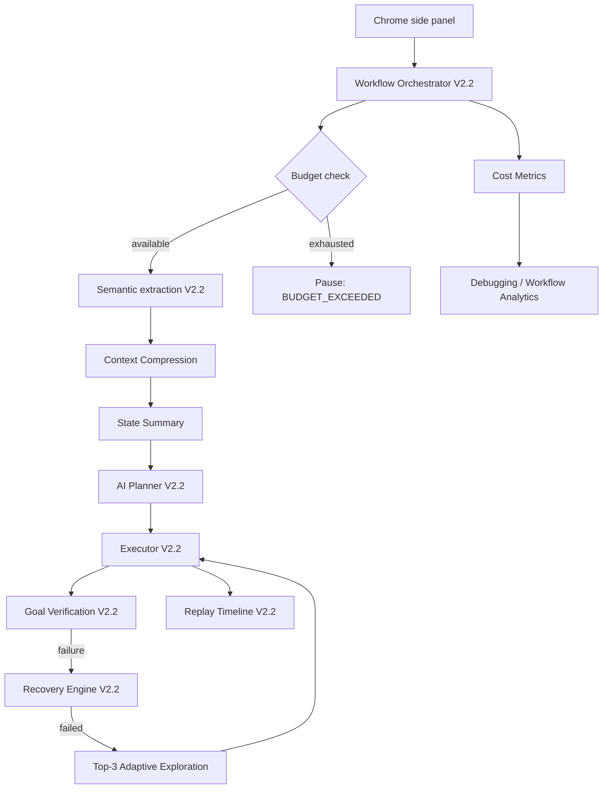

# V2.3 Incremental Enhancements

V2.3 extends the approved V2.2 components. It does not introduce a replacement orchestrator, state engine, task graph, recovery engine, or planner.

## Updated architecture and integration flow



Planner input is now a stable five-field object: `verified_facts`, `active_goal`, `relevant_elements`, `important_failures`, and `task_constraints`. Full DOM, accessibility trees, visible text, and full replay history remain available to their existing owners but do not enter interactive planner prompts.

## Updated folder structure

```text
backend/app/
├── budget_engine/{budget_models,budget_manager,budget_enforcer}.py
├── context_compression/{compressor,relevance_ranker,state_summarizer}.py
├── exploration/{exploration_planner,candidate_generator,candidate_evaluator}.py
├── domain_models.py
├── schemas/analytics.py
└── services/analytics_service.py
```

The existing orchestrator, AI service, recovery orchestrator, ORM models, workflow routes, replay timeline, and side-panel Debugging Center are extended in place.

## Database additions

`workflow_budgets` stores limits, counters, start time, and update time per session. `workflow_cost_metrics` stores planner/vision calls, token usage, and cumulative planner latency. Both use `sessions.id` as a one-to-one foreign key.

For an existing deployment, create these tables from the ORM metadata during the normal startup migration window. Production rollout should first apply an Alembic revision generated from these two ORM models, deploy application code second, and backfill active sessions with defaults last. No existing table or column is removed.

## API additions

`GET /workflow/{session_id}/analytics` returns budget usage, token and recovery counts, grouped failures, success/false-success rates, stability score, average step completion time, and planner/vision cost metrics. `POST /analyze` now returns HTTP 409 with status `BUDGET_EXCEEDED` when a hard limit pauses a workflow.

## Data models and validation

`FlightCard`, `ProductCard`, `GmailDraft`, and `WhatsAppMessage` are Pydantic models. Extraction adapters should validate into these models before writing facts to the State Engine. Invalid prices, ratings, URLs, or missing required fields are rejected; raw LLM text is never a state fact.

## Migration plan

1. Apply additive database tables and deploy analytics reads dark.
2. Enable context compression and compare prompt tokens/latency against a V2.2 control cohort.
3. Enable budget enforcement with generous limits, then move to the specified defaults after observing long workflows.
4. Enable lightweight exploration only after recovery exhaustion.
5. Turn on the Analytics tab and alert on false-success rate above 2%.
6. Roll back features independently with flags if needed; retain additive tables for audit continuity.

## Testing strategy

Unit tests cover every budget boundary, exact compressed-context shape, relevance ordering, typed-model rejection, and grounded exploration. Integration tests should exercise planning and execution boundary checks, persistent pause/resume, analytics aggregation, recovery-to-exploration handoff, and concurrent event writes. Browser tests should reproduce popup, stale-selector, rerender, and repeated-validation loops. A 60-minute soak test should include more than 50 steps by configuring a larger explicit budget; the default remains 50.

## Performance benchmark plan

Replay a fixed corpus of at least 100 V2.2 workflows (known and unseen sites) against control and V2.3 builds. Capture prompt/completion tokens, p50/p95 planner latency, planner calls, completion time, success verified by the Goal Verification Engine, false successes, recoveries, and stability score. Pass gates are at least 50% fewer planner tokens, 30% lower average planner latency, 15% higher stability, false successes at or below 2%, and zero unbounded loops. Use identical models, temperature, network region, page snapshots, and budgets; report confidence intervals and results by workflow length/site class.
