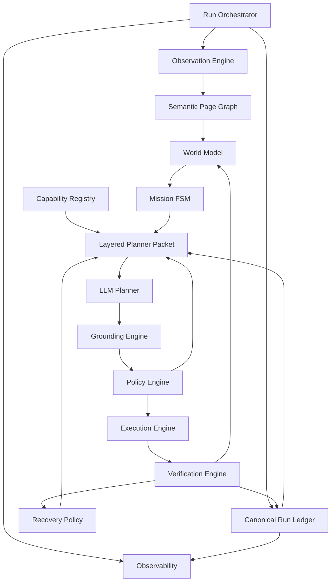
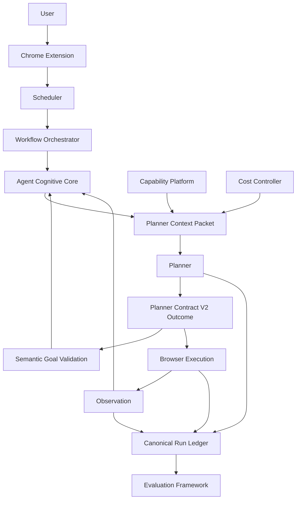

# V3 Architecture Review

Date: 2026-07-21

Status: architecture review. This document critiques and revises the Comet-class blueprint before implementation. It does not implement code.

## 1. Executive Summary

The existing architecture has the correct production skeleton: an MV3 Chrome Extension observes and executes, a FastAPI backend plans and validates, and the workflow loop refreshes state after every step. The V3 blueprint correctly identifies the strategic pivot: move from selector-driven action planning to a semantic, event-sourced browser agent.

The blueprint is directionally sound, but it needs several hardening changes before implementation:

1. Add an explicit version strategy for every durable contract.
2. Add feature flags as first-class rollout infrastructure.
3. Make Capability Registry a core dependency, not a late add-on.
4. Separate execution history from reasoning memory.
5. Promote Source Graph into a broader World Model.
6. Implement Mission Intelligence as an explicit state machine, not only computed summaries.
7. Define performance budgets before adding semantic graph, traces, and visual observation.
8. Treat observability as architecture, not a debugging afterthought.
9. Make multi-agent readiness a boundary design now, even while running one LLM planner.

The improved V3 architecture remains evolutionary: preserve Planner Contract V2, preserve the production workflow loop, preserve extension execution, and introduce new components as passive or additive projections before routing behavior through them.

## 2. Current Architecture Summary

Current production runtime:

```text
User
-> Extension Side Panel
-> Background Service Worker
-> Content Extractor
-> Backend /analyze
-> WorkflowOrchestrator
-> ContextCompressor
-> ai_service Planner
-> SGV / GC / SG / PR helpers
-> Extension outcome router
-> Content Executor
-> Action Verification / Selector Recovery / Widgets / File / Tabs
-> Refresh observation
-> Continue loop
```

Existing strengths:

| Area | Status |
|---|---|
| Planner Contract V2 | Good foundation; typed outcomes exist |
| Workflow loop | Functional production loop in extension |
| Backend orchestration | Central planning path exists |
| Observation | Good DOM/accessibility extraction |
| Execution | Strong deterministic browser capabilities |
| Verification | Action verification and SGV exist |
| Recovery | Selector recovery, strategy context, planner recovery exist |
| Workspaces | Task, mission, and tab workspaces exist |
| Context compression | Production compressor exists |
| Validation assets | Production validation docs and benchmark suite exist |

Primary weakness:

The system is a set of useful components rather than one coherent agent state machine. State is split across extension state, backend DB rows, prior steps, module globals, workspaces, mission snapshots, compression summaries, benchmark traces, and provider traces.

## 3. Target Architecture Summary

V3 should be:



The planner remains the only semantic decision maker, but it no longer owns low-level selector selection, validation, recovery policy, safety policy, or memory reconstruction.

## 4. Architecture Weaknesses And Improvements

### 4.1 Fragmented State

Why it exists:

- The system evolved milestone by milestone. Each layer added local state: prior steps, mission snapshot, task workspace, tab workspace, backend verified facts, workflow events, benchmark traces.

Impact:

- Debugging requires stitching together multiple partial histories.
- Recovery can miss facts that another component knew.
- Context compression can drop important signals because there is no canonical source.

Improved design:

- Introduce a Canonical Run Ledger as the append-only source of truth.
- Workspaces, prior steps, mission snapshot, trace views, and planner packets become projections.

Justification:

- Event sourcing preserves backward compatibility and supports replay, testing, traceability, and future learning.

### 4.2 Planner Owns Too Much

Why it exists:

- Planner Contract V2 widened outcomes but still requires executable selectors for actions.

Impact:

- The planner must reason semantically and ground to CSS at the same time.
- Wrong-link failures occur when similar elements are compressed into ambiguous selector choices.

Improved design:

- Planner chooses semantic intent and target reference.
- Grounding Engine resolves target to executable locator.
- Legacy selector action remains fallback during migration.

Justification:

- SOTA browser agents separate "what should happen" from "how to actuate it."

### 4.3 Prompt-Encoded Policy

Why it exists:

- MSM and DCR phases added policy quickly via `SYSTEM_PROMPT`.

Impact:

- Mission mode, source suitability, evidence sufficiency, and safety are non-deterministic.
- Tests can verify prompt text but not actual policy execution.

Improved design:

- Mission FSM computes mode/subgoal/evidence state.
- Policy Engine computes allowed/blocked/requires-confirmation decisions.
- Context packet renders those decisions for the planner.

Justification:

- Deterministic policy is testable, observable, and enforceable.

### 4.4 Missing Semantic Page Graph

Why it exists:

- Current observation extracts page facts directly for planner consumption.

Impact:

- No stable representation of entities, result sets, forms, affordances, or relationships.
- Context compression becomes the semantic layer by accident.

Improved design:

- Add deterministic Semantic Page Graph from DOM, accessibility, browser metadata, and future visual metadata.
- Planner consumes graph summary; planner never generates graph.

Justification:

- This is the required bridge from browser state to mission/grounding/validation.

### 4.5 Capability Awareness Is Scattered

Why it exists:

- Capabilities live in TypeScript action types, prompt text, background routing, widgets, file transfer, tab control, and tests.

Impact:

- Planner capability guidance can drift from actual executor support.
- Policy cannot reason uniformly about permissions and constraints.

Improved design:

- Add centralized Capability Registry.
- Every capability declares id, version, purpose, inputs, outputs, permissions, execution environment, constraints, and telemetry.

Justification:

- Capability Registry should feed planner context, policy, grounding, tests, and documentation.

### 4.6 Validation Is Too Boolean

Why it exists:

- SGV first focused on report completion.

Impact:

- `sgv_verified: bool` cannot express uncertainty, contradiction, missing evidence, or source provenance.

Improved design:

- Introduce versioned Validation Object with status: `satisfied`, `not_satisfied`, `contradicted`, `uncertain`.
- Preserve `sgv_verified` as derived compatibility field.

Justification:

- Autonomous agents need to continue, complete, recover, or ask based on why validation failed.

### 4.7 Source Graph Is Too Narrow

Why it exists:

- The blueprint scoped Source Graph around facts and URLs.

Impact:

- Real research requires relationships, hypotheses, conflicting evidence, provenance, and confidence.

Improved design:

- Evolve Source Graph into World Model.
- Model entities, relationships, evidence, hypotheses, provenance, confidence, conflicts, and open questions.

Justification:

- Comparison and research workflows require more than a list of extracted facts.

### 4.8 Reasoning Memory Is Not Separate

Why it exists:

- Prior steps mix actions, results, reports, validation messages, strategy context, and planner analysis.

Impact:

- The system remembers what happened but not why a reasoning path was rejected.

Improved design:

- Separate Execution Ledger from Reasoning Memory.
- Reasoning Memory stores hypotheses, rejected strategies, planner confidence, alternatives, and rationale.

Justification:

- This supports recovery and multi-agent planner review without polluting execution history.

### 4.9 Mission Intelligence Needs An FSM

Why it exists:

- Mission Snapshot started as a compact planner aid.

Impact:

- Mode transitions are prompt-dependent and hard to test.

Improved design:

- Implement Mission FSM with states: `initialized`, `searching`, `collecting`, `extracting`, `verifying`, `comparing`, `report_ready`, `awaiting_user`, `blocked`, `completed`.

Justification:

- Mission transitions become observable, testable, and replayable.

### 4.10 Observability Is Not A First-Class Contract

Why it exists:

- Benchmark traceability matured faster than production traceability.

Impact:

- Real-world failures are harder to debug than benchmark failures.

Improved design:

- Every V3 component emits metrics, logs, traces, and health indicators with run id and ledger event id.

Justification:

- Production-grade browser agents need forensic replay and dashboards.

## 5. Version Strategy

| Version | Name | Scope | Compatibility Rule |
|---|---|---|---|
| V3.0 | Foundation | Run Ledger, trace parity, feature flags, capability registry skeleton | No planner behavior change |
| V3.1 | Semantic Intelligence | Semantic Page Graph schema/builder, context packet compatibility mode | V2 planner contract unchanged |
| V3.2 | Intent Grounding | Semantic targets, grounding adapter, legacy selector fallback | V2 actions still accepted |
| V3.3 | Mission Intelligence | Mission criteria and FSM | Mission state advisory first |
| V3.4 | Validation | General Validation Object and criteria-based completion | `sgv_verified` remains derived |
| V3.5 | Policy And Vision | Policy Engine and hybrid visual observation | Visual capture gated by policy |
| V3.6 | World Model And Learning | World Model, source graph, site memory | User/private data never promoted automatically |

Deprecation policy:

- A V2 field can be deprecated only after two V3 minor releases where both old and new paths are emitted and validated.
- A compatibility field must have an owner, migration test, and removal issue.
- Planner Contract V2 remains the external default until V3.2 has production validation.

## 6. Feature Flag Strategy

Every major subsystem gets three rollout states:

1. `off`: no writes, old behavior.
2. `shadow`: compute/write traces only, no behavior change.
3. `active`: component output affects downstream context or routing.

| Flag | Default | Shadow Output | Active Effect | Rollback |
|---|---|---|---|---|
| `V3_RUN_LEDGER` | shadow | ledger events | projections can read ledger | use existing prior steps |
| `V3_TRACE_PARITY` | off | production trace artifacts | diagnostics UI/API reads traces | disable trace emit |
| `V3_CAPABILITY_REGISTRY` | shadow | capability manifest | planner packet and policy read registry | prompt/static actions |
| `V3_SEMANTIC_GRAPH` | shadow | page graph snapshots | context packet includes graph summary | raw PageContext summary |
| `V3_CONTEXT_PACKET` | off | packet preview | planner uses layered packet | old compressor output |
| `V3_SEMANTIC_TARGETS` | off | target ids in graph | planner sees target refs | hide target refs |
| `V3_INTENT_GROUNDING` | off | dry-run grounding decision | target action resolves to selector | execute legacy selector |
| `V3_MISSION_FSM` | shadow | mission state transitions | planner receives FSM state | mission snapshot only |
| `V3_VALIDATION_OBJECT` | shadow | validation object | completion uses validation object | `sgv_verified` boolean |
| `V3_POLICY_ENGINE` | shadow | policy decision | gates planner/execution | approval flow only |
| `V3_VISUAL_OBSERVATION` | off | screenshot metadata only | visual facts/bboxes in graph | DOM/a11y only |
| `V3_WORLD_MODEL` | off | world facts/conflicts | planner packet uses world summary | task workspace facts |
| `V3_SITE_MEMORY` | off | candidate site priors | planner packet uses site priors | ignore site priors |

## 7. Revised Component Ownership

| Component | Owns | Must Not Own |
|---|---|---|
| Run Orchestrator | lifecycle, event ordering, budgets, phase transitions | semantic planning |
| Run Ledger | immutable event history | policy decisions |
| Observation Engine | raw browser state | semantic conclusions |
| Semantic Page Graph | typed page representation | planner decisions |
| Capability Registry | available operations and constraints | execution outcomes |
| Policy Engine | permissions and risk gates | choosing task strategy |
| Mission FSM | mode, subgoal, evidence gaps | browser actions |
| Planner | semantic next intent | validation, selector recovery, final truth |
| Grounding Engine | target to locator/action | mission strategy |
| Execution Engine | browser actuation | goal completion |
| Verification Engine | effect and goal evidence evaluation | planner intent |
| Recovery Policy | bounded recovery routing | unbounded replanning |
| World Model | facts, relationships, provenance, hypotheses | raw DOM storage |

## 8. Semantic Page Graph Review

The Semantic Page Graph should be deterministic and versioned.

Inputs:

- DOM-derived page context.
- Accessibility metadata.
- Browser metadata.
- Future visual metadata.

Non-inputs:

- LLM reasoning.
- Planner analysis text.
- Provider responses.

Core graph:

```text
SemanticPageGraph
  schema_version
  graph_id
  observation_id
  url
  title
  page_type
  nodes[]
  edges[]
  facts[]
  targets[]
  build_metadata
```

Node types:

- `page`
- `section`
- `result_set`
- `result_item`
- `entity`
- `fact`
- `form`
- `field`
- `control`
- `navigation`
- `dialog`
- `table`
- `row`
- `download`
- `upload`
- `error_state`
- `visual_region`

Edge types:

- `contains`
- `labels`
- `describes`
- `links_to`
- `controls`
- `submits`
- `filters`
- `sorts`
- `paginates`
- `represents`
- `has_fact`
- `source_of`
- `visually_near`
- `alternative_locator`

Lifecycle:

1. Build from observation.
2. Hash and persist summary to ledger.
3. Cache by observation hash.
4. Project compact graph summary into planner packet.
5. Discard or redact raw sensitive values according to policy.

Caching:

- Key: observation hash + graph schema version + builder version.
- Invalidate on URL change, visible text hash change, interactive element hash change, form-state hash change, or visual metadata hash change.

Serialization:

- Stable JSON ordering.
- Bounded node/fact/target counts in planner packet.
- Full graph in trace/ledger only when trace mode permits.

## 9. Capability Registry Review

Capability Registry should be a V3.0 foundation dependency, not a late feature.

Capability schema:

```text
Capability
  id
  version
  purpose
  operation_kind
  inputs_schema
  outputs_schema
  permissions
  execution_environment
  constraints
  safety_class
  telemetry_fields
  feature_flag
```

Initial capabilities:

- `browser.click`
- `browser.fill`
- `browser.select_option`
- `browser.choose_date`
- `browser.scroll`
- `browser.navigate`
- `browser.wait`
- `browser.open_new_tab`
- `browser.switch_tab`
- `browser.close_tab`
- `browser.focus_existing_tab`
- `browser.upload`
- `browser.download`
- `browser.extract_visible_fact`
- `browser.observe`
- `user.ask`
- `user.handoff`

The planner receives a compact manifest. Policy and grounding read the full registry.

## 10. Context Architecture Review

Replace monolithic compressed context with layered planner packet:

```text
PlannerPacket
  schema_version
  run
  mission_context
  task_context
  browser_context
  page_context
  memory_context
  policy_context
  capability_context
  recovery_context
  validation_context
  output_contract
  budget_metadata
```

Layer ownership:

| Context Layer | Owner |
|---|---|
| Mission Context | Mission FSM |
| Task Context | Run Orchestrator / user input |
| Browser Context | Extension/background |
| Page Context | Semantic Page Graph |
| Memory Context | Ledger / World Model |
| Policy Context | Policy Engine |
| Capability Context | Capability Registry |
| Recovery Context | Recovery Policy |
| Validation Context | Verification Engine |
| Output Contract | Planner service |

## 11. World Model Review

Source Graph should evolve into World Model.

World Model schema:

```text
WorldModel
  entities[]
  relationships[]
  evidence[]
  hypotheses[]
  conflicts[]
  open_questions[]
```

Entity examples:

- product
- repository
- job
- company
- document
- person
- invoice
- hotel
- source page

Reasoning Memory should be a sibling projection:

```text
ReasoningMemory
  hypotheses_considered
  rejected_strategies
  alternatives
  planner_confidence_history
  contradiction_history
```

The ledger records what happened. Reasoning Memory records what was believed, rejected, or uncertain.

## 12. Mission State Machine Review

Mission Intelligence should be an explicit FSM.

States:

- `initialized`
- `searching`
- `collecting`
- `extracting`
- `verifying`
- `comparing`
- `report_ready`
- `awaiting_user`
- `recovering`
- `blocked`
- `completed`
- `cancelled`
- `failed`

Events:

- `observation_received`
- `source_found`
- `entity_opened`
- `fact_extracted`
- `criteria_satisfied`
- `criteria_missing`
- `validation_contradicted`
- `execution_failed`
- `semantic_stalled`
- `policy_blocked`
- `user_input_required`
- `report_verified`

Mission FSM does not create browser actions. It outputs planner context and readiness signals.

## 13. Multi-Agent Readiness

V3 should remain single-planner in implementation, but boundaries should support future specialists:

| Future Agent | Current Boundary |
|---|---|
| Planner Agent | Planner service |
| Research Agent | World Model + Source Graph |
| Execution Agent | Grounding + Execution |
| Validation Agent | Verification Engine |
| Safety Agent | Policy Engine |
| Memory Agent | Ledger + World Model |

Readiness requirement:

- All agents exchange versioned data contracts.
- No agent reads raw private browser state unless policy permits.
- Every agent output is ledgered.

## 14. ADR Summary

### ADR-001: Use Canonical Run Ledger As Source Of Truth

Context: workflow state is fragmented.

Problem: components cannot reliably reconstruct what happened.

Alternatives: keep current state, centralize only backend events, event-source all workflow facts.

Decision: event-source all workflow facts in a canonical run ledger.

Consequences: more schema work up front; much better replay, debugging, and migration safety.

### ADR-002: Keep Planner Contract V2 During Foundation Migration

Context: V2 already works and is integrated.

Problem: moving to intent contracts before grounding exists would destabilize production.

Decision: preserve V2 until semantic targets and grounding adapter are shadow-tested.

Consequences: temporary dual support later; lower immediate risk.

### ADR-003: Semantic Page Graph Is Deterministic

Context: planner needs richer page meaning.

Problem: LLM-generated page graphs would be expensive, non-deterministic, and hard to test.

Decision: graph is built from DOM, accessibility, browser metadata, and future visual metadata only.

Consequences: less magical but testable and cacheable.

### ADR-004: Capability Registry Is A Foundation Component

Context: capabilities are scattered.

Problem: prompt, policy, and execution can drift.

Decision: centralize capability definitions and expose compact manifest to planner.

Consequences: initial registry overhead; better versioning and policy integration.

### ADR-005: Mission Intelligence Is An FSM

Context: mode transitions are prompt-driven.

Problem: prompt-only mission behavior is not reliably testable.

Decision: implement explicit mission FSM with advisory outputs first.

Consequences: avoids planner override while enabling deterministic state.

### ADR-006: Validation Uses Explicit Uncertainty

Context: boolean verification is too narrow.

Problem: unsupported, contradicted, and uncertain reports need different behavior.

Decision: introduce Validation Object with four states.

Consequences: compatibility field needed for `sgv_verified`.

### ADR-007: World Model Supersedes Narrow Source Graph

Context: research tasks need entities, relationships, hypotheses, and conflicts.

Problem: source graph alone cannot model reasoning state.

Decision: build World Model with Source Graph as one projection.

Consequences: broader memory scope; requires privacy controls.

## 15. Final Revised Architecture

The revised V3 architecture is:

```text
Run Orchestrator
  owns lifecycle

Run Ledger
  owns immutable event history

Observation Engine
  captures browser state

Semantic Page Graph
  converts browser state into deterministic semantic representation

Capability Registry
  declares what the browser agent can do

Policy Engine
  determines what is allowed

World Model + Reasoning Memory
  tracks facts, evidence, hypotheses, conflicts, rejected strategies

Mission FSM
  tracks mode, subgoal, evidence sufficiency, completion readiness

Context Packet Builder
  renders layered planner context within budgets

Planner
  chooses next semantic outcome/intent

Grounding Engine
  resolves semantic target to executable action

Execution Engine
  performs browser action

Verification Engine
  evaluates action effect and goal evidence

Recovery Policy
  routes bounded recovery

Observability
  makes every step measurable and replayable
```

## 16. Readiness Conclusion

The blueprint is strong, but implementation should be strengthened by moving Capability Registry, feature flags, versioned contracts, performance budgets, observability, Mission FSM, and World Model into the core V3 plan. The first implementation phase remains Canonical Run Ledger, but it should include feature-flag and contract-version foundations so future V3 work does not recreate migration plumbing repeatedly.

## 17. Final Refinements Before Freeze

This section records the final architecture refinement decisions before implementation freeze. These decisions extend the V3 blueprint without changing the migration strategy, Planner Contract V2, or backward compatibility requirements.

### 17.1 Capability Platform

Decision: approve as an extension of Capability Registry, not a replacement.

Capability Registry should expand into a Capability Platform with these responsibilities:

- Registry: canonical descriptions of available capabilities.
- Discovery: runtime visibility into which capabilities are available in the current environment.
- Versioning: explicit capability versions and compatibility metadata.
- Health: availability, degradation, and last-known failure state.
- Permissions: required browser, local, network, file, provider, account, or user permissions.
- Constraints: supported domains, file types, tab requirements, auth requirements, and destructive-action restrictions.
- Metrics: usage, latency, error rate, recovery rate, and cost attribution.

Rationale: Comet/Operator-class systems need planner-visible affordances that can expand without hard-coded planner logic. Browser execution, OCR, vision, search, Python, memory, MCP tools, and plugins should all be represented through a common capability contract.

Boundary: the Capability Platform does not plan. It tells the planner and orchestrator what is available, healthy, permitted, and constrained.

Migration impact: introduce a minimal platform skeleton early, populated initially by existing browser capabilities. Advanced plugin discovery and marketplace-style capability behavior remain later work.

Risk: excessive abstraction. Mitigation: only register real capabilities that already exist or are being integrated in the current milestone.

### 17.2 Scheduler

Decision: approve a lightweight Scheduler boundary now, with advanced scheduling deferred.

The Scheduler owns:

- task queue ownership
- dependency ordering
- waiting and delayed tasks
- retry scheduling
- background work
- future parallel execution coordination

The planner decides what should happen. The Scheduler decides when eligible work should run.

Initial scope should remain small:

- one active foreground workflow per user task
- explicit wait and resume scheduling
- bounded retry scheduling for existing recovery policies
- background trace, evaluation, or cleanup jobs

The Scheduler must not duplicate orchestration or create planner decisions. It should wrap the existing workflow lifecycle rather than replace it immediately.

Rationale: without a scheduler boundary, long-running tasks, delayed waits, background evaluation, and future multi-tab work all accrete ad hoc timing logic inside the workflow controller.

Risk: overlap with Workflow Orchestrator. Mitigation: Workflow Orchestrator owns run semantics; Scheduler owns eligibility and timing.

### 17.3 Agent Cognitive Core

Decision: approve as an architectural boundary, not a monolithic component.

The Agent Cognitive Core groups the agent's durable reasoning state:

- Mission FSM
- World Model
- Reasoning Memory
- Goal Graph
- Evidence Tracking
- Hypothesis Management

The Cognitive Core is a boundary and facade. It must not collapse these responsibilities into one large object or introduce a second planner.

Rationale: the current roadmap contains several related reasoning-state components. Grouping them under one boundary clarifies ownership and prevents scattered state management across planner prompts, workflow controllers, validation, and recovery.

Boundary: the Cognitive Core maintains structured state. The planner remains the only component that decides future browser actions.

Risk: becoming a broad "god subsystem." Mitigation: each internal component keeps a small contract, and the planner receives only compact context packets.

### 17.4 Cost Controller

Decision: approve as a core cross-cutting component that extends Performance Budgets.

The Cost Controller owns:

- token budgets
- vision budgets
- provider budgets
- latency budgets
- workflow duration budgets
- budget-aware planner guidance
- budget telemetry

It should begin in advisory or shadow mode and become enforceable only where product behavior requires it.

Rationale: real autonomous browsing requires cost-aware choices. The agent must know when to use cheap text observation, when to spend on vision, when to avoid unnecessary provider calls, and when a workflow is exceeding useful effort.

Boundary: the Cost Controller does not plan or validate. It supplies budget state, constraints, and recommendations to the orchestrator and planner context.

Risk: over-constraining useful exploration. Mitigation: early versions expose guidance and metrics before enforcing hard stops.

### 17.5 Evaluation Framework

Decision: approve as first-class production-adjacent architecture, not a hot-path runtime dependency.

The Evaluation Framework owns:

- production run replay
- planner version comparison
- automated scoring
- grounding accuracy measurement
- validation accuracy measurement
- mission success measurement
- benchmark automation
- production scorecards

Rationale: after V3, correctness depends on behavior over full workflows, not isolated unit behavior. Evaluation must become a durable engineering surface, but it should consume traces and ledgers asynchronously.

Boundary: evaluation never changes a live workflow decision. It reads completed run records, compares behavior, and produces evidence for engineering decisions.

Risk: building tooling before enough run data exists. Mitigation: start with replay of existing traces and scorecards derived from the Canonical Run Ledger.

## 18. Updated V3 System Boundary



## 19. Updated Ownership Boundaries

| Component | Owns | Does Not Own |
|---|---|---|
| Planner | Choosing the next outcome under Planner Contract V2 | Browser execution, validation authority, scheduling |
| Workflow Orchestrator | Run lifecycle and outcome routing | Planner reasoning, timing policy, evaluation |
| Scheduler | Work eligibility, queueing, waiting, retry timing | Planner decisions, browser action choice |
| Capability Platform | Available capability metadata, health, permissions, constraints | Planning, execution implementation |
| Agent Cognitive Core | Mission state, world model, reasoning memory, evidence state | Creating browser actions, validating reports |
| Cost Controller | Budget state, usage, cost-aware constraints and guidance | Planner decisions, provider implementation |
| SGV | Semantic verification of report completion | Recovery, replanning, action generation |
| Browser Execution | Performing actions and reporting execution quality | Planner intent, semantic goal completion |
| Evaluation Framework | Replay, scoring, comparison, scorecards | Live workflow decisions |

## 20. Freeze Readiness Assessment

1. Is the architecture sufficiently complete to begin implementation?

Yes. The final refinements clarify long-term platform boundaries without requiring a rewrite or changing the current migration strategy.

2. Are major risks unresolved?

No unresolved architectural blockers remain. The remaining risks are implementation risks: preserving backward compatibility, preventing duplicate orchestration, bounding context growth, and keeping new components advisory until proven.

3. Would delaying implementation provide benefit?

No material benefit is expected from further architecture-only iteration. The next useful evidence will come from implementing the frozen V3 foundation behind feature flags and validating it against production workflows.

4. Can this evolve to Comet/Operator-class capability without rewrite?

Yes. The refined architecture supports capability expansion, durable mission state, cost-aware operation, scheduled long-running work, and replay-based evaluation without replacing Planner Contract V2 or the production workflow loop.

Final recommendation: freeze the V3 architecture and begin implementation with the foundation phase.
